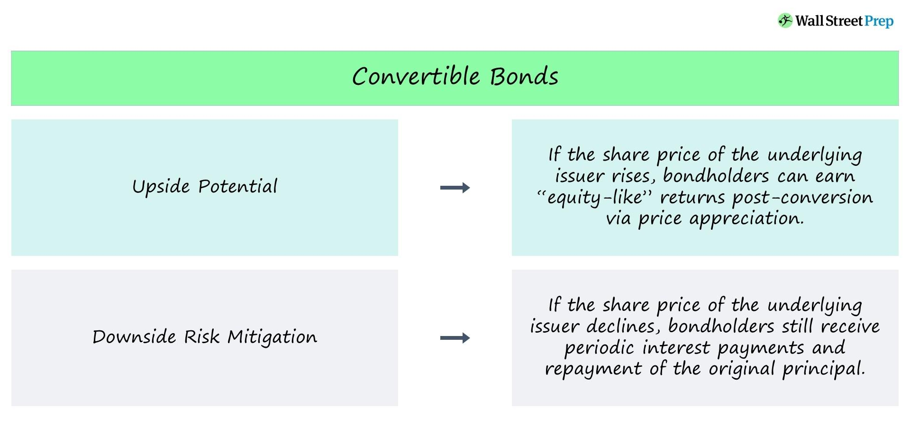

## Table of Contents

## What are convertible bonds?

Convertible bonds are a type of bond that can be changed into a set number of shares of the issuing company's stock. This means that if you own a convertible bond, you have the option to convert it into stock instead of getting your money back with interest when the bond matures. This can be attractive to investors because they can benefit from any rise in the stock's price.

These bonds are often used by companies as a way to raise money. They can be appealing to companies because they usually have lower interest rates than regular bonds. This is because investors are willing to accept a lower interest rate in exchange for the chance to convert the bond into stock if the company does well. However, if the stock price doesn't go up much, the investor can still get their money back with interest, like a regular bond.

## Why do private corporations issue convertible bonds?

Private corporations issue convertible bonds mainly because they can raise money at a lower cost. When a company issues a convertible bond, it usually offers a lower interest rate than a regular bond. This is because investors are willing to accept a lower interest rate in exchange for the chance to convert the bond into stock if the company does well. This means the company can borrow money more cheaply, which is good for its finances.

Another reason is that convertible bonds can attract more investors. Some people might not want to buy the company's stock directly because it's too risky. But they might be willing to buy a convertible bond because it gives them a safer way to invest in the company. If the stock price goes up a lot, they can convert the bond into stock and make a profit. If the stock price doesn't go up much, they still get their money back with interest, like a regular bond. This flexibility can make the bonds more appealing to a wider range of investors.

## How does the conversion process work for convertible bonds?

The conversion process for convertible bonds is pretty straightforward. When you buy a convertible bond, the company tells you how many shares you can get for each bond. This is called the conversion ratio. For example, if the conversion ratio is 10, you can trade one bond for 10 shares of the company's stock. You can choose to convert your bond into stock at any time during a specific period, which the company sets when they issue the bond.

To convert your bond, you just need to tell the company you want to do it. They will then give you the shares based on the conversion ratio. But remember, you don't have to convert your bond if you don't want to. You can keep it until it matures and get your money back with interest, just like a regular bond. The choice is yours, depending on whether you think the stock will go up enough to make converting a good idea.

## What are the benefits of issuing convertible bonds for a private corporation?

Private corporations issue convertible bonds because it helps them get money at a lower cost. When they issue these bonds, they can offer a lower interest rate than regular bonds. This is because people who buy the bonds might be okay with a smaller interest rate if they get the chance to turn their bond into stock later. If the company does well and the stock price goes up, the bondholder can convert the bond and make more money. So, the company saves money on interest, which is good for its finances.

Another benefit is that convertible bonds can attract more investors. Some people might not want to buy the company's stock directly because it's too risky. But they might be happy to buy a convertible bond because it gives them a safer way to invest in the company. If the stock price goes up a lot, they can convert the bond into stock and make a profit. If the stock price doesn't go up much, they still get their money back with interest, like a regular bond. This flexibility makes the bonds more appealing to a wider range of people.

## What are the risks associated with issuing convertible bonds?

When a private corporation issues convertible bonds, there's a risk that the company's stock price might not go up as much as expected. If the stock price stays low, people who bought the bonds might not want to convert them into stock. Instead, they'll want their money back with interest when the bond matures. This means the company will have to pay back the money it borrowed, which can be tough if it doesn't have enough cash.

Another risk is that if a lot of people decide to convert their bonds into stock at the same time, it can lead to more shares being out there. This is called dilution. When there are more shares, each share is worth a little less, and that can make the stock price go down. It can also mean that the original owners of the company have less control because there are more people who own part of the company.

Also, if the company's financial situation gets worse, it might be harder to borrow money in the future. If people see that the company is struggling, they might not want to buy its bonds or stocks. This can make it harder for the company to raise money when it needs it. So, issuing convertible bonds can be risky if the company doesn't do well.

## How do convertible bonds affect a company's capital structure?

When a company issues convertible bonds, it changes its capital structure by adding a mix of debt and potential equity. At first, convertible bonds count as debt because the company has to pay back the money with interest. But if a lot of people decide to convert their bonds into stock, it can turn some of that debt into equity. This means the company has less debt but more shares out there. This can be good because it makes the company's debt load lighter, but it also means that each share might be worth a little less because there are more of them.

Another way convertible bonds affect a company's capital structure is by possibly changing who owns the company. If a lot of bonds get converted into stock, it can dilute the ownership of the original shareholders. This means they own a smaller piece of the company than before. It can also affect how much control the original owners have because more people now own part of the company. So, issuing convertible bonds can change the balance between debt and equity in the company's capital structure and affect who has a say in how the company is run.

## What are the key terms and conditions typically included in convertible bond agreements?

Convertible bond agreements usually have some key terms and conditions that everyone needs to know. One important term is the conversion ratio, which tells you how many shares of stock you can get for each bond. This is set when the bond is issued and helps you figure out if converting the bond into stock is a good idea. Another term is the conversion price, which is the price per share at which the bond can be converted into stock. This is linked to the conversion ratio and helps you understand the value of the bond if you decide to convert it. The agreement also includes a maturity date, which is when the bond will be paid back if you don't convert it, and an interest rate, which is the amount of money you get for holding the bond until it matures or you convert it.

There are also some conditions about when and how you can convert the bond. The conversion period is the time during which you can convert the bond into stock. This period is set by the company and can affect your decision on whether to convert. Sometimes, there's a call provision, which lets the company buy back the bond before it matures. If the company uses this, you might have to decide quickly whether to convert your bond or get your money back. Another condition is the put provision, which lets you sell the bond back to the company at certain times. This can be useful if you think the company is not doing well and you want to get your money back sooner.

Finally, there might be some protections for bondholders, like anti-dilution provisions. These protect your investment if the company issues more stock or changes the conversion ratio in a way that could hurt you. Knowing these terms and conditions helps you understand the risks and rewards of holding a convertible bond and makes it easier to decide what to do with it.

## How do convertible bonds impact the valuation of a private corporation?

When a private corporation issues convertible bonds, it can affect how much the company is worth. At first, the bonds are seen as debt because the company has to pay back the money with interest. This can make the company look more valuable because it shows that people are willing to lend money to the company. But if a lot of people decide to convert their bonds into stock, it can change things. More shares mean the value of each share might go down a bit, which can make the overall value of the company seem lower. So, convertible bonds can make the company's value go up at first but might make it go down later if a lot of bonds get converted.

Another way convertible bonds can impact the valuation is by changing who owns the company. If a lot of bonds turn into stock, it can dilute the ownership of the people who already own the company. This means they own a smaller piece of the company than before. When investors look at the company, they might think it's worth less because there are more people who own part of it. Also, if the company's financial situation gets worse, it might be harder to borrow money in the future. This can make investors think the company is riskier, which can also lower its value. So, convertible bonds can have both good and bad effects on how much a private corporation is worth.

## What are the tax implications of issuing convertible bonds for both the issuer and the investor?

For the issuer, the tax implications of issuing convertible bonds can be beneficial. When a company issues these bonds, it gets to deduct the interest payments it makes to bondholders from its taxable income. This means the company can lower its tax bill because it's paying less in taxes. But if the bondholders decide to convert their bonds into stock, things can change. The company won't have to pay interest anymore, but it might have to deal with more complicated tax rules about stock issuance and potential dilution of existing shares. 

For the investor, the tax implications depend on what they do with the bond. If they hold the bond and get interest payments, they have to pay taxes on that interest income. But if they convert the bond into stock, they don't have to pay taxes on the interest right away. Instead, they might have to pay capital gains tax later if they sell the stock for more than they paid for it. This can be a good thing because it lets them put off paying taxes until they sell the stock, which can be a big advantage.

## How do market conditions influence the decision to issue convertible bonds?

Market conditions play a big role in whether a private corporation decides to issue convertible bonds. If the stock market is doing well and the company's stock price is high, it might be a good time to issue convertible bonds. This is because people who buy the bonds will be more likely to convert them into stock if they think the stock price will keep going up. Also, if interest rates are low, the company can borrow money at a cheaper rate by issuing convertible bonds instead of regular bonds. This makes it a smart move for the company to raise money when the market is in their favor.

On the other hand, if the stock market is not doing well and the company's stock price is low, it might not be the best time to issue convertible bonds. People who buy the bonds might not want to convert them into stock if they think the stock price will keep going down. They would rather get their money back with interest when the bond matures. Also, if interest rates are high, the company might have to offer a higher interest rate on the bonds to attract investors. This can make issuing convertible bonds less appealing because it's more expensive for the company to borrow money.

## What are the differences between convertible bonds and other types of corporate debt?

Convertible bonds are different from other types of corporate debt because they give the person who buys them a choice. With a regular bond, you get your money back with interest when it matures. But with a convertible bond, you can choose to turn it into stock instead. This means you can make more money if the company's stock price goes up a lot. Regular bonds don't give you this option, so they are less risky but also might not make you as much money.

Another big difference is that convertible bonds usually have lower interest rates than regular bonds. This is because people who buy them are okay with getting less interest if they get the chance to turn the bond into stock later. With regular bonds, the company has to pay back all the money it borrowed at the end, which can be hard if it doesn't have enough cash. Convertible bonds can be easier on the company because some of the debt might turn into stock, which means less money to pay back.

## How can convertible bonds be used as a strategic tool in corporate finance planning?

Convertible bonds can be a smart tool for a company to use in its financial planning. They let the company borrow money at a lower interest rate than regular bonds. This is because people who buy convertible bonds might be okay with getting less interest if they get the chance to turn the bond into stock later. This can save the company a lot of money on interest payments, which is good for its finances. Also, if the company's stock price goes up a lot, some of the debt can turn into stock, which means the company has to pay back less money when the bond matures. This can make it easier for the company to manage its money and plan for the future.

Another way convertible bonds can help with financial planning is by attracting more investors. Some people might not want to buy the company's stock directly because it's too risky. But they might be happy to buy a convertible bond because it gives them a safer way to invest in the company. If the stock price goes up a lot, they can convert the bond into stock and make a profit. If the stock price doesn't go up much, they still get their money back with interest, like a regular bond. This flexibility can make the bonds more appealing to a wider range of people, which can help the company raise more money when it needs it.

## What are Convertible Bonds?

Convertible bonds are a sophisticated financial instrument, blending the characteristics of traditional bonds and equity securities. These bonds are issued by corporations and possess the unique feature of being convertible into a predetermined number of the issuing company's shares at the discretion of the bondholder. This conversion feature offers investors the potential for capital appreciation, akin to owning equity, while initially providing the steady income stream and lower risk profile associated with bonds.

When initially issued, convertible bonds function similarly to standard debt instruments. Investors receive regular interest payments, known as coupon payments, which are typically lower than the rates on comparable non-convertible bonds. This trade-off in interest rates compensates for the valuable option to convert the bond into equity.

The conversion process is governed by specific terms outlined in the bond's indenture. Key elements include the conversion ratio, which determines how many shares a bondholder receives upon conversion, and the conversion price, which is the effective per-share price paid by the bondholder. Mathematically, these relationships are defined as:

$$
\text{Conversion Ratio} = \frac{\text{Par Value of Bond}}{\text{Conversion Price}}
$$

Valuation of convertible bonds is complex due to their hybrid nature, combining elements of fixed-income valuation with option pricing models. The valuation typically involves assessing the 'straight bond value', the present value of the bond's future cash flows if held to maturity, and the 'conversion value', determined by the current stock price and the conversion ratio. An advanced method often employed is the binomial options pricing model, which considers various factors such as the [volatility](/wiki/volatility-trading-strategies) of the underlying stock, interest rates, and time to maturity.

Investors value convertible bonds for their dual potential: receiving regular income while retaining the option to share in the growth of the issuing company. For corporations, issuing convertible bonds can be an attractive financing strategy, enabling [capital raising](/wiki/hedge-fund-capital-raising) with initially limited dilution of equity. This multifunctionality places convertible bonds as a strategic tool in corporate financing and investment portfolios, albeit with complexity that mandates careful analysis and understanding.

## What are the pros and cons of convertible bonds in corporate finance?

Convertible bonds serve as a strategic tool in corporate finance, offering companies a mechanism to raise capital while managing equity dilution. By issuing convertible bonds, companies are able to secure funds through debt with the potential to convert this obligation into equity. This conversion feature allows issuers to benefit from a reduced interest rate compared to traditional bonds, as investors are often willing to accept lower yields due to the added value of the conversion option.

### Advantages for Companies

1. **Delayed Equity Dilution:**
   Convertible bonds allow companies to postpone equity dilution. This is particularly advantageous for firms that anticipate higher future valuations, as it defers the issuance of additional shares until conversion, thereby preserving existing shareholder value in the interim.

2. **Cost-Effective Financing:**
   The promise of potential equity conversion generally enables issuers to offer lower interest rates compared to traditional debt instruments. This reduced cost of borrowing can lead to significant interest savings, which enhances corporate cash flow and financial flexibility. If $r_c$ represents the coupon rate for convertible bonds and $r_t$ represents the coupon rate for traditional bonds, it is typically the case that $r_c < r_t$.

3. **Market Signal of Confidence:**
   Issuing convertible bonds may signal to the market that management is confident in the company's future prospects. The ability to offer equity in the future suggests expectations of growth, which can positively influence stock prices and corporate reputation.

### Potential Downsides

1. **Equity Dilution Upon Conversion:**
   While delayed, the conversion of bonds into equity inevitably results in dilution of ownership. New shares issued upon conversion increase the total number of outstanding shares, potentially affecting earnings per share and diluting the voting power of existing shareholders. The impact on earnings per share (EPS) can be calculated as follows:
$$
   \text{EPS} = \frac{\text{Net Income}}{\text{Total Outstanding Shares + Shares from Conversion}}

$$

2. **Impact on Voting Control:**
   The introduction of new shares through conversion can affect voting rights within the company. Original shareholders may find their influence diluted, especially in situations where significant portions of convertible bonds are converted, potentially altering the balance of power within shareholder meetings.

3. **Market Perception Risks:**
   The market may interpret the issuance of convertible bonds as a sign that the company foresees future dilution, which could potentially exert downward pressure on stock prices. Additionally, an over-reliance on convertible bonds might suggest to the market that the company is struggling to secure traditional financing, potentially eroding investor confidence.

In summary, while convertible bonds present a cost-effective capital-raising option that leverages both debt and equity characteristics, companies must carefully weigh these benefits against the potential implications for equity dilution and shareholder control. Balancing these factors requires strategic foresight and an understanding of market dynamics to ensure optimal corporate financing decisions.

## References & Further Reading

[1]: Brennan, M. J., & Schwartz, E. S. (1980). ["Analyzing Convertible Bonds."](https://www.jstor.org/stable/2330567) Journal of Financial and Quantitative Analysis, 15(4), 907-929.

[2]: ["Options, Futures, and Other Derivatives"](https://www.amazon.com/Options-Futures-Other-Derivatives-9th/dp/0133456315) by John C. Hull

[3]: Fabozzi, F. J. (Ed.). (2005). ["Fixed Income Analysis."](https://books.google.com/books/about/Fixed_Income_Analysis.html?id=lujLawVLS3YC) CFA Institute Investment Series.

[4]: Chan, E. (2009). ["Quantitative Trading: How to Build Your Own Algorithmic Trading Business."](https://github.com/ftvision/quant_trading_echan_book) Wiley.

[5]: ["Algorithmic Trading: Winning Strategies and Their Rationale"](https://www.amazon.com/Algorithmic-Trading-Winning-Strategies-Rationale-ebook/dp/B00CY5HC0U) by Ernie Chan

[6]: Landau, G. N. (2009). "Convertible Bonds: Valuation, Conversion & Call Policies." ["The Journal of Portfolio Management"](https://onlinelibrary.wiley.com/doi/abs/10.1002/9781119209263.ch5) 36(1), 107-121.