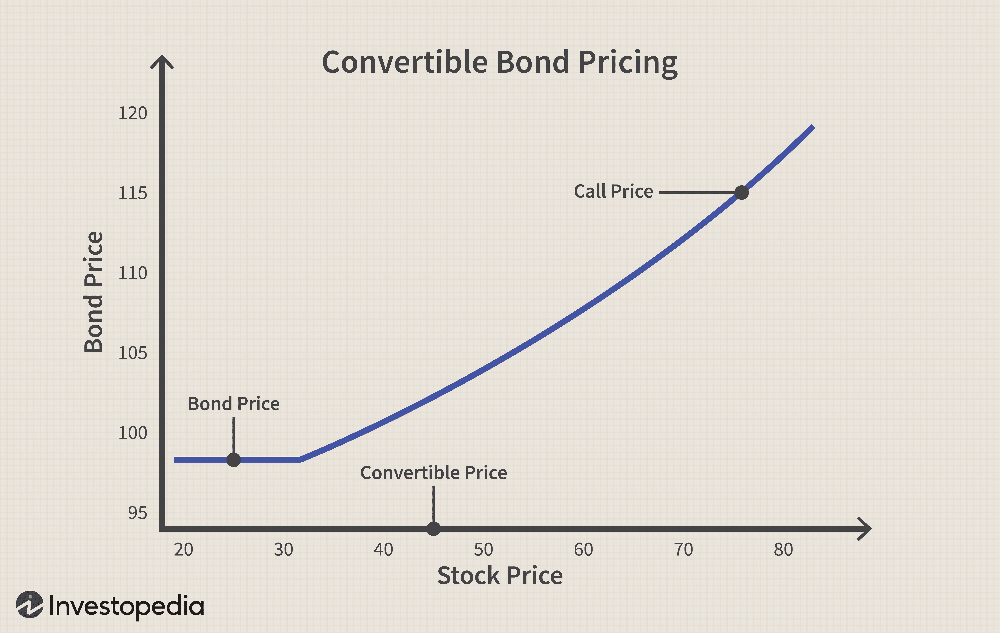

Convertible bonds represent a distinctive category of financial instruments utilized within corporate finance, characterized by their capacity to blend aspects of both debt and equity. These instruments enable corporations to raise capital while offering investors structured investment opportunities. Convertible bonds issue fixed-interest payments akin to traditional bonds but also provide the option for conversion into a predetermined number of corporate shares, which offers opportunities for capital appreciation.

Grasping how convertible bonds intersect with private corporations, corporate finance, and algorithmic trading is essential for both companies and investors. Private corporations often opt for convertible bonds as a strategic tool to balance the need for immediate capital inflow with the potential for future equity conversion. This helps these entities postpone equity dilution, thereby maintaining shareholder value and management control.

Algorithmic trading further influences the convertible bonds market, enhancing liquidity and pricing accuracy. Advanced algorithmic systems ensure efficient market conditions, thus reducing transaction costs and improving market transparency. However, these advancements come with their own set of challenges, necessitating sophisticated strategies and adaptations from both issuers and investors.

This article will explore the multifaceted role of convertible bonds within private corporations, evaluate the intricacies of corporate finance nuances, and assess how algorithmic trading has reshaped this dynamic financial landscape.

## Table of Contents

## What are Convertible Bonds?

Convertible bonds are a sophisticated financial instrument, blending the characteristics of traditional bonds and equity securities. These bonds are issued by corporations and possess the unique feature of being convertible into a predetermined number of the issuing company's shares at the discretion of the bondholder. This conversion feature offers investors the potential for capital appreciation, akin to owning equity, while initially providing the steady income stream and lower risk profile associated with bonds.

When initially issued, convertible bonds function similarly to standard debt instruments. Investors receive regular interest payments, known as coupon payments, which are typically lower than the rates on comparable non-convertible bonds. This trade-off in interest rates compensates for the valuable option to convert the bond into equity.

The conversion process is governed by specific terms outlined in the bond's indenture. Key elements include the conversion ratio, which determines how many shares a bondholder receives upon conversion, and the conversion price, which is the effective per-share price paid by the bondholder. Mathematically, these relationships are defined as:

$$
\text{Conversion Ratio} = \frac{\text{Par Value of Bond}}{\text{Conversion Price}}
$$

Valuation of convertible bonds is complex due to their hybrid nature, combining elements of fixed-income valuation with option pricing models. The valuation typically involves assessing the 'straight bond value', the present value of the bond's future cash flows if held to maturity, and the 'conversion value', determined by the current stock price and the conversion ratio. An advanced method often employed is the binomial options pricing model, which considers various factors such as the [volatility](/wiki/volatility-trading-strategies) of the underlying stock, interest rates, and time to maturity.

Investors value convertible bonds for their dual potential: receiving regular income while retaining the option to share in the growth of the issuing company. For corporations, issuing convertible bonds can be an attractive financing strategy, enabling [capital raising](/wiki/hedge-fund-capital-raising) with initially limited dilution of equity. This multifunctionality places convertible bonds as a strategic tool in corporate financing and investment portfolios, albeit with complexity that mandates careful analysis and understanding.

## Private Corporations and Convertible Bonds

Private corporations face significant challenges when considering the issuance of convertible bonds, primarily due to regulations set forth by the U.S. Securities and Exchange Commission (SEC). These regulations typically impose restrictions related to public disclosures and registration requirements that are not as easily navigable for private firms compared to their public counterparts. Convertible bonds, which blend characteristics of both debt and equity, necessitate transparency and ongoing compliance with SEC rules, presenting logistical and financial burdens for smaller private entities.

As an alternative to circumvent the stringent requirements associated with convertible bonds, many private corporations opt for issuing convertible notes. Unlike convertible bonds, convertible notes are not considered tradable securities and thus do not require registration with the SEC. This makes convertible notes a more feasible option for private firms to raise capital without the immediate complexities associated with going public. These notes typically convert into equity at a future equity financing round, allowing the issuing company to potentially defer formal valuation concerns and the accompanying equity dilution.

Convertible notes serve as interim instruments that bridge the company's financing needs until a more significant equity round or [liquidity](/wiki/liquidity-risk-premium) event occurs. The terms of conversion, such as conversion price, discount rate, and maturity date, are typically negotiated between the issuer and the investor, providing both parties with a degree of flexibility that can be advantageous given the variable dynamics present in private market fundraising.

To successfully utilize convertible instruments, private firms often engage in detailed negotiations to establish terms that align with both the company's growth ambitions and investor expectations. Factors such as the valuation cap and the [interest rate](/wiki/interest-rate-trading-strategies) play crucial roles in these negotiations. A valuation cap sets an upper limit on the conversion price, thereby protecting early investors from excessive dilution. Meanwhile, the interest rate on the convertible notes compensates investors for the risk associated with delayed equity participation.

Private corporations also need to consider the legal and tax implications of issuing convertible notes. Although these instruments are simpler than convertible bonds, they require careful documentation to ensure clarity concerning conversion mechanisms and dispute resolution procedures. Moreover, these complexities necessitate sophisticated legal and financial advisory to navigate the nuances effectively, ensuring compliance with relevant securities laws while maximizing the advantages offered by convertible financing instruments. 

In summary, while private corporations are constrained by regulatory barriers from directly issuing convertible bonds, they can effectively leverage convertible notes to fulfill their capital requirements. This strategy provides flexibility and a pathway to future equity financing, allowing private firms to navigate capital raising efficiently.

## Pros and Cons of Convertible Bonds in Corporate Finance

Convertible bonds serve as a strategic tool in corporate finance, offering companies a mechanism to raise capital while managing equity dilution. By issuing convertible bonds, companies are able to secure funds through debt with the potential to convert this obligation into equity. This conversion feature allows issuers to benefit from a reduced interest rate compared to traditional bonds, as investors are often willing to accept lower yields due to the added value of the conversion option.

### Advantages for Companies

1. **Delayed Equity Dilution:**
   Convertible bonds allow companies to postpone equity dilution. This is particularly advantageous for firms that anticipate higher future valuations, as it defers the issuance of additional shares until conversion, thereby preserving existing shareholder value in the interim.

2. **Cost-Effective Financing:**
   The promise of potential equity conversion generally enables issuers to offer lower interest rates compared to traditional debt instruments. This reduced cost of borrowing can lead to significant interest savings, which enhances corporate cash flow and financial flexibility. If $r_c$ represents the coupon rate for convertible bonds and $r_t$ represents the coupon rate for traditional bonds, it is typically the case that $r_c < r_t$.

3. **Market Signal of Confidence:**
   Issuing convertible bonds may signal to the market that management is confident in the company's future prospects. The ability to offer equity in the future suggests expectations of growth, which can positively influence stock prices and corporate reputation.

### Potential Downsides

1. **Equity Dilution Upon Conversion:**
   While delayed, the conversion of bonds into equity inevitably results in dilution of ownership. New shares issued upon conversion increase the total number of outstanding shares, potentially affecting earnings per share and diluting the voting power of existing shareholders. The impact on earnings per share (EPS) can be calculated as follows:
$$
   \text{EPS} = \frac{\text{Net Income}}{\text{Total Outstanding Shares + Shares from Conversion}}

$$

2. **Impact on Voting Control:**
   The introduction of new shares through conversion can affect voting rights within the company. Original shareholders may find their influence diluted, especially in situations where significant portions of convertible bonds are converted, potentially altering the balance of power within shareholder meetings.

3. **Market Perception Risks:**
   The market may interpret the issuance of convertible bonds as a sign that the company foresees future dilution, which could potentially exert downward pressure on stock prices. Additionally, an over-reliance on convertible bonds might suggest to the market that the company is struggling to secure traditional financing, potentially eroding investor confidence.

In summary, while convertible bonds present a cost-effective capital-raising option that leverages both debt and equity characteristics, companies must carefully weigh these benefits against the potential implications for equity dilution and shareholder control. Balancing these factors requires strategic foresight and an understanding of market dynamics to ensure optimal corporate financing decisions.

## Investor Perspective: Advantages and Disadvantages

Convertible bonds offer a unique investment opportunity by blending the properties of both equities and fixed-income securities. For investors, these instruments can be attractive due to their potential for capital appreciation combined with a comparatively lower risk profile versus direct equity investment.

### Advantages for Investors

The primary advantage of convertible bonds lies in their potential upside. The ability to convert a bond into equity allows investors to benefit from stock price appreciation. If a company's stock performs well, the investor can convert the bond into shares, capturing the growth potential akin to holding equity. This option provides flexibility and the possibility of profiting from favorable market conditions without the immediate risks associated with buying stock outright.

Additionally, convertible bonds can act as a diversification tool within an investor's portfolio. They offer exposure to equity-like appreciation while still providing the fixed-income characteristics of bonds, such as regular interest payments. This dual nature can smooth out portfolio volatility. Given their hybrid nature, convertible bonds may have a lower correlation with other asset classes, providing a buffer against market fluctuations.

### Disadvantages for Investors

Despite their potential benefits, convertible bonds present certain disadvantages. One significant drawback is the typically lower yield they offer compared to non-convertible bonds. Since convertibles provide the potential for conversion into equity, they often offer lower interest rates. For income-focused investors, this may be less attractive, especially during periods of rising interest rates or inflation.

Another risk is the potential for adverse conversion outcomes. The conversion ratio, which dictates how many shares an investor can receive per bond, is set at issuance and may not always align with market conditions at maturity. If the underlying stock performs poorly or if the market conditions during conversion are unfavorable, investors might experience reduced returns or even losses upon conversion.

Moreover, convertibles introduce equity price risk from the conversion feature, which may not fully be offset by the hedging strategies that underpin the bond's original pricing.

In summary, while convertible bonds offer investors an appealing blend of growth potential and income, they come with inherent trade-offs such as lower yields and conversion risks. Strategic consideration of these factors is necessary when incorporating convertible bonds into an investment portfolio.

## Algorithmic Trading's Impact on Convertible Bonds

Algorithmic trading has significantly transformed the convertible bonds market by enhancing pricing precision and liquidity. Convertible bonds, due to their hybrid nature, present complex valuation challenges that can benefit from the computational power of algorithmic systems. These advanced trading systems leverage algorithms to analyze vast datasets in real-time, allowing traders to ascertain true market values with greater accuracy. This improved pricing accuracy enables participants to make more informed decisions, minimizing mispricing opportunities that might otherwise occur in a less liquid market.

In addition to pricing improvements, [algorithmic trading](/wiki/algorithmic-trading) systems have augmented liquidity in the convertible bonds market. The deployment of sophisticated algorithms facilitates faster execution of trades, thereby narrowing bid-ask spreads and increasing the depth of the market. This liquidity injection makes it easier for investors to enter and [exit](/wiki/exit-strategy) positions, reducing the cost and time constraints associated with trading convertible bonds.

Advanced trading systems also enhance market transparency by providing continuous access to market data and trade information. This transparency ensures that all market participants operate with the same set of information, reducing the asymmetry that often plagues less liquid assets. As a result, transaction costs are lowered, benefiting both issuers and investors by making convertible bond markets more efficient and accessible.

However, the integration of algorithmic trading poses several challenges. First, there is the inherent complexity in developing and maintaining robust algorithmic strategies that are adaptable to market fluctuations. Traders must account for a plethora of factors, including interest rates, equity volatility, and issuer creditworthiness, when designing algorithms for convertible bonds.

Moreover, the rapid pace of algorithmic trading can exacerbate market volatility during periods of stress, leading to increased risks for investors. To counteract these challenges, market participants must employ sophisticated risk management strategies and technology infrastructure capable of handling high-frequency data processing demands.

In summary, while algorithmic trading offers substantial benefits by improving pricing accuracy, enhancing liquidity, and reducing transaction costs, it requires a deep understanding of both the financial instruments and the technology employed. Constant innovation and adaptation are necessary to manage the complexities and challenges presented by the dynamic nature of the convertible bonds market.

## Conclusion

Convertible bonds offer a potent solution for corporate finance by combining the characteristics of debt and equity. They enable companies to raise capital with potentially lower interest rates than traditional bonds, while also providing investors with upside potential through conversion to equity. However, these instruments are not without challenges and complexities. Companies must carefully time the issuance of convertible bonds to align with market conditions and corporate strategies. The decision to convert bonds into equity can lead to dilution of shares, impacting existing shareholders' voting power and ownership percentages.

For investors, understanding the strategic implications and risks associated with convertible bonds is crucial. These instruments can diversify an investment portfolio by providing a hybrid option that balances risk and reward. However, the potential for lower yields compared to traditional bonds and the complexities of conversion risk must be taken into account.

Algorithmic trading has brought forth new opportunities in the convertible bond market by enhancing pricing accuracy, improving liquidity, and reducing transaction costs. These advanced trading systems provide a level of market transparency previously unattainable, allowing for more efficient price discovery and trading executions. On the flip side, the rapid technological advancement in algorithmic trading necessitates sophisticated strategies and a deeper understanding of its implications for both issuers and investors. Adaptation to these changes is vital for market participants to fully leverage the benefits and mitigate the risks that algorithmic trading introduces in the convertible bonds landscape.

In conclusion, convertible bonds present a nuanced instrument offering advantages in corporate finance, provided stakeholders are willing to navigate their inherent complexities. Both corporations and investors must stay informed and strategically agile to optimize the use of convertible bonds, while also embracing the evolving dynamics of algorithmic trading that shape this segment of the financial market.

## References & Further Reading

[1]: Brennan, M. J., & Schwartz, E. S. (1980). ["Analyzing Convertible Bonds."](https://www.jstor.org/stable/2330567) Journal of Financial and Quantitative Analysis, 15(4), 907-929.

[2]: ["Options, Futures, and Other Derivatives"](https://www.amazon.com/Options-Futures-Other-Derivatives-9th/dp/0133456315) by John C. Hull

[3]: Fabozzi, F. J. (Ed.). (2005). ["Fixed Income Analysis."](https://books.google.com/books/about/Fixed_Income_Analysis.html?id=lujLawVLS3YC) CFA Institute Investment Series.

[4]: Chan, E. (2009). ["Quantitative Trading: How to Build Your Own Algorithmic Trading Business."](https://github.com/ftvision/quant_trading_echan_book) Wiley.

[5]: ["Algorithmic Trading: Winning Strategies and Their Rationale"](https://www.amazon.com/Algorithmic-Trading-Winning-Strategies-Rationale-ebook/dp/B00CY5HC0U) by Ernie Chan

[6]: Landau, G. N. (2009). "Convertible Bonds: Valuation, Conversion & Call Policies." ["The Journal of Portfolio Management"](https://onlinelibrary.wiley.com/doi/abs/10.1002/9781119209263.ch5) 36(1), 107-121.