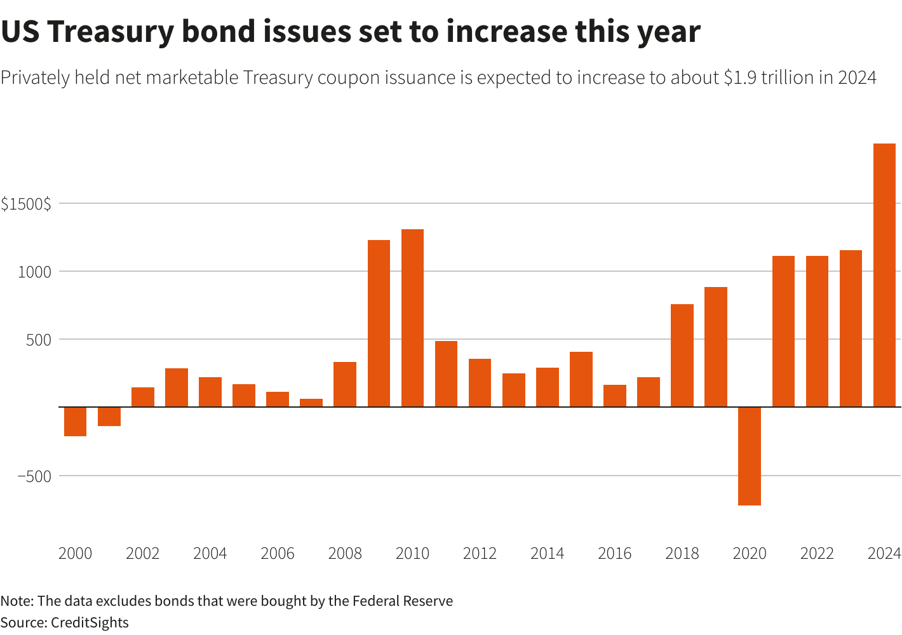

Federal bonds and government securities are pivotal components of the global financial system, serving as fundamental instruments for government financing and providing a safe investment option for individuals and institutional investors alike. These securities not only help governments raise capital for public projects and manage national debt but also play a crucial role in maintaining economic stability and liquidity within the financial markets.

Bond issuance is a complex process that involves numerous steps, from legal documentation to auctions, and is typically conducted by the U.S. Department of the Treasury in the United States. With the advancement of technology, algorithmic trading has emerged as a significant innovation, enhancing the efficiency and speed of trading government securities. This form of trading utilizes advanced mathematical models and algorithms to execute orders at speeds unimaginable to human traders, crucial for managing the massive volume of securities exchanged daily.



The focus of the article is to explore the multifaceted nature of federal bonds, the intricate processes involved in their issuance, and the transformative impact of algorithmic trading on these markets. This exploration is particularly relevant in today's financial environment, characterized by rapid technological advancement and increasing market complexity. A deeper understanding of these elements is essential for investors seeking to optimize their portfolios and for policymakers aiming to formulate effective fiscal policies.

For investors, federal bonds are often seen as a secure investment, providing stable returns and serving as a hedge against market volatility. This is due to their government backing, which significantly lowers the risk of default. For policymakers, a thorough comprehension of the role federal bonds play can aid in crafting strategies that strengthen national financial health and promote economic growth.

Through this article, readers will gain insights into the foundational role of federal bonds and the innovative processes that support their trading and issuance, equipping them with the knowledge needed to navigate the evolving financial markets successfully.

## Table of Contents

## Understanding Federal Bonds and Government Securities

Federal bonds and government securities are critical instruments issued by national governments as a means of raising funds from the public to finance various governmental activities and obligations. These securities are considered low-risk investments, as they are backed by the credit and taxing power of the issuing government.

### Types of Government Securities

There are several types of government securities, which primarily include Treasury bills (T-bills), Treasury notes, and Treasury bonds. Each type varies in terms of maturity, risk, and return potential.

- **Treasury Bills (T-bills):** These are short-term securities that mature in one year or less from their issue date. T-bills are usually issued for maturities of 4, 8, 13, 26, or 52 weeks. They are sold at a discount to their face value and do not pay interest before maturity. The return on T-bills is the difference between the purchase price and the face value, which is paid at maturity.

- **Treasury Notes (T-notes):** These securities have maturities ranging from 2 to 10 years. T-notes pay interest every six months and have a fixed interest rate. The longer maturity compared to T-bills typically results in a higher yield to compensate for the increased risk of interest rate changes over time.

- **Treasury Bonds (T-bonds):** These are long-term securities with maturities of more than 10 years, often up to 30 years. Like T-notes, T-bonds pay interest semi-annually at a fixed rate and provide a higher return due to the long-term commitment involved, alongside higher interest rate risk.

### Maturity, Risk Levels, and Returns

- **Maturity Periods:** As discussed, government securities offer a range of maturity periods from a few weeks (T-bills) to several decades (T-bonds). Shorter maturities typically involve less risk and lower returns, while longer maturities offer higher yields but come with greater exposure to interest rate fluctuations.

- **Risk Levels:** Government securities are generally considered among the safest investments because they are backed by the government, minimizing the risk of default. However, they are subject to interest rate risk, where changes in prevailing interest rates can affect the market value of existing bonds.

- **Returns:** Returns on government securities are often lower compared to other securities such as corporate bonds or equities due to their lower risk. However, these returns can be beneficial for conservative investors aiming to preserve capital and receive steady income.

### The Role of Federal Bonds in Government Financing and Fiscal Policy

Federal bonds play a significant role in government financing, serving as a primary tool for funding government operations, infrastructure projects, and managing public debts. By issuing bonds, the government can secure large sums of money from investors and use these funds for immediate development needs or to cover fiscal deficits.

Moreover, federal bonds are integral to fiscal policy, providing a mechanism for governments to influence the economy. For example, by adjusting the amount of bonds issued or altering interest rates, the government can directly impact money supply and demand, thus influencing inflation rates and overall economic stability.

Federal bonds and government securities are pivotal, not only for financing governmental activities but also in shaping the broader economic framework. Their fundamental characteristics of varying maturities, virtually negligible default risk, and government backing make them a cornerstone of prudent investment strategies, as well as efficient fiscal management.

## The Process of Bond Issuance

Federal bonds issued by the U.S. Department of the Treasury play a critical role in financing government operations and managing fiscal policy. The process of bond issuance involves several stages, starting from legal documentation to public auctions, ensuring that the government can raise funds efficiently and transparently.

### Step-by-Step Breakdown of Bond Issuance

1. **Legal Documentation and Regulations**: The issuance process begins with preparing the necessary legal documentation. This includes determining the terms of the bonds, such as maturity date, interest rate, and issue size. The Treasury must ensure compliance with all relevant laws and regulations, including the Government Securities Act.

2. **Announcement**: Once the details are finalized, the Treasury announces the upcoming bond issuance. This announcement, made via press releases and its website, includes crucial details like auction date, time, and amount to be issued. This transparency helps in attracting potential investors.

3. **Bidding and Auction Preparation**: Investors submit bids to purchase the bonds. These bids can be competitive, where bidders specify the yield or discount rate they are willing to accept, or non-competitive, where bidders agree to accept the yield determined at auction. The Treasury uses an auction system to determine the yield and allocate the bonds.

4. **Auction System**: The auction system is a critical component in the issuance process. Auctions can be conducted using either a single-price method, where all successful bidders receive the same yield, or a multiple-price method, where yields are assigned based on individual bids. In the U.S., single-price auctions, also known as Dutch auctions, are commonly used for federal bonds.

5. **Issuance**: After the auction, the Treasury assigns the bonds to the winning bidders and issues the securities. The settlement occurs shortly after the auction, where the investors pay the Treasury, and the bonds are delivered electronically.

### Marketing and Critical Elements of a Successful Bond Issue

Effective marketing is crucial to a successful bond issuance. The Treasury employs several strategies, including leveraging its credibility and maintaining transparency, to attract a broad investor base. Key elements that contribute to a successful bond issue include clarity in communication, timely dissemination of information, and ensuring accessibility for diverse investor groups.

### Management of Purchasing Bids

The Treasury manages purchasing bids through a well-organized system that ensures fairness and efficiency. The competitive bids are arranged in order of ascending yield, and bonds are allocated starting with the lowest yield bid. Non-competitive bids are filled at the determined yield after competitive bids are allocated. This systematic approach helps in achieving favorable financing terms for the government while managing borrowing costs.

In summary, the bond issuance process by the U.S. Department of the Treasury involves a structured approach, combining legal compliance, strategic marketing, and an efficient auction system to meet the government's financing needs. By understanding these mechanisms, investors can make informed decisions about participating in the government securities market.

## Algorithmic Trading and Its Role in Government Securities

Algorithmic trading, often referred to as algo trading, utilizes computer programs to execute trades at high speeds and volumes that are impossible for human traders. This method relies on mathematical models and complex algorithms to identify trading opportunities and make decisions. In the context of government securities, [algorithmic trading](/wiki/algorithmic-trading) has become integral to enhancing market efficiencies and [liquidity](/wiki/liquidity-risk-premium).

Algorithms in trading increase operational efficiency by automating the execution of buy and sell orders. These programs can analyze vast datasets and execute trades within milliseconds based on predetermined criteria. In government securities, such as Treasury bills and bonds, this speed ensures that trades can occur instantaneously in response to market conditions and economic announcements, improving liquidity and narrowing bid-ask spreads.

The impact of algorithmic trading on market [volatility](/wiki/volatility-trading-strategies) and pricing is significant. By rapidly processing information and executing orders, algorithms can help stabilize markets through continuous buying and selling, which absorbs large shocks that could lead to volatility. However, this same high-speed trading can also amplify volatility if all algorithms react similarly to market signals, causing rapid price swings. For pricing, algorithmic trading tends to lead to fairer pricing through competitive bidding and enhanced price discovery.

An example of a basic algorithmic trading strategy in government securities is mean reversion. This strategy assumes that bond prices will revert to their historical average over time. The algorithm identifies price deviations from the mean and triggers buy or sell orders when the current price significantly diverges from this average. The simplified pseudocode for such a strategy might look like this:

```python
import numpy as np

# Prices of the government security
prices = np.array([100, 102, 101, 98, 97, 99, 100, 103, 101, 102])

# Calculate the mean price
mean_price = np.mean(prices)

# Define the threshold for triggering a trade
threshold = 2

# Initialize empty list for trading signals
signals = []

for price in prices:
    if price < mean_price - threshold:
        signals.append('Buy')  # Buy if price is below mean by a threshold
    elif price > mean_price + threshold:
        signals.append('Sell')  # Sell if price is above mean by a threshold
    else:
        signals.append('Hold')  # Hold otherwise

print(signals)
```

This example illustrates how algorithms harness historical data and statistical analyses to inform trading decisions, aligning with the broader trend toward data-driven investing. As technology continues to evolve, algorithmic trading in government securities will likely become even more sophisticated, incorporating advancements in [artificial intelligence](/wiki/ai-artificial-intelligence) and [machine learning](/wiki/machine-learning) to enhance trade execution and portfolio management.

## Challenges and Opportunities in Algorithmic Trading

Algorithmic trading has revolutionized the way financial markets operate by utilizing complex algorithms to execute trading decisions at speeds and frequencies impossible for human traders. Despite its advantages, the practice faces significant challenges and opportunities. Understanding these aspects is crucial for investors and policymakers alike.

### Challenges in Algorithmic Trading

Algorithmic trading systems are not immune to technical failures. These failures can arise from hardware malfunctions, software bugs, or network issues, potentially leading to substantial financial losses. For example, a trading algorithm might misinterpret market signals due to incorrect data input, resulting in inappropriate trades. Furthermore, algorithms can sometimes exacerbate market volatility. High-frequency trading ([HFT](/wiki/high-frequency-trading-strategies)) strategies, which involve rapidly buying and selling securities, can create flash crashes. Such events undermine market stability and erode investor confidence.

Regulatory considerations are another critical challenge. As algorithmic trading grows, so does the scrutiny from regulatory bodies such as the U.S. Securities and Exchange Commission (SEC) and the European Securities and Markets Authority (ESMA). Regulators focus on ensuring these trading systems do not engage in harmful practices like market manipulation. Compliance with these regulations requires robust monitoring and modifications to trading algorithms, representing a continual challenge for traders and firms.

### Opportunities in Algorithmic Trading

Advancements in technology present significant opportunities. The integration of Artificial Intelligence (AI) and machine learning into trading algorithms enhances their ability to analyze vast datasets, detect patterns, and predict market trends. For instance, machine learning algorithms can process news articles and social media posts to gauge market sentiment, enabling more informed trading decisions. These technologies also improve risk management by refining the predictive accuracy for price movements and liquidity forecasts.

AI also facilitates the development of adaptive algorithms capable of self-improvement without human intervention. As these algorithms learn from historical data, they adjust their strategies to optimize trading outcomes dynamically. This adaptability offers a competitive edge, allowing for better responsiveness to changing market conditions.

### Leveraging Algorithmic Trading Effectively

For investors looking to capitalize on algorithmic trading, diversifying strategies through various algorithms can mitigate risks. Diversification across asset classes, timeframes, and trading strategies helps cushion against losses from market volatility or algorithmic errors. Use of robust [backtesting](/wiki/backtesting) procedures can ensure that algorithms are effective under historical conditions. Investors should also prioritize investment in technology infrastructure to minimize technical failures and implement rigorous compliance checks to adhere to regulatory requirements.

Python serves as a versatile tool for implementing algorithmic trading strategies. Investors can use libraries like NumPy and pandas for data analysis, and machine learning libraries like scikit-learn for developing predictive models. A simple example of a moving average crossover strategy in Python might look like this:

```python
import pandas as pd
import numpy as np

# Load historical stock data
data = pd.read_csv('stock_data.csv')
data['SMA_50'] = data['Close'].rolling(window=50).mean()
data['SMA_200'] = data['Close'].rolling(window=200).mean()

# Generate trading signals
data['Signal'] = np.where(data['SMA_50'] > data['SMA_200'], 1, 0)
data['Position'] = data['Signal'].diff()

# Evaluate strategy
initial_capital = 10000
data['Portfolio Value'] = initial_capital + (data['Position'].cumsum() * data['Close'])
print(data[['Close', 'SMA_50', 'SMA_200', 'Signal', 'Position', 'Portfolio Value']])
```

By understanding these challenges and opportunities, investors can make strategic decisions that harness the full potential of algorithmic trading while navigating its inherent risks. This informed approach aligns with achieving sustainable financial growth in an ever-evolving market landscape.

## The Importance of Federal Bonds in Investor Portfolios

Federal bonds, often referred to as government securities, are considered a cornerstone of many investment portfolios due to their safety, reliability, and governmental backing. Unlike stocks, which can be highly volatile, federal bonds offer a predictable stream of income and are regarded as one of the safest investment vehicles available. This level of security derives from the commitment of governments, especially those with strong credit ratings, to honor debt obligations.

### Why Federal Bonds are Considered Safe

Federal bonds are perceived as low-risk investments because they are backed by the full faith and credit of the issuing government. In cases such as U.S. Treasury securities, the likelihood of default is minimal due to the government's ability to print money, raise taxes, and engage in fiscal austerity to meet its debt obligations. This implied security provides a foundation of stability within investment portfolios.

### Federal Bonds in a Diversified Portfolio

Incorporating federal bonds within a diversified portfolio serves to mitigate overall investment risk. Diversification involves spreading investments across different asset classes to reduce exposure to any single one. Federal bonds complement riskier assets like stocks, which may be subject to market fluctuations, by providing more stable returns. The inclusion of federal bonds ensures that investors have a dependable income source, which can be particularly beneficial during economic downturns.

### Risk vs. Return Analysis for Bonds

The risk-return profile of federal bonds typically shows lower returns compared to equities but with significantly reduced risk. For instance, the U.S. 10-year Treasury bond yield is often used as a benchmark for risk-free rate in financial models. Historically, these bonds have provided a modest return, but due to their security and predictability, they serve as a crucial component of the overall risk management strategy in an investor's portfolio.

$$
\text{Risk-Free Rate (RFR)} = \text{Yield of a 10-year Treasury Bond}
$$

Investors often use this risk-free rate as a baseline to gauge the expected return on other investments, adjusting for risk factors associated with equities or corporate bonds.

### Achieving Long-Term Financial Goals with Federal Bonds

Federal bonds play a fundamental role in achieving long-term financial goals. They are commonly used in retirement portfolios to balance income needs with capital preservation, ensuring that retirees have a steady income stream without incurring significant risk. Furthermore, bonds with varying maturities can be strategically invested to match their temporal liabilities and planned expenses.

In conclusion, federal bonds occupy a vital position in investment strategies. Their role as safe, reliable assets allows investors to build resilient portfolios capable of weathering market uncertainties while achieving financial objectives. The combination of low risk, stable returns, and predictability makes them indispensable for both conservative and diversified investment approaches.

## Conclusion

Federal bonds and algorithmic trading represent fundamental components of the modern financial landscape. The issuance and trading of government securities, such as federal bonds, serve as vital tools for national financing and fiscal policy management. They provide governments with the necessary funding to operate efficiently, while also presenting secure investment opportunities for individuals and institutions alike. Understanding these financial instruments thus becomes crucial for both investors seeking stable returns and policymakers aiming to enact sound fiscal strategies.

Algorithmic trading, on the other hand, has revolutionized the ways these securities are traded. By employing computer algorithms to automate the trading process, efficiency is markedly improved. These algorithms allow for rapid execution of trades, minimizing the time it takes to respond to market changes, and can significantly reduce transaction costs. Furthermore, while this technology may contribute to increased market volatility at times, it also offers sophisticated trading strategies that can be leveraged for better pricing and advantageous investment outcomes.

Empowering investors with a comprehensive understanding of bond issuance processes and algorithmic trading strategies is essential in navigating today's evolving financial markets. Investors, equipped with knowledge about the mechanisms of federal bonds and the benefits of algorithmic trading, can more effectively manage their portfolios. This includes recognizing the potential risks and rewards associated with various investment vehicles.

In a continuously changing economic environment, adapting to new technologies and methodologies, like algorithmic trading, is crucial. It equips investors to make informed decisions, balancing traditional investment strategies with innovative techniques to enhance their financial goals. Overall, recognizing the significance of federal bonds and the influence of algorithmic trading will provide investors with the confidence and competency needed to thrive amidst financial market dynamics.

## References & Further Reading

[1]: Interagency Working Group on Treasury Market Surveillance. (2020). ["Recent Disruptions and Potential Reforms in the U.S. Treasury Market: A Staff Progress Report."](https://home.treasury.gov/news/press-releases/jy0470) 

[2]: U.S. Department of the Treasury. ["Bureau of the Fiscal Service."](https://www.fiscal.treasury.gov/) 

[3]: Treynor, J. L. (1965). "How to Rate Management of Investment Funds." *Harvard Business Review.*

[4]: ["Handbook of Fixed Income Securities"](https://www.amazon.com/Handbook-Fixed-Income-Securities-Ninth/dp/1260473899) by Frank J. Fabozzi

[5]: Aldridge, I. (2013). ["High-Frequency Trading: A Practical Guide to Algorithmic Strategies and Trading Systems, 2nd Edition."](https://www.amazon.com/High-Frequency-Trading-Practical-Algorithmic-Strategies/dp/1118343506) 

[6]: Hasbrouck, J., & Saar, G. (2013). ["Low-latency trading."](https://www.sciencedirect.com/science/article/abs/pii/S1386418113000165) *Review of Financial Studies, 26*(9), 2379-2439. 

[7]: ["Treasury Securities FAQs."](https://www.treasurydirect.gov/help-center/faqs/buyback-faqs/) U.S. Department of the Treasury.