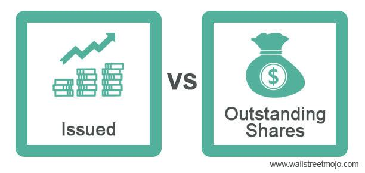

Understanding the basics of stock comparison is crucial for investors looking to optimize their portfolios. In the stock market, shares play a vital role, and an investor's ability to differentiate between issued shares and outstanding shares is fundamental. Issued shares, the total number offered by a company, and outstanding shares, those held by investors excluding treasury shares, are key indicators of a company's financial standing and investor appeal.

Algorithmic trading, commonly referred to as algo trading, has transformed the way shares are traded, introducing a significant shift that prioritizes speed and efficiency. This method leverages computer programs to execute trades rapidly, based on pre-established criteria, and has become a pivotal factor in modern trading environments.



This article offers a comprehensive guide to stock comparison, focusing on issued shares, outstanding shares, and the profound influence of algorithmic trading. By exploring these components, readers will gain clearer insights into how these elements affect stock market decisions and guide investor strategies. Drawing from these insights, investors can enhance their understanding and approach to investment opportunities, thereby refining their portfolio optimization techniques.

## Table of Contents

## Understanding Issued Shares

Issued shares are a pivotal concept in understanding a company's ownership and financial structure. They represent the total number of shares a company has sold to both institutional and retail investors throughout its history. These shares encompass both the outstanding shares, which are held by external investors, and the treasury shares, which the company retains in its own coffers.

When a company is initially formed, it determines the number of shares it plans to issue as part of its charter. This number can fluctuate over time due to various corporate actions, such as stock splits, stock dividends, or share buybacks. For instance, during a stock split, each existing share is divided into multiple shares, thereby increasing the number of issued shares without affecting the company's overall capital. Conversely, a share buyback reduces the number of issued shares as the company repurchases shares from the open market, often aiming to reduce the supply of its stock and increase shareholder value.

Grasping the concept of issued shares is essential for investors seeking to understand a company's capital structure. These shares reflect the initial capital raised by the company and indicate its capacity to execute long-term strategies, such as expansion or research and development investments. Analyzing issued shares also aids investors in assessing how a company leverages its equity for financing purposes and its potential to undertake future corporate actions that may impact share value and investor returns.

For a robust analysis, investors can consider the proportion of issued shares represented by treasury shares, which may offer insights into a company's strategic stock management. A substantial number of treasury shares can suggest management's confidence in future growth or a mechanism to exercise control over the company’s decisions.

Thus, understanding issued shares not only reveals the history of a company’s financial decisions but also provides clues about future strategic intentions, holding significant importance for any comprehensive investment evaluation.

## Exploring Outstanding Shares

Outstanding shares are a key element in understanding a company's equity structure, forming an integral part of financial analysis. These shares represent the number of shares that are currently held by investors, which include institutional investors, retail investors, and company executives, but exclude treasury shares that the company retains for potential future transactions.

**Role in Financial Metrics**

Outstanding shares are vital for calculating important financial metrics. The Earnings Per Share (EPS) is a crucial indicator used by investors to gauge a company's profitability. It is computed using the formula:

$$
\text{EPS} = \frac{\text{Net Income} - \text{Dividends on Preferred Stock}}{\text{Total Outstanding Shares}}
$$

Another significant metric where outstanding shares are applied is market capitalization, which measures a company's total market value. Market capitalization is calculated as:

$$
\text{Market Capitalization} = \text{Current Share Price} \times \text{Total Outstanding Shares}
$$

**Dynamics of Outstanding Shares**

The number of outstanding shares is not static and can fluctuate due to corporate actions such as stock buybacks or issuing new shares. When a company repurchases its shares, the number of outstanding shares decreases, which often leads to a higher EPS due to the reduced denominator in the EPS formula. Conversely, issuing new shares increases the number of outstanding shares, which can dilute the current shareholders' value if the capital raised does not proportionately enhance the company's earnings.

**Investor Analysis**

Investors pay close attention to outstanding shares to understand ownership distribution and shareholder dilution. A lower number of outstanding shares typically implies higher shareholder value, assuming constant net income and market price. Investors carefully evaluate changes in outstanding shares to anticipate their potential impact on share value and market sentiments. Stock buybacks are generally viewed as a signal of management's confidence in the company's future prospects, whereas issuing new shares might require careful analysis of the company's rationale to avoid undesirable dilution.

In conclusion, outstanding shares provide crucial insights into a company's equity distribution and help investors make informed decisions regarding stock investments. They serve as a foundation for key financial calculations and indicators, making them indispensable for evaluating a company's financial health and strategic decisions.

## Stock Comparison: Issued vs. Outstanding Shares

Comparing issued shares to outstanding shares provides valuable insights into a company's operational and financial health. Issued shares encompass the total number of shares a company has created and sold to investors. These include both outstanding shares, which are currently held by all investors, and treasury shares, which are held by the company itself.

A significant difference between issued and outstanding shares often indicates the presence of substantial treasury shares. Treasury shares are those that a company repurchases but chooses not to retire. A higher proportion of treasury shares means fewer shares are available on the open market, potentially affecting the company's [liquidity](/wiki/liquidity-risk-premium) and control. Companies with substantial treasury shares might have lower liquidity, which can influence the ease with which shares can be bought or sold without impacting the share price significantly.

Understanding the balance between issued and outstanding shares is crucial for assessing a company's potential for future stock offerings or buybacks. For instance, a company with a large number of treasury shares might use these shares for employee compensation plans or to raise capital in the future without issuing new shares. Conversely, if a company has issued a high number of shares but many are held as treasury shares, this may indicate readiness for future buybacks, which can consolidate ownership and potentially enhance shareholder value by reducing the number of shares outstanding.

Investors utilize the comparison between issued and outstanding shares to evaluate a company's approach to capital management. A company that frequently buys back shares might be perceived as one that emphasizes returning value to shareholders, possibly indicating a strong cash flow position. Alternatively, a firm that issues new shares regularly might be in a growth phase, seeking to raise capital for expansion or other corporate activities.

Ultimately, the relationship between issued and outstanding shares serves as a window into a company's strategic financial decisions and their implications for investors. Whether considering potential dilution effects or company control, analyzing these metrics provides crucial information on a company's capital strategy and its implications for investor interests.

## The Role of Algo Trading in Stock Markets

Algorithmic trading, often referred to as algo trading, has transformed the landscape of stock markets by leveraging computer programs to execute trades with precision and speed. These programs operate based on predetermined criteria, such as timing, price, or complex mathematical models. This shift towards automation has brought about significant changes in market dynamics, with both beneficial and detrimental implications.

One of the primary advantages of [algorithmic trading](/wiki/algorithmic-trading) is its ability to enhance liquidity and market efficiency. By executing trades rapidly, algo trading reduces the spread between the bid and ask prices, facilitating smoother transactions for all market participants. This heightened liquidity ensures that large orders can be absorbed by the market with minimal impact on prices, thus contributing to more stable market conditions.

However, the reliance on algorithms and speed introduces challenges, notably in terms of market [volatility](/wiki/volatility-trading-strategies) and risk of manipulation. High-frequency trading ([HFT](/wiki/high-frequency-trading-strategies)), a subset of algo trading, is particularly known for exacerbating volatility during periods of uncertainty or high market stress. The flash crash of 2010, where the Dow Jones Industrial Average plunged nearly 1,000 points in minutes, highlighted the potential for rapid, algorithm-driven sell-offs. Such events showcase the market’s vulnerability to sharp price movements triggered by automated systems.

Understanding how algorithmic trading operates is crucial for investors aiming to recognize patterns and anticipate [volume](/wiki/volume-trading-strategy) spikes. Algorithms can be designed to detect and react to particular conditions, such as the appearance of large block trades or the [breakout](/wiki/breakout-trading) of certain technical indicators. For instance, a simple moving average crossover strategy might involve buying stock when a short-term moving average crosses above a long-term moving average, indicating an upward trend:

```python
def moving_average_crossover(prices, short_window=50, long_window=200):
    short_mavg = prices.rolling(window=short_window, min_periods=1).mean()
    long_mavg = prices.rolling(window=long_window, min_periods=1).mean()
    signal = (short_mavg > long_mavg).astype(int)
    return signal
```

Despite its complexities, algorithmic trading also carries the risk of market manipulation. Practices such as spoofing—where traders place large orders to create false demand or supply, only to cancel them later—can distort market perceptions and prices. Such tactics undermine market integrity and can lead to regulatory scrutiny.

In conclusion, while algorithmic trading offers substantial benefits in efficiency and liquidity, it also presents challenges related to market stability and fairness. A robust understanding of algo trading dynamics, combined with strategic oversight, is essential for ensuring this technology continues to contribute positively to market ecosystems. Investors equipped with knowledge about algorithmic patterns and potential pitfalls will be better positioned to mitigate associated risks and capitalize on opportunities.

## Impact of Algo Trading on Shares

Algorithmic trading, widely known as algo trading, significantly influences trading volume and price movements, impacting both issued and outstanding shares. By employing algorithms to execute trades at high speeds, algo trading can alter the market environment in several ways, particularly through its subsets, such as high-frequency trading (HFT).

High-frequency trading, a prominent form of algo trading, targets highly liquid stocks, thereby affecting their volatility levels. This type of trading involves executing a large number of orders at ultra-fast speeds, often completing these transactions in microseconds. The main aim is to capitalize on small price inefficiencies in the market. Due to the rapid nature of HFT, stocks that are commonly targeted include those with high liquidity, enabling traders to enter and [exit](/wiki/exit-strategy) positions swiftly without significantly affecting the stock price. However, the sheer volume and speed of trades can lead to substantial price swings and increased market volatility.

One potential implication for investors is the resultant fluctuation in the market price of shares. The intense activity driven by algo trading can lead to swift and unexpected price changes, posing challenges for traditional investors who rely on longer-term strategies. Understanding these dynamics is crucial, as periods of rapid trading can influence the market's perception of a stock's value, potentially leading to a misrepresentation of a company's true financial health and performance.

Investors should therefore be vigilant about the impact of algo trading on their shares. This impact becomes particularly pronounced during periods of rapid price changes, where quick decisions can result in either substantial gains or losses. Recognizing the trading patterns associated with algo trading can help in predicting potential movements in stock prices and preparing suitable responses.

Additionally, a comprehensive understanding of algo trading dynamics can facilitate more informed investment decisions and risk management strategies. For instance, being aware of how algo trading influences market liquidity and volatility can guide investors in adjusting their portfolios to mitigate risks associated with unexpected market movements. 

Incorporating algorithms into one's own trading strategy, or understanding their presence in the market, can provide an edge in navigating the stock market's complexities. By leveraging insights derived from recognizing algo trading's impact, investors can optimize their investment portfolios, ensuring alignment with their financial goals while mitigating potential risks associated with this high-speed trading phenomenon.

## Conclusion

A sound understanding of issued shares, outstanding shares, and algorithmic trading is essential for any serious investor. These elements are fundamental to evaluating a company's stock, as they offer insights into both traditional valuation metrics and modern trading dynamics. 

Issued shares provide a window into a company’s capital structure, while outstanding shares are crucial for calculating financial metrics like earnings per share (EPS) and determining market capitalization, both key indicators of a company's financial health and investor appeal. Knowing the differences and interconnections between these types of shares allows investors to better gauge shareholder dilution and company control.

Algorithmic trading represents a transformative force in stock markets, enhancing trade execution speed and liquidity but also introducing potential volatility and concerns about market manipulation. As algorithmic trading technology evolves, understanding its impact on issued and outstanding shares becomes increasingly important. This awareness can help investors anticipate market movements, particularly during high-frequency trading activities that lead to rapid price shifts.

By leveraging knowledge of these aspects, investors can make more informed decisions, effectively manage risks, and optimize their investment strategies in the ever-complex stock market environment. Staying informed about these components not only aids in analyzing current market conditions but also prepares investors to adapt to future developments in stock trading practices.

## References & Further Reading

[1]: ["Algorithmic and High-Frequency Trading"](https://www.cambridge.org/us/universitypress/subjects/mathematics/mathematical-finance/algorithmic-and-high-frequency-trading) by Álvaro Cartea, Sebastian Jaimungal, and José Penalva

[2]: Black, Fischer, & Scholes, Myron. (1973). ["The Pricing of Options and Corporate Liabilities."](https://www.cs.princeton.edu/courses/archive/fall09/cos323/papers/black_scholes73.pdf) Journal of Political Economy, 81(3), 637-654.

[3]: Fama, Eugene F. (1970). ["Efficient Capital Markets: A Review of Theory and Empirical Work."](https://onlinelibrary.wiley.com/doi/abs/10.1111/j.1540-6261.1970.tb00518.x) Journal of Finance, 25(2), 383-417.

[4]: ["The Handbook of High-Frequency Trading"](https://www.amazon.com/Handbook-High-Frequency-Trading-Gregoriou-ebook/dp/B00TH0LWHY) edited by Greg N. Gregoriou

[5]: Kirilenko, Andrei A., & Lo, Andrew W. (2013). ["Moore’s Law versus Murphy’s Law: Algorithmic Trading and Its Discontents."](https://www.aeaweb.org/articles?id=10.1257/jep.27.2.51) The Journal of Economic Perspectives, 27(2), 51-72.

[6]: ["Dark Pools: The Rise of the Machine Traders and the Rigging of the U.S. Stock Market"](https://archive.org/details/darkpoolsriseofm0000patt) by Scott Patterson