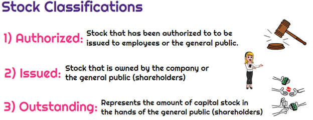

## Table of Contents

## What are issued shares?

Issued shares are the total number of shares that a company has given out to investors. When a company decides to raise money, it can do this by selling pieces of ownership, called shares, to people or other companies. These shares represent a part of the company, and the total number of shares that have been sold is called the issued shares.

The number of issued shares can change over time. If a company wants to raise more money, it might decide to issue more shares. This means they sell more pieces of the company to new or existing investors. On the other hand, if a company buys back some of its own shares, the number of issued shares will go down. Keeping track of issued shares is important because it helps show how much of the company is owned by investors.

## What are outstanding shares?

Outstanding shares are all the shares of a company that are owned by investors, including the public and company insiders. These are the shares that have been issued by the company and are currently held by shareholders. The number of outstanding shares is important because it shows how many pieces of the company are divided among owners.

The number of outstanding shares can change over time. If a company issues more shares to raise money, the number of outstanding shares goes up. If the company buys back some of its own shares, the number of outstanding shares goes down. Keeping track of outstanding shares helps investors understand how much of the company they own and how their ownership might change.

## How do issued shares differ from outstanding shares?

Issued shares are the total number of shares a company has sold to investors. This number includes all the shares the company has ever given out, even if some of those shares are no longer in the hands of investors. For example, if a company issued 100 shares but then bought back 20 of them, the number of issued shares would still be 100.

Outstanding shares, on the other hand, are the shares that are currently owned by investors. This number only includes the shares that are still out there in the market or held by shareholders. Using the same example, if the company issued 100 shares but bought back 20, the number of outstanding shares would be 80 because those 20 shares are no longer owned by investors.

The main difference between issued shares and outstanding shares is that issued shares count all shares ever sold by the company, while outstanding shares only count the shares that are currently owned by investors. This difference is important because it helps show how much of the company is actually in the hands of shareholders at any given time.

## Why is it important to understand the difference between issued and outstanding shares?

Understanding the difference between issued and outstanding shares is important because it helps you know how much of a company is owned by investors at any time. Issued shares are all the shares a company has ever sold, even if some of those shares are no longer owned by investors. Outstanding shares are the shares that are still owned by investors right now. This difference matters because it shows you how the company's ownership has changed over time and how many shares are actually out there in the market.

Knowing this difference can also help you make better decisions if you're thinking about investing in the company. If a company has a lot of issued shares but fewer outstanding shares, it might mean the company has bought back some of its own shares. This can be a good sign because it might mean the company thinks its shares are a good investment. On the other hand, if the number of outstanding shares keeps going up, it could mean the company is issuing more shares to raise money, which might dilute the value of the shares you own. So, understanding issued and outstanding shares gives you a clearer picture of the company's financial health and its strategy for managing its stock.

## Can the number of issued shares change over time?

Yes, the number of issued shares can change over time. When a company wants to raise more money, it can sell more shares to investors. This means they issue new shares, and the total number of issued shares goes up. For example, if a company starts with 100 issued shares and then sells 50 more, the new total of issued shares becomes 150.

On the other hand, the number of issued shares can also go down. If a company buys back some of its own shares, those shares are no longer considered issued. So, if that same company with 150 issued shares buys back 30 of them, the number of issued shares drops to 120. Keeping track of how many shares are issued helps show how the company is managing its stock and raising money.

## Can the number of outstanding shares change over time?

Yes, the number of outstanding shares can change over time. When a company wants to get more money, it can sell new shares to people or other companies. When this happens, the number of outstanding shares goes up because more shares are now owned by investors.

The number of outstanding shares can also go down. If a company buys back some of its own shares, those shares are no longer owned by investors. So, the total number of outstanding shares decreases. Keeping track of how many shares are outstanding helps show how much of the company is owned by investors at any given time.

## What causes the number of outstanding shares to be less than the number of issued shares?

The number of outstanding shares can be less than the number of issued shares when a company buys back some of its own shares. When a company does this, it's called a share buyback or stock repurchase. The shares that the company buys back are no longer owned by investors, so they are not counted as outstanding shares anymore. But, they are still part of the total number of issued shares because the company issued them in the first place.

For example, if a company originally issued 100 shares and then bought back 20 of them, the number of issued shares would still be 100. But, the number of outstanding shares would now be 80 because only 80 shares are still owned by investors. This difference shows how the company is managing its stock and can affect the value of the shares that are still out there.

## How do companies decide on the number of shares to issue?

Companies decide on the number of shares to issue based on how much money they need to raise and what they want their stock price to be. If a company needs a lot of money, it might issue more shares to get more cash from investors. But, if they want the price of each share to stay high, they might issue fewer shares. The company also thinks about how much of the business they want to give away to investors. If they want to keep more control, they might issue fewer shares.

Another thing companies think about is the market and what investors want. If there's a lot of interest in their company, they might issue more shares because they know people will buy them. They also look at similar companies to see how many shares those companies issued. This helps them decide on a number that makes sense for their own business. It's a balancing act to make sure they get the money they need without giving away too much of the company or making the share price too low.

## What impact do issued and outstanding shares have on a company's market capitalization?

A company's market capitalization, or market cap, is the total value of all its outstanding shares. It's found by multiplying the current stock price by the number of outstanding shares. So, if a company has 1 million outstanding shares and each share is worth $10, the market cap would be $10 million. This number shows how much the whole company is worth in the market.

The number of issued shares doesn't directly affect the market cap because market cap only counts the shares that are owned by investors right now, which are the outstanding shares. But, if a company issues more shares, it can change the number of outstanding shares and the stock price. If the company issues more shares and sells them, the money raised might make the company more valuable, but it also means the value of each share might go down because there are more shares to divide the company's value among. So, understanding both issued and outstanding shares helps you see how a company's decisions about its stock can affect its market value.

## How do stock buybacks affect the number of issued and outstanding shares?

When a company buys back its own shares, it's called a stock buyback. This action changes the number of outstanding shares. When the company buys back shares, those shares are no longer owned by investors, so the number of outstanding shares goes down. For example, if a company had 100 outstanding shares and bought back 20 of them, the number of outstanding shares would now be 80.

Stock buybacks also affect the number of issued shares, but in a different way. The shares that the company buys back are still considered issued because the company originally sold them. So, in the same example, even after the buyback, the number of issued shares would still be 100. The difference between issued and outstanding shares after a buyback shows how the company is managing its stock and can affect the value of the shares that remain in the market.

## What are the financial reporting requirements for issued and outstanding shares?

Companies have to follow certain rules when they tell people about their issued and outstanding shares. They need to report the number of outstanding shares in their financial statements, which are documents that show how the company is doing financially. These statements are important because they help investors understand how much of the company is owned by shareholders at any time. The number of outstanding shares is usually shown in the company's balance sheet, which is a part of the financial statements that lists what the company owns and owes.

The number of issued shares is also important, but it's not always shown in the same way as outstanding shares. Companies usually talk about issued shares in their notes to the financial statements. These notes give more details about the numbers in the financial statements. They might explain how many shares the company has issued over time and why the number of issued shares might be different from the number of outstanding shares. By looking at both issued and outstanding shares, investors can get a better picture of the company's stock and how it's being managed.

## How do investors use the data on issued and outstanding shares for investment decisions?

Investors use the data on issued and outstanding shares to make smart choices about buying or selling a company's stock. They look at the number of outstanding shares to understand how much of the company is owned by investors right now. If a company has fewer outstanding shares, each share might be worth more because there are fewer pieces of the company to go around. Investors also watch for changes in the number of outstanding shares. If a company is buying back its own shares, it might mean the company thinks its stock is a good investment, which could be a good sign for investors.

Investors also pay attention to the number of issued shares because it shows the total number of shares the company has ever sold. If a company keeps issuing more shares, it might be trying to raise money, but it could also mean that the value of each share might go down because there are more shares to divide the company's value among. By looking at both issued and outstanding shares, investors can get a fuller picture of how the company is managing its stock and how that might affect the stock's value. This helps them decide if they want to buy, hold, or sell the stock.

## What are outstanding shares and how can we explore them?

Outstanding shares are a key element in understanding a company's equity structure, forming an integral part of financial analysis. These shares represent the number of shares that are currently held by investors, which include institutional investors, retail investors, and company executives, but exclude treasury shares that the company retains for potential future transactions.

**Role in Financial Metrics**

Outstanding shares are vital for calculating important financial metrics. The Earnings Per Share (EPS) is a crucial indicator used by investors to gauge a company's profitability. It is computed using the formula:

$$
\text{EPS} = \frac{\text{Net Income} - \text{Dividends on Preferred Stock}}{\text{Total Outstanding Shares}}
$$

Another significant metric where outstanding shares are applied is market capitalization, which measures a company's total market value. Market capitalization is calculated as:

$$
\text{Market Capitalization} = \text{Current Share Price} \times \text{Total Outstanding Shares}
$$

**Dynamics of Outstanding Shares**

The number of outstanding shares is not static and can fluctuate due to corporate actions such as stock buybacks or issuing new shares. When a company repurchases its shares, the number of outstanding shares decreases, which often leads to a higher EPS due to the reduced denominator in the EPS formula. Conversely, issuing new shares increases the number of outstanding shares, which can dilute the current shareholders' value if the capital raised does not proportionately enhance the company's earnings.

**Investor Analysis**

Investors pay close attention to outstanding shares to understand ownership distribution and shareholder dilution. A lower number of outstanding shares typically implies higher shareholder value, assuming constant net income and market price. Investors carefully evaluate changes in outstanding shares to anticipate their potential impact on share value and market sentiments. Stock buybacks are generally viewed as a signal of management's confidence in the company's future prospects, whereas issuing new shares might require careful analysis of the company's rationale to avoid undesirable dilution.

In conclusion, outstanding shares provide crucial insights into a company's equity distribution and help investors make informed decisions regarding stock investments. They serve as a foundation for key financial calculations and indicators, making them indispensable for evaluating a company's financial health and strategic decisions.

## References & Further Reading

[1]: ["Algorithmic and High-Frequency Trading"](https://www.cambridge.org/us/universitypress/subjects/mathematics/mathematical-finance/algorithmic-and-high-frequency-trading) by Álvaro Cartea, Sebastian Jaimungal, and José Penalva

[2]: Black, Fischer, & Scholes, Myron. (1973). ["The Pricing of Options and Corporate Liabilities."](https://www.cs.princeton.edu/courses/archive/fall09/cos323/papers/black_scholes73.pdf) Journal of Political Economy, 81(3), 637-654.

[3]: Fama, Eugene F. (1970). ["Efficient Capital Markets: A Review of Theory and Empirical Work."](https://onlinelibrary.wiley.com/doi/abs/10.1111/j.1540-6261.1970.tb00518.x) Journal of Finance, 25(2), 383-417.

[4]: ["The Handbook of High-Frequency Trading"](https://www.amazon.com/Handbook-High-Frequency-Trading-Gregoriou-ebook/dp/B00TH0LWHY) edited by Greg N. Gregoriou

[5]: Kirilenko, Andrei A., & Lo, Andrew W. (2013). ["Moore’s Law versus Murphy’s Law: Algorithmic Trading and Its Discontents."](https://www.aeaweb.org/articles?id=10.1257/jep.27.2.51) The Journal of Economic Perspectives, 27(2), 51-72.

[6]: ["Dark Pools: The Rise of the Machine Traders and the Rigging of the U.S. Stock Market"](https://archive.org/details/darkpoolsriseofm0000patt) by Scott Patterson