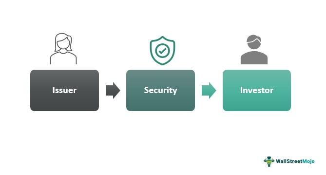

## Table of Contents

## What is an issuer in finance?

An issuer in finance is the organization or company that creates and sells securities like stocks or bonds to investors. This can be a government, a corporation, or even a municipality. When a company needs to raise money, it might issue stocks, which are shares of ownership in the company, or bonds, which are loans that the company promises to pay back with interest.

The role of the issuer is important because they are responsible for the terms of the securities they issue. For example, if a company issues bonds, it sets the interest rate and the maturity date, which is when the bond will be paid back. Investors look at the issuer's financial health and reputation to decide if they want to buy the securities. If the issuer does well, the value of the securities can go up, but if the issuer runs into trouble, the value can go down.

## What types of financial instruments can an issuer offer?

An issuer can offer different types of financial instruments to raise money. The most common ones are stocks and bonds. Stocks are pieces of ownership in a company. When you buy a stock, you become a part-owner of that company. Bonds are like loans that you give to the issuer. The issuer promises to pay you back the money you lent them, plus some extra money called interest, over time.

There are also other types of financial instruments that issuers can offer. For example, they can issue preferred stocks, which are a bit like a mix between stocks and bonds. Preferred stocks usually pay a fixed dividend and have priority over common stocks if the company goes bankrupt. Another type is commercial paper, which is a short-term debt instrument used by companies to finance their immediate needs, like paying for inventory or managing cash flow.

Lastly, issuers can offer derivatives, which are financial contracts whose value comes from an underlying asset like stocks, bonds, commodities, or currencies. Common derivatives include options and futures. Options give the buyer the right, but not the obligation, to buy or sell an asset at a set price before a certain date. Futures are agreements to buy or sell an asset at a future date for a price agreed upon today. These instruments can be complex and are often used for hedging risks or speculating on price movements.

## How does an issuer differ from an underwriter?

An issuer is the company or organization that creates and sells securities like stocks or bonds. They need money, so they offer these securities to investors. The issuer decides the terms of the securities, like how much interest they will pay on bonds or how many shares of stock they will sell. They are responsible for the securities and must follow rules about how they are sold and how they report their financial health to investors.

An underwriter, on the other hand, is a different kind of company that helps the issuer sell their securities. When an issuer wants to sell securities, they often hire an underwriter to manage the process. The underwriter helps set the price of the securities, buys them from the issuer, and then sells them to investors. They take on the risk of selling the securities and often earn a fee for their services. So, while the issuer creates the securities, the underwriter helps make sure they are sold successfully.

## What are the responsibilities of an issuer when issuing securities?

When an issuer wants to issue securities, they have to follow a lot of rules to make sure everything is done right. They need to make sure they give all the important information about the securities to investors. This means writing documents like a prospectus that tells people what the securities are, how much they cost, and any risks involved. The issuer also has to follow the rules set by places like the Securities and Exchange Commission (SEC) in the United States, which helps make sure the securities market is fair and honest.

After the securities are issued, the issuer still has responsibilities. They have to keep investors updated on how the company is doing. This means they need to share regular reports about their financial health, like how much money they are making or losing. If the issuer is a company, they also need to make sure they are using the money they raised from the securities the way they said they would. All these steps help build trust with investors and keep the market working smoothly.

## What is the process for an issuer to bring a new security to the market?

When an issuer wants to bring a new security to the market, they start by deciding what kind of security they want to issue, like stocks or bonds. They work with lawyers and financial experts to create a plan for the security. This plan includes how much money they want to raise, the price of the security, and any special terms or conditions. The issuer also prepares a document called a prospectus, which explains everything about the security to potential investors. This document is really important because it helps investors understand what they are buying and the risks involved.

Next, the issuer usually hires an underwriter, which is a company that helps sell the securities. The underwriter works with the issuer to set the final price of the security and then buys the securities from the issuer. After that, the underwriter sells the securities to investors. The issuer has to make sure they follow all the rules set by financial regulators, like the Securities and Exchange Commission (SEC) in the United States. Once the securities are sold, the issuer needs to keep investors updated on how the company is doing by sharing regular financial reports. This helps keep everything transparent and fair for everyone involved.

## How does an issuer's credit rating affect the securities they issue?

An issuer's credit rating is like a report card that tells investors how likely the issuer is to pay back the money they borrow. If an issuer has a high credit rating, it means they are seen as reliable and less risky. This makes investors feel more comfortable buying the securities, like bonds, that the issuer sells. Because the risk is lower, the issuer might be able to offer a lower [interest rate](/wiki/interest-rate-trading-strategies) on their bonds, which saves them money.

On the other hand, if an issuer has a low credit rating, it means they are seen as riskier. Investors might be worried that the issuer won't be able to pay back the money they borrow. Because of this higher risk, investors will want a higher interest rate to feel comfortable buying the securities. This means the issuer has to pay more money to borrow, which can make it harder for them to raise money. So, a credit rating can really affect how much it costs an issuer to bring new securities to the market.

## What are the regulatory requirements an issuer must comply with?

When an issuer wants to sell securities like stocks or bonds, they have to follow a lot of rules set by financial regulators. In the United States, the main regulator is the Securities and Exchange Commission (SEC). The issuer needs to file a registration statement with the SEC, which includes a prospectus. The prospectus is a detailed document that tells investors everything they need to know about the securities, like how much they cost, what the risks are, and how the issuer plans to use the money they raise. The SEC reviews this information to make sure it's accurate and complete, which helps protect investors from being misled.

After the securities are sold, the issuer still has to follow rules to keep investors informed. They need to file regular reports with the SEC, like quarterly and annual financial statements. These reports show how the company is doing financially and help investors decide if they want to keep their investment or sell it. The issuer also has to follow rules about how they communicate with the public and investors, making sure they don't share false or misleading information. All these rules help make the securities market fair and transparent for everyone involved.

## How do issuers use prospectuses and what information must they include?

An issuer uses a prospectus to tell investors about the new securities they want to sell. The prospectus is like a detailed guide that explains everything an investor needs to know before buying the securities. It's really important because it helps investors make smart choices by giving them all the facts. When an issuer wants to sell stocks or bonds, they have to create a prospectus and share it with the public so everyone knows what they're getting into.

The prospectus must include a lot of information. It has to tell investors about the company or organization issuing the securities, like what they do and how they make money. It also needs to explain the securities themselves, like how much they cost, when they will be paid back if they are bonds, or what rights the investor gets if they are stocks. The prospectus must also talk about any risks involved in buying the securities, like if the company might not do well and lose money. Finally, it needs to say how the issuer plans to use the money they raise from selling the securities, so investors know where their money is going.

## What are the risks for an issuer in issuing new securities?

When an issuer decides to issue new securities, they face several risks. One big risk is that the market might not want to buy their securities. If the issuer sets the price too high or if investors think the company is too risky, the securities might not sell well. This can make it hard for the issuer to raise the money they need. Another risk is that the cost of issuing securities can be high. The issuer has to pay for things like legal fees, underwriters, and the costs of preparing all the required documents. If they don't raise enough money, these costs can eat into their profits.

Another risk is that issuing new securities can change how much control the original owners have over the company. If the issuer sells stocks, they are giving away pieces of ownership. This means new shareholders can have a say in how the company is run, which might not always align with what the original owners want. Also, if the company's financial situation changes for the worse after issuing securities, the value of those securities can go down. This can make investors unhappy and hurt the company's reputation, making it harder to raise money in the future.

## How can issuers manage the interest rate risk associated with their debt securities?

Issuers can manage the interest rate risk of their debt securities by using something called interest rate swaps. An interest rate swap is like a trade where the issuer agrees to exchange their interest payments with another party. For example, if the issuer has a bond that pays a variable interest rate, they might swap it for a fixed rate. This way, even if interest rates go up, the issuer knows exactly how much they will have to pay, which helps them plan their finances better.

Another way issuers can manage interest rate risk is by choosing the right kind of debt securities to issue. They can decide to issue bonds with different maturity dates. Short-term bonds have less interest rate risk because they are paid back quickly, while long-term bonds have more risk because interest rates can change a lot over time. By mixing short-term and long-term bonds, issuers can balance the risk and make sure they can handle changes in interest rates without too much trouble.

## What strategies can issuers employ to optimize their capital structure?

Issuers can optimize their capital structure by balancing the use of debt and equity. Debt, like bonds, means borrowing money that the issuer has to pay back with interest. Equity, like stocks, means selling pieces of ownership in the company. By using the right mix of debt and equity, issuers can lower their cost of capital. This means they can raise money more cheaply, which helps them grow their business or invest in new projects. If an issuer has a lot of debt, they might decide to issue more stocks to reduce the risk of not being able to pay back their loans. On the other hand, if they have a lot of equity, they might issue more bonds to take advantage of tax benefits, since interest payments on debt can be deducted from taxes.

Another strategy is to keep an eye on the company's financial health and market conditions. If the economy is doing well and interest rates are low, it might be a good time for the issuer to issue more debt because it will be cheaper. If the stock market is strong, it might be a good time to issue more stocks because investors might be willing to pay more for them. Issuers can also use financial tools like convertible bonds, which start as debt but can be turned into stocks later. This gives the issuer flexibility to adjust their capital structure as conditions change. By staying flexible and watching the market, issuers can make smart choices about how to raise money and keep their company financially strong.

## How do issuers handle investor relations and communication during and after a securities issuance?

When an issuer is getting ready to sell new securities, they need to talk a lot with investors. They do this by sharing important information through a document called a prospectus. This document tells investors everything they need to know about the securities, like how much they cost and any risks involved. The issuer also might hold meetings or calls with investors to answer questions and explain why the securities are a good investment. This helps build trust and makes investors feel more comfortable about buying the securities.

After the securities are sold, the issuer keeps talking to investors to keep them updated on how the company is doing. They do this by sending out regular reports, like quarterly and yearly financial statements, which show how much money the company is making or losing. The issuer also has a team that handles investor relations, answering questions and sharing news about the company. Good communication helps keep investors happy and confident in their investment, which is important for the company's reputation and future fundraising efforts.

## References & Further Reading

[1]: Bergstra, J., Bardenet, R., Bengio, Y., & Kégl, B. (2011). ["Algorithms for Hyper-Parameter Optimization."](https://dl.acm.org/doi/10.5555/2986459.2986743) Advances in Neural Information Processing Systems 24.

[2]: ["Advances in Financial Machine Learning"](https://www.amazon.com/Advances-Financial-Machine-Learning-Marcos/dp/1119482089) by Marcos Lopez de Prado

[3]: ["Evidence-Based Technical Analysis: Applying the Scientific Method and Statistical Inference to Trading Signals"](https://www.amazon.com/Evidence-Based-Technical-Analysis-Scientific-Statistical/dp/0470008741) by David Aronson

[4]: ["Machine Learning for Algorithmic Trading"](https://github.com/stefan-jansen/machine-learning-for-trading) by Stefan Jansen

[5]: ["Quantitative Trading: How to Build Your Own Algorithmic Trading Business"](https://www.amazon.com/Quantitative-Trading-Build-Algorithmic-Business/dp/1119800064) by Ernest P. Chan