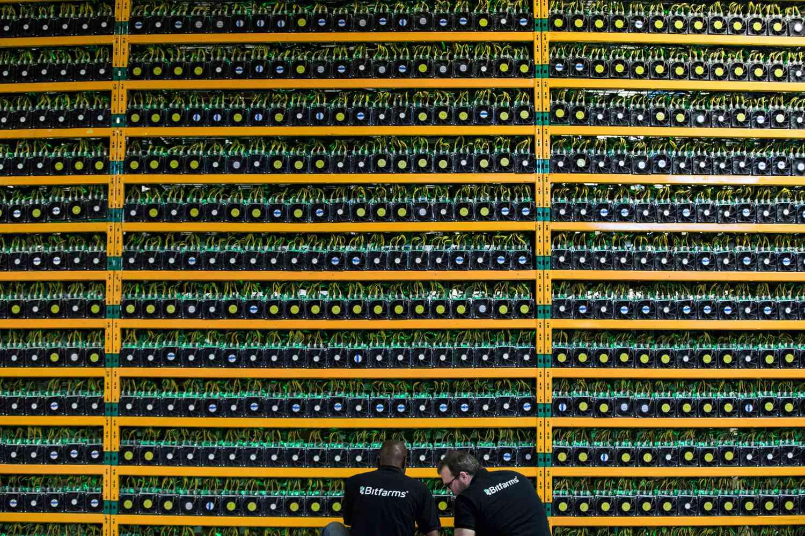

Cryptocurrency mining is a groundbreaking innovation that has fundamentally reshaped the financial landscape by enabling decentralized validation of transactions and the creation of new digital coins. Despite its revolutionary nature, mining has encountered several significant challenges that threaten the core ideals of decentralization—a principle that initially underpinned the development of blockchain technology and cryptocurrencies such as Bitcoin. One of the primary challenges is centralization in mining, where a small number of powerful entities dominate a substantial portion of a network’s computational power, or hashrate. This concentration of control can undermine the decentralized philosophy and introduce security vulnerabilities, such as the risk of 51% attacks, where such entities can potentially alter transaction history or double-spend coins.

Simultaneously, algorithmic trading has gained traction in the cryptocurrency market, offering both opportunities and complexities. Algorithmic trading employs computer programs to execute trades at speeds and frequencies that are unachievable by human traders, harnessing the inherent volatility of cryptocurrency markets to optimize profit. However, this automated trading also poses challenges, including technical glitches that may lead to substantial financial losses, and the risk of market manipulation, where algorithms exploit market irregularities or induce artificial price movements.



This article aims to explore the intersection of centralized mining issues and algorithmic trading in the cryptocurrency domain, emphasizing how these elements interact and shape the evolving landscape of digital currencies.

## Table of Contents

## Understanding Centralized Cryptocurrency Mining

Centralization in cryptocurrency mining occurs when a majority of the network's computational power, or hashrate, is concentrated among a small number of participants. This phenomenon counters the foundational goal of cryptocurrency, which is to decentralize financial control and to provide an alternative to traditional monetary systems dominated by centralized entities such as banks and governments.

Initially, the design of cryptocurrencies like Bitcoin aimed to distribute mining power among a broad base of participants. This was facilitated by the use of proof-of-work (PoW) consensus mechanisms, which require network nodes to solve complex mathematical puzzles to validate transactions and secure the network. In the early days, mining could be performed on standard personal computers, allowing virtually anyone to participate.

However, the growing value and popularity of cryptocurrencies have introduced economic incentives that drive centralization. As the bitcoin network expanded, the difficulty of mining increased, necessitating more computational power to remain competitive. This environment has attracted larger players with significant financial resources who invest in specialized, high-cost mining equipment known as Application-Specific Integrated Circuits (ASICs). These devices are designed specifically for the efficient computation of PoW puzzles and significantly outperform general-purpose computer hardware.

Technological advancements have also played a pivotal role in the centralization process. As technology progresses, the cost of ASIC development and deployment decreases, further enabling well-capitalized entities to maintain and expand their advantage over smaller miners.

Mining pools further contribute to this centralization. These pools aggregate the computational efforts of many individual miners, effectively consolidating their collective hashrate. While this allows participants to receive more regular payouts, it also concentrates control over the network's mining processes in the hands of the pool operators. As a result, a few large mining pools often dominate a substantial share of a [cryptocurrency](/wiki/cryptocurrency)'s hashrate.

This concentration is a critical concern as it increases vulnerability to potential security threats and manipulation. If a single entity or a coalition of mining pool operators controls more than 50% of the network's hashrate, it could theoretically execute a "51% attack," where fraudulent transactions are approved or legitimate ones are reversed.

Overall, understanding the dynamics of centralized cryptocurrency mining is crucial in assessing its implications for the security and decentralization ethos of blockchain networks. While economic and technological factors drive mining centralization, the community continues to explore solutions to maintain decentralization and enhance the resilience of cryptocurrency ecosystems.

## Causes of Mining Centralization

Cryptocurrency mining centralization stems from several interrelated factors, primarily driven by economic and technological elements. The growing profitability of mining has attracted large corporations with substantial financial resources, leading to significant consolidation in the industry. These organizations have the capability to invest heavily in state-of-the-art mining equipment and infrastructure, thereby gaining a competitive advantage over individual miners or smaller companies.

A key component contributing to mining centralization is the high cost of acquiring and maintaining competitive mining hardware, specifically Application-Specific Integrated Circuits (ASICs). ASICs are specialized hardware designed exclusively for mining cryptocurrencies, offering significant performance enhancements over general-purpose hardware like CPUs and GPUs. However, the substantial initial investment required for ASICs often excludes smaller participants, limiting competition and fostering concentration of power.

Furthermore, mining pools have played a considerable role in the consolidation of mining power, although they allow individual miners to participate. In a mining pool, multiple miners combine their computational resources to enhance their collective probability of solving the cryptographic puzzles required for block generation. While this collaborative approach facilitates more consistent revenue for participants, it simultaneously consolidates mining power within the pool operators. This aggregation can potentially lead to a small number of entities controlling a significant portion of a cryptocurrency's network hashrate.

These dynamics underscore the pronounced centralization trends within cryptocurrency mining, highlighting critical challenges to maintaining the decentralized ethos that cryptocurrencies were designed to embody. The economic incentives inherent to mining, combined with technological barriers to entry, continue to shape the industry’s landscape, potentially affecting both network security and overall market fairness.

## Consequences of Centralized Mining

Centralized cryptocurrency mining presents several significant consequences that affect both the technical and environmental aspects of blockchain networks. One of the foremost concerns is the security risk associated with the concentration of hashing power. When a single entity or a small group of entities control more than 50% of the network's total hashrate, a situation known as a "51% attack" can occur. In such scenarios, the controlling parties have the potential to reverse transactions, double-spend coins, and prevent other transactions from being confirmed. This kind of control undermines the trustless nature of blockchain, which is integral to cryptocurrency's value proposition.

Additionally, monopolization of the network's hashrate has implications for the governance and rule-setting of the cryptocurrency. Entities with substantial hashing power may influence the direction of protocol changes, potentially tilting the network rules in their favor. This manipulation can lead to contentious hard forks or shifts in consensus mechanisms that may not align with the community's decentralized ideals.

Environmental concerns are another significant consequence of centralized mining. Large mining operations consume vast amounts of energy, primarily powered by fossil fuels in regions with low electricity costs. This energy consumption not only leads to increased carbon emissions but also strains local power grids, sometimes resulting in political and social tensions in the regions hosting these mining facilities. The environmental impact challenges the sustainability of proof-of-work-based cryptocurrencies and contrasts starkly with the growing global emphasis on sustainable practices. 

To summarize, centralized mining poses risks that jeopardize cryptocurrency network security, integrity, and sustainability, necessitating a re-evaluation of current mining practices and consideration of alternative consensus mechanisms.

## Algorithmic Trading in Cryptocurrency

Algorithmic trading in the cryptocurrency sector employs computer algorithms to automatically execute trades based on pre-set criteria. This strategy leverages mathematical models and statistical analysis to make trading decisions at speeds that surpass human capabilities. The algorithms are designed to exploit market inefficiencies and capitalize on minute price movements, often across multiple cryptocurrency exchanges simultaneously.

One of the primary advantages of [algorithmic trading](/wiki/algorithmic-trading) is its ability to handle a high [volume](/wiki/volume-trading-strategy) of trades with precision and speed. This rapid decision-making process is crucial in the fast-paced cryptocurrency market, where prices can fluctuate substantially within seconds. Algorithms can be programmed for a variety of trading strategies, such as [arbitrage](/wiki/arbitrage), [trend following](/wiki/trend-following), or [market making](/wiki/market-making). For example, a simple [momentum](/wiki/momentum)-based algorithm might buy Bitcoin when its price surpasses a certain moving average and sell when it falls below this average.

However, algorithmic trading is not without its drawbacks. The complexity of the algorithms and the necessity for accurate market data means that technical failures or inefficiencies can lead to significant losses. One of the inherent risks includes latency, where delays in data processing or order execution can cause discrepancies between the expected and actual trade prices. Furthermore, the dependence on high-frequency trading systems can overwhelm cryptocurrency exchanges, resulting in a lack of [liquidity](/wiki/liquidity-risk-premium) or increased [volatility](/wiki/volatility-trading-strategies).

Market manipulation is another potential risk linked to algorithmic trading. This can occur when traders use algorithms to create artificial price movements or spoofing—placing large orders with the intent to cancel them before execution to mislead other market participants. Such practices can undermine the integrity of cryptocurrency markets and lead to distorted price signals.

Despite these challenges, the use of algorithmic trading in cryptocurrencies continues to grow, driven by advances in technology and the increasing sophistication of trading strategies. The evolution of [machine learning](/wiki/machine-learning) and [artificial intelligence](/wiki/ai-artificial-intelligence) is further enhancing the capabilities of trading algorithms, enabling them to learn and adapt to changing market conditions autonomously. As these technologies advance, the landscape of cryptocurrency trading is likely to become exceedingly more complex and competitive.

## Interplay Between Centralized Mining and Algo Trading

Centralized cryptocurrency mining significantly influences algorithmic trading strategies due to its impact on network power dynamics and subsequently on price movements. When a small number of entities control a substantial portion of a network's hashrate, as is typical in centralized mining scenarios, they can wield considerable influence over transaction validation and block generation times. This influence can lead to unpredictabilities in transaction costs, delays, and price volatility, providing fertile ground for algorithmic traders to exploit these irregularities.

Algorithmic traders, leveraging sophisticated algorithms, have the capacity to detect and capitalize on price movements resulting from the activities of centralized mining entities. For instance, if a dominant mining pool were to influence transaction times or network congestion, it could create temporary price inefficiencies. These inefficiencies present arbitrage opportunities for algorithmic traders who use high-speed computing to execute trades more rapidly than human counterparts could. The use of such algorithms often involves complex computations, rapid data analysis, and pattern recognition to gain an edge in trading.

Moreover, centralized mining coupled with algorithmic trading contributes to the increasing complexity of crypto markets. As centralized mining grows, network control becomes concentrated, possibly leading to changes in market structures and greater vulnerability to market manipulation. Algorithmic trading, with its capability to execute large volumes of trades quickly, adds another layer of intricacy, heightening market volatility.

These intertwined dynamics necessitate advanced modeling and simulation to better understand market behavior. For example, mathematical models can be applied to anticipate how mining centralization might affect future market trends. Python code can be utilized to simulate these market conditions:

```python
import numpy as np

# Simulating price changes affected by centralization
np.random.seed(42)

def simulate_price_change(initial_price, volatility, steps):
    price = initial_price
    price_changes = [initial_price]

    for _ in range(steps):
        change_percent = np.random.normal(0, volatility)
        price += price * change_percent
        price_changes.append(price)

    return price_changes

price_simulation = simulate_price_change(50000, 0.01, 100)

# Plotting the simulated price changes over time
import matplotlib.pyplot as plt

plt.plot(price_simulation)
plt.title('Simulated Cryptocurrency Price Changes')
plt.xlabel('Time Steps')
plt.ylabel('Price')
plt.show()
```

Through such simulations, traders and analysts can better anticipate how centralized mining might skew the market and devise strategies to adapt to these shifts. Centralized mining and algorithmic trading, by shaping each other's impact on the market, underscore the importance of continuous innovation and adaptive strategies in maintaining market stability and fairness.

## Future of Decentralization Efforts

Innovations such as proof-of-stake (PoS) and other emerging consensus mechanisms are gaining traction as potential solutions to the centralization problem in cryptocurrency mining. While traditional proof-of-work (PoW) systems, like those used by Bitcoin, often lead to centralization due to their reliance on expensive and high-energy-consuming hardware (ASICs), PoS systems require validators to hold and "stake" a certain amount of cryptocurrency. This shift reduces reliance on specialized hardware, thereby lowering barriers to entry and dispersing network control.

Proof-of-stake operates on the principle that the probability of validating a block and receiving rewards is proportional to the stake one has in the network, rather than the computational power. This approach inherently discourages centralization, as accumulation of network power is tied to economic investment rather than technical might. Ethereum, for instance, has implemented a PoS mechanism known as the Ethereum 2.0 upgrade, signifying a major transition in one of the largest blockchain networks.

Beyond PoS, other consensus mechanisms like Delegated Proof of Stake (DPoS), Practical Byzantine Fault Tolerance (PBFT), and various hybrid models are being explored to further decentralize control and enhance network efficiency. These models aim to provide improved security and scalability while ensuring that no single entity can dominate the network.

Projects seeking to resist the dominance of ASICs in PoW systems are also exploring ASIC-resistant algorithms. These algorithms, such as RandomX used by Monero, are designed to favor general-purpose hardware over specialized mining equipment, thus broadening participation and distribution of mining power.

The future of cryptocurrency will heavily rely on striking a balance between centralization and decentralization to ensure both network security and equitable access. While decentralization remains the ideological cornerstone, complete decentralization may not always be feasible in practical terms. Thus, hybrid approaches that incorporate both decentralized and centralized elements may offer a pragmatic pathway forward.

In conclusion, continuous innovation in the development of consensus protocols and mining algorithms, coupled with thoughtful regulatory oversight, will be vital in addressing centralization challenges. Successful implementation of these technologies could safeguard the integrity and democratic ethos of cryptocurrencies while fostering a more inclusive financial ecosystem.

## Conclusion

Centralized mining presents a significant challenge within the cryptocurrency landscape, as it undermines the foundational ideals of decentralization. Initially designed to democratize financial systems by distributing network power among numerous participants, cryptocurrencies are increasingly seeing mining activities concentrated in the hands of a few entities. This concentration threatens network security and introduces risks such as 51% attacks, where a single entity or coalition of miners could potentially manipulate the blockchain.

Concurrently, algorithmic trading introduces further complexity to the market dynamics. By leveraging sophisticated algorithms and high-speed computing, traders can execute numerous transactions in fractions of a second, potentially influencing price movements and market liquidity. However, this also introduces risks of technical failures and opens possibilities for market manipulation, as these algorithms may exploit price volatilities amplified by centralized mining activities.

Addressing these intertwined challenges necessitates continuous innovation. Technical solutions, such as the development and implementation of alternative consensus mechanisms like proof-of-stake, aim to redistribute power by reducing the reliance on expensive mining hardware. Furthermore, initiatives to develop mining algorithms resistant to ASIC domination seek to level the playing field for smaller participants.

Regulatory oversight also plays a crucial role in preserving the decentralized ethos of cryptocurrencies. By establishing clear guidelines and monitoring market activities, regulators can curb excessive centralization in mining and ensure fair trading practices. This dual approach of technological innovation and policy regulation is imperative to maintain the integrity and democratic ideals that underpin the cryptocurrency ecosystem.

## FAQs

### FAQs

**What is centralized mining?**  
Centralized mining in the context of cryptocurrencies refers to the concentration of mining power in the hands of a few entities or organizations, which control a substantial portion of the network's computational power, or hashrate. This centralization contradicts the foundational principle of cryptocurrencies, which is to ensure a decentralized and distributed financial network. Over time, economic incentives, technological advancements, and the high costs associated with mining equipment have led to this concentration. As a result, the decentralized ethos of blockchain technology is threatened, as these mining powerhouses can potentially manipulate network transactions or influence decisions regarding protocol changes.

**How does algorithmic trading impact the cryptocurrency market?**  
Algorithmic trading, or algo trading, involves using sophisticated algorithms to execute large trades quickly and efficiently without human intervention. This approach allows traders to capitalize on small price discrepancies that might exist for only a brief moment. In the cryptocurrency market, this can lead to increased market liquidity and tighter bid-ask spreads. However, it can also introduce significant volatility and risk. Market manipulation is a potential concern, as algorithms can react to market anomalies created by centralization or exploit inefficiencies in the trading environment. Moreover, technical failures in these algorithms can result in cascading effects, impacting broader market stability.

**Are there any solutions to combat centralized mining?**  
To counteract centralized mining, several solutions have been proposed and are in various stages of implementation. One prominent solution is transitioning to alternative consensus mechanisms, like Proof of Stake (PoS), which is less hardware-intensive compared to Proof of Work (PoW). PoS promotes a more decentralized network by allowing users to "stake" their coins, thereby participating in block validation without requiring centralized mining operations. Another solution is the design and implementation of ASIC-resistant mining algorithms, which aim to level the playing field by making specialized, high-cost mining equipment less advantageous. Innovations and community-driven initiatives continue to seek methods to decentralize mining, ensuring broader participation in the network's validation process.

**How do mining pools contribute to centralization?**  
Mining pools are collaborations where multiple miners combine their processing power to solve blocks more efficiently, sharing the rewards among all participants. While they increase the chance of successfully mining a block and contribute to consistent payouts for individual miners, they can inadvertently lead to centralization. This centralization arises when a few large mining pools control a significant portion of the network's hashrate. Although composed of numerous individual contributors, these large pools can coordinate activities akin to a single entity, potentially threatening the network's security if enough power is concentrated. This power concentration makes the network more susceptible to 51% attacks, where a single entity or group could alter transactions or prevent new transactions from being confirmed.

## References & Further Reading

[1]: Antonopoulos, A. M. (2017). ["Mastering Bitcoin: Unlocking Digital Cryptocurrencies."](https://books.google.com/books/about/Mastering_Bitcoin.html?id=IXmrBQAAQBAJ) O'Reilly Media.

[2]: Narayanan, A., Bonneau, J., Felten, E., Miller, A., & Goldfeder, S. (2016). ["Bitcoin and Cryptocurrency Technologies: A Comprehensive Introduction."](https://press.princeton.edu/books/hardcover/9780691171692/bitcoin-and-cryptocurrency-technologies) Princeton University Press.

[3]: Bonneau, J., Miller, A., Clark, J., Narayanan, A., Kroll, J., & Felten, E. (2015). ["SoK: Research Perspectives and Challenges for Bitcoin and Cryptocurrencies."](https://ieeexplore.ieee.org/document/7163021) 2015 IEEE Symposium on Security and Privacy.

[4]: Gandal, N., & Halaburda, H. (2014). ["Competition in the Cryptocurrency Market."](https://papers.ssrn.com/sol3/papers.cfm?abstract_id=2501640) Journal of Industrial Economics, 14(2), 202-219.

[5]: Lopez de Prado, M. (2018). ["Advances in Financial Machine Learning."](https://www.amazon.com/Advances-Financial-Machine-Learning-Marcos/dp/1119482089) Wiley.

[6]: Easley, D., O'Hara, M., & Basu, S. (2019). ["From mining to markets: The evolution of bitcoin transaction fees."](https://www.sciencedirect.com/science/article/pii/S0304405X19300583) Journal of Financial Economics, 23(4), 965–999.

[7]: Makarov, I., & Schoar, A. (2020). ["Trading and Arbitrage in Cryptocurrency Markets."](https://www.sciencedirect.com/science/article/pii/S0304405X19301746) National Bureau of Economic Research Working Paper Series.