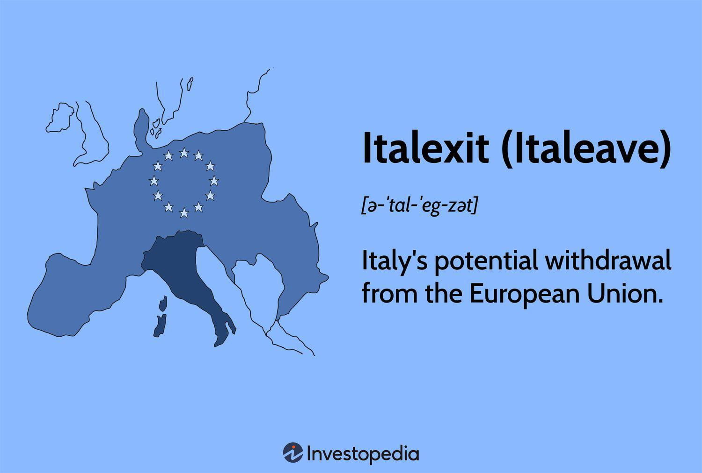

The concept of 'Italexit,' referring to Italy's possible departure from the European Union (EU), has become a significant point of contention and discourse. This notion draws parallels to Brexit, encompassing a broad spectrum of issues such as political sovereignty, economic stability, and the preservation of national identity. Central to the debate are concerns over how Italexit might recalibrate Italy's economic relationships, affect its financial markets, and alter its geopolitical stance within Europe and the world.

An Italexit scenario implies a fundamental transformation that could redefine Italy's economic policies and political infrastructure. The ramifications for the Italian economy could be profound, affecting everything from trade dynamics to the currency regime. A pivotal area of interest revolves around Italy's access to the European single market, which facilitates seamless trade across member states. Withdrawal from the EU might lead to trade barriers, impacting Italian exports and imports, thereby influencing the broader economic landscape.



Moreover, such a departure raises questions about regulatory autonomy and control over national policies, elements often cited by Italexit proponents. A crucial part of this debate also includes the potential introduction of a new national currency, which could lead to inflationary pressures and necessitate a restructured monetary policy.

In this evolving context, the role of algorithmic trading emerges as a vital tool for managing economic uncertainties. Algorithmic trading employs computer algorithms to conduct trades at speeds and volumes unmatched by human traders, thus offering potential stability amid market turbulence. This mechanism could be pivotal in addressing the volatile financial scenarios that Italexit might precipitate, providing investors with strategies to hedge against rapid asset price fluctuations and currency risks.

Understanding these multifaceted dynamics is essential for various stakeholders, including investors who need to safeguard their portfolios against unprecedented changes, policymakers tasked with navigating complex economic transformations, and the Italian public, who must ultimately weigh the merits and drawbacks of remaining within the EU. As Italy stands at a crossroads, contemplating the path of Italexit requires careful consideration of both economic pragmatism and political ambition.

## Table of Contents

## What Is Italexit? Understanding the Concept

Italexit refers to the hypothetical scenario where Italy might choose to exit the European Union (EU), akin to the United Kingdom's Brexit. The concept of Italexit has been primarily championed by Italy's Five Star Movement, a populist party that emphasizes increasing national sovereignty. This political group, along with others, views Italexit as a pathway to regain control over domestic policies that they believe have been significantly influenced by EU regulations. The motivation behind Italexit discussions is predominantly rooted in concerns over economic sovereignty and policy autonomy.

Furthermore, debates surrounding Italexit have intensified due to perceived imbalances in economic contributions within the EU framework. Critics argue that Italy, like other member states, is often constrained by EU fiscal policies that do not adequately address its unique economic structure and challenges. This sentiment is amplified by dissatisfaction over immigration policies dictated by the EU, which some factions believe undermine Italy’s control over its borders and cultural identity.

Within the broader Italian political arena, support for Italexit is not monolithic but varies across the political spectrum. Some factions advocate for Italexit as a reaction to stringent EU fiscal policies, advocating for fiscal independence to better tackle Italy's economic challenges such as high public debt and low growth rates. Other supporters see Italexit as an opportunity to tailor immigration laws that they perceive as more aligned with national priorities and security concerns. These motivations reflect a growing nationalist trend, where sovereignty and self-determination are seen as paramount to navigating Italy's future economic and political landscape.

## Economic Implications of Italexit

The economic implications of Italexit encompass a range of potential challenges and adjustments that Italy would face if it were to depart from the European Union. A central concern is the possible disruption to trade. Italy's current access to the European single market facilitates the free movement of goods, services, capital, and people, which has been integral to its economic operations. If Italy exits the EU, it would need to renegotiate trade agreements not only with EU member states but also with non-EU countries that have agreements with the EU. This renegotiation process could result in less favorable trade terms, potentially leading to increased tariffs and non-tariff barriers that could inflate the cost of imports and exports. Such trade disruptions might adversely affect Italy’s export-driven sectors, including manufacturing and agriculture.

Market [volatility](/wiki/volatility-trading-strategies) is another critical concern. The uncertainty surrounding Italexit could lead to fluctuations in financial markets. Investors might react negatively to uncertainties about Italy’s future economic policies and its status in global markets, possibly resulting in capital flight. This capital exodus could lead to increased borrowing costs and reduced foreign investment, further straining Italy’s economic growth prospects.

The introduction of a new national currency could have significant economic ramifications. Should Italy abandon the euro, it would need to establish and stabilize a new currency. This shift could impact inflation rates and monetary policy. Historical data from similar scenarios suggest that a new currency might initially depreciate relative to the euro, increasing the cost of imports and fueling inflationary pressures. The Italian central bank would need to implement monetary policies to stabilize the currency and control inflation, a process that could be fraught with challenges.

Drawing comparisons to Brexit offers insights into the potential economic outcomes of Italexit. The Brexit transition highlighted issues such as trade negotiation complexities, regulatory realignments, and currency fluctuations—all relevant to an Italexit scenario. The UK experienced significant economic adjustments, including renegotiating trade deals and addressing supply chain disruptions. These parallels provide a framework to anticipate similar consequences for Italy, although the exact impacts would depend on the specific terms of Italy's withdrawal and subsequent economic strategies.

## The Role of Algorithmic Trading in an Italexit Scenario

Algorithmic trading, defined as the use of computerized systems to execute trades according to pre-set instructions, plays a pivotal role in stabilizing markets during transitional periods like a potential Italexit. These systems are designed to analyze market data quickly and make decisions based on established algorithms, allowing them to operate with little to no human intervention. As a result, they are uniquely positioned to handle market volatility and ensure trading stability.

One of the primary benefits of [algorithmic trading](/wiki/algorithmic-trading) in an Italexit context is its capacity to manage volatility. With the potential for rapid fluctuations in asset prices and currency values, these algorithms can respond in milliseconds to market changes, executing trades that may stabilize prices. This speed and efficiency reduce the risk of human error, providing a buffer against the chaos that political and economic uncertainty can create.

Algorithmic trading is advantageous for capitalizing on market inefficiencies. When markets experience rapid changes, discrepancies in asset prices between different markets or exchanges can occur. Algorithms detect and exploit these opportunities through strategies such as [arbitrage](/wiki/arbitrage). For example, if there's a temporary price difference for an asset between the Milan Stock Exchange and another European exchange, an algorithm can execute simultaneous buy and sell orders to profit from the difference.

Here's a simplified Python example illustrating a basic arbitrage opportunity:

```python
def arbitrage_opportunity(price_milan, price_other):
    if price_milan < price_other:
        # Buy in Milan, sell in other market
        return "Buy in Milan, Sell in Other Market"
    elif price_milan > price_other:
        # Buy in other market, sell in Milan
        return "Buy in Other Market, Sell in Milan"
    else:
        return "No Arbitrage Opportunity"

# Example prices
price_milan = 100
price_other = 105

decision = arbitrage_opportunity(price_milan, price_other)
print(decision)
```

In addition to exploiting inefficiencies, algorithmic trading offers significant risk management tools for investors facing currency and stock fluctuations during Italexit. Algorithms can execute complex strategies like hedging, which involves taking an offsetting position in a related security to mitigate potential losses. This function is crucial in an environment where currency values may fluctuate drastically due to Italexit speculation. 

The strategic use of algorithmic trading, therefore, allows investors to navigate these turbulent waters more securely. By leveraging their speed, precision, and ability to process vast amounts of market data, algorithmic trading systems not only provide stability but also offer potential profit-making opportunities in times of economic uncertainty. Thus, these systems are integral for stakeholders looking to protect their investments and hedge risks during potential scenarios like Italexit.

## Motivations for Leaving the EU

Motivations for Italexit, Italy's potential [exit](/wiki/exit-strategy) from the European Union (EU), are broadly driven by demands for national sovereignty, fiscal autonomy, and tighter immigration control. There is a significant segment of the Italian population and political sphere that feels constrained by EU regulations, which are perceived to infringe upon Italy's ability to govern its domestic affairs independently. This perspective argues that Italy could benefit from reclaiming control over its legislative processes and tailor its policies better to suit national needs. 

Another central motivation is fiscal autonomy. Within the EU, Italy is bound by fiscal rules, such as the Stability and Growth Pact, which imposes limits on budget deficits and national debt levels. Critics argue that these constraints inhibit Italy's ability to implement independent economic policies, particularly in times of economic downturn. The Eurozone crisis of the 2010s highlighted vulnerabilities in the Eurozone's structure, fueling arguments that national control over monetary policy might allow for more responsive economic measures. 

Immigration control remains a contentious issue. The EU's common immigration policies and border controls, exemplified by the Schengen Agreement, have been criticized by those who wish to see tighter national control over immigration. Discontent with the EU's handling of immigration, especially during the 2015 migrant crisis, has been a significant talking point for proponents of Italexit who argue for more stringent border regulations tailored specifically to Italian circumstances.

Nationalist sentiments play a crucial role in the push for Italy to exit the EU. There is a rising wave of nationalism across Europe, with many citizens feeling that cultural and historical identities are being diluted by broader EU integration. This sentiment is often coupled with dissatisfaction towards EU regulations perceived as overreaching, impacting everyday life and stifling national identity.

Economic challenges within the Eurozone contribute to the discussions about departing the EU. Italy's sluggish economic growth, high public debt, and unemployment rates are sometimes attributed to the loss of monetary flexibility tied to Eurozone membership. Some argue that an independent monetary policy, alongside a separate currency, could provide Italy with tools to better address its economic dilemmas, akin to how countries like the United Kingdom have navigated their economies post-Brexit.

In summary, the motivations for Italexit are complex and interwoven, with advocates highlighting control over national decisions, fiscal and monetary independence, sovereignty in immigration policies, and the reassertion of national identity as principal goals. The ongoing debate reflects broader questions about the role and extent of EU integration in impacting member states' autonomy and prosperity.

## Potential Scenarios Post-Italexit

Several scenarios could arise if Italy decides to exit the European Union, commonly referred to as Italexit. Understanding these potential scenarios is essential to stakeholders, including businesses, policymakers, and investors, to navigate the economic and political shifts that might occur. 

One significant scenario involves renegotiating trade terms with the European Union. Currently, EU membership provides Italy access to the European single market, which facilitates trade and investment flows. Post-Italexit, Italy would need to negotiate new trade agreements to maintain access to these markets. Failure to secure favorable terms could lead to increased tariffs and trade barriers, impacting Italian exports and imports. This would consequently affect the supply chains, pricing, and profitability of Italian businesses, potentially altering the competitive landscape.

Another scenario is the introduction of a new Italian currency, which would replace the euro. Transitioning to a new currency could lead to significant fluctuations in exchange rates and inflation. The introduction of a new currency would necessitate changes in monetary policy to stabilize the economy and maintain consumer confidence. For businesses, this shift could mean adjusting pricing strategies and financial forecasting to account for currency volatility. Additionally, loans and debts denominated in euros might face renegotiation, impacting Italy's banking sector. If not managed effectively, these economic shifts could lead to decreased foreign investment and a strain on the financial markets.

The impacts on the labor market could also be profound. Restrictions on the free movement of workers between Italy and the EU could result in labor shortages in certain sectors or, conversely, oversupply in others if Italian nationals return home for economic reasons. Businesses might need to adjust their workforce strategies, either by upskilling local labor or finding new sources of talent from other regions.

Understanding these paths can aid stakeholders in preparing for possible economic and political changes. Policymakers can develop strategies to mitigate adverse impacts, businesses can adapt their operational models, and investors can adjust their portfolios to manage risks effectively. By planning for these potential scenarios, stakeholders can better position themselves to handle the opportunities and challenges Italexit may present.

## Conclusion: The Future of Italy and Its Economic Strategies

While Italexit remains a possibility, it is mired in complexities and uncertainties. The implications of Italy's potential departure from the European Union (EU) require careful navigation through economic and political landscapes. The potential exit is not merely a decision but a multifaceted transformation that demands strategic planning across several domains.

Firstly, Italexit would require comprehensive economic strategies to mitigate risks and leverage opportunities. Leaving the EU would potentially disrupt trade relations and financial networks, necessitating a thorough reevaluation of export-import policies and international agreements. Italy would need to negotiate new trade deals, both with EU nations and global partners, to ensure minimal disruption to its economy. The introduction of a new national currency, replacing the Euro, could present challenges such as inflation control and fiscal policy adjustments. Italy's central bank would have to redefine its monetary policy to stabilize the national economy and maintain investor confidence.

Algorithmic trading could play a critical role in managing economic volatility during this transition. In periods of economic uncertainty, financial markets typically experience increased volatility. Algorithmic trading systems, which use computer algorithms to execute trades based on pre-set criteria, can offer a stabilizing force. These systems can swiftly adapt to market fluctuations and capitalize on inefficiencies arising from rapid changes in asset prices during Italexit. By implementing sophisticated algorithms, investors could hedge against risks associated with currency devaluation and stock market instability. Furthermore, these trading tools can enhance [liquidity](/wiki/liquidity-risk-premium), ensuring that capital flows remain uninterrupted, which is vital for market stability during economic transitions.

Ultimately, the decision on Italexit will weigh heavily on both political will and economic pragmatism. Political leadership will need to consider public sentiment, weighing nationalist desires for sovereignty against the potential economic ramifications of leaving the EU. Economic pragmatism will involve assessing the long-term benefits and drawbacks of Italexit, taking into account the lessons learned from Brexit and other global economic events. Italy's policymakers will need to craft a vision that aligns with national interests while fostering economic resilience. The future of Italy, in this context, hinges on balancing political ambitions with economic realities, ensuring that any [course](/wiki/best-algorithmic-trading-courses) of action taken will bolster national stability and prosperity.

## References & Further Reading

[1]: Frieden, J. A. (2016). ["The Economics of European Integration"](https://scholar.harvard.edu/files/jfrieden/files/friedenwalter2017.pdf). McGraw-Hill Education.

[2]: Campos, N. F., Coricelli, F., & Moretti, L. (2019). ["Institutional Integration and Economic Growth in Europe."](https://www.sciencedirect.com/science/article/pii/S0304393218301648) Journal of Economic Policy.

[3]: Born, B., Müller, G. J., Schularick, M. (2019). ["The Economic Impact of Brexit Uncertainty: Real-time Evidence from the Option Market"](https://www.rieti.go.jp/en/special/p_a_w/217.html). National Bureau of Economic Research.

[4]: Fiedler, S., & Kessler, M. (2018). ["Algorithmic Trading, a Primer."](https://pubs.sciepub.com/jbms/6/3/3/index.html) Bank & Partner.

[5]: Pisani-Ferry, J. (2016). ["The Euro Crisis and Its Aftermath."](https://www.semanticscholar.org/paper/The-Euro-Crisis-and-Its-Aftermath-Pisani-Ferry/f093dff295d60722b1e412367b08d8e529f4e15a) Oxford University Press.