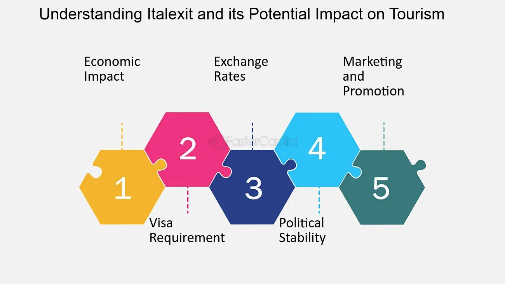

## Table of Contents

## What is Italexit?

Italexit is a term used to describe the idea of Italy leaving the European Union. It is similar to Brexit, which was when the United Kingdom decided to leave the EU. The idea of Italexit has been talked about by some people in Italy who think that leaving the EU could be good for their country. They believe that Italy could make its own rules and not have to follow the EU's rules.

However, not everyone in Italy agrees with the idea of Italexit. Many people think that being part of the EU is good for Italy because it helps the country's economy and makes it easier to work and travel in other European countries. The debate about Italexit is still ongoing, and it is not clear if Italy will ever decide to leave the EU.

## Why is Italexit being considered?

Some people in Italy think about Italexit because they believe it could help Italy. They say that Italy could make its own rules and not have to follow the EU's rules. They think this could be good for Italy's economy and help the country solve its problems better on its own.

However, not everyone agrees with this idea. Many people in Italy like being part of the EU. They think it helps Italy's economy by making it easier to trade with other countries. They also like that it's easier to travel and work in other European countries because of the EU. So, the idea of Italexit is still being talked about, and it's not clear what will happen.

## What are the main arguments for Italexit?

Some people in Italy want Italexit because they think it could help Italy be more independent. They believe that if Italy leaves the EU, it can make its own rules without having to follow what the EU says. They think this could be good for Italy's economy because Italy could do things its own way. They also feel that the EU has too many rules that are not good for Italy, and leaving could help Italy solve its problems better.

However, not everyone in Italy agrees with Italexit. Many people think that being part of the EU is good for Italy. They believe that the EU helps Italy's economy by making it easier to trade with other countries. They also like that it's easier to travel and work in other European countries because of the EU. So, the debate about Italexit is still going on, and it's not clear what will happen.

## What are the main arguments against Italexit?

Many people in Italy think that staying in the EU is good for their country. They believe that being part of the EU helps Italy's economy. It makes it easier for Italy to trade with other countries in Europe. This can create jobs and help businesses grow. They also like that it's easier to travel and work in other European countries because of the EU. They worry that if Italy leaves the EU, it might be harder to do these things.

Another reason people are against Italexit is that they think it could cause a lot of problems. Leaving the EU could be complicated and expensive. It might take a long time to make new rules and agreements with other countries. Some people worry that Italy's economy could get worse if it leaves the EU. They think it's better to stay in the EU and work together with other countries to solve problems.

## How would Italexit affect Italy's economy?

If Italy leaves the European Union, it could have a big impact on Italy's economy. Some people think that leaving the EU could help Italy make its own rules and do things its own way. They believe this could be good for Italy's businesses and help the economy grow. However, leaving the EU would also mean that Italy would not be part of the single market anymore. This could make it harder for Italy to trade with other European countries, which might hurt businesses and lead to fewer jobs.

On the other hand, many people worry that Italexit could be bad for Italy's economy. They think that being in the EU helps Italy's economy by making it easier to trade with other countries. If Italy leaves the EU, it might take a long time to make new trade agreements with other countries. This could cause problems for businesses and make the economy worse. Also, leaving the EU could be expensive and complicated, which might make things harder for Italy's economy in the short term.

## What would be the immediate economic impacts of Italexit?

If Italy decides to leave the EU, there would be some quick changes to its economy. Right away, Italy would not be part of the EU's single market anymore. This means it would be harder for Italy to trade with other European countries. Businesses might have a harder time selling their products, and this could lead to fewer jobs. Also, the value of the euro might go down if Italy leaves the Eurozone, which could make things more expensive for people in Italy.

In the short term, leaving the EU would also be expensive and complicated. Italy would need to make new rules and agreements with other countries, which could take a long time. This could slow down the economy and make things harder for businesses. People might also feel less sure about the future, which could make them spend less money. All of these things could make Italy's economy worse right after Italexit happens.

## How would Italexit influence Italy's trade relations?

If Italy leaves the EU, it would change how Italy trades with other countries. Right now, Italy is part of the EU's single market. This makes it easy for Italy to sell things to other European countries without many rules or taxes. If Italy leaves the EU, it would not be part of this market anymore. This means Italy would need to make new trade deals with other countries. It could take a long time to make these new deals, and in the meantime, it might be harder for Italy to sell its products.

Leaving the EU could also make it harder for Italy to get things from other countries. Right now, Italy can buy things easily from other EU countries. If Italy leaves, it might have to pay more taxes on things it buys from the EU. This could make things more expensive for people in Italy. Also, other countries might not want to trade with Italy as much if it's not part of the EU. This could hurt Italy's economy because it relies on trade with other countries.

## What are the potential long-term economic consequences of Italexit?

In the long run, if Italy leaves the EU, it could have big changes for Italy's economy. Italy might be able to make its own rules and do things its own way. Some people think this could help Italy's businesses grow and make the economy stronger. But, Italy would not be part of the EU's single market anymore. This means it would be harder for Italy to trade with other European countries. It could take a long time to make new trade deals with other countries, and this could hurt Italy's economy.

Also, leaving the EU could make it harder for Italy to get money from other countries. Right now, Italy can borrow money easily because it's part of the EU. If Italy leaves, it might have to pay more to borrow money. This could make it harder for Italy to spend money on things like schools and hospitals. People might also feel less sure about the future, which could make them spend less money. All of these things could make Italy's economy worse in the long run.

## How would Italexit impact the European Union?

If Italy leaves the EU, it could change things for the whole European Union. Italy is a big country in the EU, and it has a lot of people and a big economy. If Italy leaves, the EU might have less power and less money. Other countries might start thinking about leaving the EU too. This could make the EU weaker and harder to work together.

Also, Italy leaving could make it harder for the EU to make decisions. Right now, the EU has to think about what Italy wants when it makes rules. If Italy is not part of the EU anymore, the EU might be able to make decisions faster. But, it might also be harder for the EU to agree on things because Italy will not be there to help. This could change how the EU works and how it helps its members.

## What legal and procedural steps are required for Italexit?

If Italy wants to leave the EU, it has to follow some rules. First, Italy needs to tell the EU that it wants to leave. This is called giving notice. After Italy gives notice, it has to wait at least two years before it can leave. During this time, Italy and the EU need to talk about how Italy will leave. They need to make agreements about things like trade and how people can move between Italy and the EU.

After the two years are up, Italy can leave the EU. But, if Italy and the EU cannot agree on everything, Italy might have to leave without any agreements. This could make things harder for Italy. Also, Italy would need to change its own laws to match the fact that it is not part of the EU anymore. This could take a long time and be complicated.

## What are the political implications of Italexit within Italy?

If Italy decides to leave the EU, it could change a lot of things in Italy's politics. Some people in Italy want Italexit because they think it could help Italy be more independent. They believe that Italy could make its own rules and not have to follow the EU's rules. This could make some political parties in Italy more popular if they support Italexit. But, it could also make other parties less popular if they want to stay in the EU. The debate about Italexit could make people in Italy argue more about politics and could change who is in charge of the government.

On the other hand, many people in Italy like being part of the EU. They think it helps Italy's economy and makes it easier to work and travel in other European countries. If Italy leaves the EU, these people might be upset. This could make it harder for the government to make decisions because people might not agree on what to do. Also, leaving the EU could make Italy's relationship with other countries worse. This could change how Italy works with other countries and could affect Italy's place in the world.

## How have similar exits, like Brexit, influenced the debate on Italexit?

The way the UK left the EU, called Brexit, has made people in Italy think a lot about Italexit. Brexit showed that leaving the EU can be hard and take a long time. It also showed that leaving can make a country's economy worse. Some people in Italy saw these problems and now think that Italexit might not be a good idea. They worry that Italy could have the same problems if it leaves the EU.

On the other hand, some people in Italy still want Italexit. They think that if the UK can leave the EU, Italy can do it too. They believe that Italy could make its own rules and do things its own way. But, because of Brexit, they know that leaving the EU would be hard and might not help Italy's economy right away. So, the debate about Italexit is still going on, and it's not clear what Italy will do.

## References & Further Reading

[1]: Frieden, J. A. (2016). ["The Economics of European Integration"](https://scholar.harvard.edu/files/jfrieden/files/friedenwalter2017.pdf). McGraw-Hill Education.

[2]: Campos, N. F., Coricelli, F., & Moretti, L. (2019). ["Institutional Integration and Economic Growth in Europe."](https://www.sciencedirect.com/science/article/pii/S0304393218301648) Journal of Economic Policy.

[3]: Born, B., Müller, G. J., Schularick, M. (2019). ["The Economic Impact of Brexit Uncertainty: Real-time Evidence from the Option Market"](https://www.rieti.go.jp/en/special/p_a_w/217.html). National Bureau of Economic Research.

[4]: Fiedler, S., & Kessler, M. (2018). ["Algorithmic Trading, a Primer."](https://pubs.sciepub.com/jbms/6/3/3/index.html) Bank & Partner.

[5]: Pisani-Ferry, J. (2016). ["The Euro Crisis and Its Aftermath."](https://www.semanticscholar.org/paper/The-Euro-Crisis-and-Its-Aftermath-Pisani-Ferry/f093dff295d60722b1e412367b08d8e529f4e15a) Oxford University Press.