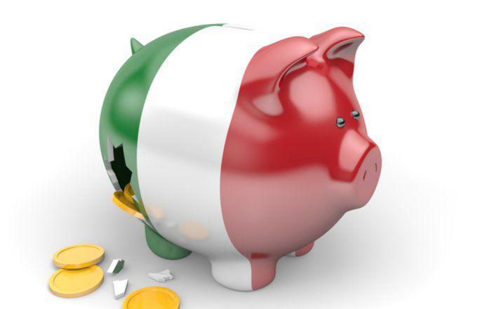

The Italian economic downturn in 2018 marked a significant period of instability for a nation that is among the largest economies in the eurozone. Italy, grappling with high government debt, political instability, and external pressures from the European Union, faced a confluence of challenges that threatened its economic stability and impacted the broader European financial landscape. The downturn was not only a test of Italy's economic resilience but also a critical moment in understanding the dynamics of European economic integration and modern financial technologies.

The downturn can largely be attributed to a cascade of political and financial factors. The inability to form a stable government in Italy led to heightened political uncertainty, which, in turn, sowed seeds of doubt among investors and international markets. Compounding these issues was Italy's proposal for a 2019 budget that included a deficit of 2.4% of GDP, significantly deviating from eurozone fiscal expectations and raising concerns among its European partners regarding fiscal discipline and debt sustainability.



Italy's government debt, which had risen to 131% of GDP, posed serious financial health concerns within the EU. The high debt level limited the government's ability to implement fiscal stimulus measures that could have alleviated the economic strain. Italy's debtor status thus magnified the crisis, as the country was seen as a potential weak link in the eurozone, necessitating scrutiny and intervention from European institutions.

In this context, the role of algorithmic trading in financial markets emerged as a potential stabilizing factor during periods of volatility. As part of the broader advancements in financial technology, algorithmic trading has the capacity to enhance liquidity and market efficiency, potentially mitigating the impacts of rapid market fluctuations—critical attributes in times of economic uncertainty.

Understanding the Italian financial crisis provides insights into the interactions between national economic policies and European integration, shedding light on the challenges and opportunities faced by economies within a connected EU framework. Moreover, it emphasizes the importance of integrating technological advancements in modern financial systems to bolster economic resilience. As Italy contends with the legacy of its 2018 economic downturn, the evolving role of financial technologies, such as algorithmic trading, continues to play an essential part in the stability and growth prospects of one of the eurozone's cornerstone economies.

## Table of Contents

## Political and Economic Causes of the Crisis

The Italian economic downturn in 2018 can be attributed significantly to both political and economic factors. A major catalyst for the crisis was Italy's inability to establish a stable government, which escalated political uncertainty and undermined investor confidence. This instability was rooted in prolonged negotiations after the general election in March 2018, which did not yield a clear majority, leading to a hung parliament. As a result, protracted coalition talks unfolded between the Five Star Movement and the League, two populist parties with diverging agendas, delaying government formation and eroding economic policymaking capacity during a critical period.

The proposed 2019 budget, introducing a deficit of 2.4% of GDP, further intensified tensions within the eurozone. This proposal sparked controversy as it deviated from the fiscal expectations agreed upon by Italy's eurozone partners. The European Commission expressed concerns over possible violations of the Stability and Growth Pact, which mandates that member states maintain a fiscal deficit below 3% of GDP while striving towards a balanced budget in the medium term. The proposed budget, perceived as fiscally irresponsible, risked increasing Italy's already substantial debt levels, leading to potential penalties for breaching EU fiscal rules.

Italy's government debt, which had escalated to 131% of GDP, represented another source of anxiety. This towering debt level not only surpassed the Maastricht criteria of a 60% debt-to-GDP ratio but also positioned Italy among the most indebted nations in Europe, second only to Greece. This situation heightened fears regarding Italy's financial sustainability, as the country struggled to balance its budget while simultaneously addressing internal socio-economic needs. The high debt burden limited fiscal space and risked crowding out productive public investment, essential for stimulating growth.

In summary, the political deadlock and fiscal policy decisions of 2018 created a precarious economic landscape in Italy, contributing to the economic challenges that year. The interplay between political indeterminacy and fiscal policy raised significant concerns at both the national and European levels, highlighting the broader implications of governance and fiscal responsibility within the eurozone framework.

## Impact on the Italian Economy

The Italian economy faced significant challenges during the economic downturn of 2018, marked by weak macroeconomic fundamentals. One of the critical issues was the persistently slow GDP growth. Italy's GDP growth rates have historically lagged behind those of other major European economies, and in 2018, the growth rate was further hindered by a combination of domestic and international factors. According to data from the Italian National Institute of Statistics (ISTAT), the Italian economy experienced periods of stagnation, with quarterly GDP growth often hovering around zero or contracting slightly.

High unemployment rates further compounded economic difficulties. The unemployment rate in Italy remained elevated, particularly among the youth, which hindered overall economic productivity and consumer spending. In 2018, the national unemployment rate was approximately 10.6%, while youth unemployment exceeded 32%, reflecting structural issues within the labor market.

Adding to the economic strain was the large [volume](/wiki/volume-trading-strategy) of non-performing loans (NPLs) in the banking sector. Italian banks were burdened with a significant amount of NPLs, a legacy from the global financial crisis and subsequent recession. These non-performing assets limited banks' ability to extend new credit, constraining business investment and consumer spending. Efforts to reduce the NPL stock, while underway, faced numerous hurdles, including regulatory challenges and sluggish economic growth.

Despite these numerous challenges, the Italian economy managed to maintain a positive current account balance, attributable in part to a rise in exports. Italy's manufacturing sector, known for its high-quality goods, played a pivotal role in boosting exports. Key industries such as automotive, fashion, and machinery saw increasing demand in international markets, which helped offset some of the domestic economic weaknesses. This positive trade balance provided essential economic relief, stabilizing the economy amidst financial uncertainty.

Overall, while the Italian economy struggled with fundamental weaknesses, particularly slow growth, high unemployment, and banking sector stress, the export sector's resilience offered a partial buffer against further economic decline. Addressing these structural issues remains critical for the country’s long-term economic stability.

## The Role of Algorithmic Trading

Algorithmic trading, a significant aspect of financial technology, has increasingly become integral to the operation of financial markets around the world. In the context of Italy's economic challenges during the downturn of 2018, [algorithmic trading](/wiki/algorithmic-trading) was adopted by financial institutions as a strategy to improve market efficiency and [liquidity](/wiki/liquidity-risk-premium).

The core principle of algorithmic trading is the use of algorithms to automate and execute multiple trading orders based on predefined criteria. This automation enhances the speed and accuracy of trading operations, which is crucial during periods of market [volatility](/wiki/volatility-trading-strategies). In Italy, financial institutions leveraged these advanced trading strategies to stabilize market conditions by ensuring a continuous flow of trading activity.

The implementation of algorithmic trading in Italy aimed primarily to address the liquidity issues that often accompany economic downturns. Automated strategies were capable of executing trades at a speed not achievable through manual transactions, thereby increasing the number of trades and the overall liquidity in the market. This increased liquidity is vital for stabilizing markets, as it facilitates the buying and selling of securities without causing significant price changes, thus reducing volatility.

Moreover, algorithmic trading has the advantage of mitigating risks associated with abrupt market fluctuations by providing a mechanism for dynamic risk management. Advanced algorithms can analyze vast datasets and adjust trading strategies in real-time according to changing market conditions. For instance, in the presence of economic uncertainties, algorithms can optimize trading strategies to minimize potential losses or capitalize on short-term market opportunities.

To illustrate, consider a simplified algorithm for executing trades based on moving averages, a common technique in algorithmic trading. In Python, this could be implemented as follows:

```python
def moving_average(prices, window):
    return [sum(prices[i:i+window]) / window for i in range(len(prices) - window + 1)]

prices = [22, 23, 25, 24, 26, 28, 29]
short_window = 3
long_window = 5

short_ma = moving_average(prices, short_window)
long_ma = moving_average(prices, long_window)

signals = ["Buy" if short_ma[i] > long_ma[i] else "Sell" for i in range(len(short_ma))]
```

In this example, the algorithm generates buy or sell signals based on the comparison of short-term and long-term moving averages, which helps traders make informed decisions rapidly in response to market changes.

Overall, the use of algorithmic trading in Italy during the economic downturn of 2018 illustrates the power of technology in maintaining market fortitude amidst instability. As Italy continues to address its economic challenges, these advanced trading strategies are likely to play a crucial role in fostering a more resilient financial sector.

## Looking Forward: Challenges and Opportunities

Italy's economic recovery and future stability hinge on overcoming political challenges and implementing comprehensive structural reforms. Political instability, marked by frequent changes in government and coalition negotiations, continues to pose significant risks to policy continuity and investor confidence. For Italy to progress economically and strengthen its position within the European Union, achieving political stability is crucial. This stability would enable the consistent implementation of policies aimed at reducing the high government debt, reforming the labor market, and enhancing the competitiveness of Italian industries.

The results of future elections and the effectiveness of governmental policies will heavily influence Italy's trajectory within the EU and the eurozone. Policy decisions addressing fiscal responsibility, labor laws, and innovation incentives will determine Italy's ability to attract investments and sustain economic growth. Moreover, Italy's approach to fulfilling its EU commitments, particularly in terms of fiscal discipline, will impact its credibility and influence within the eurozone.

The role of technology, particularly algorithmic trading, presents notable opportunities for Italy's economic landscape. Algorithmic trading can bolster market resiliency by enhancing liquidity and reducing the impact of market volatility. Financial institutions employing sophisticated algorithms can execute trades more efficiently, leveraging vast datasets to optimize investment strategies under uncertain economic conditions. The continued adoption and refinement of these technologies could help rebuild investor confidence and facilitate smoother market operations.

Italy's path toward sustainable economic recovery not only involves grappling with internal political and structural challenges but also embracing technological advancements. By stabilizing its political framework and leveraging technology to enhance market dynamics, Italy can position itself for more resilient economic growth and a stronger role within the broader European context.

## Conclusion

The Italian financial crisis of 2018 serves as a compelling example of how political instability can exacerbate economic challenges. In this context, Italy's struggle with forming a stable government compounded existing financial issues, leading to heightened uncertainty and undermining investor confidence. Such political dynamics underscore the crucial role that effective governance and coherent policy-making play in maintaining economic stability.

Addressing Italy's structural weaknesses is paramount for its economic recovery and long-term growth. High government debt, non-performing loans in the banking sector, and stagnant GDP growth are critical areas requiring reform. Structural reforms should focus on enhancing productivity, fostering innovation, and improving labor market conditions. Additionally, streamlining bureaucratic processes and promoting investment-friendly policies can stimulate economic dynamism and attract foreign investment.

The integration of technological advancements, particularly in algorithmic trading, presents a significant opportunity for the Italian economy. Algorithmic trading enhances market efficiency and liquidity, vital for managing volatility during economic downturns. By leveraging sophisticated trading algorithms, Italy can mitigate risks associated with rapid market fluctuations and bolster financial market resiliency.

As Italy moves forward, continued observation and analysis of its economic strategies will be instrumental in understanding the broader implications for the eurozone and global markets. The lessons learned from Italy's experience will provide valuable insights into managing economic integration and financial stability within a complex and interdependent monetary union. Emphasizing structural reforms and embracing technological advancements in trading could lay the groundwork for a more robust and resilient Italian economy, with positive ripple effects throughout the eurozone.

## References & Further Reading

[1]: "The European Sovereign Debt Crisis" by Ali Ari, which provides context on debt crises in Europe, including Italy's predicament.

[2]: "The Italian Economy at the Dawn of the 21st Century" by Massimo Bassetti, offering insights on Italy's economic challenges and integration into the eurozone.

[3]: Dehan, C., & Heyman, D. (2018). ["The Role of Technology in the Italian Financial Crisis."](https://www.fordham.edu/graduate-school-of-social-service/faculty/full-time-faculty-profiles/janna-c-heyman/) Journal of Banking and Finance.

[4]: "Algorithmic Trading: Winning Strategies and Their Rationale" by Ernie Chan, discussing the role of algorithmic trading in financial markets, which relates to Italy's situation in 2018.

[5]: "The European Debt Crisis: Historical, Political and Economic Perspectives" by Costas Simitis, examining the fiscal issues within the European Union including Italy's financial crisis.