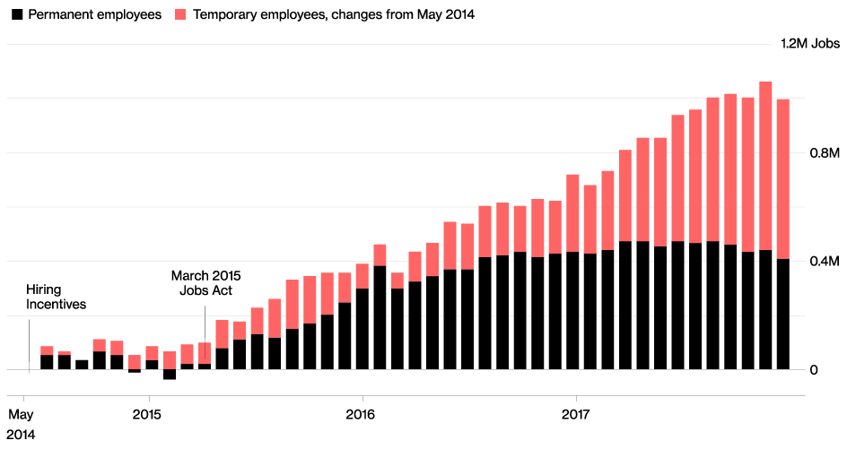

## Table of Contents

## What was the Italian Economic Crisis of 2018?

The Italian Economic Crisis of 2018 was a challenging time for Italy's economy. It started because Italy had a lot of debt and was not growing as fast as other countries. The government had trouble borrowing money because investors were worried about Italy's ability to pay back its debts. This made it harder for Italy to manage its finances and led to higher interest rates on its loans.

During this time, there was also a lot of political uncertainty in Italy. Different political parties had different ideas about how to fix the economy, which made it hard to agree on a plan. This uncertainty scared investors even more, making the crisis worse. Many people in Italy were worried about their jobs and the future of their country's economy.

## What were the main causes of the Italian Economic Crisis in 2018?

The main causes of the Italian Economic Crisis in 2018 were related to Italy's high levels of debt and slow economic growth. Italy had been borrowing a lot of money for a long time, and by 2018, its debt was very high. This made investors worried that Italy might not be able to pay back all the money it owed. When investors are worried, they want higher interest rates to lend money, which made it harder for Italy to borrow more money and manage its finances.

Another big cause was political uncertainty. In 2018, Italy had a lot of political changes and different parties had different ideas about how to fix the economy. This made it hard for the government to agree on a plan to help the country. The uncertainty scared investors even more, which made the crisis worse. People in Italy were worried about their jobs and the future of their country's economy because of all these problems.

## How did the Italian government respond to the economic crisis of 2018?

The Italian government tried to fix the economic crisis of 2018 by making new rules and plans. They wanted to help the economy grow and make people feel better about their jobs. The government worked on lowering the debt and finding ways to borrow money at lower interest rates. They also tried to make businesses want to invest in Italy by offering them help and making it easier to do business there.

There was a lot of arguing about what to do because different political parties had different ideas. Some wanted to spend more money to help people right away, while others thought it was important to save money and pay off the debt first. This made it hard for the government to agree on one plan. In the end, they made some changes to taxes and spending to try and balance the needs of the people and the need to fix the economy.

## What were the immediate effects of the 2018 economic crisis on the Italian population?

The 2018 economic crisis made life harder for many people in Italy. A lot of people were worried about losing their jobs because businesses were not doing well. Some people even lost their jobs, which made it tough for them to pay for things like food and rent. Families had to be careful with their money and cut back on spending, which meant they couldn't buy things they wanted or needed.

The crisis also made people feel unsure about the future. They didn't know if things would get better or if the economy would keep getting worse. This uncertainty caused a lot of stress and worry. Many Italians were also upset with the government because they felt that the leaders were not doing enough to help them. This led to protests and more political tension in the country.

## How did the 2018 crisis impact Italy's GDP and unemployment rates?

The 2018 economic crisis made Italy's GDP, which is like the total money the country makes, grow slower. Before the crisis, Italy was already growing slowly, but after 2018, it got even worse. The GDP didn't shrink, but it didn't go up much either. This meant that the country was not getting richer as fast as it should. The slow growth was a big problem because Italy needed to make more money to pay off its debts and help its people.

The crisis also made more people lose their jobs. Before 2018, the unemployment rate, which is the number of people without jobs, was already high. After the crisis, it went up even more. A lot of people were out of work and couldn't find new jobs easily. This made life hard for many families because they didn't have enough money coming in. The high unemployment rate was a big worry for the government and the people of Italy.

## What role did the European Union play during the Italian Economic Crisis of 2018?

During the Italian Economic Crisis of 2018, the European Union played a big role in trying to help Italy. The EU was worried about Italy's high debt and slow growth. They wanted to make sure Italy did not make the crisis worse by spending too much money. The EU worked with Italy to come up with rules and plans to fix the economy. They told Italy to be careful with its money and to try to lower its debt. This was important because Italy is part of the Eurozone, and what happens in Italy can affect other countries in Europe too.

The EU also gave Italy some help, but they were strict about it. They wanted Italy to follow certain rules before getting more help. This made things harder for Italy because the government had to balance what the EU wanted with what the people in Italy needed. Sometimes, the EU's rules made it hard for Italy to do what it thought was best for its people. But the EU's help was still important because it showed that Europe was working together to try and solve the crisis.

## How did the financial markets react to the Italian Economic Crisis in 2018?

The financial markets got very worried when the Italian Economic Crisis started in 2018. They were scared because Italy had a lot of debt and was not growing fast. This made people who lend money, called investors, want to charge Italy more interest on loans. They were afraid Italy might not be able to pay back all the money it owed. So, the price of Italian bonds, which are like IOUs from the government, went down. This made it harder for Italy to borrow more money and manage its finances.

Because of the crisis, the stock market in Italy also went down. Companies in Italy had a hard time because people were not buying as much stuff. This made investors lose confidence in Italian businesses. They started selling their stocks, which made the stock market prices drop even more. All of this made the crisis worse because it was harder for Italy to get the money it needed to help its economy grow again.

## What were the long-term economic consequences of the 2018 crisis for Italy?

The 2018 economic crisis left Italy with a lot of long-term problems. The country's GDP, which is how much money the whole country makes, grew very slowly after the crisis. This slow growth made it hard for Italy to pay off its big debts. Because the economy was not getting better fast enough, the government had to keep being careful with money. This meant they couldn't spend as much on things like schools and hospitals, which made life harder for people.

The crisis also made more people lose their jobs and stay out of work for a long time. Even years after 2018, Italy's unemployment rate was still high. This made it tough for families because they didn't have enough money coming in. A lot of young people had to leave Italy to find jobs in other countries. This brain drain meant Italy lost a lot of smart and talented people who could have helped the country grow. Overall, the crisis left Italy struggling to get back on its feet and made the future look uncertain for many Italians.

## How did the 2018 economic crisis affect Italy's banking sector?

The 2018 economic crisis made things very hard for Italy's banks. They had a lot of Italian government bonds, which are like loans to the government. When the crisis started, the value of these bonds went down because people were worried Italy might not pay back its debts. This made the banks lose a lot of money. Also, because the economy was not doing well, more people and businesses couldn't pay back their loans to the banks. This made the banks even more worried about their money.

Because of these problems, banks had to be very careful about lending more money. They didn't want to take big risks because they were already in trouble. This made it harder for people and businesses in Italy to get loans to start new projects or keep their businesses going. The banks' problems made the whole economy slower to recover from the crisis. It took a long time for the banking sector to get better, and it affected a lot of people's lives in Italy.

## What measures were proposed to prevent future economic crises in Italy following the 2018 event?

After the 2018 economic crisis, people in Italy and the European Union came up with ideas to stop another crisis from happening. One big idea was to keep Italy's debt from getting too big. They wanted the government to spend less money and find ways to make more money. This would help Italy pay off its debts and not have to borrow as much. Another idea was to make rules that would help the economy grow faster. They thought about helping businesses by making it easier for them to start and grow. This would create more jobs and make the country richer.

They also talked about making the banks stronger. The banks had a lot of trouble during the crisis, so they wanted to make sure banks had enough money to handle problems. They suggested that banks should have more money saved up and be careful about who they lend money to. This would help keep the banks safe and make sure they could keep helping people and businesses. All these ideas were about making Italy's economy stronger and more stable so it wouldn't face another big crisis.

## How did the Italian Economic Crisis of 2018 compare to previous economic downturns in Italy?

The Italian Economic Crisis of 2018 was different from earlier economic problems in Italy, but it had some things in common too. Before 2018, Italy had a big economic crisis in 2008, which was part of a global financial crisis. That time, a lot of banks and businesses around the world were in trouble, and it hit Italy hard. Many people lost their jobs, and the economy shrank a lot. The 2018 crisis was not as bad as 2008 because it was mostly about Italy's own problems, like too much debt and slow growth, rather than a worldwide problem. But it still made life hard for Italians because of worries about the country's debt and political fights.

Compared to other times, like the early 1990s when Italy had another big economic downturn, the 2018 crisis was more about how the government handled its money. In the 1990s, Italy had problems with inflation, which means prices were going up fast, and the government had to change its money to the euro. The 2018 crisis was more about the government not being able to borrow money easily because of high debt. Both times, people in Italy were worried about their jobs and the future, but the reasons for the worries were a bit different. Overall, the 2018 crisis showed that Italy still had big economic problems to solve, even years after earlier crises.

## What were the political ramifications of the 2018 economic crisis in Italy?

The 2018 economic crisis caused a lot of political problems in Italy. People were upset with the government because they felt it was not doing enough to help them. This led to more people supporting parties that were against the government in power. The crisis made it hard for the different political parties to agree on what to do. Some wanted to spend more money to help people right away, while others thought it was important to save money and pay off the debt first. This disagreement made the government look weak and caused a lot of arguing in politics.

The crisis also made people lose trust in the politicians. They were angry and worried about their jobs and the future. This led to more protests and more people voting for new political parties that promised to fix the economy. The political tension made it even harder for Italy to solve its economic problems because the government was too busy fighting to work together. In the end, the 2018 crisis showed that Italy needed to find a way to work together politically to fix its economic problems.

## References & Further Reading

[1]: "The European Sovereign Debt Crisis" by Ali Ari, which provides context on debt crises in Europe, including Italy's predicament.

[2]: "The Italian Economy at the Dawn of the 21st Century" by Massimo Bassetti, offering insights on Italy's economic challenges and integration into the eurozone.

[3]: Dehan, C., & Heyman, D. (2018). ["The Role of Technology in the Italian Financial Crisis."](https://www.fordham.edu/graduate-school-of-social-service/faculty/full-time-faculty-profiles/janna-c-heyman/) Journal of Banking and Finance.

[4]: "Algorithmic Trading: Winning Strategies and Their Rationale" by Ernie Chan, discussing the role of algorithmic trading in financial markets, which relates to Italy's situation in 2018.

[5]: "The European Debt Crisis: Historical, Political and Economic Perspectives" by Costas Simitis, examining the fiscal issues within the European Union including Italy's financial crisis.