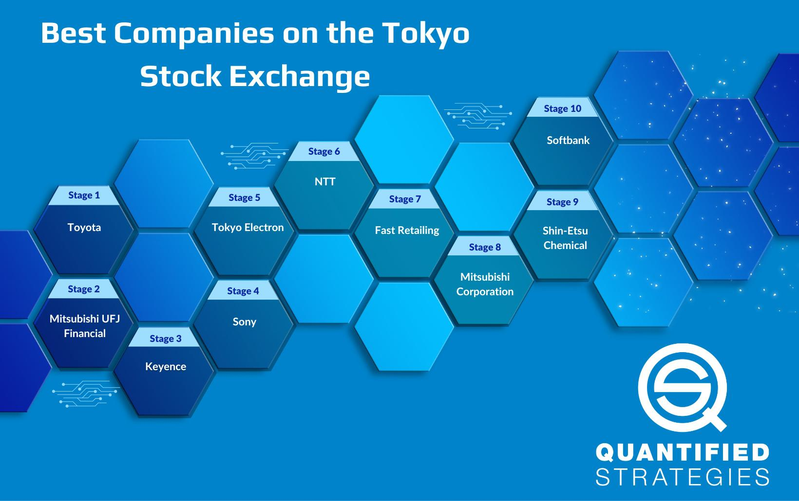

In today's rapidly evolving financial markets, algorithmic trading has gained significant traction among investors and traders looking to leverage technology for efficient decision-making. As market dynamics become increasingly complex, traditional methods of trading are often supplemented or even replaced by advanced algorithmic strategies to optimize performance and gain a competitive edge. One such method that is gaining recognition in this landscape is Itayose, a specialized clearing method used in Japanese commodity exchanges. This method plays a crucial role in determining auction market prices, offering unique insights and methodologies that can be essential for algorithmic trading.

Itayose is distinguished by its approach to price priority and order execution, differing from conventional time-based methods. By focusing on the optimization of market order equalization, traders can achieve more transparent and equitable pricing dynamics. Understanding these methodologies provides traders with a competitive edge in executing trades efficiently and effectively. This approach is particularly pertinent in the context of algorithmic trading, where strategic decision-making and precision execution are paramount.



Incorporating the principles of Itayose within algo trading can enhance strategic decision-making and optimize trading outcomes. By automating the Itayose method’s principles, traders can achieve greater precision, speed, and scalability. These attributes are crucial for exploiting unique market conditions and maintaining a competitive edge in dynamic market scenarios. The systematic approach of Itayose to price discovery aligns well with the objectives of algorithmic traders, providing a framework to refine strategies and implement efficient trading algorithms.

This article offers a detailed exploration into the rules and functionality of Itayose and its integration with algo trading. By examining the operational intricacies of this method, traders and investors can better understand how to incorporate its principles into their algorithmic frameworks, contributing to more sustainable and profitable trading systems. As such, the Itayose method holds the potential to significantly amplify trading efficacy for those able to integrate its processes into their strategies. Understanding and utilizing these advanced methodologies is increasingly crucial in today's competitive financial markets.

## Table of Contents

## What is Itayose?

Itayose is a crucial clearing method employed by Japanese commodity exchanges to determine prices using an auction market approach. Distinct from traditional methods, Itayose does not differentiate the time of order entry. Instead, it prioritizes prices, thereby introducing a different dynamic to the clearing process. This prioritization is rooted in the modified Walrasian market framework, which Itayose enhances to facilitate efficient matching of buy and sell orders.

The primary function of the Itayose method is to set an opening price that satisfies the condition of market order equalization under specific priority rules. The focus on price priority means that within each auction session, orders are matched and cleared based on their prices rather than their entry times. This results in an auction market where prices are indicative of the immediate market equilibrium. By prioritizing price over time, Itayose ensures that all transactions are conducted at the most transparent and equitable prices available, holding particular relevance in markets with fluctuating price dynamics.

One of the key elements of Itayose is its ability to enhance market transparency and equity among participants. As a system that meticulously organizes and executes trades based on price priority, it provides a clear mechanism for price discovery. This transparency is particularly beneficial in complex trading environments, allowing market participants to understand how market prices are determined and thereby enabling them to devise more informed trading strategies.

For traders, comprehending the principles of Itayose is vital. Insight into how market prices are established through this method can lead to the development of more effective trading strategies, optimizing their trading decisions based on rigorous market analysis underpinned by the foundation of price priority. Understanding Itayose thus empowers traders with knowledge that can significantly impact their trading efficacy by leveraging the clear, equitable principles this method upholds in market exchanges.

## How Itayose Works

The Itayose method is a systematic procedure employed in Japanese commodity exchanges to stabilize market prices effectively through an auction-like process. Initially, exchange staff post a provisional price, which serves as a reference point for submitting buy and sell orders from various floor members. This initial price acts as the foundation for an iterative process where the provisional price is adjusted based on the incoming order flow.

In this method, the orders are meticulously analyzed to ensure that the provisional price converges to a point where the aggregate demand meets the aggregate supply. This is akin to finding the market-clearing price, where no excess buy or sell orders exist. The exchange staff's primary task is to adjust the provisional prices iteratively, scrutinizing the quantity of orders to ensure that all buy and sell orders are in equilibrium. This adjustment continues in cycles until a stable price point is achieved—a price reflecting the collective market sentiment at that moment.

The central objective of the Itayose method is to optimize the traded [volume](/wiki/volume-trading-strategy) while minimizing any untraded volume. This is governed by strict price and time priority rules, which are foundational to maintaining fairness and orderliness within the market. The priority rules ensure that the earliest orders have precedence in execution if prices coincide, aligning with typical auction mechanisms where timeliness can confer a competitive advantage.

Algorithmic traders, on integrating Itayose principles within their systems, can garner increased transparency and efficiency in their order execution processes. The automated nature of [algorithmic trading](/wiki/algorithmic-trading) can emulate the Itayose's systematic adjustments to provisional prices, refining these adjustments until an optimal price equilibrium is discovered. This integration not only facilitates superior price-setting mechanisms but also enhances the responsiveness of trading algorithms to dynamic market changes.

For algo trading systems, the incorporation of Itayose principles can be implemented through programming techniques such as setting iterative loops within a trading algorithm to adjust bid and ask prices. Python, due to its simplicity and powerful libraries, serves as an ideal language to model such a process. A simplified Python pseudocode to mimic this iterative process might look like:

```python
def itayose_clearing(buy_orders, sell_orders, initial_price):
    provisional_price = initial_price
    while True:
        buy_volume = sum(order.volume for order in buy_orders if order.price >= provisional_price)
        sell_volume = sum(order.volume for order in sell_orders if order.price <= provisional_price)

        if buy_volume == sell_volume:
            break
        elif buy_volume > sell_volume:
            provisional_price += price_increment
        else:
            provisional_price -= price_increment

    return provisional_price
```

In this snippet, `buy_orders` and `sell_orders` are lists containing buy and sell orders, respectively, each with a set price and volume attribute. The `provisional_price` is adjusted in small increments (`price_increment`) until the total volumes on either side meet, achieving a balance indicative of the market-clearing price. This iterative adjustment is core to the efficacy of trading systems using Itayose methods, allowing them to engage with market dynamics more precisely and strategically.

## Rules Governing Itayose

The Itayose method sets contract prices through a comprehensive framework designed to balance and streamline trading activities. This method involves a series of conditions and rules aimed at maximizing trade volume while minimizing any disparities between buy and sell orders. These conditions are essential to understand for anyone involved in algorithmic trading systems looking to automate price optimization.

**Condition 1: Exact Match within a Range**

The first condition places precedence on the price where bids and offers align precisely within a stipulated range. This approach is crucial for achieving a balanced market, ensuring that there is a seamless match between buying and selling interests. The methodology considers the cumulative volume within the specified range to select the price point that meets the equilibrium condition, enhancing market balance.

**Condition 2: Maximization of Traded Volume**

Under the second condition, the goal is to identify a price point that maximizes the volume of trades conducted during a trading session. This step is critical in promoting [liquidity](/wiki/liquidity-risk-premium) and ensuring that as many orders as possible are executed. By focusing on traded volume, the Itayose method encourages active market participation and helps maintain a dynamic trading environment.

**Condition 3: Minimization of Surplus**

The third condition aims to minimize the surplus by targeting a price where there is the least differential between the volume of buy and sell orders. This rule ensures that any excess in tradeable volume is reduced, promoting order efficiency and reducing market imbalances. Continued adjustments are made until the surplus is minimized, optimizing the trading process.

**Additional Rules: Cumulative Volume and Reference Prices**

Furthermore, the Itayose framework incorporates additional strategies involving cumulative volume analysis and reference prices to guide and structure trading results effectively. These rules assist in establishing an ordered and predictable pricing scheme, crucial for systematic trading operations. The strategies derived from cumulative data support the price-setting mechanism by providing historical context and expected future trends.

**Importance for Algorithmic Trading Systems**

These rules are fundamental to the development of algorithmic trading systems that aim to automate and optimize pricing decisions. By adhering to the structured conditions of the Itayose method, algos can enhance their decision-making capabilities, ensuring more accurate and timely execution of trades. This alignment not only augments trading effectiveness but also provides a robust framework for handling complex, high-frequency trading environments.

## Integrating Itayose in Algo Trading

Algorithmic trading, often referred to as algo trading, involves the use of computer algorithms to automate the process of buying and selling financial instruments. The integration of Itayose techniques into algo trading systems has the potential to enhance price setting mechanisms and improve trading outcomes. Itayose is a method that focuses on price priority and clearing trades through iterative adjustments, making it a suitable candidate for optimization in algorithmic frameworks.

Incorporating Itayose within algos allows traders to achieve greater precision in trade executions. This precision arises from the ability of computer algorithms to process large volumes of data rapidly, ensuring that trades are executed at optimal prices determined by the Itayose procedure. This results in a reduction of errors that can occur with manual trading, as algorithms consistently apply rules without fatigue or emotional influence.

Furthermore, the automation of Itayose principles enables substantial improvements in the speed and scalability of trading operations. For instance, an algorithm can be programmed to adjust orders dynamically as market conditions change, following the iterative price-matching process that is central to Itayose. This dynamic adjustment capability ensures that trading strategies remain robust, even in volatile markets.

Integrating Itayose aids in identifying unique market conditions that can be exploited for profit. Since Itayose sets prices by analyzing and clearing the total volume of orders, algorithms can be developed to recognize patterns or anomalies that may signal a favorable trading opportunity. This capability not only strengthens a trader’s position but also provides a competitive advantage by enabling the early detection of market trends or shifts.

The embedding of Itayose in trading algorithms simplifies complex decision-making processes. This is achieved by encoding the procedural rules of Itayose into the algorithm, allowing it to autonomously conduct the price discovery and order execution tasks. The ease of automation means that traders can deploy multiple strategies across various asset classes or exchanges without the need to manually monitor each. This scalability is particularly beneficial for hedge funds or large institutional investors who manage significant portfolios.

In summary, integrating Itayose principles within algorithmic trading frameworks can significantly enhance trading efficiency and accuracy. By automating Itayose, traders can capitalize on precision and speed, while maintaining a keen edge in diverse and dynamic market environments. 

## Challenges and Future Perspectives

Algorithmic trading, including the application of Itayose clearing methods, faces several challenges largely attributable to market [volatility](/wiki/volatility-trading-strategies) and infrastructure requirements. One significant challenge is managing the risks of overfitting, where an algorithm is too finely tailored to historical data, potentially compromising its performance under new market conditions. Overfitting can lead to erroneous trading decisions when live market data deviates from historical patterns. This necessitates a robust and adaptable algorithmic design that balances past performance learning with generalization for future trades.

The infrastructure demands associated with executing algorithmic strategies, including those based on Itayose methods, are notably high. These systems require advanced hardware and network setups capable of handling large volumes of data with minimal latency, especially when operating in high-frequency trading environments. The rising costs involved in maintaining such sophisticated infrastructures can pose economic barriers for traders aiming to capitalize on Itayose's precise market price-setting advantages.

As financial markets continue to evolve, so must the algorithms employed. Continuous optimization and fine-tuning of trading algorithms are essential in adapting to market shifts. This dynamic environment demands that traders regularly recalibrate their strategies to maintain efficacy. For instance, algorithmic models need periodic reassessment and revision for parameters such as risk tolerance, market conditions, and policy changes.

Looking ahead, advancements in [artificial intelligence](/wiki/ai-artificial-intelligence) (AI) and [machine learning](/wiki/machine-learning) (ML) offer promising opportunities for further integrating Itayose's principles into algorithmic trading with heightened intelligence and efficiency. Machine learning models can enhance data analysis capabilities, allowing for the more accurate prediction of market trends and price movements. This could lead to the development of smarter trading strategies that are not only responsive to present conditions but predictive of future shifts.

Successfully navigating these challenges requires a deep understanding of both the theoretical underpinnings of the Itayose method and practical technical deployment. Implementing Itayose-based algorithms necessitates skillful orchestration of technology and trading knowledge. This involves not merely an application of cutting-edge technological tools but also careful consideration of market dynamics and trading fundamentals.

Positioning for the future in algorithmic trading, and specifically the use of Itayose methodologies, involves striking a balance between leveraging technological advancements and adhering to time-tested trading principles. This harmony ensures that traders can responsibly exploit sophisticated trading systems without losing sight of fundamental market mechanisms. By marrying technological prowess with trading acumen, financial professionals can better manage the complexities of modern trading environments and achieve sustainable outcomes.

## Conclusion

Understanding Itayose offers algorithmic traders crucial insights into order priority and efficient price setting, both cornerstones for refining trading strategies. The Itayose method's systematic approach to price discovery aligns seamlessly with the goals of precision and efficiency inherent in algorithmic trading. By following a structured mechanism that prioritizes price and order matching, Itayose enhances the reliability and speed with which trades are executed.

Despite the clear advantages, challenges such as market volatility and technological constraints exist. However, traders who master the principles of Itayose are positioned to harness these challenges as opportunities for innovation. This method's strategic advantages in algorithmic trading hold the potential to greatly amplify trading efficacy, offering the precision required in rapidly shifting markets.

By exploring Itayose's integration within trading algorithms, traders can unlock promising opportunities in both traditional and emerging markets. This integration not only refines existing strategies but also provides a framework for developing more innovative approaches. The continuous study and strategic implementation of Itayose can guide traders toward establishing more profitable and sustainable trading systems, allowing them to stay competitive and adaptive to market demands. 

Ultimately, the incorporation of Itayose principles in algorithmic trading strategies offers not just a competitive edge but a pathway to ongoing improvement and success in dynamic financial environments.

## References & Further Reading

[1]: ["Algorithmic and High-Frequency Trading"](https://assets.cambridge.org/97811070/91146/frontmatter/9781107091146_frontmatter.pdf) by Álvaro Cartea, Sebastian Jaimungal, and José Penalva

[2]: Pan, J., & Poteshman, A. M. (2006). ["The Information in Option Volume for Future Stock Prices."](https://www.mit.edu/~junpan/volume.pdf) The Review of Financial Studies.

[3]: Seddon, J. (2015). ["Algorithmic Trading – Winning Strategies and Their Rationale"](https://www.wiley.com/en-us/Algorithmic+Trading%3A+Winning+Strategies+and+Their+Rationale-p-9781118460146) by Ernest P. Chan

[4]: Hasbrouck, J. (2003). ["Trading Costs and Returns for U.S. Equities: The Evidence from Daily Data."](https://users.nber.org/~confer/2003/micros03/hasbrouck.pdf) Journal of Finance.

[5]: Budish, E., Cramton, P., & Shim, J. (2015). ["The High-Frequency Trading Arms Race: Frequent Batch Auctions as a Market Design Response."](https://academic.oup.com/qje/article/130/4/1547/1916146) The Quarterly Journal of Economics.