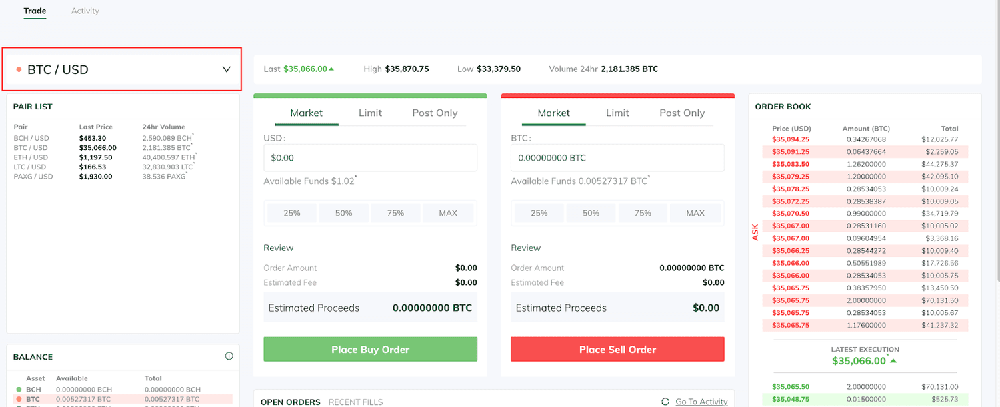

Cryptocurrency exchanges play a critical role in the digital asset market by providing a platform for the trading of cryptocurrencies. These exchanges serve as a bridge between buyers and sellers, offering a marketplace for executing transactions in various digital coins and tokens. They are essential for price discovery, market liquidity, and implementing investment strategies, ranging from simple purchases to complex trading algorithms.

Among the notable players in this evolving landscape is ItBit, recognized for its prominence in the cryptocurrency exchange market. ItBit is acknowledged for its robust trading infrastructure, emphasizing regulatory compliance and security measures, which appeal to both retail and institutional traders. This article aims to thoroughly review ItBit's functionalities, scrutinizing its capabilities in standard crypto trading while shedding light on its support for algorithmic trading strategies.

Algorithmic trading has gained significance in the cryptosphere, characterized by using automated systems to execute trades based on predefined strategies. This trend reflects the broader financial markets, where algorithmic trading has revolutionized how trades are conducted, prioritizing speed and efficiency. As such, ItBit's offerings in this area represent an area of growing interest.

Through this review, readers will learn about ItBit's unique features, assess its performance as a trading platform, and understand its position as a secure and reliable choice within the competitive crypto exchange market. The examination will also consider its support for algorithmic trading, analyzing how it caters to traders seeking sophisticated trading solutions.

## Table of Contents

## What is ItBit?

ItBit is a cryptocurrency exchange that was founded in 2013. It is known for being one of the earliest platforms to offer Bitcoin trading services to institutional and individual investors. The company is headquartered in New York City and operates as a subsidiary of Paxos Trust Company, LLC, a regulated financial institution. ItBit's focus on security, compliance, and reliability has established its reputation within the cryptocurrency market.

Regulatory compliance is a cornerstone of ItBit's operations. It is notable for being one of the first cryptocurrency exchanges to secure a trust charter from the New York State Department of Financial Services (NYDFS) in 2015. This charter authorizes ItBit to operate as a legally recognized financial institution, providing an added layer of protection and trust for its customers. The exchange is required to adhere to rigorous financial and security standards, aligning with traditional banking regulations, which enhances its credibility and trustworthiness.

ItBit offers a range of markets and currencies for trading. In addition to Bitcoin, the exchange supports several other cryptocurrencies, including Ethereum (ETH), Bitcoin Cash (BCH), Litecoin (LTC), and Paxos Standard (PAX). This variety of supported digital assets allows traders to diversify their portfolios and execute a range of trading strategies.

The typical user profile of ItBit includes institutional traders, professional investors, and high-net-worth individuals who prioritize security and regulatory compliance. These users often seek platforms that offer robust protections for their investments, and ItBit's regulatory status and focus on security make it an attractive choice. Additionally, the exchange appeals to algorithmic traders who require a dependable and efficient trading environment to implement their trading strategies.

Security and compliance are integral to ItBit's operations. The exchange employs advanced security measures, including bank-level security protocols, cold storage for the majority of customer funds, and comprehensive identity verification processes. These measures are designed to protect customer assets and data from potential threats and breaches. By adhering to strict compliance standards and maintaining high-security protocols, ItBit aims to mitigate risks and enhance user assurance in the crypto trading space.

## Key Features of ItBit

ItBit is a notable entity in the [cryptocurrency](/wiki/cryptocurrency) exchange arena, offering users a well-constructed trading platform characterized by a comprehensive and user-friendly interface. The platform is designed to cater to both novice and experienced traders, providing an intuitive layout that facilitates ease of navigation. Key features include advanced charting tools, real-time market data, and customizable trading views that enable users to tailor their trading environment to better suit their needs.

**Overview of Fees and Pricing Structure**

ItBit operates on a transparent fee structure that is competitive within the cryptocurrency exchange market. The platform employs a maker-taker pricing model, where the fees are as follows: market makers receive a fee discount for adding [liquidity](/wiki/liquidity-risk-premium), typically ranging from 0% to 0.20%, whereas takers, who remove liquidity, are charged fees from 0.20% to 0.30%. Additionally, ItBit may offer [volume](/wiki/volume-trading-strategy)-based discounts, where fees decrease as users trade more, incentivizing higher trading volumes.

**Security Features and Measures**

Security is a cornerstone of ItBit's operations. The platform implements a comprehensive suite of security measures to safeguard user assets and data. These include two-[factor](/wiki/factor-investing) authentication (2FA) for an additional layer of account protection, advanced encryption technologies to secure transactions and user information, and robust Know Your Customer (KYC) protocols to ensure compliance and prevent fraudulent activities. Furthermore, ItBit stores the majority of funds in cold wallets, minimizing exposure to potential online threats.

**Types of Accounts Offered and Their Respective Benefits**

ItBit offers multiple account types to cater to varied user requirements. Standard accounts provide access to the basic trading functionalities suitable for individual investors. Institutional accounts, on the other hand, are tailored for corporate clients and come with additional benefits such as personalized account management, higher withdrawal limits, and exclusive market insights. These account types ensure that both individual and institutional users can find the services that best align with their trading strategies.

**Customer Support and Service Standards**

Customer support at ItBit is structured to ensure user satisfaction and swift resolution of queries. The support team is accessible through multiple channels, including email and live chat, offering timely assistance to users. ItBit is committed to maintaining high service standards, evidenced by its provision of an educational resource center where users can find articles, tutorials, and FAQs to help them understand the platform's features and enhance their trading acumen. This comprehensive support framework underlines ItBit's dedication to fostering a supportive trading environment for its clientele.

## Crypto Trading on ItBit

ItBit, a prominent cryptocurrency exchange, provides a streamlined process for conducting trades on its platform, making it an attractive option for both novice and experienced traders. The trading process on ItBit's platform begins with users creating an account and completing any necessary identity verification steps. Once verified, traders can deposit funds into their accounts using various methods supported by the platform.

The platform supports a variety of order types, which include market orders, limit orders, and stop orders. Market orders enable users to buy or sell quickly at the current market price, while limit orders allow traders to set specific price levels at which they wish to execute their trades. Stop orders, on the other hand, are used to trigger a market or limit order when the specified stop price is reached. 

ItBit offers a selection of trading pairs, allowing users to trade fiat currencies such as the US Dollar against cryptocurrencies like Bitcoin and Ethereum. This selection caters to a diverse range of trading strategies and preferences, making ItBit suitable for different user profiles.

Liquidity is a crucial feature for any trading platform, and ItBit seeks to provide high liquidity levels to facilitate smooth and rapid order execution. High liquidity ensures that traders can buy or sell sizable amounts without causing significant price fluctuations. This is particularly important for large trades or those looking to make quick transactions.

Integration capabilities are an essential aspect of modern trading platforms. ItBit supports integration with various trading platforms and APIs, enabling traders to connect their external software solutions to the exchange. This allows for the automation of trading strategies and enhanced portfolio management through third-party applications.

In terms of performance, ItBit is recognized for its speed and reliability. The platform utilizes robust technologies to ensure that transactions are processed efficiently, minimizing latency and maximizing uptime. This operational efficiency is vital in the fast-paced cryptocurrency market, where price movements can be rapid and opportunities can arise and disappear quickly.

Overall, ItBit’s trading platform offers a comprehensive suite of tools and features tailored to meet the diverse needs of cryptocurrency traders, ensuring a balanced combination of speed, reliability, and liquidity.

## Algo Trading on ItBit

Algorithmic trading, often referred to as algo trading, involves the use of computer programs to execute trades based on predefined strategies. Its benefits are substantial for cryptocurrency investors, providing opportunities for better execution speeds, removing emotional bias, and enabling complex strategies that can respond swiftly to market changes.

### ItBit’s Support for Algo Trading Strategies

ItBit, a notable cryptocurrency exchange, offers robust support for [algorithmic trading](/wiki/algorithmic-trading) strategies. The exchange provides access to API endpoints that facilitate automated trading systems. These APIs allow for the seamless integration of user-designed algorithms, giving traders the ability to automate buying and selling processes effectively.

The REST API and WebSocket API offered by ItBit provide a range of functionalities essential for algo trading:
- **Market Data:** Access to current and historical market data is crucial for backtesting trading strategies.
- **Order Placement:** Automated order placement and management, including market, limit, and stop orders.
- **Account Management:** Real-time access to account balances and transactions.

### Tools and Resources Provided by ItBit for Algo Traders

For algo traders, ItBit offers several tools and resources that enhance trading efficiency and adaptability:
- **API Documentation:** Comprehensive documentation for both REST and WebSocket APIs that support developers in creating custom trading bots.
- **Sandbox Environment:** A simulated environment where traders can test their algorithms without financial risk. This is invaluable for validating strategies under real-world conditions without incurring losses.
- **Detailed Order Book Data:** Access to full trading depth and order book updates, helpful for executing high-frequency trading strategies.

### Case Studies or Examples of Successful Algo Trading on ItBit

While specific case studies of successful algorithmic trading on ItBit are not publicly detailed due to privacy and competitive reasons, it is well-documented that institutions and individual traders have successfully used APIs to execute high-frequency and [arbitrage](/wiki/arbitrage) trading strategies. The use of predictive models, combined with execution algorithms, has been advantageous in capturing price inefficiencies in cryptocurrency markets.

### Potential Limitations or Challenges of Using Algo Trading on ItBit

Despite the advantages, there are potential limitations and challenges associated with algorithmic trading on ItBit:
- **Technical Complexity:** Developing and optimizing trading algorithms require a significant level of technical expertise and programming knowledge.
- **Market Risk:** Algorithms can sometimes fail to adapt to unforeseen market conditions, leading to unintended losses.
- **Latency:** While ItBit offers robust API connectivity, latency in order execution can still pose a challenge, particularly for high-frequency trading strategies where milliseconds matter.
- **Regulatory Changes:** Automated trading systems need to be adaptable to changing regulatory landscapes, which can impact trading operations.

In summary, ItBit provides a conducive platform for algorithmic trading by offering powerful APIs and essential resources. While there are challenges, with careful planning and execution, algo trading on ItBit can be a rewarding endeavor for sophisticated investors seeking to optimize their trading strategies.

## Pros and Cons of Using ItBit

ItBit, a notable entity in the cryptocurrency exchange ecosystem, offers a series of advantages and drawbacks that potential users should carefully consider. Below is a comprehensive review of ItBit’s strengths and limitations, alongside a comparison with other prevalent exchanges and feedback from the crypto community.

One of the primary advantages of using ItBit is its strong security framework. The platform implements robust security measures, including cold storage for assets, two-factor authentication (2FA), and advanced encryption techniques to protect user data and funds. As a regulated exchange, ItBit is compliant with various financial authorities, enhancing trust among its users. ItBit holds a trust charter from the New York State Department of Financial Services (NYDFS), which sets stringent compliance and operational standards. This regulatory compliance ensures that users’ assets are managed under a stable and legally recognized framework.

User experience on ItBit is generally positive. The platform's interface is designed for clear navigation, catering to both novice and experienced traders. However, one potential drawback is ItBit’s fee structure, which may pose a challenge for some users. While the fees are competitive, especially for institutional investors, they might be higher than those of other platforms with large volumes and varied offerings. Moreover, ItBit supports a limited number of trading pairs compared to leading global exchanges like Binance or Coinbase. This limitation may constrain users who seek a broad diversification of assets.

When comparing ItBit to other major cryptocurrency exchanges, its commitment to security and regulatory compliance stands out as a significant benefit. However, exchanges like Binance offer a wider array of cryptocurrencies and features such as futures trading, decentralized finance (DeFi) staking, and more, which might appeal to a different segment of users. In contrast, Coinbase offers a more extensive selection of cryptocurrencies with a user-friendly platform that appeals to newcomers.

User feedback about ItBit often highlights its reliability and high level of security, though some users have expressed concerns about its limited selection of cryptocurrencies and relatively higher fees. Community reviews suggest that while ItBit is ideal for users who prioritize security and regulatory oversight, it may not be the best choice for those seeking extensive trading options or lower costs.

Considering these factors, ItBit appears most suited for institutional investors or individual traders who value security and compliance over a broad selection of trading pairs. While it may not fulfill all the desires of an active altcoin trader, it offers a safe and stable environment for those focused on Bitcoin and Ethereum trading. Users are encouraged to weigh these considerations against their personal trading needs to determine whether ItBit aligns with their objectives in cryptocurrency trading.

## Conclusion

ItBit stands out as a regulated and secure cryptocurrency exchange, offering a range of features suited for both beginners and experienced traders. A key strength of ItBit is its commitment to regulatory compliance and high-security standards, making it a trustworthy platform in an industry where such factors are critical. The platform’s robust security measures, along with its straightforward user interface, provide a seamless trading experience. However, its trading fees and limited range of supported cryptocurrencies might be potential drawbacks for some users.

ItBit's support for algorithmic trading and API integration makes it an attractive option for tech-savvy traders interested in executing complex trading strategies. This feature is particularly beneficial for institutions and professional traders who prioritize speed and reliability in their trading activities.

For individuals seeking a secure and regulated trading environment, especially those interested in algorithmic trading, ItBit offers a compelling option. Its focus on compliance and institutional-grade services caters well to professional traders and institutions. Potential users should consider these strengths when choosing ItBit for their trading needs, particularly if they value security and regulatory assurance over a wide variety of cryptocurrency options.

Readers are encouraged to explore ItBit further to see if its features align with their specific trading requirements. With the growing interest in algorithmic trading and the increasing importance of security in the crypto market, ItBit is well-positioned to continue expanding its role as a significant player in the cryptocurrency exchange landscape. Its continued adherence to strong compliance standards and user-centric features suggest a promising future in the evolving crypto market.

## References & Further Reading

[1]: Nakamoto, S. (2008). ["Bitcoin: A Peer-to-Peer Electronic Cash System."](https://nakamotoinstitute.org/library/bitcoin/)

[2]: Paxos Trust Company, LLC. ["Paxos and itBit."](https://paxos.com/itbit/)

[3]: Arnuk, S. L., & Saluzzi, J. E. (2012). ["Broken Markets: How High Frequency Trading and Predatory Practices on Wall Street are Destroying Investor Confidence and Your Portfolio."](https://ptgmedia.pearsoncmg.com/images/9780132875240/samplepages/0132875241.pdf) FT Press.

[4]: O’Hara, M. (2015). ["High Frequency Market Microstructure."](https://www.sciencedirect.com/science/article/abs/pii/S0304405X15000045) Journal of Financial Economics.

[5]: Securities and Exchange Commission. ["Statement on Cryptocurrencies and Initial Coin Offerings."](https://www.sec.gov/newsroom/speeches-statements/statement-clayton-2017-12-11) 

[6]: ["A Guide to Algorithmic Trading"](https://www.investopedia.com/articles/active-trading/101014/basics-algorithmic-trading-concepts-and-examples.asp) by Justin Kuepper, Investopedia.