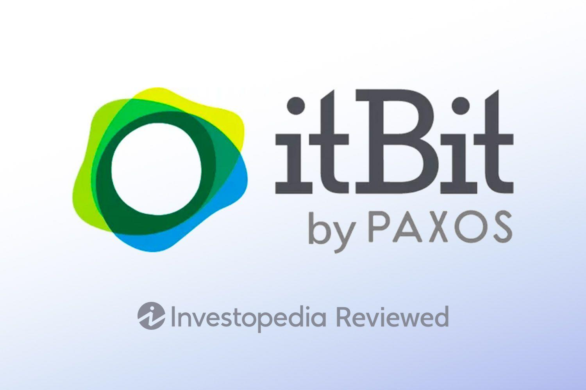

## Table of Contents

## What is ItBit Exchange and when was it founded?

ItBit Exchange is a platform where people can buy, sell, and trade cryptocurrencies like Bitcoin. It helps people to easily exchange their regular money, like dollars or euros, into digital currencies. ItBit also offers services for businesses, helping them to accept and manage cryptocurrency payments.

ItBit was founded in 2013. Since then, it has grown to become one of the well-known exchanges in the cryptocurrency world. The company aims to make trading digital currencies safe and easy for everyone.

## How does ItBit Exchange work for beginners?

ItBit Exchange is a place where you can trade cryptocurrencies like Bitcoin. If you're new to this, you first need to sign up for an account on their website. Once you're in, you can add money to your account using a bank transfer or other methods they accept. This money can then be used to buy cryptocurrencies. ItBit makes it easy by showing you how much you'll get for your money right on the screen.

After you've bought your cryptocurrencies, you can keep them in your ItBit wallet or trade them for other types of digital money or back into regular money. The platform has a simple design so beginners can easily see their balance, make trades, and check the prices of different cryptocurrencies. ItBit also has support and guides to help you learn more about trading and using their services safely.

## What are the fees associated with using ItBit Exchange?

When you use ItBit Exchange, there are some fees you need to know about. For buying and selling cryptocurrencies, ItBit charges a fee based on how much you trade. If you trade a small amount, the fee is a bit higher, but if you trade a lot, the fee goes down. This fee is taken out of your trade right away, so you see the final amount you get after the fee.

There are also fees for moving your money in and out of ItBit. If you want to put money into your ItBit account from your bank, there might be a small fee for that. And if you want to take your money out of ItBit and back to your bank, there's another fee. These fees can change, so it's good to check ItBit's website to see the latest fees before you do anything.

## What types of cryptocurrencies can be traded on ItBit Exchange?

On ItBit Exchange, you can trade different kinds of cryptocurrencies. The main one is Bitcoin, which is very popular and used by many people. Besides Bitcoin, you can also trade Ethereum, which is another big [cryptocurrency](/wiki/cryptocurrency) that many people use for different things like making apps or contracts that work on the internet.

ItBit also lets you trade Litecoin, which is a bit like Bitcoin but works faster and costs less to use. Another cryptocurrency you can trade on ItBit is Bitcoin Cash, which came from Bitcoin but is a bit different. So, if you're interested in trading, ItBit gives you a few choices to start with.

## How secure is ItBit Exchange and what security measures do they have in place?

ItBit Exchange works hard to keep your money and information safe. They use strong security measures to protect against hackers and other bad people. ItBit keeps most of the money in special secure places that are not connected to the internet, which makes it very hard for hackers to steal. They also use two-[factor](/wiki/factor-investing) authentication, which means you need two ways to prove it's really you when you log in, like a password and a code sent to your phone. This makes it much safer because even if someone knows your password, they can't get in without the second code.

ItBit also checks all the money going in and out to make sure it's not being used for anything bad, like crime. They follow rules and laws to make sure everything is done the right way. If something goes wrong, ItBit has insurance to help cover any losses, which gives you extra peace of mind. So, while no place is 100% safe, ItBit does a lot to keep your money and information secure.

## What are the deposit and withdrawal options available on ItBit Exchange?

At ItBit Exchange, you can put money into your account using a bank transfer. This is the main way to add money. You just need to link your bank account to ItBit, and then you can send money over. It might take a few days for the money to show up in your ItBit account, but it's a safe and easy way to get started.

When you want to take money out of ItBit, you can also use a bank transfer. You tell ItBit how much money you want to take out, and they send it back to your bank account. Just like putting money in, taking money out can take a few days. ItBit makes sure everything is safe and follows the rules, so you don't have to worry about your money.

## How does ItBit Exchange comply with regulatory requirements?

ItBit Exchange follows the rules set by governments and financial watchdogs to make sure they are doing things the right way. They have to follow laws about stopping bad things like money laundering and helping the police if they need to look into any crimes. ItBit works with these rules by checking where the money comes from and making sure it's not being used for anything bad. They also keep a close eye on all the trades to make sure everything is above board.

To show they are following the rules, ItBit gets checked by special groups that make sure exchanges are doing things right. They have to share information with these groups and sometimes with the police to help keep everything safe and legal. By doing this, ItBit makes sure they can keep running and helping people trade cryptocurrencies without breaking any laws.

## What are the advanced trading features offered by ItBit Exchange?

ItBit Exchange has some special tools for people who know a lot about trading and want to do more than just buy and sell. One of these tools is called the API, which lets smart traders connect their own computer programs to ItBit. This way, they can make trades very quickly without having to click buttons on the website. ItBit also lets you set up different kinds of orders, like limit orders, where you can say, "I want to buy this coin, but only if the price is this low." This can help you get a better deal on your trades.

Another cool feature is the trading charts and tools that ItBit gives you. These charts show you how the prices of cryptocurrencies are changing over time, and you can use them to try and guess what might happen next. ItBit also lets you see how much other people are buying and selling, which can help you decide when to make your own trades. All these tools together make it easier for experienced traders to do well on ItBit.

## How does ItBit Exchange's liquidity compare to other exchanges?

ItBit Exchange has pretty good [liquidity](/wiki/liquidity-risk-premium), which means there are usually enough people buying and selling that you can make trades without waiting too long. Compared to some of the biggest exchanges like Binance or Coinbase, ItBit might not have as much liquidity. But, it still does a good job, especially for the main cryptocurrencies like Bitcoin and Ethereum. This means if you want to trade these, you can usually do it quickly on ItBit.

For less popular cryptocurrencies, ItBit's liquidity might not be as strong as on some other exchanges. This means you might have to wait a bit longer to buy or sell these coins. But overall, ItBit works hard to keep the trading going smoothly, and many people find it easy to use for their trading needs.

## What are the customer support options available on ItBit Exchange?

ItBit Exchange has different ways to help you if you have questions or problems. You can reach out to them by sending an email. They have a special email address just for customer support, so you can write to them and explain what you need help with. ItBit usually tries to answer your email quickly, but sometimes it might take a bit longer if they are very busy.

They also have a help center on their website. This is like a big book of answers where you can look up common questions and find out how to do things on ItBit. The help center has guides and tips that can teach you about trading and using the exchange. If you can't find what you need in the help center, you can always send that email to get personal help from their team.

## How does ItBit Exchange handle user privacy and data protection?

ItBit Exchange cares a lot about keeping your private information safe. They follow strict rules to make sure your data is protected. When you use ItBit, they only collect the information they need to help you trade and keep things secure. They use strong security measures like encryption to keep your data safe from hackers. ItBit also follows privacy laws like the GDPR in Europe, which means they have to be very careful about how they handle your information.

If you want to know what information ItBit has about you, you can ask them, and they will tell you. You can also ask them to delete your information if you don't want them to keep it anymore. ItBit makes sure that only the people who really need to see your data can look at it, and they train their staff to keep everything confidential. So, while no system is perfect, ItBit does a lot to protect your privacy and keep your data secure.

## What are the pros and cons of using ItBit Exchange based on expert analysis?

ItBit Exchange has some good things going for it. It's known for being safe and secure, which is really important when you're dealing with money online. They use strong security measures like keeping most of the money offline and using two-factor authentication. ItBit also follows the rules and laws, which makes it a trustworthy place to trade. The fees are clear and not too high, especially if you trade a lot. Plus, it's easy to use, so even if you're new to trading, you can figure it out quickly.

On the other hand, there are some downsides to using ItBit. It might not have as much liquidity as some of the bigger exchanges like Binance or Coinbase, which means you might have to wait longer to make trades, especially with less popular cryptocurrencies. Also, the customer support is mainly through email, so if you need help fast, you might have to wait a bit. And while ItBit has some advanced trading features, it might not have as many tools as some other exchanges that are more focused on experienced traders.

## References & Further Reading

[1]: Nakamoto, S. (2008). ["Bitcoin: A Peer-to-Peer Electronic Cash System."](https://nakamotoinstitute.org/library/bitcoin/)

[2]: Paxos Trust Company, LLC. ["Paxos and itBit."](https://paxos.com/itbit/)

[3]: Arnuk, S. L., & Saluzzi, J. E. (2012). ["Broken Markets: How High Frequency Trading and Predatory Practices on Wall Street are Destroying Investor Confidence and Your Portfolio."](https://ptgmedia.pearsoncmg.com/images/9780132875240/samplepages/0132875241.pdf) FT Press.

[4]: O’Hara, M. (2015). ["High Frequency Market Microstructure."](https://www.sciencedirect.com/science/article/abs/pii/S0304405X15000045) Journal of Financial Economics.

[5]: Securities and Exchange Commission. ["Statement on Cryptocurrencies and Initial Coin Offerings."](https://www.sec.gov/newsroom/speeches-statements/statement-clayton-2017-12-11) 

[6]: ["A Guide to Algorithmic Trading"](https://www.investopedia.com/articles/active-trading/101014/basics-algorithmic-trading-concepts-and-examples.asp) by Justin Kuepper, Investopedia.