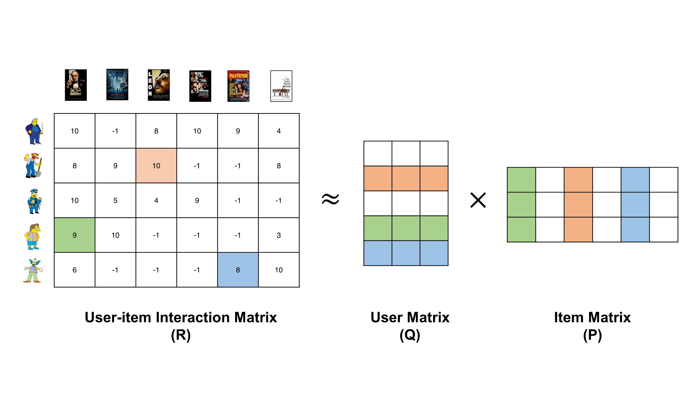

## Table of Contents

## What is an Item Matrix in the context of machine learning?

An Item Matrix in machine learning is a way to organize data about different items, like products in a store or movies in a database. Each row in the matrix represents a different item, and each column represents a feature or characteristic of those items. For example, if you're looking at movies, the columns might include things like genre, release year, and average rating. This setup helps computers understand and work with the data more easily.

Using an Item Matrix, machine learning algorithms can find patterns and make predictions. For instance, if you want to recommend movies to someone, the algorithm can look at the features of movies they've liked before and find other movies with similar features. This is done by calculating similarities between rows in the matrix. The matrix makes it easier to perform these calculations quickly and accurately, which is important for making good recommendations or predictions.

## How is an Item Matrix used in recommendation systems?

In recommendation systems, an Item Matrix helps to suggest things like movies, books, or products that a user might like. Imagine a big table where each row is a different item, and each column is a feature of that item, like the genre of a movie or the price of a product. The system looks at the items a user has liked before and finds other items with similar features. For example, if someone enjoys action movies, the system will look for other movies with the action genre in the Item Matrix and recommend those.

To do this, the system uses math to figure out how similar items are to each other. It might use something called cosine similarity, which measures how closely two items match based on their features. The formula for cosine similarity between two items $$A$$ and $$B$$ is $$ \text{similarity} = \frac{A \cdot B}{\|A\| \|B\|} $$. By calculating this for different items, the system can find the best matches to recommend. This makes the recommendations more accurate and helps users find new items they might enjoy.

## What are the basic components of an Item Matrix?

An Item Matrix is made up of rows and columns. Each row stands for a different item, like a book or a movie. Each column represents a feature or characteristic of those items, such as the genre of a movie or the price of a product. For example, if you have a matrix for books, the columns might include the author, the number of pages, and the average rating. This setup helps the computer understand and work with the data easily.

To use an Item Matrix in recommendation systems, the computer looks at the features of items a user has liked and finds other items with similar features. For example, if a user likes science fiction books, the system will look for other books with the science fiction genre in the Item Matrix and suggest those. The system calculates how similar items are using a method like cosine similarity. The formula for cosine similarity between two items $$A$$ and $$B$$ is $$ \text{similarity} = \frac{A \cdot B}{\|A\| \|B\|} $$. This helps the system make accurate recommendations by finding the best matches based on the features in the Item Matrix.

## Can you explain the process of constructing an Item Matrix?

To construct an Item Matrix, you start by deciding what items and features you want to include. For example, if you are making a matrix for movies, each row could represent a different movie, and the columns could be features like genre, release year, and average rating. You gather all the data about these movies, making sure each movie has information for all the features you've chosen. This might mean looking up the genre and release year of each movie, and maybe calculating the average rating from user reviews.

Once you have all the data, you organize it into a table. Each row in the table is one movie, and each column is one feature. For instance, the first row might be for the movie "Titanic," with columns showing that it's a drama, released in 1997, and has an average rating of 7.8. You fill in the table with all the data, making sure every cell has a value. If some data is missing, you might need to estimate or fill in those gaps. This completed table is your Item Matrix, ready to be used in machine learning algorithms to make recommendations or find patterns.

In recommendation systems, the Item Matrix helps by allowing the computer to calculate how similar items are to each other. For example, if someone likes action movies, the system can look at the features of those movies in the matrix and find other movies with similar features. This is often done using a method called cosine similarity, where the similarity between two items $$A$$ and $$B$$ is calculated with the formula $$ \text{similarity} = \frac{A \cdot B}{\|A\| \|B\|} $$. By using the Item Matrix and this formula, the system can make accurate recommendations, helping users find new items they might enjoy.

## What are the common data sources for building an Item Matrix?

When building an Item Matrix, common data sources include databases, online APIs, and user-generated content. For example, if you're creating an Item Matrix for movies, you might use a database like IMDb to get information about movie genres, release years, and ratings. Online APIs from streaming services like Netflix or Spotify can provide real-time data on user interactions and preferences. User-generated content, such as reviews and ratings on platforms like Amazon or Goodreads, can also be valuable, offering insights into how users perceive different items.

Once you have collected data from these sources, you need to clean and organize it. This might involve handling missing values, converting data into a consistent format, and ensuring that all items have the same set of features. For instance, if some movies are missing ratings, you might need to estimate them based on similar movies. After cleaning, you can arrange the data into the Item Matrix, where each row represents an item and each column a feature. In recommendation systems, this matrix helps calculate similarities between items, often using methods like cosine similarity, calculated with the formula $$ \text{similarity} = \frac{A \cdot B}{\|A\| \|B\|} $$. This process allows the system to make accurate recommendations by finding items with similar features to those a user has enjoyed before.

## How does dimensionality reduction apply to Item Matrices?

Dimensionality reduction is a way to simplify an Item Matrix by reducing the number of features, or columns, while keeping the important information. Imagine you have a big table with lots of columns for each movie, like genre, release year, and many other details. Sometimes, some of these columns might not be very useful for making recommendations or finding patterns. By using techniques like Principal Component Analysis (PCA) or Singular Value Decomposition (SVD), you can combine similar columns into fewer, more important ones. This makes the matrix smaller and easier to work with, which can help the computer run faster and make better predictions.

For example, if you have columns for different genres like action, adventure, and sci-fi, you might find that they often go together. Dimensionality reduction could combine these into a single "action-adventure-sci-fi" column. This way, the matrix is simpler but still captures the main ideas. The math behind this, like in PCA, involves finding the directions in which the data varies the most. You can think of it as finding the best way to summarize the data with fewer columns. The formula for PCA involves calculating the eigenvectors and eigenvalues of the covariance matrix, but the main idea is to find a new set of axes that best represent the data. This helps in making the Item Matrix more manageable and effective for tasks like recommendations.

## What are the challenges faced when dealing with sparse Item Matrices?

Dealing with sparse Item Matrices can be tricky because they have lots of empty or zero values. Imagine a big table where most of the cells are empty. This can make it hard for the computer to find patterns or make good recommendations. For example, if you're recommending movies and only a few people have rated each movie, the matrix will have many zeros. This makes it difficult to calculate similarities between items using methods like cosine similarity, which is calculated with the formula $$ \text{similarity} = \frac{A \cdot B}{\|A\| \|B\|} $$. When there are many zeros, the results might not be very accurate or useful.

To handle sparse matrices, you need special techniques. One way is to use algorithms that are good at dealing with zeros, like Alternating Least Squares (ALS) for recommendation systems. Another way is to fill in the missing values, a process called imputation. You might guess what the missing values should be based on other data. This can make the matrix less sparse and easier to work with. But, filling in the gaps can also introduce errors if the guesses are not good. So, finding the right balance between keeping the matrix simple and making sure it's accurate is a big challenge when working with sparse Item Matrices.

## How can collaborative filtering be implemented using an Item Matrix?

Collaborative filtering using an Item Matrix works by looking at what users have liked or rated before and finding items that other users with similar tastes have enjoyed. Imagine a big table where each row is a different movie and each column is a user. The cells in the table show how much each user liked each movie. To make recommendations, the system calculates how similar the movies are to each other using a method called cosine similarity. The formula for cosine similarity between two movies $$A$$ and $$B$$ is $$ \text{similarity} = \frac{A \cdot B}{\|A\| \|B\|} $$. By finding movies with high similarity scores to the ones a user has liked, the system can suggest new movies they might enjoy.

One way to implement this in code is by using a library like NumPy in Python. You start by creating the Item Matrix, where rows are items and columns are users. Then, you calculate the similarity between items using the cosine similarity formula. After that, you can use these similarities to make recommendations. Here's a simple example of how you might do this:

```python
import numpy as np

# Create an Item Matrix (movies x users)
item_matrix = np.array([
    [5, 3, 0, 1],  # Movie 1
    [4, 0, 0, 1],  # Movie 2
    [1, 1, 0, 5],  # Movie 3
    [1, 0, 0, 4],  # Movie 4
    [0, 1, 5, 4]   # Movie 5
])

# Function to calculate cosine similarity
def cosine_similarity(A, B):
    return np.dot(A, B) / (np.linalg.norm(A) * np.linalg.norm(B))

# Calculate similarities between movies
similarities = np.zeros((item_matrix.shape[0], item_matrix.shape[0]))
for i in range(item_matrix.shape[0]):
    for j in range(item_matrix.shape[0]):
        similarities[i, j] = cosine_similarity(item_matrix[i], item_matrix[j])

# Example: Recommend movies similar to Movie 1
movie_1 = item_matrix[0]
similar_movies = similarities[0]
# Sort movies by similarity, excluding the movie itself
sorted_indices = np.argsort(similar_movies)[::-1][1:]
print("Movies similar to Movie 1:", sorted_indices + 1)
```

This code shows how you can create an Item Matrix, calculate similarities between movies, and recommend movies based on those similarities.

## What are the advanced techniques for optimizing Item Matrix performance?

One way to make an Item Matrix work better is by using a technique called matrix factorization. This method breaks down the big Item Matrix into smaller, easier-to-handle matrices. Imagine you have a big table with lots of rows and columns. Matrix factorization can turn this into two smaller tables that, when multiplied together, give you back the original big table. This can help the computer find patterns and make recommendations faster. A common way to do this is with Singular Value Decomposition (SVD), which uses math to find the best way to split the matrix. The formula for SVD is $$ A = U \Sigma V^T $$, where $$ A $$ is the original matrix, $$ U $$ and $$ V $$ are the new smaller matrices, and $$ \Sigma $$ is a diagonal matrix of singular values.

Another way to improve the performance of an Item Matrix is by using dimensionality reduction. This means making the matrix smaller by keeping only the most important information. For example, if you have a lot of columns that are similar, you can combine them into fewer columns. This makes the matrix easier for the computer to work with and can help it run faster. A popular method for this is Principal Component Analysis (PCA), which finds the directions in the data that explain the most variation. By using fewer but more important columns, the computer can make better and quicker recommendations. Both matrix factorization and dimensionality reduction help make the Item Matrix more efficient and effective for tasks like recommendation systems.

## How do you evaluate the effectiveness of an Item Matrix in a recommendation system?

To evaluate how well an Item Matrix works in a recommendation system, you look at how accurate and useful the recommendations are. One common way to do this is by using metrics like precision and recall. Precision tells you how many of the recommended items were actually liked by the user, while recall shows how many of the items the user liked were recommended. For example, if a user likes 10 movies and the system recommends 5 of them, the recall is 50%. If out of those 5 recommendations, the user liked 4, the precision is 80%. These numbers help you understand if the Item Matrix is doing a good job at finding items the user might enjoy.

Another way to check the effectiveness of an Item Matrix is by using something called the Root Mean Square Error (RMSE). This measures how far off the system's predictions are from the actual user ratings. The formula for RMSE is $$ \text{RMSE} = \sqrt{\frac{1}{n} \sum_{i=1}^{n} (y_i - \hat{y}_i)^2} $$, where $$ y_i $$ is the actual rating, $$ \hat{y}_i $$ is the predicted rating, and $$ n $$ is the number of ratings. A lower RMSE means the predictions are closer to the real ratings, which means the Item Matrix is doing a better job. By looking at these metrics, you can tell if the Item Matrix needs to be improved or if it's working well enough to make good recommendations.

## What are the scalability issues associated with large Item Matrices, and how can they be addressed?

Large Item Matrices can be hard to work with because they take up a lot of space and need a lot of time to process. Imagine a huge table where each row is a different item and each column is a feature or a user. If you have millions of items and thousands of users, the table gets very big. This can make the computer slow down when trying to find patterns or make recommendations. For example, calculating the similarity between items using the cosine similarity formula $$ \text{similarity} = \frac{A \cdot B}{\|A\| \|B\|} $$ can take a long time when dealing with millions of rows and columns.

To make large Item Matrices easier to handle, you can use special techniques. One way is to break the big matrix into smaller pieces using a method called matrix factorization. This can be done with Singular Value Decomposition (SVD), which uses the formula $$ A = U \Sigma V^T $$ to split the matrix into smaller, easier-to-work-with parts. Another way is to use dimensionality reduction, like Principal Component Analysis (PCA), to make the matrix smaller by keeping only the most important information. By using these techniques, you can make the computer work faster and handle the large Item Matrix more efficiently.

## Can you discuss the integration of Item Matrices with deep learning models for enhanced recommendation systems?

Integrating Item Matrices with deep learning models can make recommendation systems even better. Deep learning models, like neural networks, are good at finding complex patterns in data. By using an Item Matrix as input, these models can learn how different items relate to each other and to user preferences. For example, a neural network can take the Item Matrix and learn to predict what a user might like next. This is done by training the model on the data in the matrix, which helps it understand the connections between items and users. The model can then use these learned patterns to make more accurate recommendations, even for new items or users it hasn't seen before.

One way to do this is by using a technique called matrix factorization in the deep learning model. This means breaking down the big Item Matrix into smaller matrices that are easier for the model to work with. The formula for matrix factorization using Singular Value Decomposition (SVD) is $$ A = U \Sigma V^T $$, where $$ A $$ is the original Item Matrix, and $$ U $$, $$ \Sigma $$, and $$ V^T $$ are smaller matrices. By using these smaller matrices, the deep learning model can process the data faster and more efficiently. This can help the model make better recommendations by capturing the most important features of the items and users.