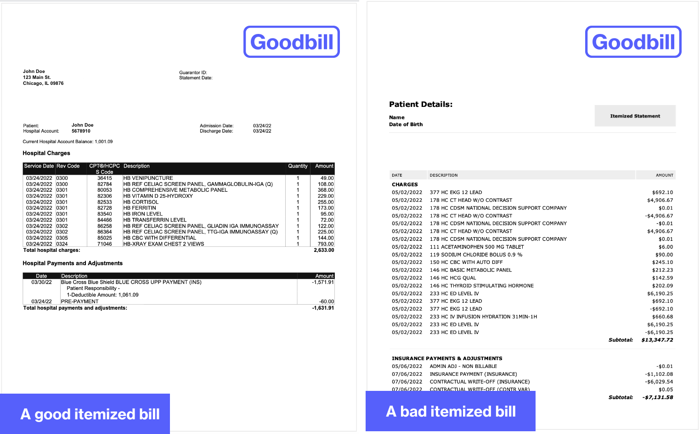

## Table of Contents

## What is an itemized statement?

An itemized statement is a detailed list of charges or expenses. It breaks down the total amount into smaller parts, showing each individual item and its cost. This helps people understand what they are being charged for and why.

For example, if you get a bill from a hospital, an itemized statement would list each medical service or supply used during your visit. Instead of just seeing a total amount, you would see charges for things like doctor visits, lab tests, and medications. This can be useful for checking if all charges are correct and for insurance claims.

## Why is an itemized statement important?

An itemized statement is important because it helps people understand their bills better. When you see a total amount, it can be hard to know what you are paying for. But with an itemized statement, you can see each charge separately. This makes it easier to check if everything is correct. For example, if you got a bill from a restaurant, an itemized statement would show the cost of each dish, drink, and any extra fees. This way, you can make sure you are only paying for what you ordered.

Itemized statements are also useful for managing money and insurance claims. If you need to keep track of your spending, seeing each expense listed out helps you plan better. It can also help when you need to file an insurance claim. Insurance companies often ask for detailed bills to process claims correctly. By having an itemized statement, you can show exactly what you paid for and why, making the process smoother.

## What are the key components of an itemized statement?

An itemized statement has several key parts that help make it clear and useful. The first part is the list of items or services. This shows each thing that you were charged for, like a doctor's visit or a meal at a restaurant. Each item is listed separately, so you can see what you paid for. The second part is the cost of each item. Next to each item, there is a price, so you can see how much each thing costs.

The third part is the total amount. At the end of the statement, all the costs are added up to give you the total amount you need to pay. Sometimes, there might be taxes or extra fees added to the total, and these are shown too. The last part is the date and any other important details. The date helps you know when the charges were made, and other details might include things like the name of the person or company that provided the service. All these parts together make an itemized statement clear and helpful for understanding your bill.

## How does an itemized statement differ from a regular statement?

An itemized statement and a regular statement both show how much money you owe, but they give the information in different ways. A regular statement just shows the total amount you need to pay. It might not tell you what each part of the total is for. For example, if you get a regular statement from a restaurant, it might just say you owe $50 without explaining what you ate or drank.

An itemized statement, on the other hand, breaks down the total into smaller parts. It lists each thing you were charged for and how much it costs. So, if you get an itemized statement from the same restaurant, it would show the price of each dish, each drink, and any extra fees like tax. This helps you see exactly what you are paying for and makes it easier to check if the bill is correct.

## What are the advantages of using an itemized statement?

Using an itemized statement has many advantages. It helps you see exactly what you are paying for. Instead of just seeing a total amount, you can see the cost of each item or service. This makes it easier to check if the bill is correct. For example, if you get a bill from a doctor, an itemized statement will show the cost of each visit, test, or medicine. This way, you can make sure you are only paying for what you used.

Another advantage is that it helps with managing your money. When you can see each expense listed out, it's easier to keep track of where your money is going. This can help you plan better and maybe even save money. Itemized statements are also useful for insurance claims. Insurance companies often need detailed bills to process claims correctly. By having an itemized statement, you can show exactly what you paid for, which makes the insurance process smoother and faster.

## Can you provide a simple example of an itemized statement?

Imagine you went to a restaurant and got an itemized statement at the end of your meal. The statement would list each thing you ordered, like a cheeseburger for $5, fries for $2, and a soda for $1. It would also show any extra fees, like a $0.50 tax. At the bottom, it would add up all these costs to give you the total amount you need to pay, which in this case would be $8.50.

This kind of statement is helpful because it shows you exactly what you are paying for. If you think the cheeseburger should have been cheaper, you can see the price right there and ask about it. It also makes it easier to split the bill with friends, because everyone can see what they owe for their part of the meal.

## How can businesses implement itemized statements effectively?

Businesses can implement itemized statements effectively by making sure their billing systems are set up to list each charge separately. This means using software or tools that can break down the total cost into smaller parts, like the price of each product or service. It's important to train staff to enter all the details correctly so the statements are accurate. For example, if a customer buys several items, the staff should list each item and its price on the statement. This helps customers understand what they are paying for and makes it easier for them to check if the bill is correct.

Another way to implement itemized statements effectively is by making them clear and easy to read. The statements should use simple language and have a clear format, so customers can quickly see the cost of each item and the total amount. Adding a brief explanation of any extra fees or taxes can also help. For example, if there's a service fee, the statement should explain what it is for. By doing this, businesses can build trust with their customers, as people feel more comfortable knowing exactly what they are paying for.

## What are the legal requirements for itemized statements in different industries?

In different industries, the legal requirements for itemized statements can vary. In healthcare, for example, the law often requires hospitals and doctors to give patients an itemized bill if they ask for one. This is to help patients understand their medical costs and check if the charges are right. Some states in the U.S. have laws that say healthcare providers must give an itemized statement within a certain time, like 30 days after a request.

In the restaurant industry, the rules can be different. Many places don't have strict laws about itemized statements, but it's common for restaurants to give them to customers. This helps customers see the cost of each dish and any extra fees like tax or tips. For businesses like hotels or repair shops, some states or countries might have rules that say they need to provide an itemized bill, especially if the customer asks for one. These rules are there to make sure customers know exactly what they are paying for and can check if the bill is fair.

## How do itemized statements impact financial transparency and accountability?

Itemized statements help make financial dealings more clear and honest. When a business gives you an itemized statement, it shows you every little thing you are paying for and how much each thing costs. This makes it easier for you to see if the bill is right and if you are only paying for what you got. For example, if you get a bill from a mechanic, an itemized statement would list the cost of each part and each hour of labor. This way, you can check if the prices seem fair and if there are any charges that don't make sense.

Having itemized statements also makes businesses more accountable. When everything is listed out, it's harder for a business to hide extra fees or charge you for things you didn't use. This can help stop mistakes or even cheating. For example, if a hospital gives you an itemized bill, you can see if they charged you for tests you didn't get. This makes businesses more careful about what they charge and helps build trust with their customers.

## What technologies can enhance the creation and management of itemized statements?

Using technology can make it easier for businesses to create and manage itemized statements. One way is by using billing software. This kind of software can automatically list out each charge, so businesses don't have to do it by hand. It can also add up the total and include any extra fees like taxes. This makes the statements more accurate and saves time. Another helpful technology is cloud-based systems. These let businesses store and share itemized statements online, so customers can see them anytime and from anywhere. This is useful for keeping good records and making sure everyone can access the information they need.

Another technology that can help is data analytics. This can look at the itemized statements to find patterns or mistakes. For example, it can show if some charges are always too high or if there are common errors in the billing. This helps businesses fix problems and make their statements even better. Using mobile apps can also make a difference. Customers can get their itemized statements on their phones, which makes it easy to check them on the go. This can help customers feel more in control of their bills and trust the business more.

## How can itemized statements be used to improve customer trust and satisfaction?

Itemized statements can help build trust with customers by showing them exactly what they are paying for. When a business gives a clear list of each charge, customers can see the cost of every item or service. This makes it easier for them to check if the bill is right and if they are only paying for what they got. For example, if a customer gets a bill from a restaurant, an itemized statement will show the price of each dish and any extra fees like tax. This openness helps customers feel more sure that the business is being honest and fair.

Using itemized statements can also make customers happier. When people understand their bills better, they are less likely to feel confused or upset about what they are paying. This can lead to fewer complaints and more happy customers. For example, if a customer gets a bill from a mechanic and sees a detailed list of parts and labor costs, they can feel more in control and satisfied with the service. By being clear and open with itemized statements, businesses can show they care about their customers and want to keep them happy.

## What are the potential challenges and solutions in maintaining accurate itemized statements?

Keeping itemized statements accurate can be hard for businesses. One big challenge is making sure all the details are entered correctly. If someone makes a mistake when they list the charges, the whole bill can be wrong. Another problem is keeping up with different rules and laws about itemized statements. These can change and be different in each place, so businesses need to know what they are and follow them. Also, using old systems or doing things by hand can make it harder to keep everything right and up to date.

To solve these problems, businesses can use modern billing software that does a lot of the work for them. This kind of software can automatically list each charge and add up the total, which helps cut down on mistakes. Training staff well is also important. If everyone knows how to enter the details right, the statements will be more accurate. Lastly, businesses should keep an eye on the laws and rules about itemized statements and make sure they follow them. By doing these things, businesses can keep their itemized statements accurate and help their customers trust them more.

## What is the overview and importance of financial statements?

Financial statements are vital tools for conveying the financial health and performance of a business over a specific period. These documents are crucial in assessing the viability and overall operational effectiveness of a company. Key components of financial statements include the income statement, balance sheet, and cash flow statement, each serving a distinct purpose.

The income statement, also known as the profit and loss statement, provides a summary of the company's revenues, expenses, and profits or losses over a period. This document helps stakeholders understand the profitability of the business. The equation for net income, a key metric on the income statement, is given by:

$$
\text{Net Income} = \text{Total Revenues} - \text{Total Expenses}
$$

The balance sheet offers a snapshot of the company's financial position at a specific point in time, detailing assets, liabilities, and shareholder equity. The balance sheet follows the fundamental accounting equation:

$$
\text{Assets} = \text{Liabilities} + \text{Shareholder's Equity}
$$

This equation ensures that the balance sheet remains balanced, which is essential for maintaining accurate financial records.

The cash flow statement highlights the inflows and outflows of cash within the company, categorized into operating, investing, and financing activities. This statement is crucial for understanding how a business manages its cash to fund operations and growth. The cash flow from operations, for example, can be estimated using:

$$
\text{Cash Flow from Operations} = \text{Net Income} + \text{Non-cash Expenses} - \text{Changes in Working Capital}
$$

Accurate financial statements are indispensable for evaluating a company's business health, informing investment decisions, and ensuring robust financial management. They provide insights into profitability, [liquidity](/wiki/liquidity-risk-premium), and financial stability, forming the backbone of strategic planning and analysis. Investors, creditors, and analysts rely heavily on these documents to make informed decisions about engaging with or investing in a company.

## References & Further Reading

[1]: Bergstra, J., Bardenet, R., Bengio, Y., & Kégl, B. (2011). ["Algorithms for Hyper-Parameter Optimization."](https://papers.nips.cc/paper/4443-algorithms-for-hyper-parameter-optimization) Advances in Neural Information Processing Systems 24.

[2]: ["Advances in Financial Machine Learning"](https://www.amazon.com/Advances-Financial-Machine-Learning-Marcos/dp/1119482089) by Marcos Lopez de Prado

[3]: ["Evidence-Based Technical Analysis: Applying the Scientific Method and Statistical Inference to Trading Signals"](https://www.amazon.com/Evidence-Based-Technical-Analysis-Scientific-Statistical/dp/0470008741) by David Aronson

[4]: ["Machine Learning for Algorithmic Trading"](https://github.com/PacktPublishing/Machine-Learning-for-Algorithmic-Trading-Second-Edition) by Stefan Jansen

[5]: ["Quantitative Trading: How to Build Your Own Algorithmic Trading Business"](https://books.google.com/books/about/Quantitative_Trading.html?id=j70yEAAAQBAJ) by Ernest P. Chan