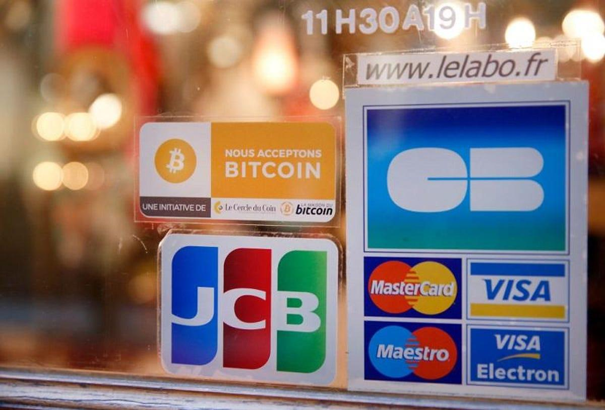

## Table of Contents

## What is cryptocurrency and how can it be used for purchases?

Cryptocurrency is a type of digital money that you can use to buy things online. It's different from regular money because it's not controlled by a government or a bank. Instead, it uses a technology called blockchain, which is like a digital ledger that keeps track of all transactions. Some popular cryptocurrencies are Bitcoin, Ethereum, and Dogecoin. You can store them in a digital wallet on your computer or phone.

To use cryptocurrency for purchases, you first need to get some. You can buy it from a cryptocurrency exchange, which is like an online marketplace, or you might get it as payment for goods or services. Once you have some cryptocurrency in your digital wallet, you can use it to buy things from places that accept it. Some online stores, like big companies and small businesses, now take cryptocurrency as payment. To make a purchase, you just send the right amount of cryptocurrency from your wallet to the store's wallet, and they'll send you the product or service you bought.

## What are the most common items that can be bought with cryptocurrency?

You can buy a lot of different things with cryptocurrency. One of the most common items is electronics, like computers, smartphones, and gadgets. Many online stores that sell these products now accept Bitcoin and other cryptocurrencies. You can also buy gift cards with cryptocurrency. These gift cards can be used at big stores like Amazon or Walmart, making it easier to buy things you need without directly using cryptocurrency at those stores.

Another common use for cryptocurrency is buying things online that you can't easily find in regular stores. This includes digital items like video games, in-game currency, or special items in online games. Some people also use cryptocurrency to buy things like domain names or web hosting services. It's becoming more popular to use cryptocurrency for these kinds of purchases because it's fast and can be done from anywhere in the world.

Lastly, some people use cryptocurrency to buy everyday items like food, clothes, and even furniture. While not as common as buying electronics or digital items, more and more places are starting to accept cryptocurrency. For example, some restaurants and cafes now let you pay with Bitcoin. This trend is growing, and it's making cryptocurrency more useful for everyday shopping.

## How do you find sellers who accept cryptocurrency?

Finding sellers who accept cryptocurrency is getting easier as more places start to take it. You can start by looking online. Websites like Coinmap and Spendabit list businesses that accept cryptocurrency. You can search for what you want to buy, like electronics or food, and see if any sellers near you take Bitcoin or other cryptocurrencies. Some big online stores like Overstock and Newegg also accept cryptocurrency, so you can check their websites directly.

Another way to find sellers is by using social media and forums. On platforms like Twitter or Reddit, people often talk about where they can use cryptocurrency to buy things. You can join groups or follow accounts that focus on cryptocurrency to get tips and recommendations. Sometimes, local meetups or events can also connect you with sellers who accept cryptocurrency. By asking around in these communities, you can discover new places to spend your digital money.

## What are the benefits of using cryptocurrency for purchases?

Using cryptocurrency for purchases can be really helpful. One big benefit is that it's fast and easy to use. When you pay with cryptocurrency, you don't have to wait for banks to process your payment. This means you can get your stuff quicker. Also, you don't need to share a lot of personal information, which can keep your details safer. This is good if you want to keep your shopping private.

Another good thing about using cryptocurrency is that it works all over the world. You can buy things from other countries without worrying about different currencies or high fees. This makes it easier to shop from anywhere. Plus, some people like that cryptocurrency can grow in value over time. If you buy something with cryptocurrency and its value goes up, you might end up paying less than if you had used regular money.

## What are the risks associated with buying items with cryptocurrency?

Using cryptocurrency to buy things can be risky because its value can go up and down a lot. This means that what you pay for something today might be worth more or less tomorrow. If the value goes down, you might end up paying more than you planned. Also, if you make a mistake when sending cryptocurrency, like putting in the wrong address, you can lose your money forever because you can't take it back.

Another risk is that not everyone trusts or understands cryptocurrency yet. This means some sellers might not accept it, or they might not know how to use it properly. There's also a chance of getting scammed because it's harder to get your money back with cryptocurrency. You need to be careful and make sure you're dealing with honest sellers.

## How does the process of buying items with cryptocurrency work?

To buy things with cryptocurrency, you first need to have some in your digital wallet. You can get cryptocurrency by buying it from an exchange, which is like an online store for digital money, or by earning it as payment for goods or services. Once you have cryptocurrency, you look for a seller who accepts it. You can find these sellers online on websites like Coinmap or Spendabit, or through social media and forums where people share places that take cryptocurrency.

When you find something you want to buy, you go to the seller's website or contact them directly. You'll see how much cryptocurrency you need to pay. Then, you send that amount from your digital wallet to the seller's wallet address. This is usually done by copying and pasting the address into your wallet app. Once the seller gets the cryptocurrency, they'll send you the item or service you bought. It's important to double-check the wallet address before sending any cryptocurrency because mistakes can't be fixed.

## What are the tax implications of using cryptocurrency for purchases?

When you use cryptocurrency to buy things, you might have to pay taxes on it. In many places, using cryptocurrency to buy stuff is like selling it. So, if the value of the cryptocurrency went up since you got it, you might have to pay taxes on that gain, even if you just used it to buy something and didn't get any regular money. For example, if you bought Bitcoin at $10,000 and used it to buy a laptop when it was worth $15,000, you might owe taxes on the $5,000 gain.

It's important to keep good records of your cryptocurrency transactions. You need to know when you got the cryptocurrency, how much you paid for it, and when you used it to buy something. This helps you figure out if you owe any taxes and how much. Tax laws about cryptocurrency can be different in different places, so it's a good idea to check with a tax professional to make sure you're doing everything right.

## How can one ensure the security of transactions when using cryptocurrency?

Keeping your cryptocurrency transactions safe is important. One way to do this is by using a secure digital wallet. There are different types of wallets, like software wallets on your computer or phone, and hardware wallets that are like a USB drive. Hardware wallets are often safer because they keep your cryptocurrency offline, which makes it harder for hackers to steal it. Always make sure to download wallet software from trusted sources and keep your wallet's software up to date to protect against new security threats.

Another way to stay safe is by being careful with the addresses you use to send cryptocurrency. Always double-check the address before sending any money because if you send it to the wrong place, you can't get it back. It's also a good idea to use two-factor authentication (2FA) on your wallet and any exchanges you use. This adds an extra layer of security by requiring a code sent to your phone or email before you can access your account. Lastly, be careful of scams and only buy from trusted sellers. If a deal seems too good to be true, it probably is.

## What are some high-value items that have been purchased with cryptocurrency?

People have used cryptocurrency to buy some really expensive things. One example is real estate. In 2017, someone bought a house in Texas for about 600 Bitcoins. At the time, that was worth around $300,000. Another big purchase was a luxury car. In 2021, a person bought a Lamborghini with Bitcoin. The car cost about 16 Bitcoins, which was around $1 million at that time. These examples show that you can use cryptocurrency to buy big, valuable things just like you would with regular money.

Another high-value item bought with cryptocurrency is art. In 2021, a digital artwork called "Everydays: The First 5000 Days" by Beeple was sold for 69 million dollars in Ethereum. This was one of the biggest art sales ever, and it was all done with cryptocurrency. People also use cryptocurrency to buy fancy watches and jewelry. For example, a rare Patek Philippe watch was sold for 20 Bitcoins, which was about $2 million at the time. These purchases show that cryptocurrency is becoming more accepted for buying expensive and unique items.

## How do different cryptocurrencies affect the purchasing process?

Different cryptocurrencies can change how you buy things because each one works a bit differently. Bitcoin is the most well-known and is accepted by many sellers. It's easy to use because a lot of people know about it and many stores take it. But other cryptocurrencies like Ethereum or Litecoin might be faster or cheaper to use. For example, Litecoin transactions can be quicker than Bitcoin, which means you might get your stuff faster. Also, some sellers might only take certain cryptocurrencies, so you need to check what they accept before you buy.

Some cryptocurrencies also have special features that can affect how you use them for purchases. For example, Ethereum is not just a currency but also a platform for smart contracts, which are like digital agreements that can automatically do things when certain conditions are met. This means you could use Ethereum to buy things in a way that's more automatic and secure. On the other hand, cryptocurrencies like Dogecoin are often used for smaller, fun purchases because they're cheaper and more playful. So, the type of cryptocurrency you use can change how easy, fast, and safe your buying process is.

## What future trends can we expect in the use of cryptocurrency for buying items?

In the future, more and more stores and businesses might start taking cryptocurrency for buying things. Right now, it's mostly online stores and some special places that accept it, but as more people learn about and use cryptocurrency, even regular stores might start to take it. This could make it easier to use cryptocurrency for everyday stuff like buying groceries or clothes. Also, as the technology gets better, buying things with cryptocurrency might become faster and cheaper, making it a more popular choice for shopping.

Another trend we might see is more ways to use cryptocurrency for special kinds of purchases, like buying art or real estate. Already, some people are using it to buy big, expensive things, and this could grow. With things like smart contracts on platforms like Ethereum, buying and selling could become more automatic and safe. This means you might be able to buy a house or a piece of art without needing a lot of paperwork or waiting a long time. As cryptocurrency becomes more common and trusted, it could change how we buy a lot of different things.

## How can businesses integrate cryptocurrency payment options into their sales systems?

Businesses can start accepting cryptocurrency by using special payment processors that work with digital money. These processors, like BitPay or Coinbase Commerce, turn cryptocurrency into regular money if the business wants, or they can keep it as cryptocurrency. To set this up, a business needs to sign up with a payment processor, get a digital wallet, and then add the payment option to their website or store. They might need to change their sales system a bit to show the price in cryptocurrency and handle the payment.

Once the payment system is set up, the business needs to tell customers that they can pay with cryptocurrency. They can do this by putting signs in their store or adding information on their website. It's important to teach staff about how to handle these payments too. As more people use cryptocurrency, businesses that accept it might get more customers and stand out from others. But they also need to keep an eye on the value of cryptocurrency because it can change a lot, which can affect how much they really get for their products.

## How do you get started with crypto algorithmic trading?

To begin your journey in crypto algorithmic trading, it is important to first grasp the fundamental aspects that underpin this innovative approach to market engagement. At its core, algorithmic trading involves utilizing computers to execute trades based on predetermined strategies and models. Here's how you can get started:

### Learning Programming Fundamentals

Programming skills are indispensable for developing, testing, and implementing trading algorithms. Python is a popular programming language in this field due to its simplicity and powerful libraries. To get started, consider familiarizing yourself with basic Python concepts, including variables, loops, and functions. Libraries such as Pandas and NumPy are essential for handling and analyzing data, while libraries like Matplotlib can be used for data visualization.

For example, you can use Python to calculate the moving average of historical price data, an indicator used to smooth out price action:

```python
import pandas as pd

# Sample price data
price_data = {'Price': [100, 102, 104, 103, 108, 110]}
df = pd.DataFrame(price_data)

# Calculate moving average
df['Moving_Average'] = df['Price'].rolling(window=3).mean()
print(df)
```

### Choosing the Right Trading Platform

Selecting a suitable trading platform is critical. Platforms like MetaTrader, TradeStation, and proprietary exchanges such as Binance or BitMEX offer varying levels of support for algorithmic trading. Evaluate platforms based on their ease of use, transaction fees, available programming interfaces, and the range of cryptocurrencies offered. Additionally, many platforms provide demo accounts which allow you to practice trading with virtual money.

### The Importance of Backtesting

Backtesting is a vital process where you test trading strategies on historical data to evaluate their effectiveness before deploying them in live markets. This process helps to identify and refine strategies that show promise while discarding those that do not. A widely used metric in [backtesting](/wiki/backtesting) is the Sharpe Ratio, which measures risk-adjusted return. It is calculated as:

$$
\text{Sharpe Ratio} = \frac{\text{Mean Portfolio Return} - \text{Risk-Free Rate}}{\text{Standard Deviation of Portfolio Return}}
$$

Backtesting in Python can be facilitated by libraries such as Backtrader or Zipline, which allow you to simulate trades against historical data and analyze results.

### Risk Management

Effective risk management is crucial for long-term success. This involves setting stop-loss limits, using position sizing techniques, and diversifying trading strategies to mitigate potential losses. The goal is to limit exposure to any single asset or strategy to avoid systemic risks. Incorporating risk management protocols can help protect capital against adverse market conditions.

In conclusion, building a strong foundation in programming, choosing the right tools, diligently backtesting strategies, and implementing sound risk management are key steps in starting a successful journey in crypto algorithmic trading. These components together form a comprehensive approach, enabling traders to navigate the dynamic cryptocurrency markets with confidence and precision.

## References & Further Reading

[1]: Nakamoto, S. (2008). ["Bitcoin: A Peer-to-Peer Electronic Cash System."](https://nakamotoinstitute.org/library/bitcoin/) 

[2]: Mougayar, W. (2016). ["The Business Blockchain: Promise, Practice, and Application of the Next Internet Technology."](https://books.google.com/books/about/The_Business_Blockchain.html?id=CEsPDAAAQBAJ) Wiley.

[3]: Antonopoulos, A. M. (2017). ["Mastering Bitcoin: Unlocking Digital Cryptocurrencies."](https://books.google.com/books/about/Mastering_Bitcoin.html?id=IXmrBQAAQBAJ) O'Reilly Media.

[4]: Narayanan, A., Bonneau, J., Felten, E., Miller, A., & Goldfeder, S. (2016). ["Bitcoin and Cryptocurrency Technologies: A Comprehensive Introduction."](https://press.princeton.edu/books/hardcover/9780691171692/bitcoin-and-cryptocurrency-technologies) Princeton University Press.

[5]: de Prado, M. L. (2018). ["Advances in Financial Machine Learning."](https://www.amazon.com/Advances-Financial-Machine-Learning-Marcos/dp/1119482089) Wiley.

[6]: Fry, J. (2018). ["Blockchain Technology Explained: The Ultimate Beginner's Guide About Blockchain Wallet, Mining, Bitcoin, Ethereum, Cryptocurrency, and Smart Contracts."](https://www.britannica.com/procon/medical-marijuana-debate) CreateSpace Independent Publishing Platform.

[7]: Chen, J. (2020). ["Algorithmic Trading: The Basics and Examples of Algorithms in Finance."](https://www.taylorfrancis.com/books/mono/10.1201/9781003087595/detecting-regime-change-computational-finance-edward-tsang-jun-chen) Investopedia.

[8]: Holmes, F. (2021). ["The Impact of Institutional Investment on Cryptocurrency Adoption."](https://www.sciencedirect.com/science/article/pii/S1062940821001194) Forbes. 

[9]: Popper, N. (2015). ["Digital Gold: Bitcoin and the Inside Story of the Misfits and Millionaires Trying to Reinvent Money."](https://archive.org/details/digitalgoldbitco0000popp) HarperCollins.