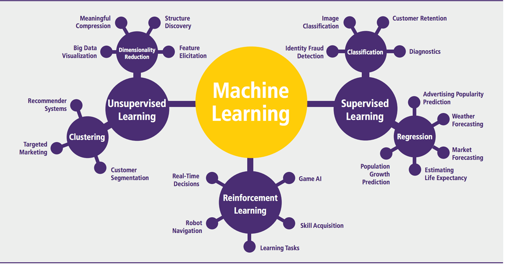

## Table of Contents

## What is machine learning and how does it relate to items?

Machine learning is a type of artificial intelligence where computers learn from data without being specifically programmed to do so. It's like teaching a computer to recognize patterns or make decisions by showing it examples, rather than telling it exactly what to do. For instance, if you want a computer to identify pictures of cats, you would show it many pictures of cats and tell it which ones are cats. Over time, the computer learns what features make a picture a cat, and it can then identify new pictures of cats on its own.

When it comes to items, machine learning can be used to understand and categorize them. For example, in an online shopping platform, machine learning can help sort products into different categories, suggest similar items to customers, or even predict what items a customer might want to buy next based on their past purchases. By analyzing data from many items and their interactions with users, the computer can learn to make these decisions more accurately over time, improving the shopping experience for customers.

## What are the basic types of machine learning algorithms used for item analysis?

The basic types of machine learning algorithms used for item analysis include supervised learning, unsupervised learning, and reinforcement learning. Supervised learning is like a teacher showing the computer examples and telling it the right answers. For instance, if you want to classify items into categories, you would show the computer many items and tell it which category each item belongs to. The computer then learns to predict the category of new items. Unsupervised learning is like letting the computer figure things out on its own. It looks at the items and tries to find patterns or groups without being told what to look for. This can be useful for discovering new ways to organize items that humans might not have thought of.

Reinforcement learning is a bit different. It's like training a pet with rewards and punishments. The computer tries different actions with the items and gets feedback on whether those actions were good or bad. Over time, it learns to choose actions that lead to the best results. For example, a recommendation system might use [reinforcement learning](/wiki/reinforcement-learning) to suggest items to users and learn from their responses which items to suggest more often. Each of these types of algorithms has its own strengths and can be used in different ways to help analyze and understand items better.

## How can machine learning be used to predict item demand?

Machine learning can help predict how many items people will want to buy by looking at past data. For example, if a store sells more umbrellas when it rains, a [machine learning](/wiki/machine-learning) model can learn this pattern. The model uses numbers from old sales to guess future sales. It looks at things like the weather, holidays, and what people bought before. By finding patterns in this data, the model can say, "If it's going to rain next week, we should order more umbrellas."

To make these predictions, machine learning uses special math formulas called algorithms. These algorithms take in lots of data and find the best way to guess future demand. For instance, a simple model might use a formula like $$ \text{Demand} = a \times \text{Weather} + b \times \text{Holidays} + c \times \text{Past Sales} $$. The computer changes the numbers $$a$$, $$b$$, and $$c$$ to make the best guess. This helps stores know how much to order, so they don't run out of items or have too many left over.

## What is the role of data preprocessing in machine learning for items?

Data preprocessing is a big step in machine learning for items. It's like cleaning and organizing your room before you start a project. When you have data about items, like how much they cost or how many were sold, you need to make sure it's ready to use. This means fixing mistakes, filling in missing numbers, and making sure all the data is in the same format. If you don't do this, the computer might get confused and make bad guesses about what people want to buy.

For example, if you have a list of items with their prices, you might find some prices are written in dollars and others in euros. You need to change them all to the same currency. Also, if some items don't have a price listed, you might need to guess a good price based on similar items. This cleaning and organizing helps the machine learning model learn better patterns and make better predictions about item demand. It's like making sure all your tools are ready before you start building something.

## How do you evaluate the performance of a machine learning model for item classification?

To evaluate how well a machine learning model works for classifying items, you need to see how often it gets the right answer. Imagine you're sorting toys into boxes labeled "cars" and "dolls." If the model puts most of the cars in the car box and most of the dolls in the doll box, it's doing a good job. A common way to measure this is by using something called accuracy, which is just the percentage of items the model sorted correctly. If you have 100 items and the model gets 90 right, the accuracy is $$ \frac{90}{100} = 0.9 $$ or 90%.

But accuracy isn't the only way to check how good the model is. Sometimes, you care more about not making certain mistakes. For example, if you're sorting medical supplies, it's really bad if you put a bandage in the box for syringes. In these cases, you might look at other measures like precision and recall. Precision tells you how many of the items the model said were bandages actually were bandages. Recall tells you how many of the real bandages the model found. These measures help you see if the model is good at avoiding the mistakes that matter most to you.

## What are some common challenges when applying machine learning to item data?

One big challenge when using machine learning with item data is dealing with messy data. Items often have missing or wrong information, like a toy missing its price or a book with the wrong author listed. You need to clean this up before you can use it, which can take a lot of time. Also, items can be very different from each other, like comparing apples to oranges. This makes it hard for the computer to find patterns because the data is all over the place. If you're not careful, the model might learn the wrong things and give you bad predictions.

Another challenge is making sure the model works well with new items. Imagine you trained your model on data about toys, but then you want to use it for clothes. The model might not know what to do with clothes because it's never seen them before. This is called the problem of generalization. You need to make sure your model can handle new types of items, which often means collecting more data or using special techniques to help the model learn better. It's like teaching a kid to recognize dogs; if you only show them small dogs, they might not recognize a big dog later.

## How can feature engineering improve machine learning models for items?

Feature engineering is like giving your machine learning model better tools to work with. When you're trying to understand items, you might start with basic information like price and color. But by creating new features, like the ratio of price to quality or the popularity of an item's color, you help the model see the data in new ways. These new features can make the patterns in the data clearer and easier for the model to learn. For example, if you create a feature that shows how often an item is bought during certain months, the model can better predict seasonal demand.

Using feature engineering can really boost how well your model works. It's like turning on a light in a dark room so you can see things better. By carefully choosing and creating features, you can make your model more accurate and able to handle different types of items. For instance, if you're trying to classify items into categories, a feature that combines multiple attributes, like $$ \text{Item Score} = \text{Price} \times \text{Rating} + \text{Sales Volume} $$, can help the model distinguish between similar items more effectively. This way, your model can make better predictions and decisions about items.

## What advanced machine learning techniques can be used for item recommendation systems?

One advanced technique for item recommendation systems is using [deep learning](/wiki/deep-learning), which is like a super smart way of teaching computers to recognize patterns. Deep learning uses something called neural networks, which are made up of layers that can learn from lots of data. For example, if you want to recommend [books](/wiki/algo-trading-books) to people, a deep learning model can look at what books someone has read before, how they rated them, and even the text inside the books to suggest new ones they might like. It's like the model is reading and understanding books just like a human would, but much faster and with more books.

Another technique is called collaborative filtering, which is like asking your friends what they like and using that to find things you might like too. This method looks at what many people have bought or rated and finds patterns in their behavior. If lots of people who bought book A also bought book B, the system might recommend book B to someone who just bought book A. Collaborative filtering can be improved with a technique called matrix factorization, which breaks down the data into simpler parts to find hidden patterns. For example, if you have a table of users and items with their ratings, matrix factorization can help find the underlying reasons why certain users like certain items, making recommendations more accurate.

## How does deep learning enhance item recognition and categorization?

Deep learning makes item recognition and categorization much better by using neural networks, which are like layers of tiny computers that learn from lots of data. Imagine you're teaching a kid to tell apples from oranges. You show them many pictures and tell them which is which. Deep learning does this but with millions of pictures and without getting tired. It can find small details that humans might miss, like the texture of an apple's skin or the shape of an orange's segments. This helps the computer recognize and sort items more accurately, even when the items look a bit different from what it has seen before.

For example, if you want to categorize different types of shoes, a deep learning model can look at pictures of shoes and learn what makes a sneaker different from a boot. It does this by breaking down the image into tiny pieces and figuring out which pieces are important for telling shoes apart. The model can then use this knowledge to sort new shoes into the right categories, even if they are different colors or have slight variations. This makes deep learning very powerful for tasks like organizing items in a store or helping robots pick the right objects in a warehouse.

## What are the ethical considerations in using machine learning for item tracking and surveillance?

Using machine learning for tracking items and watching over people brings up some big ethical questions. One main worry is privacy. When machines keep an eye on what we buy or where we go, it can feel like someone is always watching us. This can make people uncomfortable and worried about their personal information being used in ways they don't want. For example, if a store uses machine learning to track what you buy, they might start showing you ads for things you don't need or even sharing your data with others without asking you first.

Another important thing to think about is fairness. Machine learning models can sometimes make mistakes or treat people unfairly if they learn from biased data. If a model is trained on data that mostly comes from one group of people, it might not work well for others. This can lead to problems like some people being watched more closely than others, or certain groups not getting the same chances to buy things they need. It's important to make sure these systems are fair and don't harm anyone, which means checking the data they use and how they make decisions.

## How can machine learning models for items be optimized for real-time processing?

To make machine learning models for items work quickly in real time, you need to think about how fast the computer can process data. One way to do this is by using smaller, simpler models that can make decisions faster. These models might not be as accurate as bigger ones, but they can handle data quickly. For example, if you're using a model to suggest items to customers as they shop online, a smaller model can give suggestions almost instantly. Another way is to use special computer chips called GPUs, which are really good at doing the math needed for machine learning. By using GPUs, you can process data much faster and keep up with real-time demands.

Another important thing is to make sure the data is ready to use right away. This means doing things like cleaning the data and turning it into numbers before it even reaches the model. If you can do this preprocessing step quickly, the model can start working on the data without waiting. Also, you can use something called "streaming data" where the model looks at data as it comes in, instead of waiting for all the data to be collected. This helps the model make decisions in real time, like suggesting items to a customer while they are still shopping. By combining these methods, you can make sure your machine learning model for items works quickly and efficiently.

## What future trends are expected in the application of machine learning to items?

In the future, machine learning will become even better at understanding items. One big trend will be using more advanced deep learning models to recognize and categorize items in real time. These models will be able to look at pictures or videos of items and tell what they are, even if they are moving or partly hidden. This will be really helpful in places like stores or warehouses, where robots can pick up items faster and more accurately. Another trend will be using machine learning to predict what items people will want to buy. By looking at more data, like social media trends and weather forecasts, the models can guess demand better. This will help stores order the right amount of items and reduce waste.

Another exciting trend is the use of machine learning for personalized item recommendations. As models get better at understanding what each person likes, they will suggest items that are more likely to be bought. This will make shopping more fun and useful for people. Also, machine learning will help with sustainability by figuring out how to reuse or recycle items better. By looking at the materials and life cycles of items, models can suggest ways to make things last longer or be used again. These trends will make our lives easier and help take care of the planet at the same time.

## References & Further Reading

[1]: Bishop, C. M. (2006). ["Pattern Recognition and Machine Learning"](https://www.cs.uoi.gr/~arly/courses/ml/tmp/Bishop_book.pdf). Springer.

[2]: Hastie, T., Tibshirani, R., & Friedman, J. (2009). ["The Elements of Statistical Learning: Data Mining, Inference, and Prediction"](https://link.springer.com/book/10.1007/978-0-387-84858-7). Springer.

[3]: Russell, S. J., & Norvig, P. (2010). ["Artificial Intelligence: A Modern Approach"](https://api.pageplace.de/preview/DT0400.9781292401171_A41586057/preview-9781292401171_A41586057.pdf) (3rd ed.). Pearson.

[4]: Goodfellow, I., Bengio, Y., & Courville, A. (2016). ["Deep Learning"](https://link.springer.com/article/10.1007/s10710-017-9314-z). MIT Press.

[5]: Murphy, K. P. (2012). ["Machine Learning: A Probabilistic Perspective"](https://www.cs.ubc.ca/~murphyk/MLbook/pml-toc-1may12.pdf). MIT Press.

[6]: Silver, D., et al. (2016). ["Mastering the game of Go with deep neural networks and tree search."](https://www.nature.com/articles/nature16961) Nature, 529(7587), 484-489.

[7]: Kelleher, J. D., Namee, B. M., & D’Arcy, A. (2015). ["Fundamentals of Machine Learning for Predictive Data Analytics: Algorithms, Worked Examples, and Case Studies"](https://mitpress.mit.edu/9780262029445/fundamentals-of-machine-learning-for-predictive-data-analytics/). MIT Press.