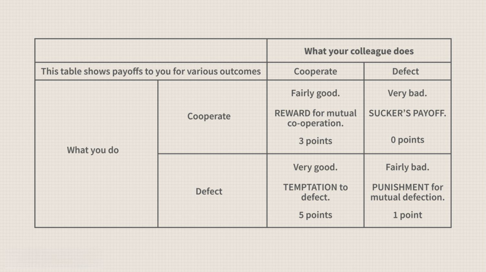

## Table of Contents

## What is the Prisoner's Dilemma?

The Prisoner's Dilemma is a famous problem in game theory that shows how two people might not work together even if it's in their best interest. Imagine two people, let's call them Alice and Bob, who are caught by the police for a crime. The police don't have enough evidence to convict them of the big crime, but they can convict them of a smaller crime. The police separate Alice and Bob and offer each of them a deal: if one confesses and the other stays silent, the one who confesses goes free and the other gets a long prison sentence. If both confess, they both get a medium sentence. If both stay silent, they both get a short sentence for the smaller crime.

The dilemma comes because each person has to decide without knowing what the other will do. If Alice thinks Bob might confess, she might confess too to avoid the long sentence. But if Bob thinks the same way, they both end up confessing and getting the medium sentence. Even though they would be better off if they both stayed silent, the fear of the other person confessing can make them choose to confess. This shows how individual choices can lead to a worse outcome for everyone.

## How does the Iterated Prisoner's Dilemma differ from the classic version?

The Iterated Prisoner's Dilemma is different from the classic version because it involves playing the game many times instead of just once. In the classic version, Alice and Bob make their choice once and then the game is over. But in the iterated version, they play the game over and over again. This means they can see what the other person did in the last round and use that information to decide what to do in the next round.

Because the game is played many times, Alice and Bob might start to work together more. If Alice sees that Bob always stays silent, she might decide to stay silent too, because she knows they will both get a short sentence each time. This can lead to a better outcome for both of them over many rounds. The iterated version shows that trust and cooperation can grow over time, which is different from the classic version where they might not trust each other at all.

## What are the basic strategies in the Iterated Prisoner's Dilemma?

In the Iterated Prisoner's Dilemma, one basic strategy is called "Tit for Tat." This strategy starts by cooperating (staying silent) in the first round. After that, it does whatever the other player did in the last round. If the other player cooperated last time, it cooperates this time. If the other player defected (confessed) last time, it defects this time. This strategy is simple and can encourage cooperation because it rewards the other player for cooperating and punishes them for defecting.

Another strategy is "Always Cooperate," where a player always chooses to cooperate no matter what the other player does. This can lead to good results if the other player also cooperates, but it can be risky if the other player always defects. On the other hand, "Always Defect" is a strategy where a player always chooses to defect. This can protect the player from getting a long sentence if the other player defects, but it can also lead to both players getting medium sentences if the other player also defects.

A more complex strategy is "Pavlov," also known as "Win-Stay, Lose-Shift." In this strategy, a player keeps doing the same thing if it worked well last time (both cooperated or both defected), but switches if it didn't work well (one cooperated and the other defected). This strategy tries to adapt to what the other player is doing and can lead to cooperation if both players use it.

## Can you explain the 'Tit for Tat' strategy and its effectiveness?

The 'Tit for Tat' strategy in the Iterated Prisoner's Dilemma is simple but effective. It starts by cooperating in the first round. After that, it does whatever the other player did in the last round. If the other player cooperated last time, 'Tit for Tat' cooperates this time. If the other player defected last time, 'Tit for Tat' defects this time. This strategy is easy to understand and follow, which makes it very practical.

'Tit for Tat' is effective because it encourages cooperation. It shows the other player that if they cooperate, 'Tit for Tat' will cooperate too. This can lead to both players getting good results over many rounds. But if the other player tries to take advantage by defecting, 'Tit for Tat' will defect back, which punishes the other player for not cooperating. This balance of reward and punishment helps build trust and cooperation over time.

## What is the 'Grim Trigger' strategy and when is it used?

The 'Grim Trigger' strategy is another way to play the Iterated Prisoner's Dilemma. It starts by always cooperating in the beginning. But if the other player ever defects, even just once, 'Grim Trigger' will always defect from then on, no matter what the other player does later. It's like a strict rule that never forgives.

This strategy can be good at stopping the other player from trying to cheat. If the other player knows about 'Grim Trigger,' they might be scared to defect because they know it will lead to bad results for a long time. But it can also be risky because if the other player defects by mistake or just once, both players will end up with bad results forever. So, 'Grim Trigger' works best when players want to make sure the other player never tries to cheat, but it can lead to a lot of bad results if used in the wrong situation.

## How does the 'Pavlov' strategy work in the Iterated Prisoner's Dilemma?

The 'Pavlov' strategy, also known as 'Win-Stay, Lose-Shift,' is a way to play the Iterated Prisoner's Dilemma. It's all about sticking with what works and changing what doesn't. If both players did the same thing last round and it worked out well - like both cooperating or both defecting - 'Pavlov' keeps doing the same thing. But if it didn't work out well - like one player cooperated and the other defected - 'Pavlov' switches to the other choice.

This strategy can be good because it tries to adapt to what the other player is doing. If both players use 'Pavlov,' it can lead to a lot of cooperation because they will keep cooperating as long as it's working. But if the other player keeps switching between cooperating and defecting, 'Pavlov' might have a hard time figuring out what to do and end up with worse results.

## What are some advanced strategies used in tournaments of the Iterated Prisoner's Dilemma?

In tournaments of the Iterated Prisoner's Dilemma, players often use advanced strategies to try to do better than others. One such strategy is called 'Forgiving Tit for Tat.' It's like the regular 'Tit for Tat,' but it gives the other player a second chance. If the other player defects, 'Forgiving Tit for Tat' defects back, but then it goes back to cooperating after one round of defecting. This can help build cooperation again if the other player made a mistake or tried to cheat just once.

Another advanced strategy is 'Tit for Two Tats.' This strategy only defects if the other player defects twice in a row. It's more forgiving than 'Tit for Tat' because it gives the other player more chances to cooperate before it starts defecting. This can help keep cooperation going even if there are a few mistakes or small tries to cheat. Both of these strategies show how players can be more flexible and forgiving to encourage better results for everyone in the long run.

## How do evolutionary dynamics influence strategy selection in the Iterated Prisoner's Dilemma?

Evolutionary dynamics in the Iterated Prisoner's Dilemma help decide which strategies do well over time. Imagine a big group of players using different strategies. Those who do better in the game - by getting more points or shorter sentences - will have more 'children' or copies of their strategies. Over many rounds, strategies that work well become more common, and those that don't work well become less common. This is like how animals evolve in nature, where the best ones survive and have more babies.

In this game, strategies like 'Tit for Tat' often do well because they encourage cooperation. If a lot of players use 'Tit for Tat,' they will cooperate with each other and do better than those who always defect. But if too many players start to always defect, then 'Tit for Tat' players might not do as well. So, the mix of strategies can change over time as players learn from each other and try to do better. This shows how the game can evolve, with different strategies becoming more or less popular depending on what works best at the time.

## What role does memory play in strategy development for the Iterated Prisoner's Dilemma?

Memory is really important in the Iterated Prisoner's Dilemma because it helps players remember what the other player did before. This lets them make better choices in the next round. For example, if a player remembers that the other player cooperated last time, they might decide to cooperate too. This can help build trust and make both players do better over many rounds. Without memory, players would have to guess what to do each time, which could lead to more mistakes and less cooperation.

Different strategies use memory in different ways. 'Tit for Tat' uses memory to copy what the other player did last time. 'Grim Trigger' uses memory to remember if the other player ever defected, and if they did, it always defects after that. 'Pavlov' uses memory to see if what it did last time worked well, and if it didn't, it changes its choice. These strategies show how memory can help players adapt and do better in the game. By remembering past moves, players can make smarter choices and work together more often.

## Can you discuss the impact of noise or errors on strategies in the Iterated Prisoner's Dilemma?

Noise or errors can make the Iterated Prisoner's Dilemma harder to play. Imagine if sometimes players accidentally do the wrong thing, like meaning to cooperate but ending up defecting by mistake. This can mess up strategies that depend a lot on remembering what the other player did last time. For example, 'Tit for Tat' might start to defect if it sees the other player defect, even if that was just a mistake. This can lead to a cycle of both players defecting even though they want to cooperate.

Some strategies are better at dealing with noise than others. 'Forgiving Tit for Tat' is good because it goes back to cooperating after one round of defecting. This means if there's a mistake, it can quickly start cooperating again. On the other hand, 'Grim Trigger' can be really bad with noise because it never forgives a defection, even if it was just an error. So, strategies that can handle mistakes and still work towards cooperation do better when there's noise or errors in the game.

## How have machine learning and AI been applied to develop strategies for the Iterated Prisoner's Dilemma?

Machine learning and AI have been used to create new strategies for the Iterated Prisoner's Dilemma by letting computers learn from lots of games. These computers can try out different ways of playing and see which ones work best. Over time, they can find strategies that do better than the ones people came up with before. For example, AI can use something called [reinforcement learning](/wiki/reinforcement-learning), where it gets rewards for good moves and tries to make more of those moves in the future. This helps the AI figure out the best way to play against different kinds of opponents.

One cool thing about using AI is that it can find strategies that are really good at working with other strategies. For example, AI might find a way to play that can cooperate with 'Tit for Tat' but also do well against players who always defect. This makes the AI very flexible and able to do well no matter who it's playing against. By using [machine learning](/wiki/machine-learning), we can keep finding new and better ways to play the Iterated Prisoner's Dilemma, which helps us understand more about how people and computers can work together or compete.

## What are some real-world applications or examples where Iterated Prisoner's Dilemma strategies have been observed or implemented?

The Iterated Prisoner's Dilemma helps us understand how people work together in real life. One example is in business, where companies have to decide whether to work with each other or try to get ahead on their own. If two companies both cooperate, they can both make more money. But if one company tries to cheat and the other doesn't, the cheating company might make more money in the short term, but it could ruin their relationship in the long run. This is a lot like the Iterated Prisoner's Dilemma, where companies might use strategies like 'Tit for Tat' to build trust and work together over time.

Another real-world example is in international relations, where countries have to decide whether to cooperate on things like trade or environmental agreements. If countries work together, they can all benefit. But if one country tries to cheat or not follow the rules, it can harm the others. Countries might use strategies from the Iterated Prisoner's Dilemma to decide how to act. For example, a country might start by cooperating and then watch to see if others do the same. If they see cheating, they might start to not cooperate back, just like in the game. This shows how the Iterated Prisoner's Dilemma can help explain and guide real-world decisions.

## References & Further Reading

[1]: Axelrod, R. (1984). ["The Evolution of Cooperation."](https://ee.stanford.edu/~hellman/Breakthrough/book/pdfs/axelrod.pdf) Basic Books.

[2]: Luce, R. D., & Raiffa, H. (1957). ["Games and Decisions: Introduction and Critical Survey."](https://archive.org/details/gamesdecisions00rdun) Dover Publications.

[3]: Aumann, R. J., & Maschler, M. (1995). ["Repeated Games with Incomplete Information."](https://mitpress.mit.edu/9780262526265/repeated-games-with-incomplete-information/) MIT Press.

[4]: Lopez de Prado, M. (2018). ["Advances in Financial Machine Learning."](https://www.amazon.com/Advances-Financial-Machine-Learning-Marcos/dp/1119482089) Wiley.

[5]: Chan, E. P. (2009). ["Quantitative Trading: How to Build Your Own Algorithmic Trading Business."](https://github.com/ftvision/quant_trading_echan_book) Wiley.

[6]: Jansen, S. (2019). ["Machine Learning for Algorithmic Trading."](https://github.com/stefan-jansen/machine-learning-for-trading) Packt Publishing.