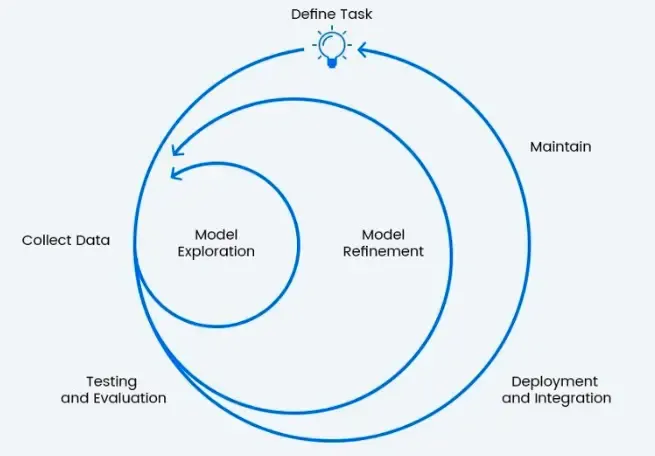

## Table of Contents

## What is iteration in the context of machine learning?

Iteration in machine learning refers to the process of repeatedly refining a model to improve its performance. When training a machine learning model, data is fed into the model multiple times, and with each iteration, the model adjusts its parameters to better fit the data. This repetitive process helps the model learn from its mistakes and gradually improve its predictions or classifications.

Think of iteration like practicing a skill. Just as you might practice throwing a ball to get better at it, a machine learning model practices on data to get better at making predictions. Each iteration is like another practice throw, where the model learns a bit more about the data and adjusts its approach. Over many iterations, the model becomes more accurate and reliable, much like how a person improves with practice.

## Why is iteration important in machine learning?

Iteration is important in machine learning because it helps the model learn and improve over time. When a model first starts, it might not be very good at making predictions. But as it goes through more iterations, it gets to see the data again and again. Each time, it can adjust its understanding a bit more, like a student learning from repeated lessons. This process allows the model to fine-tune its parameters, making its predictions more accurate with each pass.

Without iteration, a model would only get one chance to learn from the data, which wouldn't be enough to understand complex patterns. For example, if you're trying to teach a model to recognize pictures of cats and dogs, it needs to see many examples and make mistakes to learn what features distinguish them. Through iterations, the model can gradually reduce its errors and become better at identifying the right features. This repeated practice is what makes machine learning models so powerful and effective in solving real-world problems.

## How does iteration help in improving model performance?

Iteration helps improve model performance by allowing the model to learn from its mistakes over time. When a model is trained, it makes predictions based on the data it sees. If the predictions are wrong, the model uses this feedback to adjust its internal parameters. Each iteration gives the model another chance to see the data and make better adjustments. This process is like practicing a skill; the more you practice, the better you get. Over many iterations, the model's predictions become more accurate because it has learned from its previous errors.

For example, imagine you're teaching a model to recognize pictures of apples and oranges. At first, the model might confuse the two because it hasn't seen enough examples. But as it goes through more iterations, it sees more pictures and gets feedback on its mistakes. It learns to focus on the right features, like the color and shape of the fruits. With each iteration, the model gets a little better at telling apples and oranges apart. This repeated practice helps the model become more reliable and accurate in its predictions.

## What are the common methods used for iteration in machine learning?

In [machine learning](/wiki/machine-learning), one common method for iteration is called gradient descent. This method works by adjusting the model's parameters little by little to minimize the error in its predictions. Imagine you're trying to find the lowest point in a valley by walking downhill. Each step you take represents an iteration, and you keep walking until you reach the bottom. In gradient descent, the model does something similar, taking small steps in the direction that reduces the error the most. The size of these steps can be controlled by a parameter called the learning rate, which decides how fast the model learns.

Another method is called stochastic gradient descent (SGD). This is a variation of gradient descent where the model looks at just one or a few examples at a time instead of the whole dataset. This makes each iteration faster because the model doesn't have to process all the data at once. It's like getting quick feedback on your work rather than waiting until the end of a big project. SGD can help the model learn more quickly and can be especially useful when working with very large datasets.

A third method is mini-batch gradient descent, which combines the benefits of both gradient descent and SGD. Instead of using the entire dataset or just one example, mini-batch gradient descent uses a small, random subset of the data for each iteration. This approach strikes a balance between the speed of SGD and the stability of full gradient descent. By using mini-batches, the model can make more consistent updates and still process data efficiently. This method is often used in training [deep learning](/wiki/deep-learning) models, where large datasets and complex models are common.

## Can you explain the concept of iterative learning algorithms?

Iterative learning algorithms are like learning a new skill through practice. Imagine you're learning to play the piano. You don't become good at it after just one try. Instead, you practice the same piece over and over, and each time you play it, you get a little better. That's what iterative learning algorithms do. They go through the data multiple times, making small adjustments each time to get better at making predictions. With each iteration, the algorithm learns from its mistakes and improves its performance.

One common way these algorithms work is through a method called gradient descent. It's like trying to find the lowest point in a valley by always walking downhill. Each step you take is an iteration, and you keep going until you reach the bottom. In gradient descent, the algorithm adjusts its parameters a little bit at a time to reduce the error in its predictions. The size of these steps is controlled by something called the learning rate, which decides how fast the algorithm learns. By doing this over and over, the algorithm can find the best way to make accurate predictions.

## How does the iterative process work in training a machine learning model?

The iterative process in training a machine learning model is like practicing a new skill. Imagine you're learning to throw a ball. You don't get it right on the first try, so you keep throwing it over and over. Each time you throw, you learn a bit more about how to do it better. In the same way, a machine learning model goes through the data many times. Each time it sees the data, it tries to make better predictions by adjusting its internal settings, called parameters. This repeated practice helps the model learn from its mistakes and improve its accuracy.

In more technical terms, the iterative process often uses a method called gradient descent. This method is like finding the lowest point in a valley by always walking downhill. Each step you take is an iteration, and you keep going until you reach the bottom. In gradient descent, the model adjusts its parameters a little bit at a time to minimize the error in its predictions. The size of these steps is controlled by something called the learning rate, which decides how fast the model learns. By doing this over and over, the model can find the best way to make accurate predictions. This iterative process is what makes machine learning models so powerful and effective in solving real-world problems.

## What are the differences between batch and iterative learning?

Batch learning and iterative learning are two different approaches to training a machine learning model. In batch learning, the model looks at all the data at once to make its predictions. It's like studying for a test by reading the whole textbook in one sitting. The model goes through the entire dataset, makes its predictions, and then adjusts its parameters based on how well it did. This method can be good for smaller datasets because it uses all the information available at once, but it can be slow and memory-intensive for very large datasets.

On the other hand, iterative learning breaks the data into smaller pieces and looks at them one at a time or in small groups. It's like studying for a test by going through the material a little bit each day. The model sees a piece of data, makes a prediction, and then adjusts its parameters before moving on to the next piece. This method is often faster and more efficient, especially for large datasets, because it doesn't need to keep all the data in memory at once. Iterative learning allows the model to learn continuously and can be more adaptable to new data as it comes in.

## How can overfitting be managed during iterative processes?

Overfitting happens when a machine learning model learns the training data too well, including its noise and errors. This makes the model perform great on the training data but poorly on new data it hasn't seen before. To manage overfitting during iterative processes, one common method is to use a technique called regularization. Regularization adds a penalty to the model's complexity, encouraging it to keep its parameters small. This helps the model focus on the most important patterns in the data instead of fitting to every little detail. For example, in linear regression, you might use L2 regularization, which adds a term to the loss function like $$ \lambda \sum_{i=1}^{n} \theta_i^2 $$ where $$ \lambda $$ is a hyperparameter that controls the strength of the regularization.

Another way to manage overfitting is by using a validation set. During the iterative process, the model is trained on the training data but periodically checked on a separate validation set. If the model's performance on the validation set starts to get worse while it improves on the training set, it's a sign that overfitting might be happening. You can then stop the training early, a technique known as early stopping. This helps the model generalize better to new data by not allowing it to overfit to the training data. By carefully monitoring the model's performance on both the training and validation sets, you can find the right balance and prevent overfitting during the iterative learning process.

## What role does cross-validation play in iterative machine learning?

Cross-validation plays a crucial role in iterative machine learning by helping to assess how well a model will perform on new data. It does this by splitting the available data into different subsets, or "folds," and using some of these folds for training and the others for testing. This process is repeated multiple times, with different combinations of folds used for training and testing each time. By doing this, cross-validation gives a more reliable estimate of the model's performance than just using a single train-test split. It helps to ensure that the model isn't just overfitting to one particular set of data but can generalize well to new, unseen data.

During the iterative process of training a machine learning model, cross-validation can be used to fine-tune the model's hyperparameters. For example, if you're using a method like gradient descent, you might want to adjust the learning rate $$ \alpha $$ to see how it affects the model's performance. By running cross-validation with different values of $$ \alpha $$, you can find the one that gives the best results across all the folds. This helps to make sure that the model isn't just performing well on the training data but will also do well on new data. Cross-validation thus plays a key role in making the iterative learning process more effective and reliable.

## How do you determine when to stop the iteration process in machine learning?

Deciding when to stop the iteration process in machine learning is important to make sure your model is good but not overfitted. One way to do this is by using a technique called early stopping. During the training, you keep an eye on how well the model is doing on a separate set of data called the validation set. If you see that the model's performance on the validation set stops getting better or starts getting worse, even though it's still improving on the training set, it's a sign that you should stop the training. This helps the model to not learn the training data too well and keeps it from overfitting.

Another way to decide when to stop is by setting a maximum number of iterations or epochs. You can choose a number, say 1000, and let the model train for that many iterations. If the model's performance is good enough by then, you can stop it. Sometimes, you might also use a threshold for the model's error or loss. For example, if the loss on the validation set drops below a certain level, like $$ \text{loss} < 0.01 $$, you can stop the training because the model is doing well enough. By using these methods, you can make sure the model stops training at the right time to perform well on new data.

## What advanced techniques can be used to optimize the iteration process in machine learning?

One advanced technique to optimize the iteration process in machine learning is called learning rate scheduling. This technique involves changing the learning rate $$ \alpha $$ during training to make the model learn faster and more efficiently. At the beginning of training, a higher learning rate can help the model make big steps and quickly find a good direction. But as training goes on, a lower learning rate can help the model fine-tune its parameters and get more precise. There are different ways to schedule the learning rate, like reducing it by a fixed amount after a certain number of iterations or using a more complex method like cyclical learning rates, where the learning rate goes up and down in a cycle.

Another technique is called batch normalization. This method helps the model learn more smoothly by normalizing the inputs to each layer. During training, the model can sometimes have trouble because the data changes a lot from one iteration to the next. Batch normalization fixes this by making the data more consistent, which helps the model learn faster and more reliably. It does this by subtracting the mean and dividing by the standard deviation for each mini-batch of data. This way, the model can focus on learning the important patterns in the data without being thrown off by changes in the scale or distribution of the inputs.

A third technique is the use of adaptive optimization algorithms like Adam or RMSprop. These algorithms automatically adjust the learning rate for each parameter based on how much that parameter is changing during training. For example, Adam combines the ideas of [momentum](/wiki/momentum), which helps the model keep moving in a good direction, and adaptive learning rates, which help the model learn at the right speed for each parameter. This makes the iteration process more efficient because the model can learn quickly where it needs to and more slowly where it doesn't, leading to better performance and faster convergence.

## Can you discuss case studies where iterative approaches significantly improved machine learning models?

In one case study, a team at a tech company was working on improving a recommendation system for an online shopping platform. They started with a basic model that used user behavior data to suggest products. However, the initial model's performance was not great, and it often recommended items that users were not interested in. The team decided to use an iterative approach with gradient descent to refine the model. They broke the data into smaller batches and used mini-batch gradient descent to train the model. Over many iterations, they adjusted the learning rate $$ \alpha $$ to find the right balance between speed and accuracy. After several rounds of iteration, the model's performance improved significantly, leading to more relevant product recommendations and higher user satisfaction.

Another case study involved a healthcare company developing a model to predict patient readmissions. The initial model was trained on a large dataset but was overfitting, meaning it performed well on the training data but poorly on new data. The team implemented an iterative approach using cross-validation to assess the model's performance more accurately. They used k-fold cross-validation, where the data was split into k subsets, and the model was trained and tested k times, each time using a different subset for validation. This helped them identify when the model was overfitting and allowed them to use early stopping to halt the training at the right time. As a result, the model's ability to predict patient readmissions improved, helping the healthcare company better manage patient care and reduce unnecessary hospital stays.

## References & Further Reading

[1]: Goodfellow, I., Bengio, Y., & Courville, A. (2016). ["Deep Learning."](https://link.springer.com/article/10.1007/s10710-017-9314-z) MIT Press.

[2]: Bottou, L. (2010). ["Large-Scale Machine Learning with Stochastic Gradient Descent."](http://leon.bottou.org/publications/pdf/compstat-2010.pdf) Proceedings of the 19th International Conference on Computational Statistics (COMPSTAT).

[3]: Ruder, S. (2016). ["An overview of gradient descent optimization algorithms."](https://arxiv.org/abs/1609.04747) arXiv preprint arXiv:1609.04747.

[4]: Ng, A. Y. (2004). ["Feature selection, L1 vs. L2 regularization, and rotational invariance."](https://dl.acm.org/doi/10.1145/1015330.1015435) Proceedings of the 21st International Conference on Machine Learning (ICML).

[5]: Bishop, C. M. (2006). ["Pattern Recognition and Machine Learning."](https://www.cs.uoi.gr/~arly/courses/ml/tmp/Bishop_book.pdf) Springer.