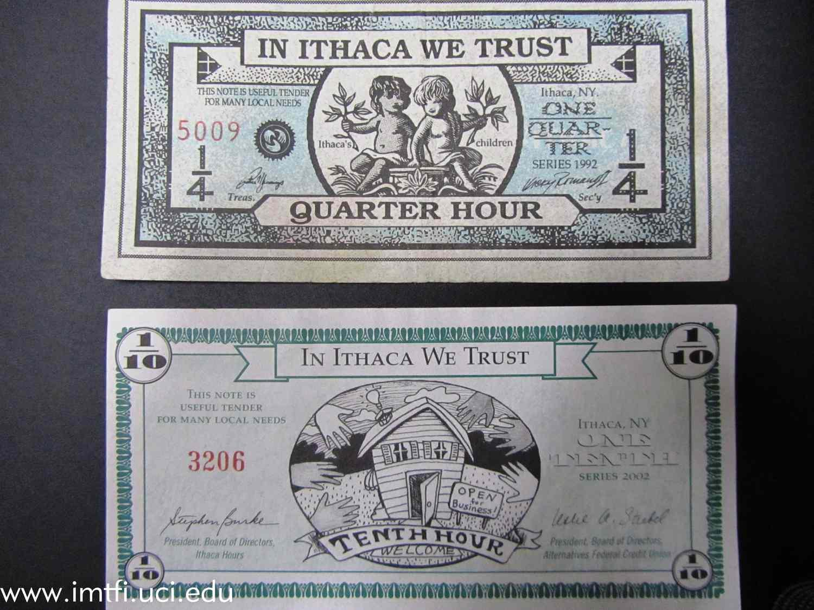

## Table of Contents

## What are Ithaca HOURS?

Ithaca HOURS is a type of local currency used in Ithaca, New York. It was started in 1991 by Paul Glover to help the local economy. One HOUR is equal to one hour of basic labor. People can earn HOURS by working and then spend them at local businesses that accept them. This helps keep money within the community.

Using Ithaca HOURS can encourage people to buy things locally instead of from big stores outside the area. This can help small businesses grow and create more jobs. It also brings people together because they have to work together to make the system work. Even though it's not used as much now, it shows how local currencies can help communities.

## Who created Ithaca HOURS and when were they introduced?

Ithaca HOURS were created by a man named Paul Glover. He started this local money system in Ithaca, New York, back in 1991. Paul wanted to help the local economy by making a currency that people could earn and spend right in their own community.

The idea behind Ithaca HOURS is simple. One HOUR is worth one hour of basic work. People can get HOURS by doing jobs and then use them to buy things from local shops that accept them. This helps keep money in Ithaca and supports small businesses.

## How are Ithaca HOURS used in the local economy?

Ithaca HOURS are used in the local economy to help people buy things from shops and businesses right in Ithaca, New York. People can earn HOURS by doing work, like helping at a store or doing a job for someone. Each HOUR is worth one hour of basic work. Once someone has HOURS, they can spend them at places that accept them, like local stores, restaurants, and even some services. This means that the money stays in the community and helps local businesses grow.

Using Ithaca HOURS also encourages people to support their neighbors and local economy. When people use HOURS, they are more likely to shop at small businesses instead of big stores outside of Ithaca. This can help create more jobs and keep the community strong. Even though Ithaca HOURS are not used as much today, they show how a local currency can bring people together and help the local economy.

## What is the value of one Ithaca HOUR?

One Ithaca HOUR is worth one hour of basic work. This means if you work for an hour doing a simple job, you earn one HOUR. It's a way to measure the value of work in the community.

People in Ithaca, New York, can use these HOURS to buy things from local shops and businesses that accept them. This helps keep money in the community and supports local jobs and businesses.

## How can someone earn Ithaca HOURS?

Someone can earn Ithaca HOURS by doing work for people or businesses in Ithaca, New York. If you help out at a local store, do some gardening, or provide a service like tutoring, you can get paid in HOURS. Each HOUR you earn is worth one hour of basic work. This means if you work for an hour, you get one HOUR.

People in the community can offer their skills and time to earn HOURS. For example, if you're good at fixing bikes, you might fix someone's bike and get paid in HOURS. This way, you're helping others and [earning](/wiki/earning-announcement) a local currency that you can use to buy things from other local businesses. It's all about trading time and skills within the community.

## Where can Ithaca HOURS be spent?

Ithaca HOURS can be spent at many places in Ithaca, New York. You can use them at local shops, restaurants, and even some services that accept them. If a business has a sign saying they take HOURS, you can use your HOURS to buy things there.

Using HOURS helps keep money in the community. When you spend HOURS at a local store, that store can use those HOURS to pay for things they need, like fixing their building or buying supplies. This way, the money stays in Ithaca and helps everyone.

## How does the system ensure the stability of Ithaca HOURS?

The system of Ithaca HOURS tries to keep things stable by making sure that the amount of HOURS in the community matches the work people do. When someone earns an HOUR, it's because they did an hour of work. This keeps the value of an HOUR steady because it's always worth the same amount of work. If too many HOURS were given out without work, they might lose value, but the system tries to avoid that by linking HOURS to real work.

Another way the system helps keep Ithaca HOURS stable is by having a lot of local businesses accept them. When more places take HOURS, people feel confident using them because they know they can spend them easily. This makes HOURS more useful and helps keep their value steady. Even though the use of Ithaca HOURS has gone down over time, the idea of linking them to work and having many places accept them has helped keep them stable while they were widely used.

## What are the benefits of using Ithaca HOURS for local businesses?

Using Ithaca HOURS can help local businesses in Ithaca, New York, in many ways. When people spend HOURS at local shops, the money stays in the community. This means that businesses can use those HOURS to pay for things they need, like fixing their building or buying supplies from other local businesses. This helps keep the local economy strong and supports other small businesses in the area.

Another benefit is that Ithaca HOURS can bring more customers to local businesses. When people earn HOURS by doing work in the community, they are more likely to spend those HOURS at nearby shops and restaurants. This can help businesses attract new customers who might not have come in otherwise. It also encourages people to shop locally instead of going to big stores outside of Ithaca, which can help small businesses grow and create more jobs.

## How do Ithaca HOURS impact the broader economic system?

Ithaca HOURS can help the local economy by keeping money within the community. When people earn and spend HOURS at local shops, it means that the money stays in Ithaca instead of going to big stores outside the area. This can help small businesses grow and create more jobs. It also encourages people to support their neighbors and local economy, which can make the community stronger.

On a broader scale, Ithaca HOURS show how local currencies can work. They can inspire other communities to start their own local money systems. This can lead to more people thinking about how to support their local economies. Even though Ithaca HOURS are not used as much now, they have shown that local currencies can help communities work together and keep money where it can do the most good.

## What challenges have been faced in the implementation and use of Ithaca HOURS?

Using Ithaca HOURS has faced some challenges. One big problem is that not enough people and businesses use them. If only a few places accept HOURS, it's hard for people to spend them. This can make people less interested in earning and using HOURS. Also, people might not trust HOURS as much as regular money. They might worry that HOURS won't be worth as much or that they won't be able to use them everywhere.

Another challenge is keeping the value of HOURS stable. If too many HOURS are given out without matching work, they could lose value. This makes it hard to keep HOURS worth the same as an hour of work. Also, as fewer people use HOURS, it can be harder for businesses to find things they need to buy with HOURS. This can make businesses less likely to accept them, which makes the problem even bigger.

Even with these challenges, Ithaca HOURS have shown that local currencies can help communities. They encourage people to work together and support local businesses. But to keep working well, more people and businesses need to use them, and the system needs to keep the value of HOURS steady.

## How do Ithaca HOURS compare to other local currencies?

Ithaca HOURS are similar to other local currencies because they all aim to help the local economy. Like Ithaca HOURS, other local currencies are used in small areas to keep money within the community. People earn these currencies by doing work, and then they can spend them at local shops and businesses. This helps small businesses grow and creates more jobs. Some examples of other local currencies are the Bristol Pound in the UK and the Chiemgauer in Germany. These currencies work in similar ways, encouraging people to support their local economy.

However, there are some differences between Ithaca HOURS and other local currencies. One big difference is how they keep their value. Ithaca HOURS are worth one hour of basic work, which helps keep their value steady. Some other local currencies might have different ways to manage their value, like using a fixed exchange rate with regular money. Also, the success of a local currency can depend on how many people and businesses use it. Ithaca HOURS have faced challenges because fewer people use them now, while some other local currencies, like the Bristol Pound, have more users and are more widely accepted. This can make a big difference in how well a local currency works.

## What future developments are anticipated for Ithaca HOURS?

The future of Ithaca HOURS could see a few changes. One possibility is that more people and businesses might start using them again if there's a big push to support the local economy. If more shops accept HOURS, it could make them more useful and encourage people to earn and spend them. Another idea is using technology to make it easier to use HOURS. For example, having an app or a card that people can use instead of paper HOURS could make them more popular.

However, there are also challenges that could affect the future of Ithaca HOURS. If not enough people use them, they might keep losing value and become less useful. Also, if people don't trust HOURS as much as regular money, it will be hard to get more users. To keep HOURS going strong, the community might need to work together to find new ways to make them work better and keep their value steady.

## References & Further Reading

[1]: Glover, R. (1994). *Ithaca HOURS: The Story of the Local Currency*.

[2]: Collom, E. (2011). "Motivations and Differential Use of Time Bank Participants in the United States: Exploring the Role of Community and Economic Significance." Community Development. Academic Journals.

[3]: Bergstra, J., Bardenet, R., Bengio, Y., & Kégl, B. (2011). ["Algorithms for Hyper-Parameter Optimization."](https://dl.acm.org/doi/10.5555/2986459.2986743) Advances in Neural Information Processing Systems 24.

[4]: ["Advances in Financial Machine Learning"](https://www.amazon.com/Advances-Financial-Machine-Learning-Marcos/dp/1119482089) by Marcos Lopez de Prado

[5]: ["Machine Learning for Algorithmic Trading"](https://github.com/stefan-jansen/machine-learning-for-trading) by Stefan Jansen