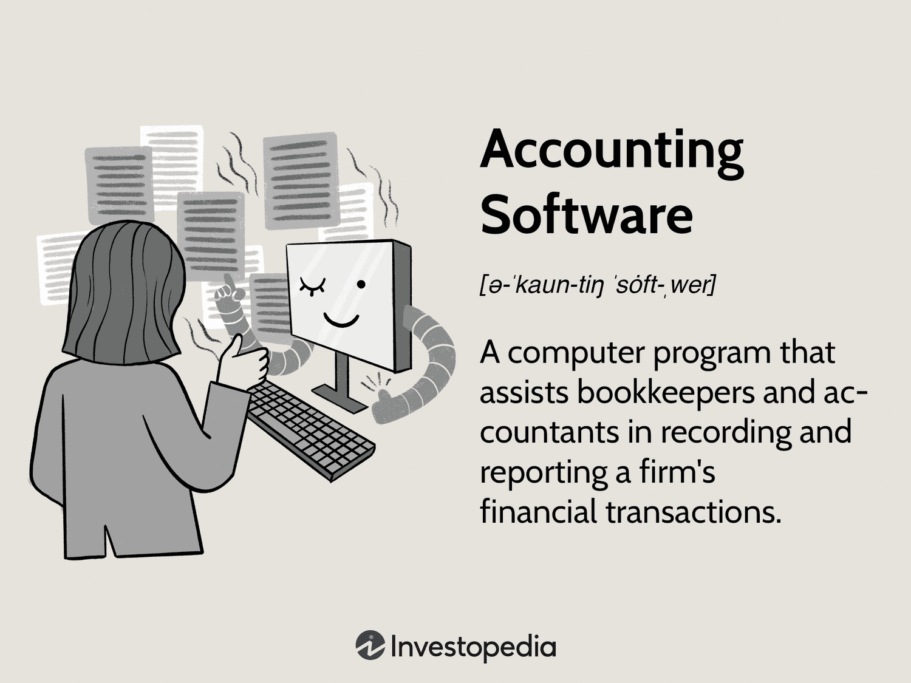

In the world of financial technology, Itiviti emerges as a prominent provider of trading software solutions. The company specializes in trading execution, risk management, and connectivity, establishing itself as a pivotal player in enabling algorithmic trading across global capital markets. Algorithmic trading, or algo trading, involves the use of complex algorithms to execute trades at speeds and frequencies beyond human capacity. Itiviti's platforms are precisely designed to accommodate these sophisticated strategies, enhancing liquidity and minimizing human error in trading processes.

Itiviti has undergone significant transformation since its inception, including its acquisition by Broadridge Financial Solutions. This strategic acquisition has further elevated Itiviti's capabilities in delivering advanced technology solutions for capital markets. By combining Broadridge’s existing strengths with Itiviti's cutting-edge technologies, the partnership aims to offer a comprehensive suite of tools that streamline trade order and execution management systems. This integration is crucial in addressing the evolving demands of the financial industry, which is characterized by rapid technological advancements and stringent regulatory requirements.

Technological innovation is at the core of Itiviti’s offerings, allowing it to support diverse trading styles and meet regulatory demands effectively. Its solutions are designed to enhance efficiency, reduce operational risk, and provide real-time insights, all of which are indispensable for maintaining a competitive edge in today's fast-paced financial markets. As such, Itiviti remains a trusted partner for financial institutions globally, helping them navigate through the complexities of modern trading environments with confidence and precision. With these capabilities, Itiviti exemplifies excellence in trading technology, continually adapting to the needs of financial institutions striving for success in the ever-changing world of finance.

## Table of Contents

## The Evolution of Itiviti

Itiviti's inception in 2016 resulted from the strategic merger of two prominent trading technology enterprises: Orc Group and CameronTec. Orc Group was highly regarded for its advanced connectivity solutions, which allowed trading institutions to efficiently connect to various market venues and streamline their trading operations. On the other hand, CameronTec was the market leader in FIX protocol solutions, which are essential for standardized electronic communication in financial transactions. The union of these two companies was motivated by the pressing need to accommodate increasingly stringent regulatory frameworks and to offer a more integrated trading infrastructure.

The fusion of Orc Group and CameronTec created a comprehensive suite of tools designed to meet the complex requirements of the modern trading ecosystem. By merging their expertise, the newly formed Itiviti was well-positioned to provide an end-to-end solution that enhanced trading performance and facilitated regulatory compliance. Its robust technology stack enabled financial institutions to navigate rapidly evolving market conditions and regulatory landscapes.

Following its establishment, Itiviti exhibited a marked expansion trajectory. It successfully widened its footprint to serve leading investment banks, brokers, and trading firms in over 50 countries. This global reach is a testament to its adaptability and the effective merger of its foundational companies' strengths. Itiviti's growth strategy included continuous innovation, ensuring that its solutions remained at the forefront of trading technology advancements. By incorporating emerging technologies and responding to client feedback, Itiviti consistently enhanced its offerings, solidifying its role as a pivotal player in the global trading landscape.

## Acquisition by Broadridge and Strategic Implications

In March 2021, Broadridge Financial Solutions acquired Itiviti for approximately €2.143 billion, marking a significant strategic development in the financial technology sector. This acquisition was primarily aimed at augmenting Broadridge's capabilities in trade order and execution management systems, which are critical components for firms operating in the capital markets.

Integrating Itiviti's advanced trading technology with Broadridge's existing suite of solutions resulted in a robust platform dedicated to capital markets technology. This comprehensive integration facilitates seamless connectivity, enhanced trading execution capabilities, and sophisticated risk management features. Such advancements are crucial for handling diverse asset classes, including equities and exchange-traded derivatives, allowing clients to navigate complex market environments more efficiently.

One of the primary objectives of this merger is to streamline technology stacks, thereby reducing redundancies and achieving greater operational efficiencies. By consolidating systems and processes, the combined entity can offer clients a more straightforward, cost-effective solution while minimizing risks associated with trading activities. This streamlined approach is instrumental in adapting to the ever-evolving regulatory landscape, enabling financial institutions to maintain compliance more effectively.

The strategic implications of the acquisition extend beyond mere operational enhancements. By leveraging Itiviti's innovative technology, Broadridge can position itself as a leader in providing cutting-edge, multi-asset trading solutions. Clients benefit from the synergy of expertise and technology, offering them the ability to remain competitive in fast-paced financial markets.

Overall, the acquisition promises significant operational efficiencies for clients, enhancing Broadridge's existing offerings and firmly cementing its role as a pivotal player in the financial technology landscape. This strategic move reflects a commitment to delivering comprehensive and scalable solutions that meet the demands of modern capital markets.

## Key Features of Itiviti's Trading Solutions

Itiviti's trading solutions are crafted to support a diverse array of trading styles and asset classes, providing financial institutions with the tools necessary to remain competitive in the complex landscape of global finance. The cornerstone of these solutions is their advanced trading execution capabilities, which are engineered to deliver rapid and precise trade processing. This level of execution efficiency is crucial for traders aiming to capitalize on fleeting market opportunities and execute trades with minimal slippage and latency.

To enhance decision-making processes, Itiviti integrates comprehensive risk management features within its software. These features offer real-time insights and alerts, enabling traders to monitor their positions continuously and manage risk effectively. By leveraging such insights, institutions can make informed decisions that optimize their trading strategies and mitigate potential losses, thus ensuring stability and profitability.

Connectivity is another vital component of Itiviti's trading solutions. The platform offers robust connectivity tools that facilitate seamless market integration, ensuring traders have access to a wide spectrum of global markets and [liquidity](/wiki/liquidity-risk-premium) pools. This seamless integration is pivotal for ensuring that trades can be executed efficiently across different markets, thereby enhancing the overall trading experience and enabling institutions to respond swiftly to market changes.

Collectively, these features—advanced execution capabilities, integrated risk management, and seamless connectivity—make Itiviti's trading solutions an essential asset for financial institutions. By providing these comprehensive tools, Itiviti ensures that its clients can maintain a competitive edge in the dynamic and often unpredictable financial markets.

## The Role of Algo Trading in Financial Markets

Algorithmic trading, commonly known as algo trading, has fundamentally reshaped the financial markets by facilitating high-speed, automated trade execution. This innovation allows market participants to leverage sophisticated algorithms for executing orders with minimal human intervention. Algo trading relies on complex mathematical models and extensive data analysis to make trading decisions, optimizing both the speed and precision of trades. This method not only enhances efficiency but also significantly reduces transaction costs.

Itiviti’s trading platforms are specifically tailored for algo trading, offering a suite of tools that support the development and execution of complex trading strategies. These platforms provide a robust environment for traders to create, test, and deploy their algorithms. The flexibility of Itiviti’s solutions allows market participants to adapt quickly to changing market conditions, identifying and capitalizing on opportunities as they arise.

In particular, Itiviti's platforms offer features that enhance the ability to process large volumes of trades at ultra-high speeds, which is critical in today’s fast-paced trading environments. By optimizing trade execution through advanced technologies such as smart order routing and latency reduction, traders can maintain their competitive advantage.

A significant advantage of algo trading is its capacity to increase market liquidity while minimizing human error. Automated systems can simultaneously manage a vast number of transactions, contributing to deeper market liquidity and a smoother trading process. Additionally, algo trading systems are less prone to the emotional and cognitive biases that can affect human traders, thus mitigating the risk of errors and enhancing decision-making accuracy.

Supporting algo trading is a testament to Itiviti’s integral role in advancing modern financial technology. By providing state-of-the-art trading platforms, Itiviti enables financial institutions to harness the full potential of algorithmic strategies, thereby gaining a strategic edge in the marketplace. This capability is essential for institutions that aim to optimize their trading operations and achieve superior market performance.

## Conclusion

Itiviti has established itself as a leader in trading technology, offering a diverse range of solutions for today's financial markets. The acquisition by Broadridge Financial Solutions significantly amplifies Itiviti's ability to innovate and adapt across the capital markets sector. This strategic move integrates Itiviti's powerful capabilities with Broadridge's extensive financial technology platform, presenting a unified approach to trade execution, risk management, and connectivity.

The comprehensive suite of tools provided by Itiviti is engineered to handle the complexities and rapid changes characteristic of modern trading environments. This adaptability ensures that Itiviti remains a preferred partner for financial institutions navigating the intricacies of evolving markets. The continuous pursuit of cutting-edge technology exemplifies Itiviti's commitment to its clients, who rely on its solutions to maintain a competitive edge.

As the financial landscape undergoes constant transformation, Itiviti is adeptly positioned to meet new demands with innovative solutions. Financial institutions seeking to remain at the forefront of technology can benefit from partnering with Itiviti, gaining access to industry-leading tools and capabilities that drive performance and success in the marketplace.

## References & Further Reading

[1]: Foley, S., & Karlsen, J. (2021). ["Broadridge to Acquire Itiviti, Templum Looks to Go Public, and More in This Week's FinTech News."](https://iaeme.com/Home/article_id/IJARET_12_01_112) Forbes.

[2]: ["Advances in Financial Machine Learning"](https://www.amazon.com/Advances-Financial-Machine-Learning-Marcos/dp/1119482089) by Marcos Lopez de Prado

[3]: Zimmerman, F., & Chalhoub-Deville, E. (2018). ["Understanding Risk Management in Trading: A Practitioner’s Guide."](https://www.researchgate.net/profile/Micheline-Chalhoub-Deville-2) World Scientific Publishing Company.

[4]: Haigh, J. (2009). ["The Mathematics of Algorithmic Trading."](https://www.cambridge.org/ad/universitypress/subjects/mathematics/mathematical-finance/algorithmic-and-high-frequency-trading) The Mathematical Gazette.

[5]: ["Quantitative Trading: How to Build Your Own Algorithmic Trading Business"](https://www.amazon.com/Quantitative-Trading-Build-Algorithmic-Business/dp/1119800064) by Ernest P. Chan