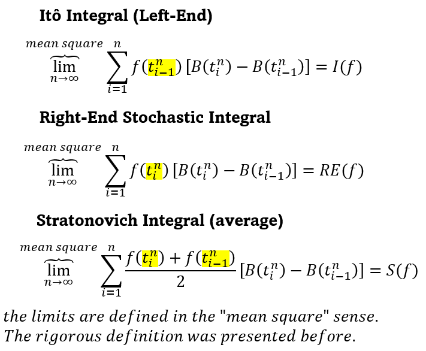

## Table of Contents

## What is Ito calculus and why is it important in finance?

Ito calculus is a type of math used to study things that change randomly over time, like stock prices. It was created by a man named Kiyoshi Ito. Instead of using regular calculus, which works with smooth changes, Ito calculus deals with sudden jumps and unpredictable movements. It uses something called stochastic differential equations, which are equations that include random parts.

In finance, Ito calculus is really important because it helps people understand and predict how stock prices and other financial things move. For example, it's used in something called the Black-Scholes model, which helps figure out the price of options, which are contracts that give you the right to buy or sell stocks at a certain price. By using Ito calculus, financial experts can make better decisions about buying and selling, managing risk, and planning for the future. It's like a special tool that helps them navigate the unpredictable world of finance.

## How does Ito calculus differ from ordinary calculus?

Ito calculus and ordinary calculus are different because they handle changes in different ways. Ordinary calculus works well with things that change smoothly and predictably, like the position of a car moving at a steady speed. It uses concepts like derivatives and integrals to understand these smooth changes. But in real life, many things don't change smoothly. For example, stock prices can jump up or down suddenly, and ordinary calculus can't handle these sudden changes very well.

That's where Ito calculus comes in. It was made to deal with things that change randomly and unpredictably, like stock prices. Ito calculus uses something called stochastic differential equations, which include random parts to represent these unpredictable changes. Instead of just looking at smooth changes, Ito calculus can handle sudden jumps and unpredictable movements. This makes it really useful for studying things in finance and other areas where randomness plays a big role.

## What is a stochastic process and how is it used in finance?

A stochastic process is a way of describing things that change over time in a random way. Imagine flipping a coin many times. You can't predict exactly what will happen next, but you can understand the patterns and chances of heads or tails. In the same way, a stochastic process helps us understand things like stock prices, which go up and down randomly. It's like a set of rules that tells us how likely certain changes are to happen, even if we can't predict them exactly.

In finance, stochastic processes are really important because they help us model and predict how financial things, like stock prices or interest rates, might change. For example, the Black-Scholes model, which is used to price options, uses a type of stochastic process called a geometric Brownian motion. This helps financial experts figure out the fair price for options, manage risk, and make better investment decisions. By using stochastic processes, they can plan for different possible futures and make smarter choices in the unpredictable world of finance.

## Can you explain the concept of Ito's Lemma and its application in finance?

Ito's Lemma is like a special rule in Ito calculus that helps us figure out how a function changes when the thing it depends on changes randomly. Imagine you have a stock price that jumps around unpredictably. If you want to know how the value of an option based on that stock changes, Ito's Lemma gives you the formula to do that. It's like a tool that tells you how to adjust your calculations when dealing with random movements.

In finance, Ito's Lemma is super useful because it helps with pricing and risk management. For example, if you're trying to figure out the price of an option using the Black-Scholes model, you need Ito's Lemma to make the calculations work. It helps you understand how the option's value changes as the stock price moves randomly. By using Ito's Lemma, financial experts can make better predictions and manage their investments more wisely in the unpredictable world of finance.

## What are stochastic differential equations and how are they used in financial modeling?

Stochastic differential equations, or SDEs, are special types of math equations that help us understand things that change randomly over time. Imagine you're trying to predict the weather, but it's always changing in unexpected ways. SDEs are like a way to write down the rules for how these random changes happen. They have two parts: one part that's like regular calculus and shows the smooth changes, and another part that adds in the randomness, like sudden jumps or unpredictable movements.

In financial modeling, SDEs are really important because they help us make sense of things like stock prices, which can go up and down in unpredictable ways. For example, the Black-Scholes model, which is used to figure out the price of options, uses an SDE to show how stock prices might change randomly. By using these equations, financial experts can predict how much an option might be worth, manage their risks better, and make smarter investment decisions. It's like having a special tool that helps them navigate the ups and downs of the financial world.

## How is Ito calculus applied in option pricing models like the Black-Scholes model?

Ito calculus is really important in option pricing models like the Black-Scholes model because it helps us understand how stock prices change randomly over time. The Black-Scholes model uses something called geometric Brownian motion, which is a type of stochastic process that shows how stock prices can jump around unpredictably. Ito calculus gives us the tools to work with these random movements, like using stochastic differential equations to describe how stock prices change.

In the Black-Scholes model, Ito calculus is used to figure out how the price of an option changes as the stock price moves randomly. This is done with a special rule called Ito's Lemma, which helps us calculate how the option's value changes based on the random changes in the stock price. By using Ito calculus, financial experts can make better predictions about the fair price of options, manage their risks more effectively, and make smarter investment choices in the unpredictable world of finance.

## What is the role of Ito calculus in risk management and hedging strategies?

Ito calculus plays a big role in risk management and hedging strategies in finance. It helps financial experts understand and predict how stock prices and other financial things move randomly. By using Ito calculus, they can figure out how much risk they are taking on with their investments. For example, if they own a stock that can go up or down suddenly, Ito calculus helps them calculate how likely those changes are and how big they might be. This understanding is crucial for managing risk, because it lets them plan for different possible outcomes and protect their investments.

Hedging is a way to reduce risk by making another investment that can offset potential losses. Ito calculus is important here because it helps experts create and price these hedging strategies. For instance, if they want to use options to hedge against a stock they own, they need to know how the option's value will change as the stock price moves randomly. Ito calculus, through tools like the Black-Scholes model and Ito's Lemma, helps them calculate these changes accurately. By understanding these random movements, they can set up hedges that minimize their risk and protect their investments from big losses.

## Can you discuss the limitations and criticisms of using Ito calculus in finance?

While Ito calculus is really helpful in finance, it has some limitations and criticisms. One big criticism is that it assumes stock prices follow a certain type of random movement called geometric Brownian motion. But in real life, stock prices can jump around in ways that don't fit this model perfectly. This can make the predictions from Ito calculus less accurate. Also, Ito calculus relies a lot on math and assumptions about how the world works, and if these assumptions are wrong, the results can be off. Critics say that this focus on math can sometimes miss important things that happen in the real world.

Another limitation is that Ito calculus can be hard to understand and use for people who aren't experts in math. This can make it tricky for everyone to use and trust the results. Some people also worry that relying too much on Ito calculus might make financial experts too confident in their predictions, even when the real world is more unpredictable than the models suggest. Despite these criticisms, Ito calculus is still a powerful tool that helps a lot in understanding and managing financial risks, but it's important to use it carefully and remember its limits.

## How does Ito calculus help in understanding and modeling interest rate movements?

Ito calculus helps us understand and model how interest rates move randomly over time. Interest rates, like stock prices, don't change smoothly but can jump around unpredictably. Ito calculus uses special equations called stochastic differential equations to describe these random changes. By using these equations, financial experts can create models that show how interest rates might go up or down in the future. This is important because interest rates affect a lot of financial decisions, like how much it costs to borrow money or how much you can earn from saving.

One common model for interest rates that uses Ito calculus is the Vasicek model. This model assumes that interest rates tend to move towards a long-term average but can still jump around randomly. Ito calculus helps experts figure out how likely these jumps are and how big they might be. By understanding these random movements, financial experts can make better predictions about future interest rates. This helps them make smarter decisions about things like bonds, loans, and other investments that depend on interest rates.

## What advanced techniques in Ito calculus are used for exotic option pricing?

Ito calculus is used in some fancy ways to figure out the price of exotic options, which are more complicated than regular options. One way is by using something called the Monte Carlo simulation. This method uses a computer to pretend many different ways the stock price might change over time, following the rules of Ito calculus. By looking at all these pretend changes, experts can guess how much an exotic option might be worth. This is really helpful because exotic options often have weird rules that make them hard to price with simpler methods.

Another advanced technique is called the finite difference method. This method breaks down the problem of pricing an exotic option into tiny pieces and uses Ito calculus to solve each piece step by step. It's like solving a puzzle by figuring out each part carefully. This method is good for options that have rules that depend on the whole path the stock price takes, not just where it ends up. By using Ito calculus in these advanced ways, financial experts can better understand and price exotic options, which can be really tricky but also really important in the world of finance.

## How can Ito calculus be applied to portfolio optimization and asset allocation?

Ito calculus helps with portfolio optimization and asset allocation by showing how investments can change randomly over time. Imagine you have a bunch of different investments like stocks and bonds. Ito calculus uses math to figure out how these investments might go up or down in unpredictable ways. By understanding these random movements, financial experts can decide how much to invest in each thing to make the best possible return while keeping risk under control. It's like using a special tool to balance your investments so you can feel more confident about your money.

For example, Ito calculus can help with something called dynamic asset allocation, where you change your investments over time based on how things are going. If you see that one investment is getting too risky, you can use Ito calculus to figure out how to move your money around to keep your portfolio safe. This helps you make smart choices about when to buy or sell different investments, so your money can grow in a way that matches your goals and how much risk you're okay with. It's all about using math to make better decisions in the unpredictable world of investing.

## What are the current research trends and future directions for Ito calculus in finance?

Current research in Ito calculus for finance is looking at ways to make models better at handling real-world situations. One big trend is trying to improve how we model things like stock prices and interest rates that don't always follow the simple rules of geometric Brownian motion. Researchers are working on new types of stochastic processes that can capture more complicated movements, like sudden jumps or changes in how much things move around. They're also using [machine learning](/wiki/machine-learning) to help make these models more accurate by learning from real data. Another focus is on making Ito calculus easier to use for people who aren't math experts, so more people can understand and use these powerful tools.

In the future, Ito calculus might help us understand and manage risks in new ways. As financial markets get more complicated, we'll need better tools to predict and control how things change. Researchers are thinking about how to use Ito calculus to model things like climate risks, which can affect investments in big ways. They're also looking at how to use it for new types of investments, like cryptocurrencies, which can be really unpredictable. By making Ito calculus more flexible and easier to use, it could help a lot more people make smarter choices about their money in a world that's always changing.

## What is Understanding Itô's Lemma?

Itô's Lemma is a cornerstone of stochastic calculus, widely used in financial modeling to handle functions affected by randomness. Unlike traditional deterministic calculus, which operates under certainty, Itô's Lemma accounts for the unpredictable nature of markets by incorporating stochastic processes. The lemma provides a mathematical framework to differentiate functions that depend on stochastic variables through the use of stochastic differential equations (SDEs).

In financial contexts, stock prices are often modeled using these stochastic processes. A common representation is the geometric Brownian motion, which is expressed as:

$$
dS_t = \mu S_t dt + \sigma S_t dW_t
$$

where:
- $S_t$ denotes the stock price at time $t$,
- $\mu$ is the drift coefficient,
- $\sigma$ is the volatility,
- $dW_t$ represents the infinitesimal increment of a Wiener process or Brownian motion.

Itô's Lemma allows us to apply calculus to such stochastic processes by decomposing the function $f(S_t, t)$ affected by randomness into a deterministic part and a stochastic part. The lemma articulates that if $f$ is a twice-differentiable function of $S_t$ and $t$, then the differential $df$ is given by:

$$
df = \left( \frac{\partial f}{\partial t} + \mu S_t \frac{\partial f}{\partial S} + \frac{1}{2} \sigma^2 S_t^2 \frac{\partial^2 f}{\partial S^2} \right) dt + \sigma S_t \frac{\partial f}{\partial S} dW_t
$$

This decomposition is essential in financial modeling, facilitating the transition from discrete time to continuous time models. Itô's Lemma is particularly instrumental in deriving the Black-Scholes equation, which is foundational for options pricing. The Black-Scholes model leverages the properties of geometric Brownian motion and Itô's calculus to value European-style options, further illustrating the lemma's importance in financial engineering.

In practice, implementing Itô's Lemma within algorithmic systems involves leveraging computational tools to perform simulations and analysis. For instance, Python, with libraries such as NumPy and SciPy, offers a robust environment for simulating stochastic processes. These capabilities enhance the precision and efficiency of financial models, proving Itô's Lemma's indispensability in [algorithmic trading](/wiki/algorithmic-trading) and beyond.

## How is Itô's Lemma applied in algorithmic trading?

Algorithmic trading has revolutionized the financial industry by employing computer algorithms to execute and manage trades at speeds and efficiencies unattainable by human traders. Central to these strategies is the ability to model and predict asset price movements accurately. Itô's Lemma, a fundamental result in stochastic calculus, is instrumental in developing these predictive models.

Itô's Lemma provides a mathematical framework for differentiating functions of stochastic processes, which are often used to model asset prices. A frequently used model is the geometric Brownian motion (GBM), described by the stochastic differential equation:

$$
dS_t = \mu S_t dt + \sigma S_t dW_t
$$

where $S_t$ is the asset price, $\mu$ is the drift coefficient, $\sigma$ is the volatility, and $W_t$ represents a Wiener process or Brownian motion. Itô's Lemma allows algorithmic trading models to incorporate both the drift and diffusion terms of this stochastic process to simulate realistic asset price paths.

In algorithmic trading, Itô's Lemma is used to simulate numerous possible future price paths, enabling algorithms to estimate the probabilities of different market scenarios. This simulation is crucial for risk management strategies and the pricing of complex derivatives. For instance, derivatives pricing under the Black-Scholes model relies on the application of Itô's Lemma to derive the dynamic hedging strategy for managing option risk.

Hedge funds and proprietary trading firms have demonstrated the successful application of stochastic calculus, including Itô's Lemma, in their trading systems. These firms often deploy quantitative analysts to construct and test sophisticated models that simulate asset price movements, leveraging Itô's calculus for superior market predictions.

A real-world example of using Itô's Lemma in algorithmic trading can be seen in the development of algorithmic strategies that adjust dynamically to market conditions. By simulating a multitude of future scenarios through stochastic models, these algorithms can respond not only to current market data but also anticipate potential future market moves. This proactive approach plays a vital role in both executing trades and managing portfolio risks effectively.

Furthermore, Python has become a prominent tool for implementing these complex models, owing to libraries such as NumPy, SciPy, and pandas, which provide efficient tools for numerical simulations and data analysis. Below is a simple Python snippet illustrating how one might simulate a GBM path for an asset:

```python
import numpy as np

def simulate_gbm(S0, mu, sigma, T, dt, n_paths):
    n_steps = int(T / dt)
    paths = np.empty((n_steps, n_paths))
    paths[0] = S0

    for t in range(1, n_steps):
        random_shocks = np.random.normal(0, 1, n_paths)
        paths[t] = paths[t-1] * np.exp((mu - 0.5 * sigma**2) * dt + sigma * np.sqrt(dt) * random_shocks)

    return paths

# Example parameters
S0 = 100  # Initial asset price
mu = 0.05  # Drift
sigma = 0.2  # Volatility
T = 1.0  # Time horizon (in years)
dt = 0.01  # Time step
n_paths = 1000  # Number of paths

asset_paths = simulate_gbm(S0, mu, sigma, T, dt, n_paths)
```

This illustration highlights the practical utility of Itô's Lemma in computational finance and algorithmic trading, offering a robust platform for creating versatile and adaptive trading algorithms. As financial markets continue to evolve, the role of stochastic calculus and Itô's Lemma will persist as pivotal components in sophisticated trading strategies.

## What is Mathematical Modeling in Financial Markets?

Stochastic differential equations (SDEs) provide a robust framework for addressing uncertainty in financial markets. These equations extend ordinary differential equations by incorporating terms that account for randomness, making them particularly useful in modeling asset prices that inherently exhibit stochastic behavior.

The primary components of an SDE in financial contexts are the drift and diffusion terms. The drift term represents the expected rate of return of an asset, encapsulating the deterministic trend of the price movement. In contrast, the diffusion term models the [volatility](/wiki/volatility-trading-strategies) or the random fluctuations in asset prices, often represented mathematically as a Wiener process, also known as Brownian motion. The general form of an SDE used in finance to model asset prices can be expressed as:

$$
dS_t = \mu S_t dt + \sigma S_t dW_t
$$

where:
- $dS_t$ denotes the infinitesimal change in the asset price,
- $\mu$ is the drift coefficient,
- $\sigma$ is the volatility of the asset,
- $S_t$ is the asset price at time $t$,
- $dW_t$ represents the increment of a Wiener process.

The interplay between these components allows SDEs to effectively mirror the dynamics of financial markets, linking real-world trading dynamics with mathematical models. Financial institutions utilize these models for risk management, derivative pricing, and to inform algorithmic trading strategies.

Despite their utility, financial modeling with SDEs is not without challenges. Market volatility can be highly unpredictable, occasionally leading to events not captured by normal distribution assumptions inherent in many traditional models. Large market events, or "black swans," present significant hurdles that require models to be adaptable. Developing models that can dynamically adjust their parameters to reflect changing market conditions remains an active area of research.

To address these complexities, computational tools and programming languages such as Python are extensively used. These tools offer functions and libraries for simulating SDEs, allowing traders and analysts to explore different market scenarios and stress-test algorithms under a variety of conditions. For instance, libraries like NumPy and SciPy facilitate the creation and numerical solution of these equations, enabling fine-grained simulations of asset price behavior.

Continued advancements in mathematical modeling and computational techniques are essential to adapt to the rapidly evolving financial world. As markets grow increasingly complex, the integration of more sophisticated models with algorithmic trading systems will likely play a critical role in maintaining financial stability and profitability.

## References & Further Reading

[1]: Øksendal, B. (2003). ["Stochastic Differential Equations: An Introduction with Applications"](https://link.springer.com/book/10.1007/978-3-642-14394-6). Springer.

[2]: Shreve, S. E. (2004). ["Stochastic Calculus for Finance I: The Binomial Asset Pricing Model"](https://link.springer.com/book/10.1007/978-0-387-22527-2). Springer.

[3]: Hull, J. C. (2017). ["Options, Futures, and Other Derivatives"](https://elibrary.pearson.de/book/99.150005/9781292212920). Pearson.

[4]: Glasserman, P. (2004). ["Monte Carlo Methods in Financial Engineering"](https://link.springer.com/book/10.1007/978-0-387-21617-1). Springer.

[5]: Black, F., & Scholes, M. (1973). ["The Pricing of Options and Corporate Liabilities"](https://www.cs.princeton.edu/courses/archive/fall09/cos323/papers/black_scholes73.pdf). Journal of Political Economy, 81(3), 637-654.  

[6]: Wilmott, P., Howison, S., & Dewynne, J. (1995). ["The Mathematics of Financial Derivatives: A Student Introduction"](https://www.cambridge.org/core/books/mathematics-of-financial-derivatives/7121345D07C5BCE4FBEC91A8A7E6F267). Cambridge University Press.

[7]: J.P. Bouchaud, & M. Potters. (2009). ["Theory of Financial Risk and Derivative Pricing: From Statistical Physics to Risk Management"](https://www.researchgate.net/publication/227390187_Theory_of_Financial_Risk_and_Derivative_Pricing). Cambridge University Press.