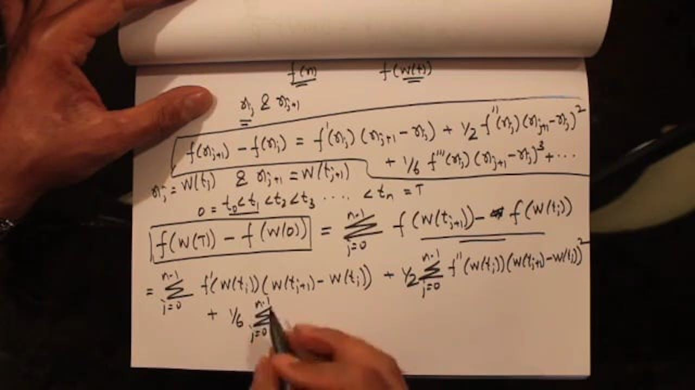

Algorithmic trading, a cornerstone of contemporary financial markets, involves the use of sophisticated computer algorithms to execute trading decisions without human intervention. This approach allows for high-speed and high-frequency trading, capable of responding to market changes with precision and efficiency. At the heart of these algorithmic systems lies stochastic calculus, a mathematical framework that is indispensable in modeling the random behavior of asset prices.

A crucial element of stochastic calculus is Itô calculus, which provides powerful tools for understanding and predicting the complex dynamics of financial instruments. Itô calculus extends traditional calculus into the realm of stochastic processes, introducing methods that account for the inherent randomness of financial markets. This randomness is often characterized by sudden, unpredictable shifts in asset prices, which can be modeled using Itô's Lemma—a fundamental principle that enables the differentiation of functions influenced by stochastic variables.



Itô's Lemma serves as a vital component in the development of algorithmic trading strategies. By offering insights into the probabilistic nature of price movements, it facilitates the creation of robust models that can simulate potential future scenarios. These models aid in decision-making processes, encompassing risk management and derivative pricing, thereby enhancing the effectiveness of trading algorithms.

In this article, we will explore the application of Itô calculus in finance, focusing on its integration within algorithmic trading systems. This examination will highlight how mathematical theory is translated into practical trading strategies, enabling algorithms to navigate the complexities of financial markets.

## Table of Contents

## Understanding Itô's Lemma

Itô's Lemma is a cornerstone of stochastic calculus, widely used in financial modeling to handle functions affected by randomness. Unlike traditional deterministic calculus, which operates under certainty, Itô's Lemma accounts for the unpredictable nature of markets by incorporating stochastic processes. The lemma provides a mathematical framework to differentiate functions that depend on stochastic variables through the use of stochastic differential equations (SDEs).

In financial contexts, stock prices are often modeled using these stochastic processes. A common representation is the geometric Brownian motion, which is expressed as:

$$
dS_t = \mu S_t dt + \sigma S_t dW_t
$$

where:
- $S_t$ denotes the stock price at time $t$,
- $\mu$ is the drift coefficient,
- $\sigma$ is the volatility,
- $dW_t$ represents the infinitesimal increment of a Wiener process or Brownian motion.

Itô's Lemma allows us to apply calculus to such stochastic processes by decomposing the function $f(S_t, t)$ affected by randomness into a deterministic part and a stochastic part. The lemma articulates that if $f$ is a twice-differentiable function of $S_t$ and $t$, then the differential $df$ is given by:

$$
df = \left( \frac{\partial f}{\partial t} + \mu S_t \frac{\partial f}{\partial S} + \frac{1}{2} \sigma^2 S_t^2 \frac{\partial^2 f}{\partial S^2} \right) dt + \sigma S_t \frac{\partial f}{\partial S} dW_t
$$

This decomposition is essential in financial modeling, facilitating the transition from discrete time to continuous time models. Itô's Lemma is particularly instrumental in deriving the Black-Scholes equation, which is foundational for options pricing. The Black-Scholes model leverages the properties of geometric Brownian motion and Itô's calculus to value European-style options, further illustrating the lemma's importance in financial engineering.

In practice, implementing Itô's Lemma within algorithmic systems involves leveraging computational tools to perform simulations and analysis. For instance, Python, with libraries such as NumPy and SciPy, offers a robust environment for simulating stochastic processes. These capabilities enhance the precision and efficiency of financial models, proving Itô's Lemma's indispensability in [algorithmic trading](/wiki/algorithmic-trading) and beyond.

## Application of Itô's Lemma in Algorithmic Trading

Algorithmic trading has revolutionized the financial industry by employing computer algorithms to execute and manage trades at speeds and efficiencies unattainable by human traders. Central to these strategies is the ability to model and predict asset price movements accurately. Itô's Lemma, a fundamental result in stochastic calculus, is instrumental in developing these predictive models.

Itô's Lemma provides a mathematical framework for differentiating functions of stochastic processes, which are often used to model asset prices. A frequently used model is the geometric Brownian motion (GBM), described by the stochastic differential equation:

$$
dS_t = \mu S_t dt + \sigma S_t dW_t
$$

where $S_t$ is the asset price, $\mu$ is the drift coefficient, $\sigma$ is the volatility, and $W_t$ represents a Wiener process or Brownian motion. Itô's Lemma allows algorithmic trading models to incorporate both the drift and diffusion terms of this stochastic process to simulate realistic asset price paths.

In algorithmic trading, Itô's Lemma is used to simulate numerous possible future price paths, enabling algorithms to estimate the probabilities of different market scenarios. This simulation is crucial for risk management strategies and the pricing of complex derivatives. For instance, derivatives pricing under the Black-Scholes model relies on the application of Itô's Lemma to derive the dynamic hedging strategy for managing option risk.

Hedge funds and proprietary trading firms have demonstrated the successful application of stochastic calculus, including Itô's Lemma, in their trading systems. These firms often deploy quantitative analysts to construct and test sophisticated models that simulate asset price movements, leveraging Itô's calculus for superior market predictions.

A real-world example of using Itô's Lemma in algorithmic trading can be seen in the development of algorithmic strategies that adjust dynamically to market conditions. By simulating a multitude of future scenarios through stochastic models, these algorithms can respond not only to current market data but also anticipate potential future market moves. This proactive approach plays a vital role in both executing trades and managing portfolio risks effectively.

Furthermore, Python has become a prominent tool for implementing these complex models, owing to libraries such as NumPy, SciPy, and pandas, which provide efficient tools for numerical simulations and data analysis. Below is a simple Python snippet illustrating how one might simulate a GBM path for an asset:

```python
import numpy as np

def simulate_gbm(S0, mu, sigma, T, dt, n_paths):
    n_steps = int(T / dt)
    paths = np.empty((n_steps, n_paths))
    paths[0] = S0

    for t in range(1, n_steps):
        random_shocks = np.random.normal(0, 1, n_paths)
        paths[t] = paths[t-1] * np.exp((mu - 0.5 * sigma**2) * dt + sigma * np.sqrt(dt) * random_shocks)

    return paths

# Example parameters
S0 = 100  # Initial asset price
mu = 0.05  # Drift
sigma = 0.2  # Volatility
T = 1.0  # Time horizon (in years)
dt = 0.01  # Time step
n_paths = 1000  # Number of paths

asset_paths = simulate_gbm(S0, mu, sigma, T, dt, n_paths)
```

This illustration highlights the practical utility of Itô's Lemma in computational finance and algorithmic trading, offering a robust platform for creating versatile and adaptive trading algorithms. As financial markets continue to evolve, the role of stochastic calculus and Itô's Lemma will persist as pivotal components in sophisticated trading strategies.

## Mathematical Modeling in Financial Markets

Stochastic differential equations (SDEs) provide a robust framework for addressing uncertainty in financial markets. These equations extend ordinary differential equations by incorporating terms that account for randomness, making them particularly useful in modeling asset prices that inherently exhibit stochastic behavior.

The primary components of an SDE in financial contexts are the drift and diffusion terms. The drift term represents the expected rate of return of an asset, encapsulating the deterministic trend of the price movement. In contrast, the diffusion term models the [volatility](/wiki/volatility-trading-strategies) or the random fluctuations in asset prices, often represented mathematically as a Wiener process, also known as Brownian motion. The general form of an SDE used in finance to model asset prices can be expressed as:

$$
dS_t = \mu S_t dt + \sigma S_t dW_t
$$

where:
- $dS_t$ denotes the infinitesimal change in the asset price,
- $\mu$ is the drift coefficient,
- $\sigma$ is the volatility of the asset,
- $S_t$ is the asset price at time $t$,
- $dW_t$ represents the increment of a Wiener process.

The interplay between these components allows SDEs to effectively mirror the dynamics of financial markets, linking real-world trading dynamics with mathematical models. Financial institutions utilize these models for risk management, derivative pricing, and to inform algorithmic trading strategies.

Despite their utility, financial modeling with SDEs is not without challenges. Market volatility can be highly unpredictable, occasionally leading to events not captured by normal distribution assumptions inherent in many traditional models. Large market events, or "black swans," present significant hurdles that require models to be adaptable. Developing models that can dynamically adjust their parameters to reflect changing market conditions remains an active area of research.

To address these complexities, computational tools and programming languages such as Python are extensively used. These tools offer functions and libraries for simulating SDEs, allowing traders and analysts to explore different market scenarios and stress-test algorithms under a variety of conditions. For instance, libraries like NumPy and SciPy facilitate the creation and numerical solution of these equations, enabling fine-grained simulations of asset price behavior.

Continued advancements in mathematical modeling and computational techniques are essential to adapt to the rapidly evolving financial world. As markets grow increasingly complex, the integration of more sophisticated models with algorithmic trading systems will likely play a critical role in maintaining financial stability and profitability.

## Technological Integration and Algorithmic Advancements

Technological advancements, particularly in [artificial intelligence](/wiki/ai-artificial-intelligence) (AI) and [machine learning](/wiki/machine-learning), play a pivotal role in enhancing the applications of Itô's Lemma in algorithmic trading. These technologies enable the development of sophisticated trading strategies by analyzing and predicting asset price movements with greater accuracy. Moreover, computational tools such as Python libraries are critical for simulating stochastic processes, thereby facilitating the practical application of Itô's Lemma in financial markets.

Python, with its rich ecosystem of libraries such as NumPy, SciPy, and pandas, provides powerful tools for mathematical modeling and data analysis. In the context of algorithmic trading, libraries like QuantLib and statsmodels are invaluable for implementing stochastic calculus methods. For instance, simulating a geometric Brownian motion, a common model for stock prices, can be efficiently executed using Python:

```python
import numpy as np

def geometric_brownian_motion(S0, mu, sigma, T, dt):
    N = int(T/dt)
    t = np.linspace(0, T, N)
    W = np.random.standard_normal(size=N)
    W = np.cumsum(W) * np.sqrt(dt)  # Brownian motion
    X = (mu - 0.5 * sigma**2) * t + sigma * W
    S = S0 * np.exp(X)  # Geometric Brownian motion
    return S

# Parameters: initial stock price, drift, volatility, time to maturity, time step
stock_prices = geometric_brownian_motion(S0=100, mu=0.05, sigma=0.2, T=1, dt=0.01)
```

This Python code snippet simulates the stochastic process of a stock's price over a specified time period. Such simulations are integral for risk management and pricing derivatives, where Itô's Lemma serves as a fundamental tool.

AI and machine learning further enhance algorithmic trading by providing tools for pattern recognition and predictive analytics. Machine learning algorithms can identify subtle market patterns and adapt to new data, which is crucial in volatile financial environments. Techniques such as [reinforcement learning](/wiki/reinforcement-learning) are being explored to optimize trading strategies by learning from interactions with the market.

Looking ahead, the future of algorithmic trading will likely be influenced by continuous innovations in computational and mathematical techniques. Emerging technologies, such as quantum computing, have the potential to further revolutionize financial modeling and simulation capabilities. Collaborations across disciplines, leveraging the strengths of mathematics, computer science, and finance, will be essential in meeting the evolving challenges of the financial markets.

In conclusion, the convergence of AI, machine learning, and robust computational tools significantly enhances the application of Itô's Lemma in algorithmic trading. This integration not only improves the accuracy and efficiency of trading systems but also paves the way for future innovations in the financial industry.

## Conclusion

Itô's Lemma serves as a cornerstone for algorithmic trading, bridging mathematical theory with trading practice by providing a structured approach to modeling financial markets' inherent randomness. The lemma facilitates the translation of stochastic processes into actionable quantitative strategies, which are crucial for effective trading algorithms. As financial markets continue to evolve in complexity, driven by factors such as globalization, high-frequency trading, and ever-increasing data availability, the demand for robust and adaptable modeling approaches becomes paramount. 

Models that can predict and adapt to market dynamics are essential for staying competitive in this fast-paced environment. The traditional models are often enriched with new data inputs and sophisticated techniques, incorporating aspects of machine learning or advanced statistical methods to enhance their predictive power and resilience against market anomalies.

Further innovation in trading systems is increasingly reliant on interdisciplinary collaboration. The convergence of mathematics, computer science, and finance fosters the development of cutting-edge technologies capable of analyzing large datasets, optimizing strategic decisions, and executing trades with precision. For instance, integrating artificial intelligence and machine learning into algorithmic frameworks allows for improved pattern recognition and prediction accuracy.

As these fields continue to intersect, future advancements in algorithmic trading are likely to be characterized by enhanced computational capabilities, more sophisticated trading models, and a deeper understanding of market behaviors. The seamless integration of Itô's Lemma with these technological and methodological advances will continue to drive the evolution of trading systems, ensuring they remain at the forefront of financial innovation.

## References & Further Reading

[1]: Øksendal, B. (2003). ["Stochastic Differential Equations: An Introduction with Applications"](https://link.springer.com/book/10.1007/978-3-642-14394-6). Springer.

[2]: Shreve, S. E. (2004). ["Stochastic Calculus for Finance I: The Binomial Asset Pricing Model"](https://link.springer.com/book/10.1007/978-0-387-22527-2). Springer.

[3]: Hull, J. C. (2017). ["Options, Futures, and Other Derivatives"](https://elibrary.pearson.de/book/99.150005/9781292212920). Pearson.

[4]: Glasserman, P. (2004). ["Monte Carlo Methods in Financial Engineering"](https://link.springer.com/book/10.1007/978-0-387-21617-1). Springer.

[5]: Black, F., & Scholes, M. (1973). ["The Pricing of Options and Corporate Liabilities"](https://www.cs.princeton.edu/courses/archive/fall09/cos323/papers/black_scholes73.pdf). Journal of Political Economy, 81(3), 637-654.  

[6]: Wilmott, P., Howison, S., & Dewynne, J. (1995). ["The Mathematics of Financial Derivatives: A Student Introduction"](https://www.cambridge.org/core/books/mathematics-of-financial-derivatives/7121345D07C5BCE4FBEC91A8A7E6F267). Cambridge University Press.

[7]: J.P. Bouchaud, & M. Potters. (2009). ["Theory of Financial Risk and Derivative Pricing: From Statistical Physics to Risk Management"](https://www.researchgate.net/publication/227390187_Theory_of_Financial_Risk_and_Derivative_Pricing). Cambridge University Press.