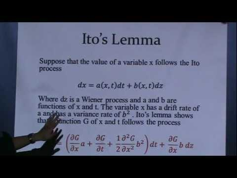

## Table of Contents

## What is Ito’s Lemma and why is it important in finance and stochastic calculus?

Ito's Lemma is a key concept in stochastic calculus that helps us understand how a function of a stochastic process changes over time. Imagine you have a variable that moves randomly, like stock prices. Ito's Lemma tells us how to calculate the change in a function of that variable. For example, if you have a function that depends on the stock price, Ito's Lemma helps you figure out how that function changes as the stock price moves randomly.

In finance, Ito's Lemma is very important because it is used to price financial derivatives like options. These are contracts whose value depends on the value of an underlying asset, such as a stock. By using Ito's Lemma, financial analysts can create models to predict how the price of these derivatives will change over time. This is crucial for managing risk and making investment decisions. Without Ito's Lemma, it would be much harder to understand and predict the behavior of financial markets.

## Can you explain the basic mathematical formula of Ito’s Lemma?

Ito's Lemma is a mathematical tool that helps us understand how a function changes when it depends on a variable that moves randomly. The basic formula of Ito's Lemma looks like this: if you have a function \( f(t, X_t) \) that depends on time \( t \) and a stochastic process \( X_t \), then the change in \( f \) over a small time step \( dt \) can be described as \( df = \frac{\partial f}{\partial t} dt + \frac{\partial f}{\partial x} dX_t + \frac{1}{2} \frac{\partial^2 f}{\partial x^2} (dX_t)^2 \). Here, \( \frac{\partial f}{\partial t} \) is how the function changes with time, \( \frac{\partial f}{\partial x} \) is how the function changes with \( X_t \), and \( \frac{\partial^2 f}{\partial x^2} \) is the second derivative, which accounts for the randomness in \( X_t \).

The term \( (dX_t)^2 \) is special because in stochastic calculus, the square of an infinitesimal change in a stochastic process isn't zero like in regular calculus. Instead, it equals the variance of the process over that small time step. For example, if \( X_t \) follows a standard Wiener process (also known as Brownian motion), then \( (dX_t)^2 = dt \). This is why the second derivative term in Ito's Lemma is multiplied by \( \frac{1}{2} \). Understanding this formula helps us predict how things like stock prices or option values change over time, which is crucial for financial modeling and risk management.

## How does Ito’s Lemma relate to the concept of Brownian motion?

Ito's Lemma is closely tied to Brownian motion because it helps us understand how functions change when they depend on a variable that moves like Brownian motion. Brownian motion, also known as a Wiener process, is a type of random movement where a particle moves in tiny, random steps. Imagine a speck of dust moving around in water; that's Brownian motion. In finance, stock prices can be modeled as following a similar kind of random movement. Ito's Lemma tells us how a function of these randomly moving stock prices changes over time.

The key part of Ito's Lemma that connects it to Brownian motion is the term \( (dX_t)^2 \). In regular calculus, if you have a tiny change \( dx \), then \( dx^2 \) is so small it's practically zero. But in stochastic calculus, with Brownian motion, \( (dX_t)^2 \) is not zero; it equals \( dt \), the time step. This is because the variance of Brownian motion over a small time step is equal to that time step. So, when using Ito's Lemma, the second derivative of the function times \( \frac{1}{2} \) and \( dt \) accounts for this randomness, helping us predict how things like option prices change as stock prices move randomly.

## What are the key assumptions needed to apply Ito’s Lemma?

To use Ito's Lemma, you need to assume a few things about the process you're looking at. First, you need to assume that the variable you're working with, like a stock price, follows a specific kind of random movement. This movement is often modeled as a Wiener process, which is a type of Brownian motion. This means the changes in the variable are random, and the size of those changes depends on the square root of time.

Second, you need to assume that the function you're looking at is smooth enough. This means the function and its first and second derivatives with respect to the variable need to exist and be continuous. This smoothness is important because Ito's Lemma uses these derivatives to figure out how the function changes as the random variable moves. Without these assumptions, Ito's Lemma wouldn't work properly.

## Can you provide a simple example of applying Ito’s Lemma to a function of a stochastic process?

Let's say you have a stock price that follows a simple random walk, like Brownian motion. We'll call this stock price \( S_t \). Now, imagine you want to know how the square of the stock price, \( f(S_t) = S_t^2 \), changes over time. This is where Ito's Lemma comes in handy. According to Ito's Lemma, the change in \( f(S_t) \) over a small time step \( dt \) can be described using the function's derivatives and the properties of the random walk.

To apply Ito's Lemma, you first need to find the derivatives of \( f(S_t) = S_t^2 \). The first derivative with respect to \( S_t \) is \( \frac{\partial f}{\partial S_t} = 2S_t \), and the second derivative is \( \frac{\partial^2 f}{\partial S_t^2} = 2 \). Since \( S_t \) follows a Wiener process, the change in \( S_t \) over \( dt \) is \( dS_t \), and \( (dS_t)^2 = dt \). Plugging these into Ito's Lemma, we get \( df = \frac{\partial f}{\partial S_t} dS_t + \frac{1}{2} \frac{\partial^2 f}{\partial S_t^2} (dS_t)^2 \). This becomes \( df = 2S_t dS_t + \frac{1}{2} \cdot 2 \cdot dt \), which simplifies to \( df = 2S_t dS_t + dt \). So, the change in the square of the stock price over time includes both the random movement of the stock price and a constant term due to the randomness itself.

## How does Ito’s Lemma differ from the standard chain rule in calculus?

Ito's Lemma and the standard chain rule in calculus both help us understand how functions change, but they work differently because they handle randomness differently. The standard chain rule in regular calculus tells us how a function changes when one of its variables changes, but it assumes those changes are smooth and predictable. For example, if you have a function \( f(x) \) and \( x \) changes a little bit, the chain rule helps you figure out how \( f \) changes. But it doesn't work well if \( x \) changes randomly, like how stock prices move in the stock market.

Ito's Lemma, on the other hand, is made for situations where the variable changes randomly, like with Brownian motion. It adds an extra term to account for this randomness. So, if you have a function \( f(t, X_t) \) and \( X_t \) moves randomly, Ito's Lemma tells you how \( f \) changes not just based on the changes in \( X_t \), but also based on the randomness itself. This extra term, which involves the second derivative of the function and the variance of the random changes, is what makes Ito's Lemma different and useful for things like financial modeling where randomness is a big part of the picture.

## What are the practical applications of Ito’s Lemma in option pricing?

Ito's Lemma is super helpful when it comes to figuring out how much options are worth. An option is like a bet on a stock's future price, and its value depends on how the stock price moves. Ito's Lemma helps us understand how the value of an option changes as the stock price goes up and down randomly. This is important because it lets us create models, like the famous Black-Scholes model, that predict how much an option should cost. Without Ito's Lemma, it would be really hard to make these predictions accurately.

In option pricing, we often use a formula called the Black-Scholes equation, which relies on Ito's Lemma. This equation helps traders and investors figure out the fair price of options, which is crucial for buying and selling them. By understanding how the option's value changes with the stock price, we can better manage risks and make smarter investment choices. So, Ito's Lemma is like a key tool that makes all this possible, helping the financial world run more smoothly.

## How can Ito’s Lemma be extended to multiple dimensions?

Ito's Lemma can be extended to work with more than one random variable, which is useful when you want to understand how a function changes when it depends on several things that move randomly. Imagine you have two stocks, and you want to know how a function that depends on both their prices changes over time. Just like in the one-dimensional case, you need to know how your function changes with each stock price and also how it changes with time. But now, you also need to consider how the randomness of one stock affects the randomness of the other. This is called the covariance between the two stocks, and it's an important part of the multi-dimensional Ito's Lemma.

In the multi-dimensional version of Ito's Lemma, you use partial derivatives of your function with respect to each stock price, as well as the second derivatives to account for the randomness. You also include a term that shows how the movements of the two stocks are related to each other. This makes the formula more complicated, but it gives you a better picture of how your function changes when multiple things are moving randomly. This is super helpful in finance, where you often need to consider how different stocks or other assets affect each other and how that impacts things like the value of options that depend on more than one stock.

## What are the common mistakes to avoid when using Ito’s Lemma?

One common mistake people make when using Ito's Lemma is forgetting about the extra term that comes from the randomness of the process. In regular calculus, if you have a tiny change, its square is so small it's basically zero. But with Ito's Lemma, the square of a tiny random change is not zero; it's equal to the time step. So, if you forget to include this term, your calculations will be wrong. It's like trying to predict the weather without considering the wind; you'll miss an important part of the picture.

Another mistake is not making sure the function you're working with is smooth enough. Ito's Lemma needs the function and its first and second derivatives to exist and be continuous. If your function is too bumpy or has sudden jumps, Ito's Lemma won't work right. It's like trying to drive a car with square wheels; it just won't roll smoothly. So, always check that your function meets these requirements before you start using Ito's Lemma.

## Can you discuss the proof of Ito’s Lemma and its underlying mathematical principles?

Ito's Lemma is like a special rule that helps us understand how a function changes when one of its variables moves randomly, like how stock prices move in the stock market. The proof of Ito's Lemma starts with a function \( f(t, X_t) \) that depends on time \( t \) and a random variable \( X_t \). The key idea is to look at how \( f \) changes over a very small time step \( dt \). We can write this change as \( df \). To figure out \( df \), we use a Taylor series expansion, which is a way to approximate how a function changes by looking at its derivatives. In regular calculus, we usually stop at the first derivative, but with Ito's Lemma, we need to go one step further because the random variable \( X_t \) has a special property: the square of its tiny change over \( dt \) isn't zero, it's equal to \( dt \). This means we need to include the second derivative of \( f \) with respect to \( X_t \), multiplied by \( \frac{1}{2} \) and \( dt \).

The underlying math of Ito's Lemma comes from stochastic calculus, which is a type of math that deals with randomness. In stochastic calculus, we often work with a Wiener process, which is a type of random movement called Brownian motion. When \( X_t \) follows a Wiener process, the tiny change \( dX_t \) has a special property: its square \( (dX_t)^2 \) equals \( dt \). This is different from regular calculus, where the square of a tiny change would be zero. So, when we apply the Taylor series to \( f(t, X_t) \), we need to include this extra term to account for the randomness. This extra term is what makes Ito's Lemma different and useful for understanding how things like stock prices or option values change over time when they move randomly.

## How does Ito’s Lemma apply to more complex stochastic differential equations?

Ito's Lemma is really helpful when you're dealing with more complex stochastic differential equations. These are equations where the variables change randomly over time, like how stock prices move in the stock market. Imagine you have a function that depends on one of these variables. Ito's Lemma helps you figure out how that function changes as the variable moves randomly. It does this by looking at the function's derivatives and adding a special term to account for the randomness. This is super important because it lets you predict how things like option prices will change even when the underlying stock prices are moving in complicated ways.

For example, let's say you have a stock price that follows a more complex random movement than just simple Brownian motion. Maybe it's affected by other factors like interest rates or other stocks. Ito's Lemma can still help you understand how the square of the stock price or some other function of the stock price changes over time. You just need to make sure you account for all the random movements and their effects on your function. This makes Ito's Lemma a powerful tool for dealing with the complex randomness you often see in finance and other fields where things don't move in simple, predictable ways.

## What are some advanced topics or extensions of Ito’s Lemma in stochastic analysis?

Ito's Lemma can be extended to more advanced topics in stochastic analysis, like dealing with functions that depend on several random variables at once. This is called multi-dimensional Ito's Lemma. Imagine you have a function that depends on the prices of two different stocks. Multi-dimensional Ito's Lemma helps you figure out how this function changes as both stock prices move randomly. It's more complicated because you need to consider how the randomness of one stock affects the other, but it's super useful for understanding things like options that depend on more than one stock.

Another advanced topic is applying Ito's Lemma to functions of jump processes. These are random variables that can suddenly jump to a new value, like how a stock price might change suddenly due to a big news event. Ito's Lemma can be adapted to handle these jumps by including extra terms that account for the sudden changes. This makes it possible to predict how things like option prices will change even when the underlying stock prices can jump around unexpectedly. These extensions make Ito's Lemma a powerful tool for dealing with all sorts of randomness in the financial world and beyond.

## What is Understanding Itô's Lemma?

Itô's Lemma is a critical concept in stochastic calculus, widely used in financial mathematics to model the random behavior of stock prices and other financial variables. Fundamentally, Itô's Lemma provides a way to differentiate functions of stochastic processes, offering a counterpart to the chain rule in traditional calculus but considering the inherent randomness in these processes.

Traditional calculus is built upon deterministic functions, where changes are smooth and continuous. In contrast, stochastic calculus manages functions subject to randomness, characterized by noise and discontinuities. This distinction is essential when modeling financial markets, which are influenced by unpredictable events and thus require a more sophisticated mathematical approach. Stochastic calculus incorporates random variables and processes into its structure, providing a more realistic modeling framework for fluctuating market conditions.

The formal representation of Itô's Lemma is given by:

$$
df(X_t) = \left( \frac{\partial f}{\partial t} + \frac{\partial f}{\partial x} \mu_t + \frac{1}{2} \frac{\partial^2 f}{\partial x^2} \sigma_t^2 \right) dt + \frac{\partial f}{\partial x} \sigma_t dW_t
$$

Here, $f(X_t, t)$ is a function of a stochastic process $X_t$, which can be a stock price or an [interest rate](/wiki/interest-rate-trading-strategies) modeled as a stochastic differential equation (SDE). The term $\mu_t$ represents the drift component or the average rate of change, $\sigma_t$ is the [volatility](/wiki/volatility-trading-strategies) or the diffusion component, and $dW_t$ represents the increment of a Wiener process, accounting for the randomness inherent in the model.

In financial applications, Itô's Lemma is instrumental for deriving the Black-Scholes equation, which is foundational in options pricing. For instance, consider a simple model where the stock price $S_t$ follows a geometric Brownian motion:

$$
dS_t = \mu S_t dt + \sigma S_t dW_t
$$

Using Itô's Lemma, one can ascertain the dynamics of derivative securities based on $S_t$, enabling precise pricing and risk management strategies in uncertain market conditions.

The concept of the Itô process is pivotal to understanding Itô's Lemma. An Itô process is a stochastic process defined as:

$$
X_t = X_0 + \int_0^t \mu_s ds + \int_0^t \sigma_s dW_s
$$

Such processes are employed to model various financial time series, recognizing their stochastic nature. The relevance of Itô processes lies in their ability to describe the evolution of financial variables where both deterministic trends and random shocks are considered.

In conclusion, Itô's Lemma serves as an essential tool in stochastic calculus, bridging theoretical insights and practical applications in finance. Its capability to handle the randomness in financial markets underpins its significance, making it a cornerstone for modern [algorithmic trading](/wiki/algorithmic-trading) and financial engineering.

## How is Itô's Lemma applied in Algorithmic Trading?

Itô's Lemma plays a pivotal role in algorithmic trading by providing a mathematical framework for modeling the stochastic nature of asset prices. In financial markets, price movements exhibit randomness that traditional calculus cannot accurately capture. Itô's Lemma, rooted in stochastic calculus, facilitates the modeling of these dynamics by allowing for the differentiation of functions whose variables follow a stochastic process.

### Modeling Asset Price Dynamics

In algorithmic trading, modeling asset price dynamics accurately is crucial for developing effective trading strategies. Itô's Lemma helps achieve this by extending the classical calculus to accommodate stochastic processes. Consider an asset whose price $S(t)$ follows a geometric Brownian motion, a common model for stock prices. It can be described by the stochastic differential equation (SDE):

$$
dS(t) = \mu S(t)dt + \sigma S(t)dW(t)
$$

where $\mu$ is the drift, $\sigma$ is the volatility, and $dW(t)$ represents the Wiener process or Brownian motion. Itô's Lemma allows us to derive the differential of a function $f(S(t), t)$ applied to this stochastic process, which is essential in pricing derivatives and managing risk.

### Algorithmic Strategies Utilizing Itô's Lemma

In practice, Itô's Lemma aids the development of algorithmic trading strategies that rely on precise price simulations. For example, it's utilized in options pricing models, such as the Black-Scholes model, which is instrumental in devising strategies for trading options. By understanding the expected changes and variances in underlying asset prices, algorithms can predict option prices more effectively.

### Risk Management and Pricing Derivatives

Using Itô's Lemma for risk management involves modeling and simulating price paths to estimate potential future risks. The lemma facilitates the calculation of Greeks—such as delta, gamma, and vega—which are sensitivities of option prices to various factors. These calculations are essential for dynamically hedging positions, thereby minimizing exposure to adverse price movements.

Consider the Python code for simulating a price path using Itô's stochastic differential equation:

```python
import numpy as np

def simulate_price(S0, mu, sigma, T, dt):
    np.random.seed(42)
    N = int(T/dt)  # total number of time steps
    t = np.linspace(0, T, N)
    W = np.random.standard_normal(size=N) 
    W = np.cumsum(W)*np.sqrt(dt)  # Brownian motion
    X = (mu - 0.5*sigma**2)*t + sigma*W
    S = S0*np.exp(X)  # simulated price path
    return S

# Parameters
S0 = 100  # Initial price
mu = 0.05  # Drift
sigma = 0.2  # Volatility
T = 1.0  # Time in years
dt = 0.01  # Time step

price_path = simulate_price(S0, mu, sigma, T, dt)
```

### Case Studies: Leveraging Itô's Lemma

Several financial institutions have leveraged Itô's Lemma to refine their algorithmic trading systems. For instance, hedge funds and proprietary trading firms incorporate stochastic calculus into their quantitative models, enhancing the precision of their pricing, hedging, and investment strategies. These entities often employ sophisticated algorithms that utilize Itô's Lemma to execute trades rapidly and accurately based on calculated price forecasts and risk assessments.

In conclusion, the integration of Itô's Lemma in algorithmic trading signifies a foundational analytical tool, facilitating more accurate financial modeling, risk management, and strategy development. Its application is a testament to the indispensable role of mathematical theory in enhancing trading efficacy and innovation.

## What is Mathematical Modeling in Financial Markets?

Stochastic differential equations (SDEs) play a pivotal role in the financial markets by providing a robust framework for modeling the dynamic behavior of asset prices. The use of SDEs allows market participants and financial engineers to capture the uncertainty and randomness inherent in financial markets. One of the key advantages of SDEs is their ability to model the continuous-time evolution of asset prices, offering a more realistic portrayal compared to discrete-time models. The general form of an SDE is given by:

$$
dX_t = \mu(X_t, t)dt + \sigma(X_t, t)dW_t
$$

where $X_t$ is the stochastic process, $\mu(X_t, t)$ is the drift term representing the expected rate of return, $\sigma(X_t, t)$ is the volatility term, and $dW_t$ is the increment of a Wiener process or Brownian motion.

Itô's Lemma is integral to financial modeling as it provides a method to derive differential equations for functions of stochastic processes. Utilizing Itô's Lemma, one can transform the SDEs of asset prices into an equation that describes the dynamics of derivative prices. The lemma is crucial in developing models such as the Black-Scholes model for option pricing. In mathematical terms, if $f(t, X_t)$ is a twice-differentiable function, Itô's Lemma states:

$$
df(t, X_t) = \left( \frac{\partial f}{\partial t} + \mu \frac{\partial f}{\partial X} + \frac{1}{2} \sigma^2 \frac{\partial^2 f}{\partial X^2} \right) dt + \sigma \frac{\partial f}{\partial X} dW_t
$$

This transformation links theoretical equations to real-world trading by converting the price dynamics into actionable insights, thereby forming a bridge between mathematical theory and its practical application.

However, the application of mathematical models in financial markets also faces challenges, especially in times of heightened volatility. Models that rely heavily on historical data may fail to predict future movements, as assumptions of constant volatility and returns might not hold. Real-world markets are driven by an array of unpredictable factors, including economic changes, geopolitical events, and sudden market shocks. This creates limitations for models that assume normal distribution of returns or constant parameters.

Accurate modeling is crucial for improving trading performance and decision-making. The ability to simulate various market scenarios and conduct rigorous stress testing using SDEs can substantially enhance risk management practices. Traders can better gauge potential price paths and execute informed trading strategies that optimize returns while mitigating risks. Moreover, accurate financial modeling can aid in the development of more sophisticated pricing algorithms for derivatives, accounting for complexities such as time-varying volatilities and interest rates.

In summary, while stochastic differential equations provide a powerful tool for financial modeling, their effectiveness is contingent upon the precision of input parameters and the stochastic calculus underpinning them. Despite challenges, advancements in computational power and data analytics continue to push the boundaries, enhancing our capability to create models that are both theoretically sound and practically applicable.

## References & Further Reading

[1]: Øksendal, B. (2003). ["Stochastic Differential Equations: An Introduction with Applications."](https://link.springer.com/book/10.1007/978-3-642-14394-6) Springer.

[2]: Hull, J. C. (2018). ["Options, Futures, and Other Derivatives."](https://www.pearson.com/nl/en_NL/higher-education/subject-catalogue/finance/Options-Futures-and-Other-Derivatives-Hull.html) Pearson.

[3]: Shreve, S. E. (2004). ["Stochastic Calculus for Finance II: Continuous-Time Models."](https://link.springer.com/book/9780387401010) Springer.

[4]: Merton, R. C. (1973). ["Theory of Rational Option Pricing."](https://www.semanticscholar.org/paper/Theory-of-Rational-Option-Pricing-Merton/f22256599cc513be281a2a82082d4bac7031def2) The Review of Economics and Statistics, 41(5), 141-183.

[5]: Wilmott, P., Howison, S., & Dewynne, J. (1995). ["The Mathematics of Financial Derivatives: A Student Introduction."](https://www.cambridge.org/core/books/mathematics-of-financial-derivatives/7121345D07C5BCE4FBEC91A8A7E6F267) Cambridge University Press.