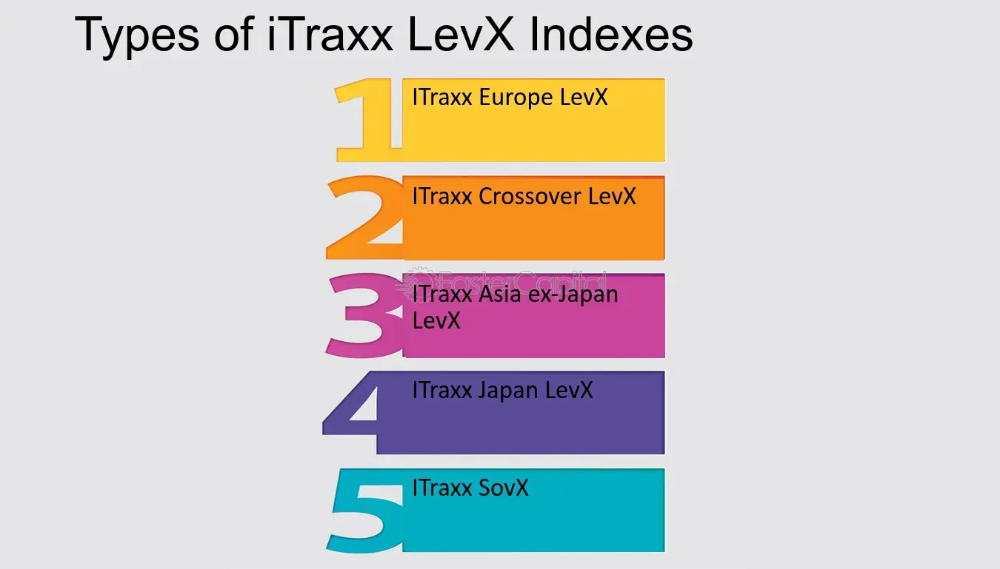

## Table of Contents

## What are ITraxx LevX Indices?

ITraxx LevX Indices are financial tools used to measure the risk of default in the credit market, specifically for leveraged loans in Europe. They track a basket of these loans and provide investors with a way to understand and manage the risk associated with these types of debts. By looking at the ITraxx LevX Indices, investors can see how likely it is that companies with leveraged loans might not be able to pay back their debts.

These indices are important because they help investors make smarter decisions about buying and selling leveraged loans. If the index shows a high risk of default, investors might be more cautious or demand higher returns for taking on that risk. On the other hand, if the index shows lower risk, it might encourage more investment in these loans. Overall, ITraxx LevX Indices give a clear picture of the health of the leveraged loan market, helping to keep the financial system stable.

## How do ITraxx LevX Indices differ from other credit indices?

ITraxx LevX Indices focus specifically on leveraged loans in Europe, which are loans given to companies that already have a lot of debt. This makes them different from other credit indices, which might look at a broader range of debts or focus on different regions. For example, the ITraxx Europe Index tracks the credit default swaps of major European companies, but it includes a wider variety of corporate debt, not just leveraged loans.

Another key difference is that ITraxx LevX Indices are designed to help investors understand the risk of default in the leveraged loan market. This is important because leveraged loans are riskier than other types of debt. Other credit indices, like the CDX in the United States, might cover a mix of corporate and sometimes even sovereign debt, giving a broader view of credit risk but not focusing specifically on the high-risk segment of leveraged loans.

In summary, while other credit indices provide a general overview of credit risk across various types of debt and regions, ITraxx LevX Indices zoom in on the specific and riskier market of leveraged loans in Europe. This specialized focus helps investors who are particularly interested in this segment of the market to make more informed decisions.

## What is the purpose of ITraxx LevX Indices in the financial market?

The main purpose of ITraxx LevX Indices in the financial market is to help investors understand the risk of default in the European leveraged loan market. These indices track a basket of loans given to companies that already have a lot of debt, which are called leveraged loans. By looking at the ITraxx LevX Indices, investors can see how likely it is that these companies might not be able to pay back their debts. This information is crucial for investors because it helps them decide whether to buy or sell these loans and what kind of returns they should expect.

In simple terms, ITraxx LevX Indices act like a health check for the leveraged loan market. If the indices show a high risk of default, investors might be more careful or demand higher returns for taking on that risk. On the other hand, if the indices show lower risk, it might encourage more investment in these loans. By providing a clear picture of the market's health, ITraxx LevX Indices help keep the financial system stable and make it easier for investors to make smart decisions.

## Who typically uses ITraxx LevX Indices and for what purposes?

ITraxx LevX Indices are mainly used by investors who deal with leveraged loans in Europe. These investors include big banks, hedge funds, and asset managers. They use the indices to check how risky it is to invest in these loans. By looking at the indices, they can see if there's a high chance that the companies borrowing the money might not be able to pay it back. This helps them decide if they should buy or sell these loans and what kind of return they should expect for taking on the risk.

Besides investors, financial analysts and researchers also use ITraxx LevX Indices. They study the indices to understand trends in the leveraged loan market and to predict future changes. This information is valuable for making reports and giving advice to clients or companies about the health of the market. In short, these indices help a lot of people in the financial world make better decisions and keep the market stable.

## How are ITraxx LevX Indices constructed?

ITraxx LevX Indices are made by choosing a group of leveraged loans from companies in Europe. These companies already have a lot of debt, which makes their loans riskier. The people who make the indices pick loans that represent different parts of the market, so the indices show a good picture of what's going on with leveraged loans in Europe. They look at things like how much the companies owe, what kind of business they are in, and how likely they are to pay back their loans.

Once the loans are picked, the indices are updated regularly to keep them accurate. This means that if a company pays back its loan or if it goes bankrupt, the index will change to reflect that. The indices are also checked to make sure they still represent the market well. By doing this, the ITraxx LevX Indices give investors a clear and up-to-date view of the risk in the European leveraged loan market.

## What types of financial instruments are included in ITraxx LevX Indices?

ITraxx LevX Indices include leveraged loans from companies in Europe. These are loans given to businesses that already have a lot of debt. The loans are chosen to represent different parts of the market, so the indices show a good picture of what's going on with leveraged loans in Europe.

The indices are made up of loans that are considered riskier because the companies borrowing the money might have trouble paying it back. By including these types of loans, the ITraxx LevX Indices help investors understand the risk of default in the European leveraged loan market.

## How often are ITraxx LevX Indices updated and rebalanced?

ITraxx LevX Indices are updated and rebalanced every six months. This means that every six months, the people who make the indices look at the loans included in them and make changes if needed. They do this to make sure the indices still show a good picture of the European leveraged loan market.

When they rebalance the indices, they might add new loans or take out old ones. This happens if a company pays back its loan, goes bankrupt, or if there are other changes in the market. By doing this regularly, the indices stay accurate and help investors understand the current risk of default in the leveraged loan market.

## What are the key risk factors associated with investing in ITraxx LevX Indices?

Investing in ITraxx LevX Indices comes with several key risk factors. One big risk is that the companies behind the leveraged loans might not be able to pay back their debts. These companies already have a lot of debt, so if the economy gets worse or if they face other problems, they could default on their loans. This would make the value of the indices go down, and investors could lose money.

Another risk is that the leveraged loan market can be unpredictable. The indices are based on a selection of loans, and if the market changes a lot, the indices might not reflect these changes quickly enough. This can make it hard for investors to make good decisions. Also, because these loans are riskier, they can be more affected by changes in interest rates or other financial conditions, which adds to the uncertainty and potential for loss.

## How can ITraxx LevX Indices be used for hedging purposes?

Investors can use ITraxx LevX Indices to protect themselves from the risk of losing money on leveraged loans. If an investor owns a lot of these loans, they might worry that the companies borrowing the money won't be able to pay it back. By using the ITraxx LevX Indices, they can buy something called a credit default swap (CDS). A CDS is like an insurance policy that pays out if the companies default on their loans. This helps the investor lose less money if things go wrong.

For example, if the ITraxx LevX Indices show that the risk of default is going up, an investor might decide to buy more CDS to be safer. This way, if the companies do default, the investor gets money from the CDS to cover their losses. By keeping an eye on the indices, investors can adjust their hedging strategies to match the current level of risk in the market, making their investments more secure.

## What are the historical performance trends of ITraxx LevX Indices?

The ITraxx LevX Indices have shown ups and downs over the years, reflecting the health of the European leveraged loan market. During good economic times, when companies are doing well and paying back their loans, the indices tend to stay stable or even go down a bit, showing less risk. But when the economy gets shaky, like during a recession or a financial crisis, the indices can go up a lot. This means the risk of companies not paying back their loans goes up, and investors get worried.

For example, during the 2008 financial crisis, the ITraxx LevX Indices jumped up because many companies were struggling to pay back their debts. This made investors very cautious, and they demanded higher returns for taking on the risk. In more recent years, like after the economic recovery from the crisis, the indices have been less volatile. But they still go up and down based on economic conditions, showing that the leveraged loan market is always a bit risky.

## How do regulatory changes impact ITraxx LevX Indices?

Regulatory changes can have a big impact on ITraxx LevX Indices. When governments or financial authorities make new rules about lending or borrowing, it can change how banks and investors behave. For example, if there are stricter rules about how much debt a company can have, fewer companies might take out leveraged loans. This means there would be fewer loans for the indices to track, which could make them less useful for investors. Also, if new rules make it harder for banks to give out these loans, the whole market could shrink, and the indices might show higher risk because there are fewer good loans to choose from.

On the other hand, if regulations make it easier for companies to borrow money, more leveraged loans might be created. This could make the indices more stable because there are more loans to track, and the risk might go down if the economy is doing well. But if the new rules lead to more risky lending, the indices could show higher risk. Overall, any changes in regulations can shake up the leveraged loan market, and investors need to keep an eye on these changes to understand how they might affect the ITraxx LevX Indices.

## What advanced strategies can be employed using ITraxx LevX Indices for portfolio management?

One advanced strategy for using ITraxx LevX Indices in portfolio management is to use them for dynamic risk management. Investors can keep a close eye on the indices to see how the risk of default in the leveraged loan market is changing. If the indices show that risk is going up, investors might decide to sell some of their leveraged loans or buy more credit default swaps (CDS) to protect their investments. On the other hand, if the indices show that risk is going down, they might buy more leveraged loans to take advantage of the lower risk and potentially higher returns. By adjusting their portfolio based on the indices, investors can better manage the risk and make smarter decisions.

Another strategy is to use ITraxx LevX Indices for sector rotation. The indices can give investors a good idea of which sectors in the European leveraged loan market are doing well and which ones are struggling. If the indices show that one sector has a lower risk of default, investors might move their money into loans from companies in that sector. If another sector looks riskier, they might sell those loans or avoid them altogether. This way, investors can shift their portfolio to focus on the sectors that are performing better, which can help them get better returns while still managing risk.

## References & Further Reading

[1]: O'Kane, D. (2008). ["Modelling Single-name and Multi-name Credit Derivatives."](https://onlinelibrary.wiley.com/doi/pdf/10.1002/9781119201960.fmatter) Wiley Finance.

[2]: Lopez de Prado, M. (2018). ["Advances in Financial Machine Learning."](https://www.amazon.com/Advances-Financial-Machine-Learning-Marcos/dp/1119482089) Wiley.

[3]: Hull, J. (2017). ["Options, Futures, and Other Derivatives."](https://elibrary.pearson.de/book/99.150005/9781292212920) Pearson.

[4]: Jansen, S. (2018). ["Machine Learning for Algorithmic Trading."](https://github.com/stefan-jansen/machine-learning-for-trading) Packt Publishing.

[5]: Chan, E. (2009). ["Quantitative Trading: How to Build Your Own Algorithmic Trading Business."](https://github.com/ftvision/quant_trading_echan_book) Wiley.

[6]: Aronson, D. (2007). ["Evidence-Based Technical Analysis: Applying the Scientific Method and Statistical Inference to Trading Signals."](https://www.amazon.com/Evidence-Based-Technical-Analysis-Scientific-Statistical/dp/0470008741) Wiley.