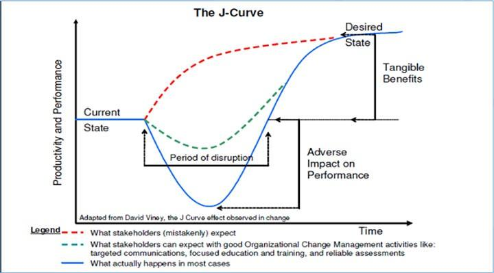

## Table of Contents

## What is the J Curve and its basic concept?

The J Curve is a concept used in economics and business to describe how a country's trade balance or a company's performance can get worse before it gets better after a significant change, like a currency devaluation or a new business strategy. Imagine the letter "J" - at first, the line goes down, showing a decline, but then it starts to go up, showing improvement. This idea helps people understand that sometimes things need to get worse before they can get better.

For example, if a country's currency becomes weaker, its exports might become cheaper and more attractive to other countries. But right away, the cost of imports goes up, which can make the trade balance worse. Over time, as more people buy the cheaper exports, the trade balance can improve. This pattern of initial decline followed by recovery is what forms the shape of the J Curve.

## How does the J Curve relate to economic theory?

The J Curve is important in economic theory because it helps explain how a country's trade balance can change over time after something big happens, like a change in the value of its currency. When a country's currency gets weaker, it might seem like a bad thing at first because the cost of buying things from other countries goes up. This makes the trade balance worse because the country is spending more on imports. But, over time, having a weaker currency can actually help the country sell more of its own products to other countries because those products become cheaper for foreigners to buy. This is how the J Curve shows that things can get worse before they get better.

Economists use the J Curve to predict and understand these changes in a country's economy. It's a useful tool for figuring out how long it might take for the trade balance to improve after a currency change. For example, if a country wants to make its exports more competitive by letting its currency get weaker, the J Curve helps them see that they might have to wait a while before they start seeing good results. This idea can also be applied to businesses that make big changes, like starting a new strategy, where they might see a dip in performance before things start to improve.

## Can you explain the phases of the J Curve?

The J Curve has three main phases that show how things change over time. The first phase is the initial decline. This happens right after a big change, like a country's currency getting weaker. At first, things get worse because the cost of buying things from other countries goes up. This makes the trade balance worse because the country is spending more on imports than it's [earning](/wiki/earning-announcement) from exports.

The second phase is the bottom of the J Curve. This is the point where the trade balance is at its worst. It's the lowest part of the "J" shape. During this phase, the country might start to see some small improvements, but it's still not back to where it was before the change happened.

The third phase is the recovery. This is when things start to get better. As more people from other countries start buying the country's cheaper exports, the trade balance starts to improve. The line on the J Curve starts to go up, showing that the country is earning more from its exports than it's spending on imports. This phase can take a while, but it shows that the big change eventually leads to a better situation.

## What are common applications of the J Curve in business?

In business, the J Curve is often used to understand how a company's performance might change after making big decisions, like starting a new strategy or launching a new product. At first, the company might see its profits go down. This is because new strategies or products can take time to catch on, and the company might have to spend a lot of money to get them going. This initial decline is the first part of the J Curve, where things get worse before they get better.

After a while, if the new strategy or product starts to work, the company's performance will begin to improve. This is the second part of the J Curve, where the line starts to go up. More customers might start buying the new product, or the new strategy might start to bring in more money. This shows that the company's big decision was a good one, even though it took time to see the benefits. The J Curve helps business leaders be patient and understand that sometimes they need to wait for good things to happen.

## How is the J Curve used in international trade?

In international trade, the J Curve helps people understand what happens to a country's trade balance when its currency gets weaker. At first, when a country's currency loses value, it costs more to buy things from other countries. This means the country might have to spend more money on imports than it earns from exports, making the trade balance worse. This initial drop in the trade balance is the first part of the J Curve, showing that things can get worse before they get better.

Over time, as the currency stays weak, the country's exports become cheaper and more attractive to other countries. More people from other countries start buying these cheaper exports, which can help the country earn more money. This increase in exports starts to improve the trade balance, and this is the second part of the J Curve, where the line starts to go up. The J Curve shows that a country might need to be patient and wait for the benefits of a weaker currency to show up in its trade balance.

## What role does the J Curve play in investment and venture capital?

In investment and venture capital, the J Curve helps explain what can happen to the value of an investment over time. When someone invests in a new business or a startup, the value of their investment might go down at first. This is because new businesses often need to spend a lot of money to get started, and they might not make any money right away. This initial drop in value is the first part of the J Curve. It shows that things can get worse before they get better.

After a while, if the new business starts to do well, the value of the investment can start to go up. The business might start making money, and the value of the investment can grow. This increase in value is the second part of the J Curve, where the line starts to go up. The J Curve helps investors understand that they might need to be patient and wait for their investments to start paying off. It shows that even though the value of an investment might go down at first, it can still end up being a good investment in the long run.

## How can the J Curve be applied to understand currency devaluation?

The J Curve helps us understand what happens to a country's trade balance when its currency loses value, which is called currency devaluation. At first, when a country's currency gets weaker, it costs more to buy things from other countries. This means the country might have to spend more money on imports than it earns from exports, making the trade balance worse. This initial drop in the trade balance is the first part of the J Curve. It shows that things can get worse before they get better.

Over time, as the currency stays weak, the country's exports become cheaper and more attractive to other countries. More people from other countries start buying these cheaper exports, which can help the country earn more money. This increase in exports starts to improve the trade balance, and this is the second part of the J Curve, where the line starts to go up. The J Curve shows that a country might need to be patient and wait for the benefits of a weaker currency to show up in its trade balance.

## What are the limitations and criticisms of the J Curve theory?

The J Curve theory has some limitations and criticisms. One big problem is that it assumes that the trade balance will always get better after a currency gets weaker, but this isn't always true. Sometimes, other things can happen that make the trade balance stay bad or even get worse. For example, if the country's trading partners start to buy less because they think the currency will keep getting weaker, then the J Curve might not work the way it's supposed to.

Another criticism is that the J Curve can take a long time to show up. It might take months or even years for the trade balance to start getting better after a currency devaluation. This can make it hard for people to use the J Curve to make quick decisions. Also, the J Curve is just a theory, and it might not fit every situation perfectly. Different countries and different situations can have different results, so it's important not to rely on the J Curve too much without looking at other factors.

## Can you provide a case study where the J Curve was observed in a real-world scenario?

In the late 1980s, the United States experienced a real-world example of the J Curve when the value of the dollar fell. At first, the trade balance got worse because it cost more to buy things from other countries. The U.S. was spending more money on imports than it was earning from exports, which made the trade deficit bigger. This initial drop in the trade balance is what the J Curve predicts will happen right after a currency gets weaker.

Over time, as the dollar stayed weak, American products became cheaper for people in other countries to buy. More people started buying things made in the U.S., which helped the country earn more money from exports. Slowly, the trade balance started to get better. This improvement in the trade balance is the second part of the J Curve, where things start to get better after they've gotten worse. The J Curve helped explain why the U.S. trade balance got worse before it got better after the dollar lost value.

## How do analysts measure and predict the J Curve effect?

Analysts measure and predict the J Curve effect by looking at data about a country's trade balance over time. They pay attention to how much money the country spends on imports and how much it earns from exports. When a country's currency gets weaker, analysts watch to see if the trade balance gets worse at first, like the J Curve says it should. They use numbers and graphs to see if the trade balance follows the shape of the J Curve, with an initial drop followed by an improvement.

To predict the J Curve effect, analysts also look at other things that might affect the trade balance. They think about how other countries might react to the weaker currency and how long it might take for exports to start going up. They use past data and economic models to guess how long the J Curve might last and how big the initial drop and the later improvement might be. This helps them give advice to people who make decisions about the country's economy.

## What advanced statistical methods are used to analyze the J Curve?

Analysts use advanced statistical methods to study the J Curve and understand how a country's trade balance changes after its currency gets weaker. One common method is regression analysis, which helps them see how different things, like the value of the currency and the amount of imports and exports, affect the trade balance. They can use this to see if the trade balance follows the J Curve pattern, with an initial drop followed by an improvement. Another method is time series analysis, which looks at how the trade balance changes over time. This helps analysts predict how long the J Curve might last and how big the changes might be.

Another important method is econometric modeling, which uses math to create models of the economy. These models can show how different factors, like currency value and trade policies, might affect the trade balance. Analysts can use these models to test different scenarios and see how the J Curve might play out in different situations. By using these advanced statistical methods, analysts can get a better understanding of the J Curve and make more accurate predictions about how a country's trade balance might change after its currency gets weaker.

## How does the J Curve concept evolve with global economic changes?

The J Curve concept changes as the world's economy changes. When countries trade more with each other and use new technology, the J Curve can look different. For example, if a country's currency gets weaker, it might not take as long for the trade balance to get better because of faster communication and shipping. Also, if countries work together more, like in trade agreements, the J Curve might not be as clear because other things can affect the trade balance.

Even though the basic idea of the J Curve stays the same, how it works can change with new economic trends. For example, if a country starts to make more of its own products instead of buying them from other countries, the J Curve might not show up as strongly. This is because the country might not spend as much on imports, so the trade balance might not get as bad at first. Understanding how the J Curve changes with the world's economy helps people make better decisions about trade and money.

## References & Further Reading

[1]: Magee, S. P., & Magee, S. P. (1973). ["Currency Contracts, Pass-Through, and Devaluation."](https://www.brookings.edu/wp-content/uploads/1973/01/1973a_bpea_magee.pdf) Brookings Papers on Economic Activity, 1973(1), 303-325.

[2]: Rose, A. K., & Yellen, J. L. (1989). ["Is There a J-Curve?"](https://www.sciencedirect.com/science/article/pii/0304393289900160) Journal of Monetary Economics, 24(1), 53-68.

[3]: ["Algorithmic Trading and DMA: An introduction to direct access trading strategies"](https://www.amazon.com/Algorithmic-Trading-DMA-introduction-strategies/dp/0956399207) by Barry Johnson

[4]: Dornbusch, R., Fischer, S., & Samuelson, P. A. (1977). ["Comparative Advantage, Trade, and Payments in a Ricardian Model with a Continuum of Goods."](https://economics.mit.edu/sites/default/files/2023-05/fischer_comp_advantage.pdf) The American Economic Review, 67(5), 823-839.

[5]: ["Trading and Exchanges: Market Microstructure for Practitioners"](https://academic.oup.com/book/52292) by Larry Harris