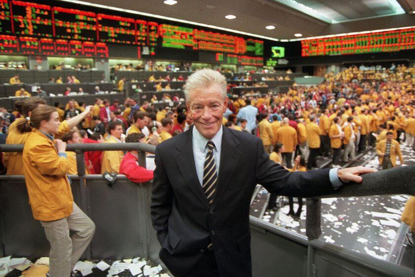

Futures trading plays a crucial role in the financial markets, offering a mechanism for price discovery, risk management, and speculation. Central to this domain is the Chicago Mercantile Exchange (CME), one of the most significant financial exchanges globally. Established as a non-profit corporation in 1898 under the name Chicago Butter and Egg Board, CME has steadily evolved into a powerhouse for futures and options trading. It provides diverse financial instruments, including commodity futures, interest rate futures, and stock index futures, catering to traders and institutions worldwide.

The CME's impact on futures trading is evident through its adoption of cutting-edge technologies and innovative trading methodologies. A significant transition in CME's history was its shift from the traditional open outcry system to electronic trading, responding to technological advancements and market dynamics. This evolution increased the speed, accessibility, and efficiency of trading, making it more appealing to global participants.



Among the influential figures shaping CME's trajectory was John Francis (Jack) Sandner. Sandner's various roles, including his tenure as CME chairman, positioned him as a driving force behind several key initiatives. His strategic vision and leadership were instrumental during pivotal moments, such as the transition to electronic trading. Sandner's contributions are acknowledged for not only transforming CME but also fortifying its resilience amid financial market upheavals like the 1987 stock market crash.

Concurrently, the rise of algorithmic trading marked a transformative phase in futures trading. Algo trading uses sophisticated algorithms to automate trading decisions, reducing human intervention and execution time. As CME embraced these technologies, the landscape of trading changed significantly, presenting both opportunities for enhanced trading efficiencies and challenges, such as increased scrutiny over market volatility and regulatory compliance.

Understanding the development and current trends in futures trading is crucial for both market professionals and enthusiasts. This exploration provides valuable insights into market mechanisms and the forces driving financial evolution. This guide sets out to provide a comprehensive understanding of CME's pivotal role in futures trading and the contributions of key figures like Jack Sandner, offering a lens into the exchange's ongoing impact on global finance.

## Table of Contents

## The Dynamics of Futures Trading at the Chicago Mercantile Exchange

The Chicago Mercantile Exchange (CME) stands as a titan among global futures exchanges, shaping the dynamics of futures trading. Founded in 1898 as the Chicago Butter and Egg Board, CME has undergone significant transformations, adapting to diverse market demands and technological advancements. Initially, it operated through the traditional open outcry system, a method where brokers and traders would communicate trade information through verbal and hand signals on the trading floor. This approach not only facilitated a live, dynamic exchange of information but also established CME as a hub for commodity trading.

As the financial landscape evolved, so too did CME, transitioning to electronic trading systems. This move began in earnest in 1992 with the launch of GLOBEX, an after-hours electronic trading platform. The shift to electronic trading marked a revolutionary change, drastically increasing the speed and efficiency of trade execution. Electronic trading minimized the time and human error associated with manual order placements, enabling CME to cater to a global clientele with round-the-clock operations. By 2000, electronic trading volumes began to overtake those of open outcry, indicating the industry's pivot toward faster, technology-driven processes.

CME offers an extensive range of products, which include commodity futures like agricultural products, energy, and metals. Additionally, it offers [interest rate](/wiki/interest-rate-trading-strategies) futures and stock index futures, providing a comprehensive suite for various trading strategies. This diversity makes CME a versatile platform capable of meeting the nuanced needs of traders and hedgers worldwide. For example, its interest rate futures allow participants to hedge against economic variables such as inflation, while stock index futures provide a mechanism for managing equity market exposure.

Recent innovations at CME have had significant repercussions for the global trading environment. The introduction of advanced trading tools and enhanced data analytics platforms equips traders with actionable insights, thereby refining decision-making processes. Moreover, the advent of [algorithmic trading](/wiki/algorithmic-trading) platforms has further advanced CME's capabilities in handling large volumes of trades efficiently and with minimal slippage. Algorithmic trading facilitates executing trades at the most opportune moments, capitalizing on minute market movements that may escape manual trading efforts.

The CME's progression from open outcry to fully electronic trading exemplifies a broader trend within financial markets towards automation and efficiency. As technological and market dynamics continue to evolve, CME remains a cornerstone of innovation and adaptability, maintaining its crucial role in global futures trading.

## Jack Sandner: A Pioneering Influence on Futures Trading

John Francis (Jack) Sandner was a pivotal figure in the development and expansion of the Chicago Mercantile Exchange (CME), having served as chairman for three distinct terms. His contributions were characterized by a blend of forward-thinking innovation and steadfast resilience, enabling the CME to navigate through significant market challenges and reforms.

Sandner's leadership was notably marked by his response to the 1987 stock market crash, an event that tested the robustness of financial institutions worldwide. During this period of market turbulence, his strategic foresight and decision-making played a crucial role in maintaining the CME's stability and reputation. Under Sandner's guidance, the exchange successfully bolstered its risk management frameworks and enhanced its clearing mechanisms to address increased market [volatility](/wiki/volatility-trading-strategies) effectively.

A visionary in embracing new technologies, Sandner was instrumental in advocating for the transition from traditional open outcry trading to electronic systems. This shift towards electronic trading was crucial not only in expanding the CME's global reach but also in increasing the efficiency and speed of trade executions. By championing these systems, Sandner facilitated a transformative period in futures trading, aligning the CME with emerging technological trends and setting a precedent for other exchanges worldwide.

Beyond technological advancements, Sandner's influence extended into regulatory frameworks within the futures trading industry. He played a central role in streamlining and consolidating financial regulations, aiming to foster a more coherent and stable trading environment. His efforts in regulatory advocacy contributed significantly to shaping the industry's landscape, ensuring more robust oversight and governance practices that would last for decades.

Jack Sandner's profound impact on the CME and the broader futures trading sector underscores the importance of adaptive leadership and visionary thinking in navigating financial markets' complexities. His legacy is a testament to the transformative power of innovation combined with a deep commitment to institutional integrity and development.

## The Emergence and Evolution of Algorithmic Trading

Algorithmic trading, often referred to as algo trading, is a systematic approach to executing trades using pre-programmed mathematical models that determine the timing, pricing, and quantity of orders. By employing complex algorithms, traders can analyze a vast array of market variables to execute trades with minimal human intervention, thereby optimizing conditions for trade execution.

The Chicago Mercantile Exchange (CME) has been a pioneer in the adoption of algorithmic trading, fundamentally transforming the latency, consistency, and precision of trades. This transition to electronic environments has significantly decreased the time it takes to execute trades, from seconds to milliseconds, and in some cases, microseconds. Algorithmic trading at CME has thereby enhanced [liquidity](/wiki/liquidity-risk-premium) and reduced the bid-ask spread in numerous markets, bolstering trading efficiency.

Algorithmic trading offers several advantages, including the ability to backtest trading strategies using historical data and the minimization of human errors that can occur due to emotional decision-making. Algorithms can be designed to recognize complex trading patterns, allowing traders to react instantaneously to market conditions based on predefined parameters and [machine learning](/wiki/machine-learning) models.

However, the rise of algorithmic trading has also introduced specific challenges. The speed and automation associated with algo trading have led to increased market volatility, highlighted by events such as the 2010 "Flash Crash." These occurrences have prompted significant regulatory scrutiny to ensure market stability and fairness. Regulators now require detailed records of algorithmic trading strategies and conduct regular audits to monitor trading activities.

For traders and institutions, comprehending the algorithms and technology driving these trades is imperative to maintain competitiveness in today's rapidly evolving trading markets. Integration with advanced platforms such as CME’s Globex has equipped traders with sophisticated tools to leverage algorithmic strategies successfully. Proficiency in programming languages, particularly Python, has become essential for developing and understanding trading algorithms. For instance, the following Python snippet illustrates a simplistic [momentum](/wiki/momentum)-based trading strategy:

```python
import pandas as pd

def calculate_momentum(prices, window=10):
    return prices.pct_change(periods=window)

# Assume 'data' is a DataFrame with 'Close' prices of a financial instrument
data['Momentum'] = calculate_momentum(data['Close'])
data['Signal'] = (data['Momentum'] > 0).astype(int)  # Buy signal

# Placing a trade if the signal is 1 (momentum is positive)
for idx, row in data.iterrows():
    if row['Signal'] == 1:
        place_trade_buy(row['Close'])
```

In conclusion, algorithmic trading continues to evolve, presenting both opportunities and challenges to market participants. Mastery of the algorithms and adaptive strategies, alongside an understanding of the regulatory landscape, remains vital for those engaged in modern trading ecosystems.

## Challenges and Opportunities in the Future

The incorporation of advanced technologies in futures trading provides remarkable prospects for innovation and efficiency within the financial sector. This transformation enables faster transaction executions, improved liquidity, and broader market accessibility. However, as with any significant technological shift, this evolution is accompanied by various challenges and opportunities that influence the future development of the trading industry.

One of the primary challenges is navigating the complex landscape of regulatory hurdles. As technologies advance, regulatory bodies must adapt to ensure market integrity, fairness, and transparency. The rapid pace of technological innovation can often outstrip regulatory frameworks, creating gaps that may lead to market inefficiencies or exploitation. International coordination among regulatory authorities is becoming increasingly vital to address these issues effectively, maintaining a balanced approach that promotes innovation while safeguarding market participants.

Risk management is another significant concern as technology reshapes trading practices. Algorithmic trading, with its capacity for high-frequency trade executions, poses potential risks such as flash crashes and liquidity shortages. Therefore, traders and institutions need to develop more sophisticated risk management strategies. The adoption of machine learning and [artificial intelligence](/wiki/ai-artificial-intelligence) in risk assessment models can provide dynamic and adaptive approaches, improving the prediction and mitigation of market risks.

Ethical considerations in algorithmic trading also present challenges. Developing algorithms with built-in ethical guidelines is crucial to prevent unfair market manipulation and ensure a level playing field for all participants. Transparent algorithmic practices and robust governance frameworks are necessary to build trust and uphold the integrity of the financial markets.

Future trends in trading technology are expected to involve the development of even more sophisticated algorithms, leveraging artificial intelligence and quantum computing to enhance decision-making processes. These advancements could lead to unprecedented levels of efficiency and accuracy in trading operations. Furthermore, the integration of blockchain technology presents opportunities for increased transparency and security in trade settlements.

Adaptability and innovation will continue to be key drivers of success in futures trading. Stakeholders must remain proactive in adopting new technologies and strategies while remaining vigilant against the associated risks. This forward-thinking approach will ensure that the trading ecosystem capitalizes on technological advancements, promoting a resilient and dynamic financial market environment.

## Conclusion

Futures trading at the Chicago Mercantile Exchange (CME) and on a global scale remains a dynamic and evolving aspect of the financial markets, fueled by past innovations and continuous advancements. The enduring legacy of figures like Jack Sandner underscores the critical role of visionary leadership in shaping the financial trading landscape. Sandner's contributions, particularly in promoting electronic trading and regulatory evolution, have set benchmarks that persist in influencing the modern exchange environment.

As algorithmic trading continues to expand its presence, it presents both opportunities and challenges. The capacity for executing trades with higher speed and precision through sophisticated algorithms offers significant advantages. However, this expansion also demands a careful consideration of complexities such as market volatility and regulatory compliance. With these factors in mind, stakeholders must strive to understand and adapt to the nuances of algorithmic strategies to maximize benefits while mitigating risks.

In an era marked by rapid technological change, staying informed and proactive is imperative for success in futures trading. Engaging with the latest market trends and technological developments is essential for traders and institutions to maintain competitiveness and resilience. By remaining vigilant and adaptable, market participants not only equip themselves to tackle present challenges but also position themselves strategically for future advancements in the financial landscape.

## References & Further Reading

[1]: Frenk, D. (2010). ["The Impact of High Frequency Trading on an Inefficient Market."](https://www.academia.edu/107573817/The_Impact_of_High_Frequency_Trading_on_Markets) SSRN.

[2]: MacKenzie, D., & Millo, Y. (2003). ["Constructing a Market, Performing Theory: The Historical Sociology of a Financial Derivatives Exchange."](https://www.jstor.org/stable/10.1086/374404) American Journal of Sociology, 109(1), 107-145.

[3]: Melamed, L., & Tamarkin, B. (1996). ["Leo Melamed: Escape to the Futures"](https://www.amazon.com/Leo-Melamed-Escape-Futures/dp/0471112151) Wiley.

[4]: Patterson, S. (2013). ["Dark Pools: The Rise of the Machine Traders and the Rigging of the U.S. Stock Market"](https://archive.org/details/darkpoolsriseofm0000patt) Crown Business.

[5]: Sandner, J. F. (2016). ["Electronic Trading and the History of Futures Exchanges."](https://en.wikipedia.org/wiki/Jack_Sandner) CME Group.