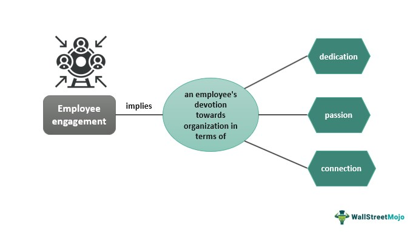

The allure of winning a jackpot, whether through gambling or a fortunate investment, captivates many. The idea of a sudden windfall can be both exhilarating and transformative, prompting dreams of financial freedom and security. In the world of finances, a jackpot traditionally signifies a substantial gain arising seemingly from nowhere—a perfect storm of opportunity and timing. In essence, winning a financial jackpot represents achieving significant returns in the face of unpredictability and chance.

Algorithmic trading, with its reliance on automated systems and predefined criteria to execute trades, offers an interesting parallel. Traders utilize algorithms to process vast amounts of data, execute trades with precision, and adapt to shifting market conditions—all within fractions of a second. This capability could be compared to a strategic gambling process, where mathematical models and historical data analyses are employed to capitalize on market inefficiencies. 



The intersection between these two concepts lies in their shared propensity for unpredictability. Understanding the mechanisms of jackpots and how they apply to algorithmic trading opens potential avenues for developing strategies that aim to mirror significant market movements and capture outsized returns. Algorithmic strategies might incorporate elements inspired by jackpot outcomes, involving calculated risks to seize rare but rewarding trading opportunities.

However, these jackpot-driven strategies necessitate a careful balancing act. While jackpots can yield large returns, they bring inherent risks and volatility. Traders must weigh psychological factors, such as risk tolerance and decision-making under uncertainty, as influenced by the possibility of substantial gains. Also, they need financial strategies that mitigate the impact of sudden gains, which could include planning for tax obligations and managing newfound wealth without veering into financial mismanagement.

Exploring these psychological and financial implications through the lens of algorithmic trading introduces a new perspective on how algorithmic strategies can adapt and evolve. By learning to embrace the unpredictable nature of jackpots, they could optimize trading outcomes and further shape the future of financial markets.

## Table of Contents

## Understanding Jackpot Mechanisms in Finance

In finance, the concept of a "jackpot" typically alludes to a sudden and substantial gain from an investment. This notion is not unlike winning a large lottery prize. At its core, a financial jackpot reflects fortuitous windfalls, where unpredictable, often one-time, events lead to extensive financial rewards in a short period. Historically, the term "jackpot" originates from gambling, where it refers to a large payout resulting from a particularly lucky turn of events or a series of wagers.

In the context of trading, a jackpot might manifest through various scenarios, such as a fortuitous IPO (Initial Public Offering) investment or a dramatic surge in a stock's value. These situations can lead to considerable, immediate returns for investors. Such financial occurrences are characterized by their unpredictability and suddenness, offering investors opportunities to capture significant profits. For example, an investor might experience a jackpot-like return if they invest in a company prior to its announcement of a groundbreaking product or innovation that significantly boosts the company's stock price.

However, these financial windfalls present unique challenges and considerations for investors. Among the issues are the tax implications that accompany sudden financial gains. Large, unexpected profits can lead to complex taxation scenarios, as investors must navigate capital gains taxes and potentially higher tax brackets. Moreover, the risk of financial mismanagement looms large, as investors may lack the experience or foresight to manage sudden increases in wealth effectively. Poor financial decisions following a jackpot win could quickly erode the newly acquired wealth.

The manner in which these jackpot mechanisms interact with trading strategies is a crucial aspect to consider, particularly in the context of [algorithmic trading](/wiki/algorithmic-trading). Algorithmic trading involves using automated software to execute trades based on predefined criteria. These algorithms can process vast amounts of data and identify potential opportunities for considerable gains. By understanding the mechanisms behind financial jackpots, algorithmic traders can develop strategies that aim to capture such rare, high-return opportunities while managing the associated risks. This involves not only recognizing the unpredictability of market conditions that could lead to jackpot-like outcomes but also implementing robust risk management tactics to safeguard against potential losses.

In summary, while financial jackpots offer the allure of significant gains akin to lottery wins, they require careful navigation to maximize their benefits and mitigate associated risks. Understanding how these mechanisms function and their role in trading strategies is central to leveraging them within algorithmic trading, creating potential pathways to harnessing such unpredictable financial opportunities.

## Algorithmic Trading: An Overview

Algorithmic trading involves utilizing automated software to execute trades based on pre-defined criteria, offering unparalleled speed and efficiency compared to manual trading methods. These algorithms, or "algos," process vast amounts of financial data swiftly and are capable of executing trades much faster than human traders. This ability allows them to capture market movements and capitalize on trading opportunities that might be missed by human participants due to slow reaction times or limited data processing capabilities.

Algos are designed to process a multitude of market indicators and execute trades based on specific triggers such as price movements, timing, or [volume](/wiki/volume-trading-strategy) levels. This level of automation and precision can be illustrated through algorithms that react instantaneously to high-frequency market fluctuations—smaller, rapid price changes that occur in milliseconds or less. As a result, algorithmic trading plays a substantial role in today's financial markets, contributing significantly to the [liquidity](/wiki/liquidity-risk-premium) and overall trading volume.

Traders are constantly exploring more sophisticated algorithms that incorporate a broader range of market influences, including economic indicators, global events, and even social media sentiment. These advanced algos are trained to recognize patterns and trends that extend beyond traditional technical analysis, often employing [machine learning](/wiki/machine-learning) techniques to adapt and improve decision-making criteria over time. Such adaptability enables these systems to not only follow established market trends but also anticipate shifts before they fully materialize.

The incorporation of jackpot-like mechanisms into algorithmic trading systems embodies both innovative strategies and complex challenges. The randomness akin to jackpot occurrences—unexpected market events with significant price movements—can be integrated into algorithms to diversify strategies and enhance profitability. However, the inherent unpredictability associated with these mechanisms necessitates the deployment of robust risk management strategies. Algos must adapt to not only capture potential financial windfalls from sudden market spikes but also mitigate exposure to resulting [volatility](/wiki/volatility-trading-strategies).

Understanding the fundamental aspects of algorithmic trading is essential for appreciating the potential impact of jackpot strategies within this context. By grasping how algorithms operate and process data, one can better understand how jackpot-like mechanisms might influence trading outcomes, presenting a unique fusion of high-risk, high-reward trading paradigms with automated decision-making systems.

## Impact of Jackpot Wins on Trading Algorithms

Algorithmic trading strategies have the potential to emulate the randomness and payout structures inherent in jackpot wins, offering an innovative approach to enhancing profitability. These strategies aim to capture large, albeit infrequent, gains by identifying and acting on market conditions that resemble the dynamics of a jackpot event. The concept rests on leveraging calculated risks that echo gambling, where the probability of a large payoff is coupled with the unpredictability of achieving that outcome.

The integration of jackpot-like mechanisms within algorithmic trading systems can increase potential returns, but it requires a careful balancing act. The inherent unpredictability synonymous with jackpots introduces heightened volatility into trading strategies. As such, risk management becomes a crucial element. To counteract potential adverse effects, these algorithms must employ sophisticated techniques, such as statistical analysis and machine learning models, to predict and react to market conditions.

Algorithms need to be adaptive and capable of recognizing and exploiting sudden market opportunities that resemble jackpot events. This requires an understanding of market sentiment and the capacity to process large volumes of data in real-time to detect anomalies or spikes indicative of a jackpot scenario.

For example, consider a simple algorithm designed to monitor stock price movements:

```python
import numpy as np

def detect_spike(prices, threshold=1.05):
    """
    Detects if the current price is a 'jackpot' spike above threshold.
    :param prices: List of historical prices
    :param threshold: Threshold factor for detecting a spike
    :return: Boolean indicating if a spike is detected
    """
    if not prices:
        return False
    current_price = prices[-1]
    mean_price = np.mean(prices)
    return current_price > mean_price * threshold

# Example usage
prices = [100, 102, 101, 103, 108]
print(detect_spike(prices))  # Returns True if a 'jackpot' spike is detected
```

This simplistic model evaluates whether the current price exceeds the mean price by a specified threshold, potentially indicating a spike similar to a jackpot win.

However, the allure of significant returns from such strategies can tempt traders to overlook the risks. Unexpected market movements can lead to substantial losses if not managed appropriately. Therefore, designing algorithms that synchronize the promise of high returns with robust risk management protocols is vital. It involves setting stop-loss limits, engaging in portfolio diversification, and regularly evaluating the performance metrics of the trading system.

In conclusion, while the incorporation of jackpot mechanisms presents remarkable opportunities for algorithmic trading, it also underscores the necessity for comprehensive risk management. By aligning trading strategies with these unpredictable dynamics, traders can position themselves to capitalize on seemingly random yet profitable market events.

## Challenges and Considerations

High-reward trading strategies that emulate jackpot mechanisms in financial markets present several regulatory and financial challenges. Such strategies, while offering the potential for significant returns, come with intricate complexities that traders and algorithm designers must carefully navigate.

One of the primary considerations involves the tax implications of sudden financial gains. In numerous jurisdictions, large windfalls from investments or trades could be subject to higher tax rates or special tax regulations. Thus, algorithmic frameworks need to incorporate mechanisms for tax optimization and compliance. This might involve timing strategies to manage gains across fiscal years or leveraging tax-advantaged accounts where applicable.

Furthermore, the sophistication required in algorithm design is crucial for distinguishing between genuine, sustainable opportunities and speculative bubbles. The ability to identify and react to market signals indicating either growth potential or imminent risk is fundamental to algorithmic trading. This differentiation requires advanced data analytics, including the use of machine learning models capable of processing large datasets to identify patterns and predict market movements with greater accuracy. Python libraries such as TensorFlow or scikit-learn can be instrumental for developing these models:

```python
import numpy as np
from sklearn.ensemble import RandomForestClassifier

# Example of using RandomForest to distinguish market patterns
def train_model(data, labels):
    model = RandomForestClassifier(n_estimators=100, random_state=42)
    model.fit(data, labels)
    return model

# Assuming `market_data` is the input data matrix and `target_labels` are the output categories
trained_model = train_model(market_data, target_labels)
```

Investors and traders must also consider the psychological dimensions of managing risk and reward. High-stakes strategies typically involve significant variability in returns, which can lead to emotional stress and irrational decision-making. Implementing psychological risk assessments and engaging with behavioral finance principles can provide valuable insights for developing robust trading practices that withstand emotional biases.

Building resilience against volatility is a critical aspect of these trading mechanisms. The unpredictability associated with jackpot-style returns can introduce substantial market swings, and without effective risk management, can lead to significant financial loss. Strategies such as hedging or using derivatives (e.g., options, futures) to mitigate risk exposure can be essential. Additionally, employing diversification techniques to spread risk across various asset classes or geographical regions can further stabilize returns.

In summary, while the integration of jackpot-like features in algorithmic trading presents exciting possibilities, it necessitates a comprehensive approach to risk management, compliance, and strategic sophistication. Addressing these challenges systematically is integral to leveraging such strategies effectively and sustainably in the financial markets.

## Conclusion

The concept of jackpots in trading strategies offers a unique perspective on the utilization of algorithmic approaches. These strategies, inspired by the unpredictability and potential high rewards associated with jackpots, can provide significant opportunities for returns. However, such potential comes with the requirement for meticulous planning and enhanced risk management. Algorithmic trading strategies designed to mimic jackpot mechanisms must incorporate sophisticated risk assessment techniques to manage the inherent volatility and unpredictability of markets.

As advancements in [artificial intelligence](/wiki/ai-artificial-intelligence) and machine learning continue to evolve, new methods for managing and predicting market dynamics are emerging. These technologies offer promising avenues to refine and harness the chaotic nature of market movements often associated with jackpot-like events. By leveraging these advancements, traders can potentially transform traditional risk management frameworks, allowing for more dynamic and adaptable strategies capable of capturing sudden market gains.

Aligning investment goals with these innovative strategies can lead to a redefinition of trading approaches, offering novel ways to achieve financial growth. By effectively exploring and understanding the intersection between jackpots and algorithmic trading, traders may gain a competitive advantage in the financial markets. This intersection could act as a catalyst for new trading paradigms, presenting unprecedented opportunities to those adept at navigating its complexities.

## References & Further Reading

[1]: Bergstra, J., Bardenet, R., Bengio, Y., & Kégl, B. (2011). ["Algorithms for Hyper-Parameter Optimization."](https://dl.acm.org/doi/10.5555/2986459.2986743) Advances in Neural Information Processing Systems 24.

[2]: ["Advances in Financial Machine Learning"](https://www.amazon.com/Advances-Financial-Machine-Learning-Marcos/dp/1119482089) by Marcos Lopez de Prado

[3]: ["Evidence-Based Technical Analysis: Applying the Scientific Method and Statistical Inference to Trading Signals"](https://www.amazon.com/Evidence-Based-Technical-Analysis-Scientific-Statistical/dp/0470008741) by David Aronson

[4]: ["Machine Learning for Algorithmic Trading"](https://github.com/stefan-jansen/machine-learning-for-trading) by Stefan Jansen

[5]: ["Quantitative Trading: How to Build Your Own Algorithmic Trading Business"](https://www.amazon.com/Quantitative-Trading-Build-Algorithmic-Business/dp/1119800064) by Ernest P. Chan