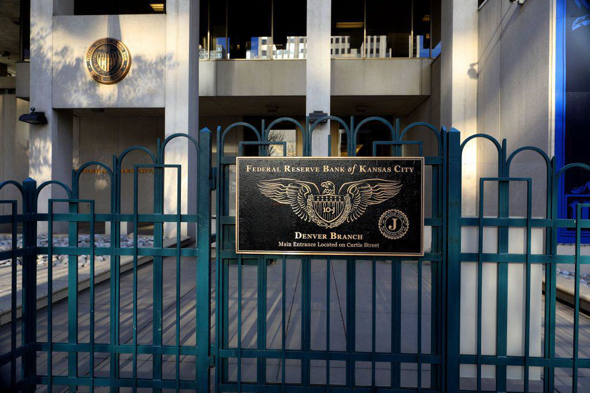

## Table of Contents

## What is the Jackson Hole Economic Symposium?

The Jackson Hole Economic Symposium is a yearly meeting where central bankers, finance experts, and academics from around the world come together. It happens in Jackson Hole, Wyoming, a place known for its beautiful nature. The event is organized by the Federal Reserve Bank of Kansas City. People go there to talk about important topics in economics and money.

At the symposium, participants discuss big issues like how to manage inflation, what's happening with the world economy, and new ideas in economic policy. It's a big deal because what is said there can influence what governments and banks do next. Sometimes, important announcements or new policies are shared at the event, which makes it very important for people who work in finance and economics.

## Where and when does the Jackson Hole Economic Symposium take place?

The Jackson Hole Economic Symposium happens in Jackson Hole, Wyoming. This place is known for its beautiful mountains and nature. The event is organized by the Federal Reserve Bank of Kansas City.

It takes place every year in late August. This timing is chosen because it's a good time for important people in finance and economics to meet and talk about big issues. They come together to discuss things like inflation, the world economy, and new ideas in economic policy.

## Who organizes the Jackson Hole Economic Symposium?

The Jackson Hole Economic Symposium is organized by the Federal Reserve Bank of Kansas City. They are in charge of putting the whole event together, from choosing the topics to inviting the guests.

The symposium happens every year in Jackson Hole, Wyoming. It's a special place because it's surrounded by beautiful nature, which makes it a nice spot for important people in finance and economics to meet and talk.

## Who typically attends the Jackson Hole Economic Symposium?

The Jackson Hole Economic Symposium attracts a lot of important people. These include central bankers, who are in charge of a country's money, from places like the United States, Europe, and Asia. Finance ministers, who help run a country's money matters, also come. Plus, there are many economists, who study how money and the economy work, and they come from universities and research groups.

There are also people from big banks and investment firms. They want to hear what the experts say because it can affect their work. Sometimes, journalists and reporters come too, because what happens at the symposium can be big news. Everyone comes together to talk about important topics like inflation, the world economy, and new ideas in economic policy.

## What topics are usually discussed at the Jackson Hole Economic Symposium?

At the Jackson Hole Economic Symposium, people talk about big money and economy issues. One main topic is inflation, which is when prices go up. They discuss how to control it and what it means for everyone. Another big topic is the world economy. They look at how different countries' economies are doing and how they affect each other. They also talk about things like trade, jobs, and how money moves around the world.

Another important thing they discuss is new ideas in economic policy. This means they talk about new ways to make the economy better. They might talk about how to help people save money, how to make businesses grow, or how to make sure everyone has a job. These discussions help leaders make better decisions for their countries.

Sometimes, they also talk about special topics that are important at that time. For example, they might discuss how technology is changing the economy or how to deal with big problems like climate change. These talks help everyone understand what's happening and what they can do about it.

## How does the Jackson Hole Economic Symposium influence global economic policy?

The Jackson Hole Economic Symposium is a big meeting where important people talk about money and the economy. When they share their ideas and plans, it can change what governments and banks do around the world. For example, if a central banker says they will change interest rates, it can affect how much it costs to borrow money everywhere. This is because other countries might decide to do the same thing to keep their economies strong.

The talks at the symposium also help everyone understand big problems better. When experts discuss things like inflation or the world economy, they come up with new ideas on how to fix them. These ideas can lead to new laws or policies that countries use to make their economies better. So, what is said at Jackson Hole can guide how leaders make decisions that affect people's lives, like jobs and prices.

## Can you explain the historical significance of the Jackson Hole Economic Symposium?

The Jackson Hole Economic Symposium started in 1978 and has become a very important event over the years. It was created by the Federal Reserve Bank of Kansas City as a place for central bankers, economists, and finance experts to talk about big money and economy issues. At first, it was just a small meeting, but it grew bigger and more important because the talks there helped shape what governments and banks did around the world.

Over time, the symposium has had a big impact on global economic policy. Important announcements and new ideas shared at Jackson Hole have led to changes in how countries manage their money. For example, in 2010, the Federal Reserve announced a new plan to help the economy recover from a big financial crisis. This announcement, made at the symposium, influenced what other countries did to help their own economies. Because of moments like this, the Jackson Hole Economic Symposium is now seen as a key event where big decisions that affect everyone's lives are made.

## What are some key speeches or events that have occurred at the Jackson Hole Economic Symposium?

One of the most famous speeches at the Jackson Hole Economic Symposium happened in 2010. Ben Bernanke, who was the head of the Federal Reserve at the time, talked about a new plan to help the economy get better after a big financial crisis. He said they would buy a lot of government bonds to put more money into the economy. This plan, called "quantitative easing," was a big deal because it helped the U.S. economy recover and influenced what other countries did to help their own economies.

Another important moment was in 2014 when Janet Yellen, who became the head of the Federal Reserve, gave a speech about how the economy was doing and what the Fed might do next. She talked about how they might start raising interest rates, which is a big decision because it affects how much it costs to borrow money. Her speech helped people understand what the Fed was thinking and what might happen next, which is important for everyone who works with money.

In 2020, during the COVID-19 pandemic, Jerome Powell, the current head of the Federal Reserve, spoke about how the virus was affecting the economy and what the Fed was doing to help. He talked about keeping interest rates low and buying bonds to support the economy. This speech was important because it showed how the Fed was trying to help during a very tough time, and it gave people hope that things would get better.

## How does the Jackson Hole Economic Symposium impact financial markets?

The Jackson Hole Economic Symposium can have a big effect on financial markets because important people talk about money and the economy there. When central bankers or other leaders share their plans or ideas, it can make stock prices, interest rates, and money exchange rates change. For example, if someone says they will raise interest rates, it might make borrowing money more expensive, so people might sell stocks and buy bonds instead. This can cause the stock market to go down and the bond market to go up.

Also, the talks at the symposium help everyone understand what might happen next in the economy. If experts say they think inflation will go up, people might start buying things that protect against inflation, like gold or special kinds of bonds. This can make the prices of those things go up. Because the symposium is so important, what is said there can make people in the financial markets act quickly, causing big changes in a short time.

## What role does the Jackson Hole Economic Symposium play in monetary policy?

The Jackson Hole Economic Symposium is a big meeting where people who control money and the economy talk about important things. It helps shape what central banks do with their money rules, which is called monetary policy. When leaders like the heads of the Federal Reserve speak at the symposium, they might say they are going to change interest rates or do something else to help the economy. This can affect what other countries do with their money too, because they want to keep their economies strong.

The talks at the symposium also help everyone understand big money problems better. Experts share new ideas on how to control things like inflation, which is when prices go up. These ideas can lead to new rules or plans that central banks use to make the economy better. Because the symposium is so important, what is said there can guide how leaders make decisions that affect everyone's lives, like how much it costs to borrow money or how much things cost in stores.

## How has the focus of the Jackson Hole Economic Symposium evolved over the years?

When the Jackson Hole Economic Symposium started in 1978, it was a small meeting for people to talk about money and the economy. At first, the talks were about things like how to control inflation and make the economy grow. Over the years, as more important people started coming, the symposium grew bigger and the topics got more varied. It became a place where big ideas and new ways to help the economy were shared. For example, in the 1980s and 1990s, they talked a lot about how to keep prices stable and how to make trade better between countries.

As time went on, the symposium started focusing on bigger global issues. In the 2000s, after big financial problems like the 2008 crisis, the talks were about how to fix the economy and stop future crises. Leaders like Ben Bernanke shared plans like "quantitative easing" to help the economy recover. More recently, topics like climate change and how technology changes the economy have been discussed. The symposium has become a key event where leaders can share ideas and plans that affect what governments and banks do around the world.

## What are the criticisms or controversies surrounding the Jackson Hole Economic Symposium?

Some people think the Jackson Hole Economic Symposium is too focused on big, rich countries like the United States and Europe. They say it doesn't talk enough about problems in poorer countries. This can make it seem like the symposium only cares about what's good for rich places, not the whole world. Critics also say that the people who come to the symposium are mostly from big banks and government, so it might not hear new ideas from smaller groups or people who think differently.

Another criticism is about how much power the symposium has. Because important people say big things there, it can affect what happens with money and the economy around the world. Some people worry that this power is too much and that it's not fair for a few people to make decisions that affect everyone. They think the symposium should be more open to different voices and ideas to make sure it's fair for everyone.

## References & Further Reading

[1]: Bernanke, B. S. (2004). ["Central Bank Talk and Monetary Policy"](https://www.federalreserve.gov/boarddocs/speeches/2004/200410072/default.htm). Speech at the American Economic Association. 

[2]: Clarida, R., Galí, J., & Gertler, M. (1999). ["The Science of Monetary Policy: A New Keynesian Perspective."](https://www.nber.org/papers/w7147) Journal of Economic Literature, 37(4), 1661-1707.

[3]: Fleming, M. J., & Ruela, F. (2020). ["Treasury Market Liquidity during the COVID-19 Crisis."](https://libertystreeteconomics.newyorkfed.org/2020/04/treasury-market-liquidity-during-the-covid-19-crisis/) Federal Reserve Bank of New York Staff Reports, No. 927.

[4]: Yellen, J. (2016). ["The Federal Reserve's Monetary Policy Toolkit: Past, Present, and Future"](https://www.federalreserve.gov/newsevents/speech/yellen20160826a.htm). Speech at the Jackson Hole Economic Symposium.

[5]: Alonso, I., & Benito, J. (2016). ["Algorithmic and High-Frequency Trading in Dynamic Limit Order Markets"](https://www.researchgate.net/publication/272242219_Algorithmic_and_High_Frequency_Trading_in_Dynamic_Limit_Order_Markets). Banco de Portugal Working Papers.