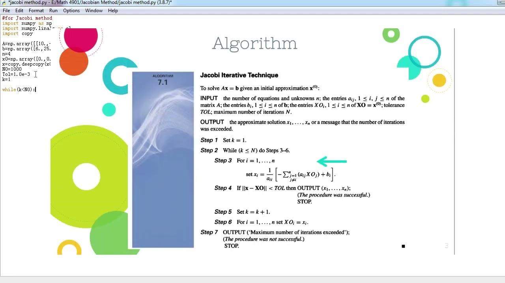

## Table of Contents

## What is the Jacobi method and why is it used?

The Jacobi method is a way to solve a set of equations where you have many unknowns. Imagine you have a bunch of equations, and each equation has a lot of variables. The Jacobi method helps you find the values of these variables by making guesses and improving those guesses over time. You start with an initial guess for each variable, then use the equations to update these guesses step by step until you get close enough to the real answers.

This method is used because it's simple and works well for certain types of problems, especially when the equations are set up in a special way, like in a grid. It's particularly useful in fields like engineering and physics, where you might need to solve big systems of equations. However, it can be slow and might not always work perfectly, so people often use it as a starting point before trying more advanced methods.

## How does the Jacobi method work to solve a system of linear equations?

The Jacobi method works by taking an initial guess for the solution of a system of linear equations and then improving that guess step by step. Let's say you have a bunch of equations, and each equation has variables like x, y, and z. You start by guessing what x, y, and z might be. Then, you use each equation to find a new, better guess for each variable. For example, if one equation is 3x + 2y + z = 10, you can solve for x if you already have guesses for y and z. You do this for all the variables, using the latest guesses to find new ones.

You keep repeating this process, updating your guesses over and over again. Each time you go through all the equations, you get closer to the real solution. It's like climbing a hill: you take a step, look around, and then take another step in the direction that seems to be going up. Eventually, your guesses stop changing much, which means you're close to the actual solution. The Jacobi method is great because it's easy to understand and use, but it can take a lot of steps to get to the answer, especially for big systems of equations.

## What are the basic steps to implement the Jacobi method in Python?

To implement the Jacobi method in Python, you first need to set up your system of equations in a way that the computer can understand. This means turning your equations into a matrix, which is like a grid of numbers, and a vector, which is a list of numbers. You also need to decide how many times you want to repeat the process, called iterations, and how close you want your answer to be to the real solution, called tolerance. Start by making an initial guess for all the variables. Then, write a loop that goes through each equation, using the current guesses to find new ones. Keep track of how much your guesses change each time, and stop when the change is smaller than your tolerance or when you've done the maximum number of iterations.

In the loop, for each equation, you solve for one variable at a time, using the latest guesses for the other variables. For example, if you have the equation 3x + 2y + z = 10, and you already have guesses for y and z, you can solve for x by rearranging the equation to x = (10 - 2y - z) / 3. After you've updated all the variables, you check if the difference between the new guesses and the old ones is small enough. If it is, you've found a good enough solution, and you can stop. If not, you go through the loop again with your new guesses. This process keeps going until you reach your stopping criteria.

## How can NumPy be used to enhance the implementation of the Jacobi method?

NumPy can make the Jacobi method easier and faster to use. It's like a special toolbox for numbers that helps you do math quickly. With NumPy, you can turn your equations into a big grid of numbers, called a matrix, and a list of numbers, called a vector, really easily. You can also use NumPy to do all the math you need for the Jacobi method, like adding, subtracting, and dividing numbers, all at once. This means you don't have to write out all the steps yourself, which saves time and makes your code cleaner.

Using NumPy also helps you keep track of how close you are to the right answer. You can use its functions to see how much your guesses change each time you go through the loop. If the change is small enough, you know you're close to the solution. Plus, NumPy can help you do the Jacobi method on really big sets of equations without slowing down too much. So, it makes the whole process smoother and more efficient.

## What are the key differences between the Jacobi method and other iterative methods like Gauss-Seidel?

The Jacobi method and the Gauss-Seidel method are both ways to solve big sets of math problems, but they do it a bit differently. In the Jacobi method, you use all the old guesses to make new guesses for all the variables at the same time. You wait until you have new guesses for every variable before you use any of them. On the other hand, the Gauss-Seidel method is a bit smarter. It uses the new guesses as soon as they're ready. So, if you just found a new guess for one variable, you use that new guess right away to find the next new guess. This can make the Gauss-Seidel method faster because it's always using the latest information.

Another big difference is how they work with the math problems. The Jacobi method needs all the equations to be set up in a special way, where the main numbers (the ones in front of the variables) are big enough compared to the other numbers. If they're not, the Jacobi method might not work well. The Gauss-Seidel method can be a bit more flexible with this, but it still needs the equations to be set up in a certain way. Both methods are used a lot in science and engineering, but the Gauss-Seidel method often gets to the answer faster because it uses the new guesses right away.

## How do you determine the convergence of the Jacobi method?

To figure out if the Jacobi method is working and getting closer to the right answer, you need to see if it's converging. Convergence means that with each step, your guesses are getting closer and closer to the true solution. You can check this by looking at how much your guesses change from one step to the next. If the changes get smaller and smaller, the method is converging. You can set a rule, like saying the method has converged if the change is less than a tiny number, called the tolerance.

The Jacobi method will converge if the equations are set up in a special way. The main numbers in front of the variables, called the diagonal elements, need to be bigger than the sum of the other numbers in their rows. If this is true, then the Jacobi method will slowly but surely get to the right answer. But if the equations aren't set up right, the method might not work, and your guesses might not get any closer to the solution. So, it's important to check the setup of your equations before you start using the Jacobi method.

## What are the conditions under which the Jacobi method is guaranteed to converge?

The Jacobi method will keep getting closer to the right answer if the equations are set up in a special way. This special way is called diagonal dominance. It means that for each equation, the number in front of the main variable (the diagonal element) is bigger than the sum of all the other numbers in that equation. If every equation in your set is set up like this, then the Jacobi method is guaranteed to work and will slowly but surely find the right answer.

But if the equations aren't set up with diagonal dominance, the Jacobi method might not work at all. Your guesses might not get any closer to the solution, and you could keep guessing forever without finding the right answer. So, before you start using the Jacobi method, it's really important to check if your equations meet this special condition. If they don't, you might need to try a different method to solve your problem.

## How can you optimize the Jacobi method implementation in Python for better performance?

To make the Jacobi method run faster in Python, you can use NumPy, which is like a special tool for doing math quickly. NumPy lets you do many calculations at the same time, instead of one by one. This means you can update all your guesses for the variables in one go, which is much faster than doing it one at a time. Also, NumPy can help you keep track of how much your guesses are changing, so you can stop the method when you're close enough to the answer. This makes the whole process smoother and more efficient.

Another way to speed up the Jacobi method is by using a technique called vectorization. Instead of writing a loop that goes through each equation and updates the guesses one by one, you can use NumPy to do all the updates at once. This can make your code run much faster, especially if you have a lot of equations. Also, you can use something called parallel processing, where you use more than one part of your computer to work on the problem at the same time. This can make the Jacobi method even quicker, especially for really big sets of equations.

## What are common pitfalls or errors to avoid when using the Jacobi method in Python?

When using the Jacobi method in Python, one common mistake is not checking if your equations are set up right. The Jacobi method works best when the main numbers in front of the variables are bigger than the other numbers in their rows. If they're not, the method might not work at all, and your guesses won't get closer to the right answer. So, always make sure your equations meet this special condition before you start.

Another pitfall is not using the right tools to make your code run faster. Python has a special tool called NumPy that can help you do math quickly. If you don't use NumPy, your code might be slow, especially if you have a lot of equations. Also, be careful with how you set up your loops. If you write them the wrong way, they can make your code run slower than it needs to. Always try to use NumPy to do as much math at once as you can, instead of doing it one step at a time.

## How can you handle sparse matrices effectively with the Jacobi method using NumPy?

When you're working with the Jacobi method and you have a lot of zeros in your equations, you're dealing with something called a sparse matrix. In Python, you can use NumPy to handle these sparse matrices more easily. NumPy has special tools that let you store and work with these matrices without using up too much memory. This is important because when you have a lot of zeros, you don't want to waste space storing them all. Instead, you can use NumPy's sparse matrix functions to only store the numbers that aren't zero, which makes everything faster and more efficient.

To use the Jacobi method with sparse matrices in NumPy, you first need to set up your sparse matrix using NumPy's special functions. Once you have your matrix set up, you can use it in the Jacobi method just like you would with a regular matrix. But because it's sparse, NumPy will do the math much faster. You'll still go through the same steps of making guesses and updating them, but now you're doing it in a way that's kinder to your computer's memory and speed. This means you can solve bigger problems without slowing down too much.

## What advanced techniques can be applied to improve the accuracy of the Jacobi method?

To make the Jacobi method more accurate, you can use something called preconditioning. This means you change your equations a bit before you start solving them. You do this by multiplying your equations by a special matrix that makes the main numbers in front of the variables even bigger. This helps the Jacobi method work better because it makes the equations more like what the method likes best. By doing this, you can get to the right answer faster and more accurately.

Another way to improve accuracy is by using a technique called over-relaxation. This means you don't just use the new guesses from the Jacobi method as they are. Instead, you mix them with the old guesses in a special way. You can choose how much you want to mix them by [picking](/wiki/asset-class-picking) a number called the relaxation [factor](/wiki/factor-investing). If you pick the right number, this can make the Jacobi method find the right answer even faster and more accurately. It's like fine-tuning your method to get the best results possible.

## How can the Jacobi method be parallelized using Python and NumPy for large-scale problems?

To make the Jacobi method faster for big problems, you can use something called parallel processing. This means you use more than one part of your computer to work on the problem at the same time. In Python, you can use a tool called multiprocessing to do this. You split your equations into smaller groups and let different parts of your computer work on each group. Then, you bring all the answers back together. With NumPy, you can set up your equations and guesses easily and use its functions to do the math quickly on each part of your computer. This way, you can solve really big sets of equations much faster than if you did it all on one part of your computer.

Another way to speed up the Jacobi method is by using NumPy's vectorized operations. Instead of going through each equation one by one, you can update all your guesses at the same time. This makes your code run much faster, especially when you're working with a lot of equations. When you combine this with parallel processing, you can make the Jacobi method even quicker. You set up your sparse matrices with NumPy, use its functions to do the math, and then let different parts of your computer work on different pieces of the problem. This can make solving big problems a lot easier and faster.

## What is the Jacobi Method and how can it be understood?

The Jacobi Method is a prominent iterative technique employed to solve systems of linear equations, widely used across various computational fields. The method is named after the 19th-century German mathematician Carl Gustav Jacobi, who contributed significantly to the theory of determinants and eigenvalues, among other areas. This iterative algorithm numerically solves equations by continuously refining approximations until achieving a satisfactory level of accuracy.

At its core, the Jacobi Method is particularly advantageous when addressing large matrices, as it transforms complex computations into a series of simpler iterations. This makes it an ideal choice for handling massive datasets commonly encountered in computational tasks. Additionally, the method's iterative nature allows for parallel execution, enhancing its efficiency for certain types of problems.

**Mathematical Foundations**

The Jacobi Method operates on a system of linear equations represented in matrix form as $Ax = b$, where $A$ is a non-singular matrix, $x$ is the vector of unknowns, and $b$ is the known vector. The method assumes that matrix $A$ can be decomposed into a diagonal component $D$, and strictly lower and upper triangular components $L$ and $U$, respectively. Thus, the equation can be rewritten as:

$$
Ax = (D + L + U)x = b
$$

Rearranging terms gives the iterative formula:

$$
x^{(k+1)} = D^{-1}(b - (L + U)x^{(k)})
$$

The iterative process involves calculating successive approximations $x^{(k+1)}$ by solving for the diagonal matrix $D$. Each iteration refines the solution, and the process repeats until convergence, i.e., when changes between successive approximations fall below a specified threshold.

**Iteration Steps**

1. **Initial Guess**: Begin with an initial guess $x^{(0)}$ for the solution vector. This guess can be arbitrary, but reasonable approximations may enhance convergence speed.

2. **Iterative Updates**: For each iteration $k$, compute the new approximation $x^{(k+1)}$ by applying the formula provided:

   For each component $i = 1, 2, \ldots, n$:
$$
   x_i^{(k+1)} = \frac{1}{a_{ii}} \left( b_i - \sum_{j=1, j \neq i}^n a_{ij}x_j^{(k)} \right)

$$
   Here, $a_{ii}$ represents the diagonal elements of $A$, and $a_{ij}$ are the off-diagonal elements.

3. **Convergence Check**: Evaluate the difference between the current and previous approximations. If the difference is below a set tolerance level, the process can halt, and the solution $x^{(k+1)}$ is obtained.

**Effectiveness**

The Jacobi Method is efficient for certain conditions, notably when $A$ is diagonally dominant, which ensures convergence. A diagonally dominant matrix $A$ satisfies $|a_{ii}| \geq \sum_{j \neq i} |a_{ij}|$ for each row. This condition aids in guaranteeing convergence to the actual solution.

**Limitations**

Despite its utility, the Jacobi Method might not converge for every system, especially for non-diagonally dominant matrices. In such cases, alternative iterative methods like the Gauss-Seidel Method or other numerical techniques may be preferred.

Through understanding its principles and execution, the Jacobi Method provides a valuable tool for solving linear systems, enhancing computation across various domains. Its implementation offers insights into efficient numerical computation, paving the way for advanced algorithmic applications.

## How can you implement the Jacobi Method in Python?

Python's versatility and extensive libraries make it a preferred choice for implementing computational algorithms like the Jacobi Method in [algorithmic trading](/wiki/algorithmic-trading). Implementing the Jacobi Method involves iterating to solve systems of linear equations, and Python’s simplicity and the availability of scientific libraries facilitate this process.

### Step-by-Step Guide to Implementing the Jacobi Method in Python

The Jacobi Method is an iterative algorithm that approximates the solutions to a linear system of equations. Consider a system of $n$ linear equations in $n$ variables, represented as $Ax = b$, where $A$ is the coefficient matrix, $x$ is the vector of unknowns, and $b$ is the constant vector.

**Step 1: Initialize Parameters**

To implement the Jacobi Method, begin by defining the coefficient matrix $A$, the constant vector $b$, and an initial guess for the solution vector $x$. The iteration will continue until the solutions converge within a specified tolerance.

```python
import numpy as np

def jacobi_method(A, b, x_init, tolerance=1e-10, max_iterations=1000):
    n = len(b)
    x = x_init.copy()
    x_new = np.zeros_like(x)
    iteration = 0
```

**Step 2: Iterative Process**

The key step involves iterating over each element to update the estimates of each variable based on the current estimates of all the other variables:

$$
x_i^{(k+1)} = \frac{1}{a_{ii}} \left(b_i - \sum_{{j=0, j\neq i}}^{n} a_{ij} x_j^{(k)}\right)
$$

This formula is used in each iteration until the solution converges.

```python
    while iteration < max_iterations:
        for i in range(n):
            s = sum(A[i][j] * x[j] for j in range(n) if j != i)
            x_new[i] = (b[i] - s) / A[i][i]

        # Check for convergence
        if np.linalg.norm(x_new - x) < tolerance:
            break

        x = x_new.copy()
        iteration += 1
```

**Step 3: Return the Solution**

Once the solution vector has converged to within the specified tolerance, or the maximum number of iterations has been reached, return the solution.

```python
    return x_new, iteration
```

### Challenges and Pitfalls

Implementing the Jacobi Method requires ensuring that the matrix $A$ strictly or diagonally dominant, which is a common condition for convergence. If this property does not hold, the method may not converge.

Other considerations include:

- **Convergence Speed**: The Jacobi Method may converge slowly for large or ill-conditioned matrices. Consider the use of the Gauss-Seidel or Successive Over-Relaxation methods for potentially faster convergence.
- **Numerical Stability**: Large floating-point rounding errors can accumulate during iterations, especially for ill-conditioned matrices. Use high precision data types if required.
- **Initial Guess**: Provide a reasonable initial guess to promote faster convergence, though the method is generally robust to the initial guess.

By following these steps, traders and developers can implement the Jacobi Method in Python, enabling efficient solutions to linear systems in trading algorithms. This algorithm forms a core tool in Python-driven trading strategies, optimizing complex numerical computations essential in financial analysis.

## References & Further Reading

[1]: Bai, Z., Demmel, J., Dongarra, J., Ruhe, A., & van der Vorst, H. (2000). ["Templates for the Solution of Algebraic Eigenvalue Problems: A Practical Guide."](https://epubs.siam.org/doi/book/10.1137/1.9780898719581) SIAM.

[2]: Quarteroni, A., Sacco, R., & Saleri, F. (2007). ["Numerical Mathematics."](https://link.springer.com/book/10.1007/b98885) Springer.

[3]: Trefethen, L. N., & Bau, D. (1997). ["Numerical Linear Algebra."](https://davidtabora.files.wordpress.com/2015/01/lloyd_n-_trefethen_david_bau_iii_numerical_line.pdf) SIAM.

[4]: Thomas, G. B., & Thomas, A. M. (2011). ["Numerical Analysis and Optimization."](https://academic.oup.com/book/52870) Oxford University Press.

[5]: Stefánsson, G. (2017). ["Algorithmic Trading and Financial Prediction Using Machine Learning."](https://github.com/stefan-jansen/machine-learning-for-trading) University of Iceland.