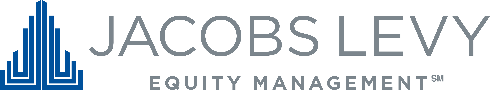

## Table of Contents

## What is Jacobs Levy Equity Management?

Jacobs Levy Equity Management is a company that helps big investors, like pension funds and insurance companies, manage their money. They use a special way of choosing stocks and other investments that involves looking at a lot of data and using computers to make decisions. This method is called quantitative investing. The company was started by Bruce Jacobs and Kenneth Levy in 1986, and they have grown to be one of the biggest firms doing this kind of investing.

The main thing Jacobs Levy does is try to pick investments that will do better than the average. They use math and computers to find patterns and make predictions about which stocks might go up in value. This helps their clients, who are usually big organizations, to grow their money over time. The company is known for being very good at what they do and for using new technology and ideas to keep improving their methods.

## When was Jacobs Levy Equity Management founded?

Jacobs Levy Equity Management was founded in 1986. It was started by two people named Bruce Jacobs and Kenneth Levy. They wanted to help big investors like pension funds and insurance companies manage their money better.

The company uses a special way of choosing investments called quantitative investing. This means they use a lot of data and computers to pick stocks that they think will do well. They are known for being good at this and for always trying to use new technology and ideas to get even better.

## Who are the founders of Jacobs Levy Equity Management?

The founders of Jacobs Levy Equity Management are Bruce Jacobs and Kenneth Levy. They started the company in 1986. Bruce and Kenneth wanted to help big investors like pension funds and insurance companies manage their money better.

They use a special way of choosing investments called quantitative investing. This means they use a lot of data and computers to pick stocks that they think will do well. They are known for being good at this and for always trying to use new technology and ideas to get even better.

## What types of investment strategies does Jacobs Levy Equity Management employ?

Jacobs Levy Equity Management uses a strategy called quantitative investing. This means they use math and computers to pick stocks and other investments. They look at a lot of data to find patterns and make predictions about which stocks might go up in value. This helps them choose investments that they think will do better than the average.

Their main goal is to help big investors like pension funds and insurance companies grow their money over time. They are always trying to use new technology and ideas to improve their methods. This makes them one of the biggest and most respected firms in quantitative investing.

## How does Jacobs Levy Equity Management approach quantitative investing?

Jacobs Levy Equity Management uses a special way of [picking](/wiki/asset-class-picking) investments called quantitative investing. This means they use math and computers to look at a lot of data. They try to find patterns and make predictions about which stocks might go up in value. This helps them choose investments that they think will do better than the average. They do this to help big investors like pension funds and insurance companies grow their money over time.

They are always trying to use new technology and ideas to make their methods better. This makes them one of the biggest and most respected firms in quantitative investing. By using a lot of data and computers, they can make smart choices about where to invest money. This approach helps their clients, who are usually big organizations, to see their investments grow.

## What are some of the key products offered by Jacobs Levy Equity Management?

Jacobs Levy Equity Management offers different products to help big investors like pension funds and insurance companies. One of their main products is called "U.S. Equity Strategies." This product uses their special way of picking stocks, called quantitative investing, to find the best stocks in the U.S. They look at a lot of data and use computers to make smart choices about which stocks to buy.

Another product they offer is "Global Equity Strategies." This product is similar to the U.S. one, but it looks at stocks all over the world. They use the same quantitative investing method to pick stocks from different countries. This helps their clients spread their investments around the world, which can be safer and help them grow their money even more.

## How has Jacobs Levy Equity Management performed historically?

Jacobs Levy Equity Management has done well over the years. They have helped big investors like pension funds and insurance companies grow their money. They use a special way of picking stocks called quantitative investing. This means they use math and computers to look at a lot of data and find the best stocks. Their methods have helped them do better than many other companies in the same business.

Over time, Jacobs Levy has been able to keep up good performance. They are always trying to use new technology and ideas to make their methods better. This has helped them stay one of the biggest and most respected firms in quantitative investing. Their clients, who are usually big organizations, have seen their investments grow thanks to Jacobs Levy's smart choices.

## What is the firm's approach to risk management?

Jacobs Levy Equity Management takes risk management very seriously. They use their special way of picking stocks, called quantitative investing, to help manage risk. This means they use math and computers to look at a lot of data. They try to find patterns and make predictions about which stocks might go up or down in value. By doing this, they can choose investments that they think will do well but also be careful about the risks.

They also spread out their investments to manage risk. This means they don't put all their money into just one stock or one type of investment. Instead, they invest in many different stocks and in different countries. This helps them because if one investment does badly, the others might do well and balance it out. By using these methods, Jacobs Levy tries to grow their clients' money while also keeping it safe.

## How does Jacobs Levy Equity Management integrate ESG factors into its investment process?

Jacobs Levy Equity Management cares about the environment, social issues, and how companies are run, which are called [ESG](/wiki/esg-investing) factors. They use these factors in their special way of picking stocks, called quantitative investing. This means they use math and computers to look at a lot of data, including ESG data. They try to find patterns and make predictions about which stocks might do well while also being good for the world.

They look at things like how a company treats its workers, how it affects the environment, and if it follows good rules and laws. By including these ESG factors, Jacobs Levy tries to pick investments that not only grow their clients' money but also help make the world a better place. This way, they can help big investors like pension funds and insurance companies invest in a way that is good for both their wallets and the planet.

## What technological innovations has Jacobs Levy Equity Management implemented in its operations?

Jacobs Levy Equity Management uses a lot of new technology to help them pick the best stocks for their clients. They use special computer programs to look at a lot of data quickly. This helps them find patterns and make smart choices about which stocks to buy. They also use something called [machine learning](/wiki/machine-learning), which is when computers learn from the data they see and get better at making predictions over time. This makes their way of picking stocks, called quantitative investing, even better.

They also have a strong focus on keeping their technology up to date. They are always looking for new ways to use technology to improve their methods. This includes using big data, which means looking at huge amounts of information, and cloud computing, which helps them store and process data more easily. By staying on top of new technology, Jacobs Levy can keep helping their clients grow their money in a smart and efficient way.

## How does Jacobs Levy Equity Management's research process contribute to its investment decisions?

Jacobs Levy Equity Management's research process is a big part of how they pick investments. They use a special way of choosing stocks called quantitative investing, which means they use math and computers to look at a lot of data. They do a lot of research to find patterns and make predictions about which stocks might go up in value. This helps them choose investments that they think will do better than the average. Their research includes looking at things like how companies are doing, what's happening in the economy, and even how the world is changing. By doing all this research, they can make smart choices about where to invest their clients' money.

Their research also helps them stay ahead of other companies. Jacobs Levy is always trying to use new ideas and technology to make their research better. They use things like machine learning, which is when computers learn from the data they see and get better at making predictions over time. This means their research is always improving, which helps them pick the best stocks. By keeping their research process strong and up to date, Jacobs Levy can help big investors like pension funds and insurance companies grow their money in a smart way.

## What are the future growth strategies and market expansion plans of Jacobs Levy Equity Management?

Jacobs Levy Equity Management is always looking for ways to grow and expand. They want to help more big investors like pension funds and insurance companies. One of their main plans is to keep improving their special way of picking stocks, called quantitative investing. They do this by using new technology and ideas. They also want to reach more clients around the world. This means they might open new offices in different countries or work with more international investors. By doing these things, they hope to grow their business and help more people manage their money better.

Another part of their growth strategy is to keep their research process strong. They do a lot of research to find the best stocks for their clients. They use math and computers to look at a lot of data and find patterns. They also want to keep using new technology like machine learning to make their research even better. This will help them pick the best investments and stay ahead of other companies. By focusing on these areas, Jacobs Levy Equity Management hopes to keep growing and helping their clients see their money grow over time.

## References & Further Reading

[1]: ["Algorithmic Trading and DMA: An Introduction to Direct Access Trading Strategies"](https://www.amazon.com/Algorithmic-Trading-DMA-introduction-strategies/dp/0956399207) by Barry Johnson

[2]: ["Quantitative Equity Portfolio Management: An Active Approach to Portfolio Construction and Management"](https://www.amazon.com/Quantitative-Equity-Portfolio-Management-Construction/dp/0071459391) by Ludovic Phalippou, Bruce Jacobs, and Kenneth Levy

[3]: ["Advances in Financial Machine Learning"](https://www.amazon.com/Advances-Financial-Machine-Learning-Marcos/dp/1119482089) by Marcos Lopez de Prado

[4]: ["The Man Who Solved the Market: How Jim Simons Launched the Quant Revolution"](https://www.amazon.com/Man-Who-Solved-Market-Revolution/dp/073521798X) by Gregory Zuckerman

[5]: Treleaven, P., Galas, M., & Vidhi, P. (2013). ["Algorithmic trading review."](https://dl.acm.org/doi/10.1145/2500117) Communications of the ACM. 

[6]: Fritz, B., Mitarbeitern, I., & Weitzel, T. (2009). ["High Frequency Trading"](https://papers.ssrn.com/sol3/papers.cfm?abstract_id=2108344) ACM Transactions on Management Information Systems.