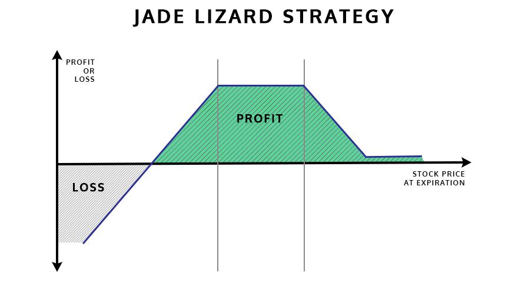

The Jade Lizard strategy presents a distinctive approach to options trading, integrating components of both a short put and a short call spread. This strategy is constructed to capitalize on volatility within the market, offering traders an opportunity to profit from premium collection, provided certain conditions are met. Particularly, it suits traders who maintain a neutral to bullish perspective, making it advantageous for environments characterized by limited price fluctuations or range-bound movements.

This article will discuss the intricacies of the Jade Lizard strategy, including its operational mechanics, potential benefits, and inherent risks. The strategy's structure is specifically tailored to take advantage of sideways markets, where the potential for upward movement is present. Additionally, the article will explore how the Jade Lizard strategy is increasingly being utilized within the context of algorithmic trading. Algorithmic trading systems allow for the automation of complex trading strategies, like the Jade Lizard, thus enhancing precision and optimization in a trader's portfolio management.



The rise of algorithmic trading underscores the need for understanding multifaceted strategies to gain a competitive advantage. By effectively employing algorithmic methods, traders can systematically apply the Jade Lizard strategy, ensuring precision in timing and execution while managing associated risks. As such, a thorough comprehension of this strategy can provide traders with enhanced abilities to optimize their stock and options portfolios, maximizing potential returns while minimizing unnecessary exposure.

## Table of Contents

## What is the Jade Lizard Options Strategy?

The Jade Lizard options strategy is a sophisticated method that aims to generate income through the strategic collection of premium. This strategy involves two primary components: a short put and a short call spread. It is particularly well-suited for traders who maintain a neutral to bullish market outlook, allowing them to capitalize on markets that exhibit sideways movements with the potential for upward price shifts.

To construct a Jade Lizard, a trader simultaneously engages in the following transactions:

1. **Selling an Out-of-the-Money (OTM) Put Option**: This part of the strategy aims to collect premium income by selling a put option that is below the current market price of the underlying asset. This position benefits if the underlying asset's price remains above the strike price of the sold put, as it expires worthless, allowing the trader to keep the premium.

2. **Establishing an OTM Call Spread**: This involves selling a call option and buying another call option with a higher strike price. The difference between these two call options forms the spread.

The collective outcome of these positions is the receipt of a net premium, which represents the potential profit at expiration. A unique characteristic of the Jade Lizard strategy is its risk-free profile on the upside, meaning if the underlying asset's price surpasses the upper strike of the call spread at expiration, the trader retains the initial net premium without incurring additional risk.

The strategic structure ensures that the net premium collected from these option sales exceeds the strike differential within the call spread. By doing so, it effectively eliminates the potential for losses on the upside, making this strategy particularly appealing for range-bound markets. This balance highlights the Jade Lizard's ability to provide income while mitigating the risks traditionally associated with a singular short put position.

## Mechanics of the Jade Lizard Strategy

The Jade Lizard strategy is a multifaceted options trading approach involving three distinct option legs. The first component is a short put option, selected at a strike price below the current market price of the underlying asset. This leg capitalizes on premium collection from traders anticipating a neutral to slightly bullish movement in the asset's price.

The second component consists of selling a call option, positioned at a strike price above the current asset value. This leg contributes additional premium to the strategy while maintaining the potential for further income if the asset remains below this level at expiration. The final component in constructing the Jade Lizard is purchasing a higher strike call option, which completes the call spread. This leg limits potential losses if the asset's price exceeds the strike price of the sold call, thereby capping the maximum risk from a significant upward market movement.

The success of the Jade Lizard strategy hinges on net premium collection, representing the difference between premiums received from the sold options and the cost of the purchased call. In essence, the maximum profit achievable stems from the total premium collected when each option expires worthless or when market conditions align with the strategy's construction.

For illustration, consider a scenario involving an outlay of selling a $45 put, issuing a $52 call, and purchasing a corresponding $53 call option. Suppose the net credit from this configuration is sufficiently large. In that case, it should exceed the differential between the call spread ($1 in this example), thereby eliminating upside risk. This results in a net credit position, setting a threshold that must be surpassed to ensure profitability:

$$
\text{Net Premium Collected} > (\text{Strike Price of Higher Call} - \text{Strike Price of Lower Call})
$$

This formula is crucial because it dictates the conditions under which the strategy remains profitable despite potential adversities. Consequently, careful calculation and strategic selection of strike prices and premiums are pivotal to maximizing returns and mitigating risk when employing the Jade Lizard strategy.

## Potential Outcomes and Risks

Maximum profit in the Jade Lizard strategy occurs when the stock price remains within the range defined by the put option and the lower strike price of the call spread at expiration. In this scenario, all options expire worthless, allowing the trader to retain the entirety of the premium collected when setting up the strategy.

However, the Jade Lizard strategy is not without its risks. A significant downside risk arises if the stock price falls below the strike price of the sold put option. In such a case, the trader is obligated to purchase the stock at the put strike price, potentially resulting in substantial losses if the market price is considerably lower.

Risk management is crucial in mitigating these potential losses. Techniques such as stop-loss orders can be employed to limit exposure to adverse price movements. For instance, a trader could set a stop-loss order at a predetermined price below the sold put strike to [exit](/wiki/exit-strategy) the position promptly if the market declines.

Understanding the breakeven points of the strategy is essential for effective management. The primary breakeven point on the downside is calculated by subtracting the total premium received from the strike price of the sold put option. Mathematically, this can be represented as:

$$
\text{Breakeven Downside} = \text{Put Strike Price} - \text{Total Premium Collected}
$$

Conversely, the upside risk is inherently limited if the strategy has been correctly implemented, as the net premium collected should exceed the spread of the call options. This setup ensures the absence of risk on the upside, as any upward movement beyond the higher call option results only in the inability to gain further profits, not additional losses.

Traders should continuously monitor the position and adjust their risk management strategies accordingly to account for market [volatility](/wiki/volatility-trading-strategies) and other external factors that could affect the underlying asset's price movement.

## Implementing Jade Lizard in Algorithmic Trading

Algorithmic trading has become increasingly popular for executing complex options strategies like the Jade Lizard. By leveraging automation, traders can streamline the execution process and take advantage of market opportunities with greater precision and speed. The Jade Lizard strategy, with its unique combination of a short put and short call spread, is particularly suited for automation due to its structured nature and reliance on specific market conditions.

To implement the Jade Lizard strategy algorithmically, systems are typically designed to trigger based on predefined criteria. These conditions often involve technical analysis indicators and historical data to identify suitable range-bound market environments where the strategy is likely to thrive. For example, using Python, a trader could employ libraries such as `pandas` and `numpy` to analyze historical price movements and `ta` for technical indicators to establish when market conditions align with a neutral to bullish outlook.

```python
import pandas as pd
import numpy as np
import ta

# Example function to identify range-bound market
def is_range_bound(prices, limit=0.05):
    max_price = prices.max()
    min_price = prices.min()
    range_percentage = (max_price - min_price) / min_price
    return range_percentage < limit

# Load historical prices into a DataFrame
prices = pd.read_csv('historical_prices.csv')
is_range = is_range_bound(prices['close'])

if is_range:
    # Conditions are met to implement Jade Lizard strategy
    # Proceed with automated execution
    pass
```

Automating the Jade Lizard strategy also enhances the precision of trade execution. Determining the optimal strike prices and timing can be mathematically and programmatically optimized, ensuring that the maximum potential income is captured efficiently. For example, calculating the net credit received from selling options can inform the trader about the breakeven points, enabling better risk management:

$$
\text{Net Credit} = P_{\text{put}} + (C_{\text{call}} - B_{\text{call}})
$$

where $P_{\text{put}}$ is the premium from the put option, $C_{\text{call}}$ is the premium from the call sold, and $B_{\text{call}}$ is the premium paid for the call bought.

Risk management is a crucial aspect of [algorithmic trading](/wiki/algorithmic-trading) systems executing Jade Lizard strategies. Real-time monitoring solutions can be integrated into the systems to evaluate metrics such as delta, gamma, and theta. These metrics, coupled with predefined risk thresholds, allow for timely adjustments to the trading strategy if market conditions shift unexpectedly. Automated alerts and stop-loss mechanisms can further protect against downside risk, ensuring that trades remain within acceptable loss parameters.

In summary, the automation of the Jade Lizard strategy via algorithmic trading systems allows traders to benefit from precision, efficiency, and robust risk management. By leveraging computational tools and data-driven insights, traders can optimize their strategy execution and capitalize on opportunities in range-bound markets.

## Pros and Cons of the Jade Lizard Strategy

The Jade Lizard strategy presents several advantages and disadvantages for traders seeking to employ this options trading strategy. 

Pros: A significant benefit of the Jade Lizard strategy is its ability to generate immediate income due to the upfront collection of premiums from both the short put and short call spread. This approach is particularly effective in range-bound or sideways markets, where the potential for price fluctuations is limited but with a slight bullish outlook. The structure of the Jade Lizard inherently limits risk on the upside, as the potential for monetary loss is capped once the market price surpasses the higher strike price of the call spread, thus offering a risk-free upside. This allows traders to capitalize on minor upward movements without exposing themselves to unlimited risks. 

Cons: However, the Jade Lizard strategy comes with notable drawbacks. The most substantial is the significant downside risk, as the trader is exposed to losses if the stock price falls below the strike price of the sold put option. This risk necessitates prudent risk management practices, such as setting stringent stop-loss orders to mitigate potential losses. Furthermore, the complexity of execution can be a barrier to entry for traders who lack experience or thorough understanding. The strategy requires precise timing and a clear understanding of market dynamics to be successful, which can add layers of difficulty. 

Despite these challenges, the Jade Lizard strategy offers flexibility for traders to adjust their positions according to market movements. By adeptly managing the positions, traders can tailor their strategies to align with evolving market conditions, thus enhancing their adaptability and potential profitability. A nuanced comprehension of options trading and diligent monitoring are essential to effectively harness the benefits while mitigating the risks associated with the Jade Lizard strategy.

## Conclusion

The Jade Lizard strategy represents a sophisticated tool in the arsenal of seasoned options traders, particularly those with an in-depth comprehension of complex options strategies. This strategy's adaptability and the potential for generating income make it a valuable addition to an investor's toolkit, especially when navigating stable or range-bound markets. By capitalizing on a combination of short puts and call spreads, the Jade Lizard can offer traders an appealing risk-reward profile.

Algorithmic trading can substantially enhance the implementation and management of the Jade Lizard strategy. Through algorithmic systems, traders can automate the identification of favorable market conditions and execute trades with precision, optimizing entry and exit points based on real-time data. This level of automation not only improves operational efficiency but also hones the strategy's ability to respond to market dynamics swiftly.

Despite its advantages, the Jade Lizard strategy is not without its risks. Traders must be vigilant, particularly regarding the downside risks inherent when the market moves against the initial positions. The potential for significant loss if the underlying asset's price drops below the sold put necessitates a robust risk management framework. Regularly reassessing the risk parameters and employing protective measures such as stop-loss orders are crucial strategies in mitigating potential losses.

Continuous learning and strategy refinement are the cornerstones of successfully employing the Jade Lizard strategy. As markets evolve and new tools emerge, traders should remain committed to enhancing their understanding and adapting their approach to maintain a competitive edge. This dedication to ongoing education and refinement will ensure that the Jade Lizard strategy remains an effective component of a trader's overall market strategy.

## References & Further Reading

[1]: Sosnick, J., & Sosnick, E. (2018). ["The New Option Secret: Volatility"](https://scholar.google.com/citations?user=9H5I3iIAAAAJ&hl=en). Trader's Press: Discusses strategies such as the Jade Lizard in options trading.

[2]: Natenberg, S. (1994). ["Option Volatility and Pricing: Advanced Trading Strategies and Techniques"](https://www.amazon.com/Option-Volatility-Pricing-Strategies-Techniques/dp/0071818774). McGraw-Hill: A comprehensive guide on options trading and understanding volatility.

[3]: Jabbour, D., & Budwick, P. (2018). ["Volatility-Based Technical Analysis: Strategies for Trading the Invisible"](https://www.wiley.com/en-us/Volatility+Based+Technical+Analysis%3A+Strategies+for+Trading+the+Invisible%2C+Companion+Web+site-p-9780470387542). FT Press: Provides insight into trading strategies for volatile markets.

[4]: Hull, J. C. (2009). ["Options, Futures, and Other Derivatives"](https://www.amazon.com/Options-Futures-Other-Derivatives-9th/dp/0133456315). Pearson: A leading text that covers the mathematics of pricing and managing financial derivatives.

[5]: Malliaris, A. G., & Ziemba, W. T. (Eds.). (1993). ["Handbooks in Operations Research and Management Science, Volume 9: Finance"](https://www.sciencedirect.com/handbook/handbooks-in-operations-research-and-management-science/vol/9/suppl/C): Explores quantitative models in finance, including algorithmic trading strategies.