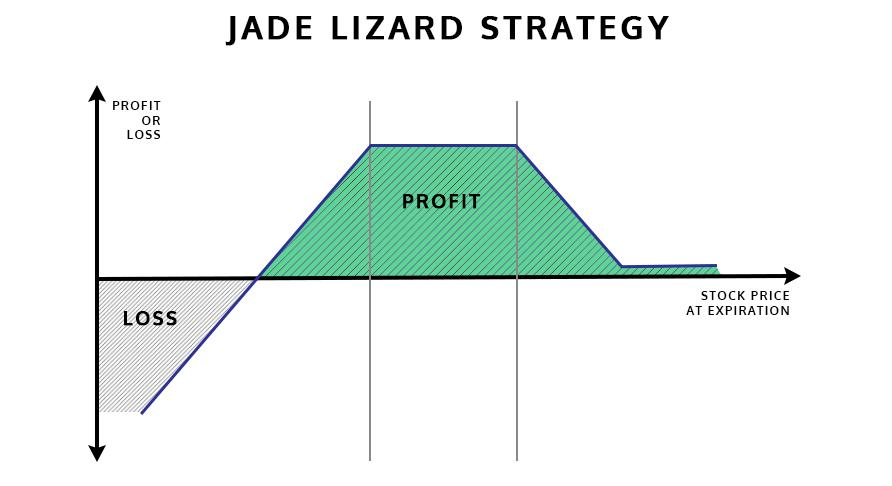

## Table of Contents

## What is the Jade Lizard options trading strategy?

The Jade Lizard options trading strategy is a way to make money from stocks by combining different options. It involves selling a put option and a call option, and then buying a call option at a higher price. This strategy is used when you think the stock price will stay the same or go up a little bit. It's called a "Jade Lizard" because it's like a regular options strategy called an "Iron Condor," but with one side missing, making it look like a lizard.

When you use the Jade Lizard strategy, you get money right away from selling the put and call options. This money is called the premium. If the stock price stays between the prices of the options you sold, you keep the premium as profit. But if the stock price goes down a lot, you might lose money because you have to buy the stock at the higher put option price. If the stock price goes up a lot, the loss is limited because of the call option you bought. So, the Jade Lizard can be a good strategy if you think the stock will stay pretty stable or go up a bit, but it does have risks if the stock moves a lot in either direction.

## How does the Jade Lizard strategy differ from other options strategies?

The Jade Lizard strategy is different from many other options strategies because it combines elements of both selling and buying options. Unlike a simple covered call, where you own the stock and sell call options against it, the Jade Lizard involves selling a put option and a call option at different strike prices, and then buying a call option at an even higher strike price. This setup creates a unique risk-reward profile that can be appealing if you think the stock will stay steady or rise slightly.

Compared to strategies like the Iron Condor, which involves selling both a put spread and a call spread, the Jade Lizard is less balanced. The Iron Condor has defined risk on both the upside and downside, whereas the Jade Lizard has unlimited risk on the downside because of the sold put option, but limited risk on the upside due to the bought call option. This makes the Jade Lizard more suitable for a bullish outlook than the Iron Condor, which is generally used when expecting a stock to stay within a certain range.

In contrast to a straddle or strangle, where you buy or sell options on both sides of the current stock price, the Jade Lizard focuses more on the upside potential. A straddle or strangle is used when you expect a big move in the stock price but are unsure of the direction, while the Jade Lizard is more directional, betting on the stock price staying above the sold put option's strike price. This directional nature of the Jade Lizard makes it distinct from non-directional strategies like straddles and strangles.

## What are the key components of a Jade Lizard strategy?

The Jade Lizard strategy has three main parts. First, you sell a put option at a lower strike price than the current stock price. This means you agree to buy the stock at that lower price if the stock goes down a lot. Second, you sell a call option at a higher strike price than the current stock price. This means you agree to sell the stock at that higher price if the stock goes up a lot. Finally, you buy a call option at an even higher strike price than the one you sold. This limits how much you can lose if the stock price goes up a lot.

These three parts work together to create a strategy that can make money if the stock price stays the same or goes up a little bit. When you sell the put and call options, you get money right away, which is called the premium. If the stock price stays between the strike prices of the options you sold, you keep this premium as profit. But if the stock price goes down a lot, you might lose money because you have to buy the stock at the higher put option price. If the stock price goes up a lot, the loss is limited because of the call option you bought. So, the Jade Lizard can be a good strategy if you think the stock will stay pretty stable or go up a bit, but it does have risks if the stock moves a lot in either direction.

## How do you set up a Jade Lizard strategy in Python?

To set up a Jade Lizard strategy in Python, you need to use a library like QuantLib or PyAlgoTrade to handle options pricing and trading. First, you'll define the current stock price, the strike prices for the put and call options you're selling, and the strike price for the call option you're buying. You'll also need to set the expiration date for these options. Then, using the library, you can calculate the premiums you'll receive from selling the put and call options, and the cost of buying the higher strike call option. Finally, you'll set up the trades by selling the put and call at their respective strike prices, and buying the call at the higher strike price.

Once you have the trades set up, you'll need to monitor the stock price and the value of your options until the expiration date. You can use Python to simulate how the value of your Jade Lizard position changes with the stock price. If the stock price stays between the strike prices of the options you sold, you'll keep the premiums as profit. If it goes below the put option's strike price, you might lose money, but if it goes above the higher call option's strike price, your loss is limited by the call option you bought. This way, you can see how the Jade Lizard strategy performs under different stock price scenarios.

## What are the potential risks and rewards of using the Jade Lizard strategy?

The Jade Lizard strategy can make you money if the stock price stays the same or goes up a little bit. When you set it up, you get money right away from selling the put and call options. This money is called the premium. If the stock price stays between the strike prices of the options you sold, you get to keep the premium as profit. This makes the Jade Lizard a good choice if you think the stock won't move much or will go up slightly.

But there are risks too. If the stock price goes down a lot, you might lose money. This is because you sold a put option, which means you have to buy the stock at a higher price than where it's trading. On the other hand, if the stock price goes up a lot, your loss is limited because you bought a call option at a higher strike price. This call option helps protect you from big losses if the stock goes way up. So, while the Jade Lizard can be profitable, it's important to be aware of these risks and understand how the stock might move before you use this strategy.

## Can you explain the Greeks in relation to the Jade Lizard strategy?

The Greeks are important measures that help you understand how sensitive your Jade Lizard options strategy is to different factors like the stock price, time, and volatility. Delta tells you how much the value of your options changes when the stock price changes. For a Jade Lizard, the delta of the put you sold is negative, meaning if the stock price goes down, the value of your position goes down too. The delta of the call you sold is positive, but the delta of the call you bought at a higher strike price is also positive and helps offset the delta of the call you sold, making your overall position less sensitive to small changes in the stock price.

Gamma measures how fast the delta changes as the stock price moves. In a Jade Lizard, the gamma of the options you sold will be higher near their expiration date, making your position more sensitive to stock price changes as time goes on. Theta measures how the value of your options changes over time. Since you're selling options in a Jade Lizard, theta works in your favor because the options you sold lose value as they get closer to expiration, which means you keep more of the premium you received. Vega measures how sensitive your options are to changes in volatility. If the stock's volatility goes up, the value of the options you sold will increase, which is bad for your position, but the value of the call you bought will also increase, helping to offset some of that risk.

## How do market conditions affect the performance of a Jade Lizard strategy?

Market conditions play a big role in how well a Jade Lizard strategy works. If the stock market is calm and the stock price stays pretty steady or goes up a little bit, the Jade Lizard can do well. This is because you get to keep the money you made from selling the put and call options, called the premium. If the stock price stays between the strike prices of the options you sold, you make a profit. So, a stable or slightly bullish market is good for the Jade Lizard.

But if the market gets really volatile or the stock price moves a lot, the Jade Lizard can be risky. If the stock price drops a lot below the strike price of the put option you sold, you might lose money because you have to buy the stock at a higher price than it's trading at. On the other hand, if the stock price shoots up way above the strike price of the call option you bought, your losses are limited because of that call option. So, while the Jade Lizard can make money in calm markets, big moves in either direction can affect its performance.

## What are some common entry and exit signals for the Jade Lizard strategy?

When you're thinking about using the Jade Lizard strategy, you need to know when to start it and when to stop it. A good time to start, or enter, a Jade Lizard is when the stock price is steady or going up a little bit. You might see this if the stock has been moving in a small range for a while or if there's good news about the company that makes you think the price will go up slowly. Also, if the options you're going to sell have high premiums, that's a good sign to start because you'll get more money upfront. You should also check if the stock's volatility is low, as that means the stock is less likely to make big moves that could hurt your position.

Knowing when to get out, or exit, a Jade Lizard is just as important. One signal to exit could be if the stock price starts to move a lot, either up or down. If it's going down and gets close to the strike price of the put option you sold, you might want to close your position to avoid losing money. If the stock price goes up a lot and gets close to the strike price of the call option you bought, you might also want to exit to lock in your profits or limit your losses. Another good reason to exit is if the options you sold start losing value quickly as they get closer to expiration, which means you can buy them back for less and keep more of the premium you received.

## How can you optimize a Jade Lizard strategy using Python?

To optimize a Jade Lizard strategy using Python, you can use libraries like QuantLib or PyAlgoTrade to help you find the best strike prices and expiration dates for your options. You'll want to write a program that looks at different combinations of strike prices for the put and call options you're selling, and the higher strike price for the call option you're buying. The program can then calculate the premiums you'll get from selling the options and the cost of buying the call option. By running simulations with different stock prices and market conditions, you can see which combination gives you the best chance of making money while keeping your risk low.

Once you have your program set up, you can run it to test the Jade Lizard strategy under different scenarios. You might want to see how it performs if the stock price stays the same, goes up a little, or even drops a lot. By changing the inputs like the stock's volatility or the time until the options expire, you can find the best settings for your strategy. This way, you can make smart decisions about when to start and stop your Jade Lizard trades, helping you to make more money and avoid big losses.

## What are the tax implications of trading Jade Lizard options?

When you trade Jade Lizard options, you need to think about taxes. The money you make from selling the put and call options, called the premium, is usually seen as ordinary income by the tax people. This means you'll pay taxes on it at your normal income tax rate. If you end up losing money because the stock price moves a lot, you can use those losses to lower your taxes. But, you have to follow special rules about how much you can deduct and when you can use those losses.

Also, if you buy and sell the options within a year, any profits you make are considered short-term capital gains. These are taxed at the same rate as your regular income. If you hold the options for more than a year before selling them, the profits could be long-term capital gains, which are usually taxed at a lower rate. It's a good idea to talk to a tax expert to understand all the rules and make sure you're doing everything right when trading Jade Lizard options.

## How does the Jade Lizard strategy perform in different volatility environments?

The Jade Lizard strategy works best when the stock market is not moving around a lot. If the stock price stays the same or goes up a little bit, you can keep the money you got from selling the put and call options. This is because the options you sold will lose value over time, and if the stock price stays between the strike prices of those options, they will expire worthless, and you get to keep the premium. So, in a low volatility environment, where the stock price doesn't change much, the Jade Lizard can be a good way to make money.

But if the stock market gets really wild and the stock price starts jumping around a lot, the Jade Lizard can be risky. If the stock price drops a lot and goes below the strike price of the put option you sold, you might have to buy the stock at a higher price than it's trading at, which could mean you lose money. On the other hand, if the stock price shoots up a lot and goes above the strike price of the call option you bought, your losses are limited because of that call option. So, in a high volatility environment, the Jade Lizard strategy can be more challenging, and you need to be careful about how much the stock price might move.

## What advanced techniques can be used to enhance the Jade Lizard strategy in Python?

To make the Jade Lizard strategy work even better, you can use Python to run a lot of different scenarios and see how the strategy does in each one. You can change things like the strike prices of the options you're selling and buying, how long the options last before they expire, and even how much the stock price might move around. By doing this, you can find the best mix of options that gives you the most money while keeping your risk low. You can also use Python to check how the strategy does when the stock price stays the same, goes up a little, or even drops a lot. This way, you can see what might happen and make smarter choices about when to start and stop your trades.

Another way to improve the Jade Lizard strategy is by using Python to keep an eye on the Greeks. The Greeks are numbers that tell you how sensitive your options are to things like the stock price, time, and how much the stock moves around. By watching these numbers, you can adjust your strategy to make it less risky or to make more money. For example, if you see that the stock's volatility is going up, you might want to change the strike prices of your options or decide to close your position to avoid big losses. Using Python to do all this math and keep track of everything can help you make better decisions and get the most out of your Jade Lizard trades.

## What is the Jade Lizard Strategy and how does it work?

The Jade Lizard Strategy is an innovative approach within options trading designed to optimize returns while minimizing risk exposure. This strategy cleverly combines three options positions to create a structure that accommodates diverse market conditions.

To construct the Jade Lizard, traders start by selling a short put option. This option is typically placed with a strike price below the current market price of the underlying asset. Selling the put generates immediate credit for the trader, which serves as the foundational building block of the strategy. Next, a short call option is sold, set at a strike price above the current market price. This call sale further contributes to the total credit accrued from the initial put position.

The final component of the strategy is buying a long call option. The purpose of this option is to hedge against potentially unlimited losses in the scenario where the underlying asset’s price experiences significant upward movement. By purchasing the long call, traders gain an insurance-like protection that caps potential risks.

The combination of these instruments results in a payoff structure that generates a net credit, offering returns if the underlying stock price either moves modestly or remains static. This net credit is a critical feature of the strategy, as it allows for profit even in scenarios of minimal price movement, provided the asset remains above the short put strike price by expiration.

The strategy is metaphorically named after a lizard due to its adaptability and ability to mitigate risks across various market scenarios. Just as a lizard can efficiently navigate diverse environments, the Jade Lizard effectively handles shifts in the market, providing traders with a balanced risk-reward profile.

In mathematical terms, the profit or loss from executing a Jade Lizard Strategy can be expressed as a function of the stock price at expiration, $S$. The payoff structure is as follows:

1. If $S \leq$ strike price of the short put $(K_p)$:
$$
   \text{Profit/Loss} = (\text{Total net credit}) - (K_p - S)

$$

2. If $K_p < S <$ strike price of the short call $(K_c)$:
$$
   \text{Profit} = \text{Total net credit}

$$

3. If $S \geq K_c$:
$$
   \text{Profit/Loss} = (\text{Total net credit}) + (S - K_c) - (\text{Cost of long call})

$$

This structured approach enables the strategy to yield potential profits across different market conditions while maintaining limited downside risk. By leveraging different market instruments and their intrinsic properties, the Jade Lizard Strategy provides a strategic edge for traders aiming to capitalize on careful risk management and strategic market positioning.

## References & Further Reading

[1]: Passarelli, D. (2012). ["Trading Options Greeks: How Time, Volatility, and Other Pricing Factors Drive Profits."](https://www.amazon.com/Trading-Options-Greeks-Volatility-Pricing/dp/1118133161) Wiley.

[2]: Cottle, R. D., & Clewlow, L. (2000). ["Options Trading: The Hidden Reality."](https://www.amazon.com/Options-Trading-Reality-Position-Adjustment-ebook/dp/B08D4T8T8R) McGraw-Hill.

[3]: Natenberg, S. (1994). ["Option Volatility and Pricing: Advanced Trading Strategies and Techniques."](https://www.amazon.com/Option-Volatility-Pricing-Strategies-Techniques/dp/0071818774) McGraw-Hill.

[4]: Jabbour, R., & Teixeira, L. (2019). ["Python for Finance Cookbook: Over 50 Recipes for Applying Modern Python Libraries to Financial Data Analysis."](https://www.semanticscholar.org/paper/Green-training-and-green-supply-chain-management%3A-Teixeira-Jabbour/666757941651cd0e7481de5b2a0506c77f773364) Packt Publishing.

[5]: Aldridge, I. (2013). ["How to Build a Successful Algorithmic Trading Strategy."](https://www.liberatedstocktrader.com/how-to-algo-trade/) Wiley.