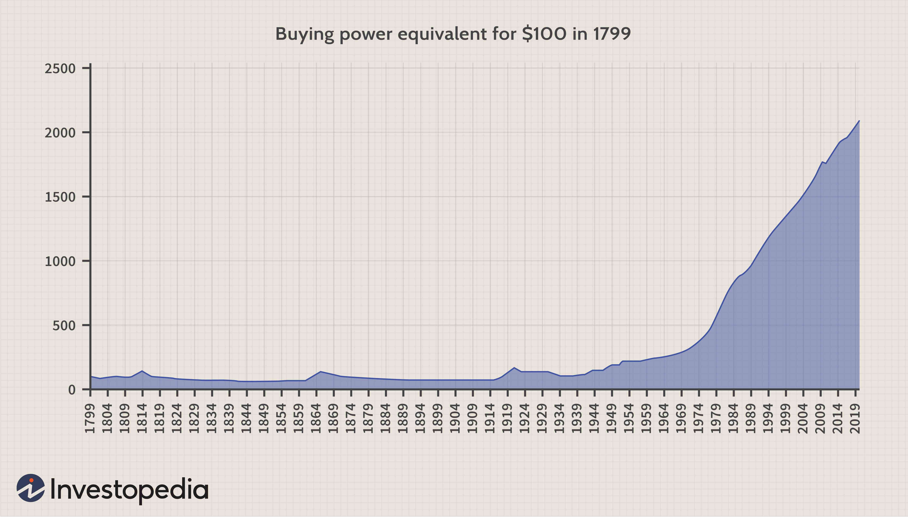

The Jamaican Dollar (JMD) plays a pivotal role in both the economic framework and cultural identity of Jamaica. Its evolution mirrors the nation's transition from colonial rule to an independent entity, showcasing significant adaptations over time. Initially introduced in 1969, the Jamaican currency has experienced numerous transformations, impacting not only the country's economy but also its cultural symbolism. By understanding the Jamaican Dollar, one gains insight into Jamaica’s historical development, its modern economic strategies such as algorithmic trading, and the currency's ongoing impact on national identity.

Exploring the Jamaican Dollar requires examining its history, assessing its current roles in the economy, and predicting future trends, particularly concerning currency trading. In today's globalized economy, the JMD is interwoven with international trade and finance, highlighting its significance beyond Jamaica's borders. This article will provide a comprehensive overview of these aspects, discussing how the Jamaican Dollar is portrayed and utilized in various financial and trading contexts. Through this analysis, one can appreciate the duality of the JMD as both a monetary instrument and a symbol of Jamaican culture and resilience.



## Table of Contents

## History of the Jamaican Dollar

The Jamaican Dollar was officially introduced in 1969, transitioning from the Jamaican pound, which had been in use since the island was part of the British colonial empire. This change was not merely a matter of convenience; it was a significant step towards cementing Jamaica's national identity following its independence from Britain in 1962. The new currency was initially pegged to the US Dollar at an equivalent value, providing a stable foundation for its early years of circulation. 

Throughout the years, the Jamaican Dollar has seen fluctuations in value relative to other currencies, largely influenced by macroeconomic factors such as trade balances and foreign exchange reserves. These fluctuations are not unique to Jamaica and reflect broader global financial trends.

The physical representations of the Jamaican Dollar, in the form of coins and banknotes, have also undergone changes. Over time, the design of these currency notes and coins has been updated to include images of national heroes and emblems that symbolize Jamaica's rich cultural heritage. Examples include likenesses of Marcus Garvey and Nanny of the Maroons, both pivotal figures in Jamaican history.

The Bank of Jamaica, established in 1960, has played a crucial role in managing the Jamaican Dollar. It is responsible for issuing currency and maintaining monetary stability. The Bank of Jamaica implements various monetary policies to achieve these goals, such as adjusting interest rates and managing the country's foreign exchange reserves.

In summary, the Jamaican Dollar's introduction was a pivotal milestone in Jamaica’s post-independence journey, symbolizing a break away from its colonial past. The currency's development over the years, supported by the Bank of Jamaica, mirrors the nation's efforts to define and sustain its economic and cultural identity on the global stage.

## Inflation and Buying Power

Jamaica has historically encountered significant challenges related to inflation, which have, in turn, impacted the value and stability of the Jamaican Dollar (JMD). Over the years, the country has experienced varying inflation rates, which have led to fluctuations in purchasing power and economic conditions. Understanding these inflationary trends is essential for both local consumers and international stakeholders who engage with the Jamaican economy.

The Bank of Jamaica plays a central role in combating inflation through various monetary policies and inflation-targeting frameworks. Inflation targeting is a monetary policy where the central bank sets a specific inflation rate as the goal and makes public announcements to guide expectations. The primary objective of these measures is to stabilize the economy and maintain the currency's purchasing power. For instance, the Bank of Jamaica uses [interest rate](/wiki/interest-rate-trading-strategies) adjustments to influence economic activity. Lowering interest rates is generally aimed at stimulating economic growth, while raising rates can help control inflation by reducing spending.

Despite these efforts, Jamaica often battles high inflation rates, which affect the cost of living. For example, fluctuating prices of essential goods and services erode the purchasing power of consumers, making it more challenging for the general population to maintain their standard of living. Persistent inflation also poses difficulties for businesses, which face increased operational costs and uncertainty, hampering long-term economic planning and growth.

From an international perspective, understanding how inflation impacts the Jamaican Dollar is crucial for investors. High inflation usually leads to currency depreciation, affecting the exchange rates with foreign currencies. Investors need to account for these risks when considering investments in Jamaica, as inflation can diminish real returns. The fluctuation of exchange rates due to inflation can impact decisions related to investing in Jamaican assets, conducting trade, or engaging in tourism-related activities.

To quantify the effects of inflation on currency and the economy, economists and policymakers often utilize mathematical models and simulations. Python, for instance, can be employed to create models that simulate inflation's impact under various economic scenarios. By analyzing trends and projecting future inflation rates, stakeholders can make informed decisions about currency management, investment strategies, and consumption patterns.

Ultimately, understanding inflation in Jamaica involves analyzing a complex interplay of monetary policy, economic conditions, and international market forces. Both local consumers and international investors must be mindful of these dynamics to navigate the challenges presented by inflation and leverage opportunities in the Jamaican market.

## Current Usage and Currency Exchange

The Jamaican Dollar (JMD) occupies a complex role in both domestic and international economic environments. In Jamaica, the JMD is primarily used in conjunction with foreign currencies, most notably the US Dollar (USD), particularly within tourist regions where economic interactions often demand the ease and stability associated with widely accepted currencies like the USD. This dynamic interplay between currencies is a testament to Jamaica's open economic structure, which accommodates and benefits from international currencies to bolster tourism and commerce.

Exchange rates between the Jamaican Dollar and other currencies fluctuate regularly, influenced by a host of both local and global factors. Locally, the Bank of Jamaica's monetary policy decisions, including interest rates adjustments and foreign exchange interventions, significantly impact the JMD's valuation. Globally, changes in international market conditions, such as fluctuations in commodity prices or shifts in global economic growth, can alter capital flows and investor perceptions, subsequently affecting exchange rates. These fluctuations are crucial for businesses and individuals engaged in import and export activities, as they can affect pricing competitiveness and purchasing power.

Visitors to Jamaica frequently encounter the choice between using the local currency or sticking to more familiar foreign currencies like the USD. This decision often hinges on factors including the current exchange rate, the transaction methods accepted by businesses (such as whether they accept only cash or credit cards and in which currencies), and the relative convenience of using one currency over another. For example, tourists may prefer using the Jamaican Dollar for small local purchases to avoid conversion fees imposed by credit card companies or banks.

Several factors determine the exchange rates that visitors and locals experience. Local market policies, such as government interventions to stabilize the JMD or actions to curb inflation, directly impact exchange rates. Globally, economic conditions such as geopolitical events, changes in foreign interest rates, and variations in trade balances also play significant roles. For stakeholders, including tourists, businesses, and investors, understanding these factors offers strategic insights into potential cost savings and financial opportunities, enabling them to make informed decisions regarding currency usage and exchange.

## Algorithmic Trading and JMD

Algorithmic trading is a method of executing orders using automated and pre-programmed trading instructions based on variables such as time, price, and [volume](/wiki/volume-trading-strategy). This approach is widely adopted across global financial markets and has significantly influenced how the Jamaican Dollar (JMD) is traded.

The Jamaican Dollar, like many other currencies, finds its place in global currency markets, where traders use algorithmic tools to optimize their transactions. These tools analyze market conditions, historical data, and patterns to execute trades at the optimal moment. By leveraging algorithms, traders can enhance their chances of capitalizing on the fluctuations in the JMD's value against other currencies.

Algorithmic trading typically incorporates statistical models and historical data to predict market movements. It enables large volumes of trades to be executed with minimal human intervention, thereby reducing the likelihood of human error and emotional biases. Sophisticated algorithms can process vast amounts of data rapidly, ensuring that trading decisions are made in milliseconds, which is crucial in the volatile foreign exchange markets.

The advent of digital trading platforms has democratized access to [algorithmic trading](/wiki/algorithmic-trading). Previously, such technology was primarily reserved for institutions with significant resources. However, the proliferation of online brokerages and trading technologies has made algorithmic trading accessible to both professional and amateur investors. Many platforms now offer tools that allow users to design and implement their own trading algorithms, often with user-friendly interfaces and educational resources to support non-expert traders.

Python, with its rich libraries for data analysis and algorithm development, is commonly used in developing trading algorithms. Here is a simple example code that depicts how one might set up a basic moving average crossover strategy for trading the JMD:

```python
import pandas as pd
import numpy as np

# Assuming 'data' is a DataFrame with a 'Date' and 'Close' prices for JMD
def moving_average_strategy(data, short_window=40, long_window=100):
    signals = pd.DataFrame(index=data.index)
    signals['signal'] = 0.0

    # Create short simple moving average
    signals['short_mavg'] = data['Close'].rolling(window=short_window, min_periods=1, center=False).mean()

    # Create long simple moving average
    signals['long_mavg'] = data['Close'].rolling(window=long_window, min_periods=1, center=False).mean()

    # Create signals
    signals['signal'][short_window:] = np.where(signals['short_mavg'][short_window:] > signals['long_mavg'][short_window:], 1.0, 0.0)   
    signals['positions'] = signals['signal'].diff()

    return signals

# Example usage
# data = pd.read_csv('jmd_data.csv', parse_dates=True, index_col='Date')
# signals = moving_average_strategy(data)
```

In this strategy, a buy signal is generated when a short-term moving average crosses above a long-term moving average, and a sell signal is generated when the opposite occurs. Such strategies exemplify how traders can employ algorithmic methods to make informed trading decisions.

As algorithmic trading continues to advance, its role in trading the Jamaican Dollar is likely to expand further. Tools and strategies will evolve, helping traders navigate currency fluctuations more efficiently. This evolution not only reflects the growing sophistication of financial markets but also underscores the increasing importance of technology in currency trading.

## Conclusion

The Jamaican Dollar (JMD) is more than a mere medium of exchange; it embodies the historical and cultural evolution of Jamaica as a nation. Since its introduction in 1969, the Jamaican Dollar has mirrored the country's narrative from colonial past to an independent identity. Despite facing significant challenges such as inflation and volatile global market conditions, Jamaica continues to employ a flexible and strategic approach to currency management, primarily through the interventions of the Bank of Jamaica. Measures such as inflation targeting demonstrate the dynamic nature of Jamaica's financial stewardship, aiming to stabilize the economy and maintain the currency's value.

In recent years, algorithmic trading has emerged as a significant development in the global financial landscape, presenting new prospects for trading the Jamaican Dollar. These automated trading platforms have become effective tools for both seasoned and novice investors, allowing them to exploit currency fluctuations strategically. The capacity of algorithmic trading to analyze vast amounts of data and execute trades at high speed increases the appeal of the Jamaican Dollar in international markets. This development widens the possibilities for leveraging the JMD beyond traditional trading practices.

Grasping the Jamaican Dollar's significance requires a dual perspective: its pivotal role within Jamaica as a revered national symbol and its potential in the expansive domain of international trading. For investors, economists, and policymakers, understanding these facets of the JMD is crucial. It not only aids in navigating local economic conditions but also in recognizing the currency's potential in global trading platforms. The Jamaican Dollar stands as a testament to Jamaica's resilience and adaptability, offering significant opportunities for stakeholders willing to explore its complexities and prospects.

## References & Further Reading

[1]: ["The Bank of Jamaica's Historical Overview."](https://boj.org.jm/about-boj/history/) Bank of Jamaica.

[2]: Lopez de Prado, M. (2018). ["Advances in Financial Machine Learning."](https://www.amazon.com/Advances-Financial-Machine-Learning-Marcos/dp/1119482089) John Wiley & Sons.

[3]: Chan, E. P. (2009). ["Quantitative Trading: How to Build Your Own Algorithmic Trading Business."](https://github.com/ftvision/quant_trading_echan_book) Wiley Trading.

[4]: ["Historical Context of Jamaica's Currency."](https://traversejamaica.com/understanding-jamaicas-currency-history-features-and-modern-use/) Central Banking.

[5]: Jansen, S. (2020). ["Machine Learning for Algorithmic Trading: Predictive Models to Extract Signals from Market and Alternative Data."](https://www.amazon.com/Machine-Learning-Algorithmic-Trading-alternative/dp/1839217715) Packt Publishing.