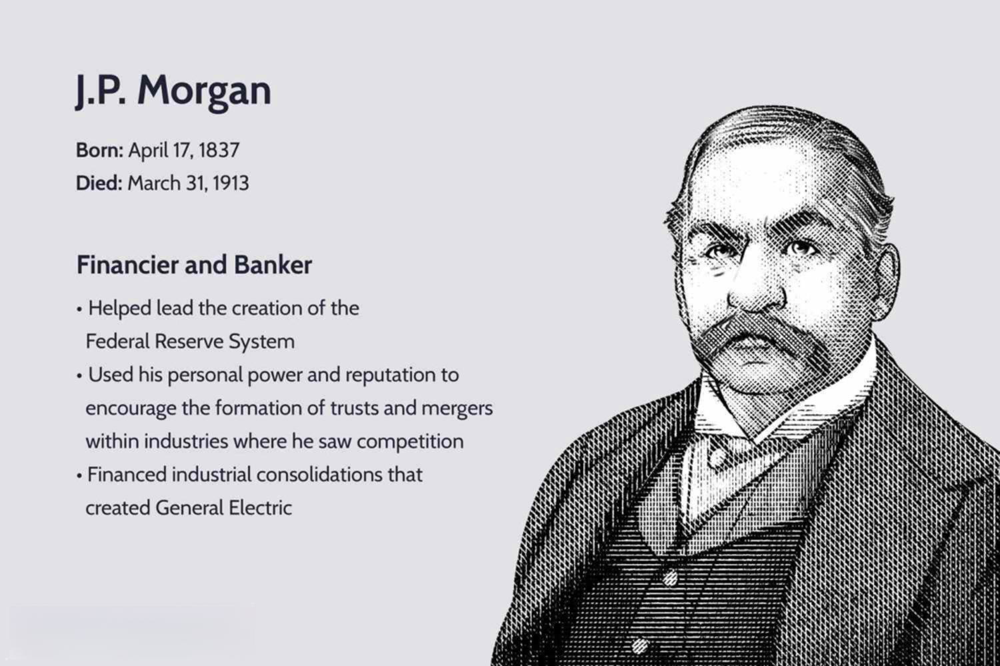

James J. McNulty is a distinguished figure in the financial world, celebrated for his pivotal leadership roles across major financial exchanges and banks. His extensive career is characterized by transformative contributions to the industry, with a particular emphasis on the development and proliferation of algorithmic trading. McNulty's journey through the financial markets has left an indelible mark, pioneering advancements that continue to shape today's financial ecosystems.

This article aims to provide a comprehensive overview of McNulty's multifaceted career, detailing how his strategic vision and leadership have substantially influenced the evolution of trading technologies and practices. Emphasizing his crucial role in the integration and expansion of algorithmic trading, this exploration highlights McNulty's influence on the rapid shift towards electronic trading platforms, enhancing efficiency, and market accessibility. Throughout the article, McNulty's contributions are examined, showcasing how his leadership and innovative strategies have propelled significant transformations within the financial sector.



## Table of Contents

## Early Life and Education

James J. McNulty was born into a family deeply rooted in the banking sector in Chicago. This environment played a pivotal role in shaping his early understanding and appreciation of financial systems. His upbringing in a city with a rich history of financial innovation and commerce provided McNulty with unique insights into the workings of financial markets, laying the groundwork for his future accomplishments in the industry.

McNulty's academic journey took a somewhat unconventional path for someone destined for a career in finance. He chose to pursue his higher education at University College Dublin, where he studied Anglo-Irish literature. This field of study, while not directly related to finance, honed his critical thinking and analytical skills. The ability to interpret complex texts and formulate structured arguments proved beneficial later in his career when navigating the complexities of financial markets and developing strategic initiatives.

While his academic focus was on the humanities, the backdrop of his family's involvement in banking likely kept him tethered to the financial world, providing a unique blend of literary acumen and financial insight. This combination enabled McNulty to approach financial challenges with a creative and thoughtful perspective, distinguishing him as a leader capable of innovative thinking.

## Transition to Financial Markets

James J. McNulty's transition into financial markets began at Harris Bank, where he embarked on a career in foreign exchange. This initial position provided him with vital experience and a strong foundation in the intricacies of currency trading and international finance. Harris Bank, known for its comprehensive approach to banking and financial services, offered McNulty an environment where he could develop his skills in managing currency-related transactions and understanding market dynamics. 

Following his tenure at Harris Bank, McNulty's career took a significant step forward as he relocated to Mexico City to serve as the treasurer for Citibank. This role not only expanded his expertise in managing financial assets and liabilities but also exposed him to the challenges of operating in a dynamic emerging market. As a treasurer, McNulty was responsible for overseeing the bank's financial operations in the region, including risk management, capital allocation, and [liquidity](/wiki/liquidity-risk-premium) management. This position demanded a deep understanding of financial instruments and strategies to navigate market volatilities effectively.

After gaining valuable experience at Citibank, McNulty returned to Chicago, where he co-founded a futures-related firm. This entrepreneurial venture marked a new chapter in his career, allowing him to leverage his substantial knowledge in trading, risk assessment, and financial innovation. The firm focused on developing futures trading strategies and technologies, contributing to the evolution of financial markets during a period of rapid growth and transformation in the industry. Through this initiative, McNulty played a pivotal role in advancing futures trading, thus cementing his influence and reputation in the field. 

This phase of McNulty's career was characterized by a blend of operational leadership and strategic foresight, setting the stage for his future achievements in major financial institutions and exchanges.

## Leadership at CME Group

From 2000 to 2004, James J. McNulty held the position of CEO at the Chicago Mercantile Exchange (CME), during a pivotal period in the exchange's history. One of his primary achievements was overseeing the demutualization of CME, a transformative process that converted the organization from a member-owned entity into a publicly traded company. This shift culminated in a successful initial public offering (IPO) in 2002, marking CME as the first major U.S. financial exchange to go public. This strategic move allowed CME to access broader capital markets and set a precedent for other exchanges contemplating similar transitions.

Under McNulty's leadership, CME experienced significant advancements in technology and risk management strategies. Recognizing the growing importance of electronic trading, McNulty drove the implementation of cutting-edge trading platforms and electronic systems, effectively revolutionizing the way trades were executed. This technological shift not only enhanced the efficiency and speed of transactions but also expanded CME's reach and accessibility to a global audience. 

Moreover, McNulty focused on strengthening risk management frameworks to adapt to the burgeoning volumes of trading activity. By updating and refining these strategies, he ensured that CME could maintain its integrity and stability amidst rapid expansion. This proactive approach to risk management helped build investor confidence and secured CME's reputation as a leader in financial innovation and security.

Through these initiatives, James J. McNulty played a crucial role in positioning the Chicago Mercantile Exchange as a modern, competitive force in the global financial landscape, laying the groundwork for future growth and success in the era of electronic trading.

## Impact on Algorithmic Trading

During James J. McNulty's tenure as CEO of the Chicago Mercantile Exchange (CME) from 2000 to 2004, significant advancements were made in the field of [algorithmic trading](/wiki/algorithmic-trading). Under McNulty’s leadership, the CME strategically expanded its technology investments, which played a crucial role in transitioning markets from traditional open outcry systems to electronic trading platforms. This shift was fundamental in supporting the burgeoning field of algorithmic trading, which relies heavily on electronic execution of trades for efficiency.

McNulty’s focus on upgrading technology infrastructure facilitated the integration of automated trading systems, which allowed for rapid processing and execution of trade orders based on pre-set parameters. These systems execute trades at speeds impossible for human traders, leveraging algorithms to determine the optimal timing and price. For instance, a simple trading algorithm might be programmed in Python as follows:

```python
def simple_algo(price, moving_average):
    if price > moving_average:
        return "Buy"
    elif price < moving_average:
        return "Sell"
    else:
        return "Hold"
```

This code snippet reflects the basic structure on which more complex systems are built, incorporating vast datasets and multi-variable algorithms to execute sophisticated trading strategies. 

The move towards algorithmic trading under McNulty was reinforced by a commitment to enhancing shareholder value. By focusing on market innovation, McNulty helped CME to increase liquidity and reduce transaction costs, making market participation more attractive for a broad range of investors. Innovations in electronic trading mechanisms ensured that the CME continued to lead in the global marketplace, providing competitive trading environments that fostered increased market participation and [volume](/wiki/volume-trading-strategy).

Additionally, the emphasis on risk management and technological advancement under McNulty’s directive allowed the CME to mitigate potential risks associated with high-frequency and automated trading. These strategies laid the groundwork for the institution to handle the rapid volume growth that algorithmic trading enabled.

McNulty’s leadership during this period thus played an instrumental role in shaping the electronic trading landscape, positioning the CME as a forerunner in algorithmic trading infrastructure. His efforts contributed substantially to the CME's ability to cater to the demands of modern trading, enhancing its reputation as a leading global derivatives marketplace.

## Later Roles and Contributions

Following his departure from the Chicago Mercantile Exchange (CME), James J. McNulty assumed several significant positions that further cemented his influence in the financial sector. One of the prominent roles he undertook was as the chairman of NYSE Liffe, a leading global derivatives business. His leadership at NYSE Liffe was marked by an emphasis on expanding the exchange's offerings and enhancing its technological infrastructure to accommodate the rapid growth of electronic trading, which had become a dominant force in the market during his tenure.

McNulty's expertise in financial markets continued to be in demand as he took on board positions at various major financial institutions. Through these roles, he provided strategic insights that helped shape organizational policies and market strategies. His extensive experience in global finance allowed him to guide these institutions in navigating the complexities of the evolving economic landscape, particularly as algorithmic and electronic trading gained prominence.

Beyond his direct involvement in financial institutions, McNulty also contributed to financial markets through strategic development efforts. He was instrumental in fostering innovation within the financial services industry, advocating for the adoption of cutting-edge technologies and the development of new financial products. His efforts contributed to enhancing market efficiency and accessibility, helping to democratize access to financial markets.

In addition to his strategic contributions, McNulty was committed to educational efforts aimed at nurturing future leaders in finance. He participated in several initiatives designed to equip aspiring professionals with the skills and knowledge necessary to succeed in the fast-paced world of financial markets. Through lectures, seminars, and mentorship programs, McNulty shared his insights and experiences, inspiring a new generation of finance professionals to pursue excellence and innovation.

Overall, James J. McNulty's post-CME endeavors reflect a continued dedication to shaping the financial industry, both through leadership roles in prominent institutions and through efforts to advance education and innovation in finance. His lasting influence is a testament to his strategic vision and commitment to the progression of global financial markets.

## Legacy and Influence

James J. McNulty's contributions to the financial industry are widely recognized, culminating in his induction into the Futures Hall of Fame. This honor reflects his pivotal role in advancing financial markets, particularly through his leadership at the Chicago Mercantile Exchange (CME). By spearheading initiatives that emphasized technological innovation and strategic risk management, McNulty played a critical part in ushering the exchange into a new era of electronic trading.

Under his oversight, the CME underwent significant transformations that were instrumental in shaping modern financial exchanges. His foresight in embracing and fostering algorithmic trading not only enhanced the efficiency and liquidity of markets but also set benchmarks for other financial institutions to follow. This shift towards electronic trading platforms under McNulty's leadership underscores a broader trend towards digital transformation within the financial services sector.

Beyond his tenure at CME, McNulty continued to exert influence through various leadership and advisory roles in eminent financial entities, including his chairmanship at NYSE Liffe and board roles elsewhere. His strategic insights contributed to the evolution of global finance, aiding in the enhancement of shareholder value and market resilience.

James J. McNulty's legacy in financial markets serves as a testament to the impact of innovative leadership. His ability to foresee industry trends and guide major exchanges through pivotal changes has left an indelible mark on the industry, illustrating how visionary leadership can transform and elevate global finance.

## Conclusion

James J. McNulty's journey from his early academic interests to his pivotal role in financial markets is a testament to his adaptability and visionary leadership. Initially immersed in Anglo-Irish literature, McNulty's transition to finance showcases a rare ability to pivot and excel in an entirely different domain. This adaptability allowed him to leverage his analytical skills in the complex world of financial markets.

His influence in algorithmic trading and exchange operations has left a lasting impact on the industry. McNulty's tenure at the Chicago Mercantile Exchange (CME) was marked by significant advancements in electronic trading. By prioritizing technological innovation and shareholder value, he spurred the growth of algorithmic trading, making it a cornerstone of modern financial transactions. These efforts not only transformed the CME but also set a precedent for other financial institutions to embrace technology-driven trading strategies.

McNulty's focus on innovation and strategic development extended beyond his role at CME, as he continued to hold influential positions within major financial institutions. His leadership helped shape the evolving landscape of global finance by promoting efficient, technology-driven market solutions. Today, the principles he championed continue to influence how financial markets operate, underscoring the importance of adaptability in the ever-changing financial industry.

## References & Further Reading

[1]: Shadab, M. (2008). ["Innovation and Institutionalization: Factors Underlying Algorithmic Trading and the Future of Financial Markets."](https://pmc.ncbi.nlm.nih.gov/articles/PMC4064928/) Journal of Law and Policy.

[2]: Lewis, M. (2014). ["Flash Boys: A Wall Street Revolt."](https://en.wikipedia.org/wiki/Flash_Boys) W. W. Norton & Company.

[3]: Aldridge, I. (2013). ["High-Frequency Trading: A Practical Guide to Algorithmic Strategies and Trading Systems."](https://www.amazon.com/High-Frequency-Trading-Practical-Algorithmic-Strategies/dp/1118343506) Wiley.

[4]: Easley, D., López de Prado, M., & O'Hara, M. (2012). ["The Volume Clock: Insights into the High Frequency Paradigm."](https://papers.ssrn.com/sol3/papers.cfm?abstract_id=2034858) The Journal of Portfolio Management.

[5]: Clark, G. (2009). ["Algorithmic Trading and DMA: An Introduction to Direct Access Trading Strategies."](https://www.semanticscholar.org/paper/Algorithmic-trading-%26-DMA-%3A-an-introduction-to-Johnson/aa5de1ab883d5e23b6651faa7c1807586d688e4b) W & A Publishing.