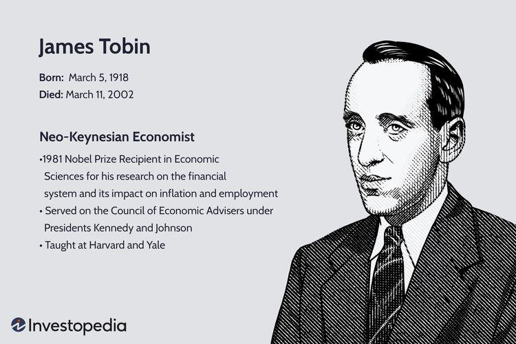

## Table of Contents

## Who was James Tobin?

James Tobin was an American economist born in 1918 and died in 2002. He was famous for his work in economics, especially in how people make choices about saving and spending money. He won the Nobel Prize in Economics in 1981 for his research on how financial markets and the economy work together.

Tobin worked at Yale University for many years and helped shape economic policy in the United States. He was part of the Council of Economic Advisers during President John F. Kennedy's time. Tobin believed that the government should play a big role in managing the economy to help it grow and keep people employed. He is also known for the "Tobin tax," an idea to put a small tax on buying and selling currencies to reduce quick trading and help the economy.

## When and where was James Tobin born?

James Tobin was born on March 5, 1918. He was born in Champaign, Illinois, in the United States. Champaign is a small city known for its university.

When Tobin was born, the world was a different place. World War I had just ended a few months before, and people were trying to rebuild their lives. Tobin's birthplace, Champaign, was a quiet town where he grew up before going on to become a famous economist.

## What was James Tobin's educational background?

James Tobin went to school in Champaign, Illinois, where he was born. He did really well in school and liked learning about economics. After high school, he went to Harvard University. At Harvard, he studied economics and got his bachelor's degree in 1939. He stayed at Harvard to keep learning and got his Ph.D. in economics in 1947. While he was at Harvard, he learned from famous economists like Joseph Schumpeter and Wassily Leontief.

After getting his Ph.D., Tobin started working at Yale University in 1950. He spent most of his career there, teaching and doing research. At Yale, he became a very important person in the world of economics. He helped many students learn about economics and wrote a lot of important papers. His work at Yale helped him win the Nobel Prize in Economics in 1981.

## What were the key positions James Tobin held during his career?

James Tobin had many important jobs during his career. He started working at Yale University in 1950 and stayed there for most of his career. At Yale, he was a professor and helped many students learn about economics. He also did a lot of research and wrote many important papers. His work at Yale helped him become very well-known in the world of economics and win the Nobel Prize in 1981.

Tobin also worked for the U.S. government. He was part of the Council of Economic Advisers during President John F. Kennedy's time. In this job, he helped the president make decisions about the economy. Tobin believed that the government should help manage the economy to make it grow and keep people working. He also came up with the idea of the "Tobin tax," which is a small tax on buying and selling currencies to help the economy.

Overall, James Tobin's key positions included being a professor at Yale University and a member of the Council of Economic Advisers. These roles allowed him to influence both academic economics and government policy.

## What is James Tobin most famous for in the field of economics?

James Tobin is most famous in economics for his work on how people save and spend money, and how this affects the economy. He won the Nobel Prize in Economics in 1981 for his research on how financial markets and the economy work together. Tobin believed that the government should play a big role in managing the economy to help it grow and keep people employed. He studied how people make choices about saving and spending, and how these choices impact the overall economy.

Another thing Tobin is famous for is the idea of the "Tobin tax." This is a small tax on buying and selling currencies to reduce quick trading and help the economy. He thought this tax could make financial markets more stable and help countries manage their economies better. Tobin's ideas about government involvement and the Tobin tax have been influential and are still discussed by economists today.

## Can you explain the Tobin Tax and its purpose?

The Tobin Tax is an idea that James Tobin came up with. It's a small tax that would be put on buying and selling currencies, like dollars or euros. The tax would be very small, maybe just a few cents for every hundred dollars traded. The main goal of the Tobin Tax is to slow down quick trading in the currency markets. When people trade currencies very fast, it can make the markets unstable. By adding a small tax, Tobin thought it would make people think twice before trading so quickly, which could help keep the markets more stable.

The purpose of the Tobin Tax is to help the economy in a few ways. First, it could reduce the wild ups and downs in currency values that can hurt countries' economies. If currencies are more stable, it's easier for countries to plan and grow their economies. Second, the money collected from the tax could be used to help poorer countries or to fund other important projects. Tobin believed that this tax could make the world's financial system fairer and more stable, which would be good for everyone.

## How did James Tobin contribute to the theory of portfolio selection?

James Tobin made important contributions to the theory of portfolio selection, which is about how people choose to invest their money. He came up with something called the "Tobin's Separation Theorem." This idea says that choosing how to invest your money can be split into two parts. First, you decide how much risk you want to take. Then, you choose the best mix of investments that matches that level of risk. This makes it easier for people to make smart choices about their investments without getting too confused.

Tobin's work helped change how people think about investing. Before his ideas, people thought that choosing investments was all about finding the best mix of stocks and bonds. But Tobin showed that it's also important to think about how much risk you're willing to take. His ideas are still used today by people who want to make smart choices about their money. Tobin's work on portfolio selection is one of the reasons he won the Nobel Prize in Economics in 1981.

## What was James Tobin's role in the development of the IS-LM model?

James Tobin played an important role in developing the IS-LM model, which is a way to understand how the economy works. The IS-LM model looks at how interest rates and the total amount of goods and services produced in an economy are connected. Tobin helped improve the model by adding ideas about how people save and spend money. He showed that people's choices about saving and spending can affect the economy a lot. His work made the IS-LM model more useful for understanding real-world economic problems.

Tobin's contributions to the IS-LM model were important because they helped economists see how different parts of the economy fit together. He added ideas about how people's behavior can change the economy, which made the model more realistic. By including these ideas, Tobin helped make the IS-LM model a better tool for studying how government policies can affect the economy. His work on the IS-LM model is one of the reasons he was so respected in the field of economics.

## How did James Tobin's work influence monetary policy?

James Tobin's work had a big impact on how governments and central banks think about money and the economy. He believed that the government should play a big role in managing the economy to help it grow and keep people working. Tobin's ideas about how people save and spend money helped shape how central banks set interest rates. He thought that if the government could control interest rates and the money supply, it could help the economy stay stable and grow. His work on the IS-LM model showed how changes in interest rates could affect the total amount of goods and services produced, which is important for setting monetary policy.

Tobin's idea of the Tobin Tax also influenced thinking about how to manage the economy. He suggested a small tax on buying and selling currencies to reduce quick trading and make financial markets more stable. This idea was meant to help control the ups and downs in currency values that can hurt countries' economies. Even though the Tobin Tax was never widely used, it got people thinking about how to use taxes to make the economy fairer and more stable. Overall, Tobin's work helped economists and policymakers understand how to use monetary policy to make the economy work better for everyone.

## What awards and recognitions did James Tobin receive for his contributions to economics?

James Tobin received many awards and recognitions for his work in economics. The most famous one was the Nobel Prize in Economics, which he won in 1981. He got this award for his research on how financial markets and the economy work together. This prize is a big deal because it shows that his ideas were very important and helpful to other economists.

Besides the Nobel Prize, Tobin was also honored in other ways. He was a member of the American Academy of Arts and Sciences and the National Academy of Sciences. These groups are made up of the smartest people in different fields, and being a part of them is a big honor. Tobin's work was respected by many people, and he was often asked to speak at important events and conferences. His ideas and research helped shape how people think about the economy, and he was seen as a leader in his field.

## How did James Tobin's views on Keynesian economics evolve over his career?

James Tobin started his career with a strong belief in Keynesian economics, which is the idea that the government should help manage the economy to keep it stable and growing. He thought that the government could use things like spending and taxes to make sure people had jobs and the economy didn't go up and down too much. Tobin worked with other economists who believed in these ideas, and he helped shape economic policy during President Kennedy's time. His early work was all about using government power to help the economy, and he believed that Keynesian ideas were the best way to do this.

Over time, Tobin's views on Keynesian economics didn't change a lot, but he did start to think more about how people's choices about saving and spending could affect the economy. He added these ideas to the Keynesian model, making it more detailed and useful. Tobin's work on the IS-LM model and his idea of the Tobin tax showed that he was always trying to improve economic theories to make them better at solving real-world problems. Even though he stayed a strong supporter of Keynesian ideas, he also showed that he was open to new ways of thinking about the economy.

## What are some critiques and controversies surrounding James Tobin's economic theories?

Some people didn't agree with James Tobin's ideas about the economy. They thought his belief in Keynesian economics, which says the government should help manage the economy, might lead to too much government control. Critics said that if the government tries to control the economy too much, it could make things worse instead of better. They worried that Tobin's ideas could lead to higher taxes and more spending, which might slow down the economy instead of helping it grow. Some also thought that his idea of the Tobin tax, a small tax on buying and selling currencies, might be hard to put into practice and might not work as well as he hoped.

Another controversy was about Tobin's work on portfolio selection and the Tobin's Separation Theorem. Some economists argued that his theory didn't take into account all the ways people make decisions about their money. They said that people's choices are more complicated than what Tobin's model showed. Critics also pointed out that the real world is more unpredictable than Tobin's theories suggested, and that his ideas might not work well in all situations. Despite these critiques, Tobin's work was still very important and helped many people understand the economy better.

## What is Portfolio Selection Theory?

James Tobin was awarded the Nobel Prize in Economics in 1981 for his pioneering work on portfolio selection theory, a central component of modern economic thought. His theory provides a framework for understanding how individuals and firms make investment decisions by balancing the trade-off between risk and return.

Tobin's work builds on the foundation laid by Harry Markowitz's Modern Portfolio Theory, which emphasizes diversification as a means to optimize the risk-return profile of an investment portfolio. Tobin introduced the concept of the "efficient frontier" and expanded the analysis by incorporating the risk-free asset, leading to the development of the Capital Market Line (CML). The CML suggests that an optimal portfolio is a combination of risk-free assets and market portfolios, where the slope of the line represents the market price of risk.

The mathematical formulation of the model begins with the expected return $E(R_p)$ of a portfolio, which is computed as:

$$
E(R_p) = w_f R_f + (1 - w_f) E(R_m)
$$

Here, $w_f$ is the proportion of funds allocated to the risk-free asset, $R_f$ is the return on the risk-free asset, and $E(R_m)$ is the expected return of the market portfolio. The portfolio's risk is measured by its standard deviation $\sigma_p$, expressed as:

$$
\sigma_p = (1 - w_f) \sigma_m
$$

where $\sigma_m$ is the standard deviation of the market portfolio. Investors choose the portfolio that maximizes their utility, given their individual risk preferences, typically represented by a concave utility function.

Tobin further explored the implications of portfolio selection on macroeconomic behavior. He demonstrated that microeconomic decisions regarding asset allocation have significant macroeconomic consequences. Specifically, Tobin's "q theory" of investment posits that companies undertake investment based on the ratio of the market value of installed capital to its replacement cost, influencing economic variables such as aggregate demand and price stability.

By binding micro and macroeconomic perspectives, Tobin's portfolio selection theory provides critical insights into the transmission mechanisms between individual investment decisions and broader economic outcomes. Through this work, Tobin has solidified his role as a pivotal figure in shaping our understanding of financial economics.

## References & Further Reading

[1]: Tobin, James. (1978). ["A Proposal for International Monetary Reform."](https://www.jstor.org/stable/pdf/20642317.pdf) Eastern Economic Journal, 4(3), 153–159.

[2]: Markowitz, Harry M. (1952). ["Portfolio Selection."](https://onlinelibrary.wiley.com/doi/abs/10.1111/j.1540-6261.1952.tb01525.x) The Journal of Finance, 7(1), 77–91.

[3]: Tobin, James. (1958). ["Liquidity Preference as Behavior Towards Risk."](https://www.jstor.org/stable/2296205) The Review of Economic Studies, 25(2), 65–86.

[4]: Atkins, Ralph. (2011). ["Tobin tax is back on agenda."](https://www.linkedin.com/in/ralph-atkins-a30479112) Financial Times.

[5]: Jovanovic, Franck, & Schinckus, Christophe. (2016). ["The History of Financial Theory."](https://papers.ssrn.com/sol3/papers.cfm?abstract_id=3294565) Palgrave Macmillan.

