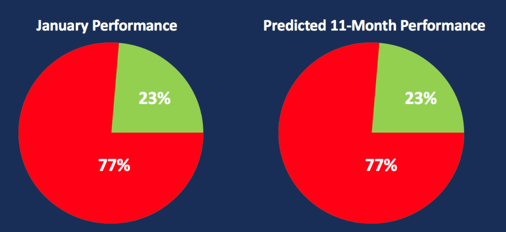

The stock market is a dynamic and intricate system, continually shaped by a wide array of factors and indicators that challenge even the most seasoned traders and analysts. Among these many phenomena is the January Barometer, a concept that has sparked considerable interest within the financial community. This idea posits that the performance of the stock market in January can serve as a predictor for its performance over the remainder of the year. This article explores the interplay between economic indicators, the stock market, the January Barometer, and the evolving realm of algorithmic trading. 

The origins of the January Barometer can be traced back to Yale Hirsch, who introduced the concept in the Stock Trader's Almanac with the adage, "As January goes, so goes the year." Over time, this notion has been associated primarily with the S&P 500 Index and has demonstrated varying degrees of predictive accuracy. The January Barometer's significance extends beyond mere curiosity, holding potential implications for trading strategies and investor behavior.



In contemporary trading environments, the adoption of algorithmic trading systems has opened new avenues for integrating the January Barometer into investment strategies. By leveraging machine learning and real-time data analysis, traders seek to enhance the predictive power of this hypothesis. However, not everyone accepts the January Barometer without scrutiny. Critics argue that its purported predictive virtues may be nothing more than statistical anomalies or a reflection of broader economic tendencies, such as the natural propensity for equities to rise over time.

While the January Barometer has carved out a place in the discussion of market hypotheses, it does not come without its criticisms and limitations. Factors such as varying applicability across different markets and the constraints imposed by the Efficient Market Hypothesis suggest that caution is warranted. Nonetheless, when employed as part of a broader strategy, it can serve as an additional tool, providing early signals that might influence decision-making and strategy formulation. In this article, we aim to comprehensively examine its origins, applications, and the challenges it presents within the financial landscape.

## Table of Contents

## Understanding the January Barometer

The January Barometer is a financial hypothesis proposing that the performance of the stock market in January serves as a predictor for its trajectory over the remainder of the year. It was popularized by Yale Hirsch in the publication "Stock Trader's Almanac". This market theory is often encapsulated by the saying, "As January goes, so goes the year." The primary focus of the January Barometer is the S&P 500 Index, a benchmark representing the performance of 500 large companies listed on stock exchanges in the United States.

The origins of the January Barometer trace back to observations made by market analysts who noticed a correlation between the market's performance in January and its subsequent annual performance. The hypothesis suggests that positive market movements in January typically indicate a positive trend for the rest of the year, while negative movements may suggest a bearish outlook.

The predictive accuracy of the January Barometer has varied over the years, showing instances of both high correlation and contradiction. Some years, the theory has held true, with strong January gains leading to robust annual returns. In other years, geopolitical events, economic shocks, or unforeseen circumstances have led to a decoupling of January's performance from the rest of the year's market trends.

While the January Barometer generally focuses on the S&P 500, its concept can also be applied to other indices or markets. However, its reliability and applicability outside the U.S. stock markets have not been extensively validated. Analysts and traders often view the January Barometer as part of a broader set of market indicators, rather than a standalone predictive tool, due to its inconsistent historical accuracy.

In summary, the January Barometer provides an intriguing yet contested method of forecasting the stock market's annual trends, having roots in historical market observations and focusing primarily on the S&P 500 Index. Its efficacy is subject to debate, and it is often used in conjunction with other indicators and analyses to inform trading strategies.

## Mechanism and Rationale Behind the January Barometer

The predictive claims of the January Barometer are supported by psychological and economic factors that significantly influence its observed trends. At the outset of a new year, institutional investors and financial managers often reassess and potentially recalibrate their investment strategies. This reassessment is a time when portfolios are adjusted based on the previous year's performance and anticipated market conditions. Such strategic shifts can lead to significant market movements during January, as large volumes of trades are executed.

Economic indicators released in January further amplify the effects observed by the January Barometer. Key reports, such as consumer spending, unemployment rates, manufacturing data, and corporate earnings, provide vital insights into the economic health and [momentum](/wiki/momentum) of the economy. Positive economic data can bolster investor confidence, leading to increased buying activity, whereas negative reports may prompt a more cautious approach or selling behaviors.

The combination of these strategic recalibrations and economic signals creates a ripple effect through the financial markets, affecting investor sentiment on future performance. Institutional investors, who wield significant influence over market dynamics due to the large volumes they trade, are particularly reactive to new economic reports. Their decisions in January can set the tone for market trends and sentiment for the remainder of the year, thus providing a foundational basis for the January Barometer's hypothesis.

Despite these factors, it is important to note that while the January Barometer reflects established psychological patterns and reactions to economic stimuli, it is not infallible. External shocks, geopolitical events, and unforeseen market disruptions can quickly alter the [course](/wiki/best-algorithmic-trading-courses) suggested by January activity, reminding traders to maintain a flexible and comprehensive approach when considering these insights.

## Applications in Algorithmic Trading

Algorithmic trading systems are increasingly harnessing the January Barometer as a foundation for stock and asset selection. This financial theory, which posits that the stock market's performance in January can forecast its annual trajectory, serves as a valuable tool within algorithmic frameworks. By leveraging this principle, [algorithmic trading](/wiki/algorithmic-trading) can identify potential market trends and enhance decision-making processes.

Machine learning models can substantially improve the predictive power of the January Barometer by integrating real-time economic indicators and sentiment analysis. These models can be designed to process extensive datasets, including news articles, social media, and economic reports, to gauge market sentiment and correlate it with January's market performance. For instance, natural language processing (NLP) techniques can analyze the tone of financial news to predict market movements. Here is a basic example of how one might set up a [machine learning](/wiki/machine-learning) model using Python to incorporate these elements:

```python
import pandas as pd
from sklearn.model_selection import train_test_split
from sklearn.ensemble import RandomForestClassifier
from sklearn.metrics import classification_report
from textblob import TextBlob

# Load financial data and sentiment scores
data = pd.read_csv('financial_data.csv')
data['sentiment'] = data['news_headlines'].apply(lambda x: TextBlob(x).sentiment.polarity)

# Prepare features and labels
features = data[['january_performance', 'economic_indicators', 'sentiment']]
labels = data['market_trend']

# Split the dataset
X_train, X_test, y_train, y_test = train_test_split(features, labels, test_size=0.2, random_state=42)

# Train a Random Forest model
model = RandomForestClassifier()
model.fit(X_train, y_train)

# Evaluate predictions
predictions = model.predict(X_test)
print(classification_report(y_test, predictions))
```

Additionally, the January Barometer can be seamlessly integrated into risk management frameworks to adjust strategies based on early market trends observed in January. For instance, if the barometer signals a strong upward January performance, risk management protocols could be adjusted to take advantage of anticipated positive trends by increasing exposure to riskier assets. Conversely, a poor January showing might prompt strategies to minimize risk exposure.

Therefore, utilizing the January Barometer within algorithmic trading presents a bridge between historical market behavior and advanced computational techniques, thereby enhancing the robustness and responsiveness of trading strategies. It is crucial for algorithms to maintain adaptability, incorporating new data and refining predictions as the year progresses. This ensures that the trading systems not only leverage early predictions but also respond effectively to evolving market conditions.

## Criticisms and Limitations

The January Barometer, while an intriguing hypothesis, has faced substantial criticisms and scrutiny within the financial community. One major critique is the notion that it may merely be a statistical anomaly rather than a reliable predictor of stock market trends. This skepticism arises from the observation that stock markets have a general propensity for upward movement over time, often referred to as a market's "growth bias." As such, attributing predictive power to the January Barometer might be conflating this natural upward drift with causation.

Moreover, the January Barometer's methodology and applicability have been questioned due to its variability across different historical periods and international markets. For instance, financial markets outside the United States may not exhibit the same tendencies, due to varying economic cycles, investor behaviors, and market structures. This variability raises questions about the robustness and universality of the January Barometer, suggesting that its results could be coincidental rather than broadly applicable.

Another critical viewpoint is provided by the Efficient Market Hypothesis (EMH), which asserts that asset prices fully reflect all available information. According to EMH, consistently exploiting any simple market indicator, including the January Barometer, should not be feasible over the long term. The market should adjust to known patterns or indicators, rendering them ineffective as predictive tools once they become widely recognized. Thus, under the EMH framework, the January Barometer might have limited utility as a standalone model for predicting future market performance.

These criticisms collectively highlight the importance of caution when relying on the January Barometer for investment decisions. Despite its historical interest, the indicator should be used critically, with an understanding of its potential limitations and in conjunction with broader market analysis.

## Case Studies and Historical Performance

Case studies such as the 2008 Financial Crisis present instances where the January Barometer aligned with broader market trends. During this period, the stock market experienced substantial declines in January 2008, with the S&P 500 falling by over 6%.[^1] This negative performance foreshadowed a tumultuous year as the global financial system grappled with crises stemming from subprime mortgage fallout and subsequent [liquidity](/wiki/liquidity-risk-premium) issues. The January Barometer appeared to reflect investor sentiment and looming economic challenges that prevailed throughout the year, reinforcing its credibility in propitious economic contexts.

Conversely, the Dot-Com Bubble era offers a more ambiguous picture regarding the predictive consistency of the January Barometer. In the late 1990s and early 2000s, markets were characterized by exuberance and [volatility](/wiki/volatility-trading-strategies), particularly around technology stocks. For instance, January 2000 saw substantial market gains, contributing to an optimistic outlook. However, the following months revealed significant market corrections, highlighting the Barometer’s limitations amidst speculative bubbles.[^2] These inconsistencies suggest that while the January Barometer may highlight initial market trends, it struggles to account for speculative excesses and abrupt market corrections, particularly in rapidly evolving sectors.

Assessing historical data provides insights into the strengths and limitations of the January Barometer across diverse economic conditions. Its effectiveness often hinges on prevailing macroeconomic factors, including investor sentiment, regulatory shifts, and fiscal policies. By studying past cases, traders and analysts can better gauge when the January Barometer might offer valuable foresight or when its signals should be viewed with skepticism. This nuanced perspective underscores the need to integrate this hypothesis with additional analytical tools for more robust market prognostication.

---

[^1]: M. Erb, C. Harvey, & T. Viskanta, "Perspectives on the January Barometer: A Historical Test," Financial Analysts Journal, vol. 56, no. 2, pp. 28-42, 2000.
[^2]: R. Shiller, "Irrational Exuberance," Princeton University Press, 2nd ed., 2005.

## Practical Considerations

The January Barometer is often scrutinized for its predictive power but retains value when integrated with a constellation of other market indicators and analyses. Its utility is maximized when coupled with technical analysis, economic forecasts, and seasonal indices. This fusion enables traders to create a more robust and comprehensive strategy that is adaptable and resilient throughout the year.

Continuous monitoring is crucial, given the dynamic nature of markets. Equity markets are influenced by myriad factors, including geopolitical events, policy changes, and unexpected economic data releases. Hence, a static strategy based solely on initial January trends without periodic updates may fail to capture evolving market sentiments.

Traders can strengthen their investment approach by employing technical analysis tools such as moving averages, trend lines, and relative strength indices (RSI). For instance, moving averages can help identify persistent trends or potential market reversals, thereby providing supplementary insights to those suggested by the January Barometer.

Additionally, incorporating economic forecasts enhances the predictive accuracy of trading strategies. Economic indicators like GDP growth rates, employment figures, and inflation data should be factored into trading decisions to gauge the fundamental health of the economy. For instance, if January indicates a bullish market but forthcoming economic reports suggest weakening consumer confidence, traders may consider adjusting their positions accordingly.

Seasonal indices, which capitalize on historical patterns of market performance during specific times of the year, can also complement the January Barometer. Certain sectors or stocks have shown historical tendencies to perform well or poorly during specific months, and traders can align their strategies with these tendencies to optimize returns.

Ultimately, the January Barometer should be viewed as one piece of a larger puzzle rather than a definitive forecasting tool. By integrating it with a diverse array of analytical techniques and maintaining flexibility to accommodate new information, traders can better navigate the complexities of the stock market and enhance their decision-making process.

## Conclusion

The January Barometer continues to be a subject of significant interest and debate among traders and market analysts. Its premise, while simple, offers a historical lens through which market patterns can be observed. By suggesting that the performance of stock markets in January can forecast the remainder of the year, it captures the attention due to its potential predictive power. However, its application is not without controversy. Critics point to its historical performance as inconsistent, highlighting that it may not always provide the reliability traders seek. Therefore, interpreting its signals requires a nuanced and analytical approach.

The January Barometer's utility lies not in its definitive predictions but as a component of a larger set of tools and analyses. This concept aligns with the broader strategy of diversified approaches in trading, where reliance on a single indicator can be risky. Instead, its greatest value is realized when integrated with other market analysis instruments and strategies. This integration can offer valuable early indicators of market trends, provided it is part of a carefully balanced decision-making framework.

In practice, traders must apply the January Barometer with caution. Its insights should complement other methods such as technical analysis, economic forecasting, and seasonal indices. This balanced approach helps enhance market insight and reduces reliance on any single predictive model. By considering the January Barometer as one piece of a larger puzzle, investors can better navigate market uncertainties and position themselves to respond effectively to shifting conditions.

In conclusion, while the January Barometer offers historical insights and potential applications within financial markets, its effectiveness depends on critical interpretation and contextual integration with broader trading strategies. Its role in enhancing early decision-making processes highlights its enduring intrigue, even as it invites continued scrutiny and debate among analysts and traders.

## References & Further Reading

[1]: Erb, C., Harvey, C., & Viskanta, T. (2000). ["Perspectives on the January Barometer: A Historical Test,"](https://papers.ssrn.com/sol3/papers.cfm?abstract_id=7437) Financial Analysts Journal, 56(2), 28-42.

[2]: Shiller, R. (2005). ["Irrational Exuberance,"](https://press.princeton.edu/books/paperback/9780691173122/irrational-exuberance) Princeton University Press, 2nd edition.

[3]: Hirsch, J. (2023). ["The Stock Trader's Almanac,"](https://www.amazon.com/Stock-Traders-Almanac-2023-Investor/dp/111998646X) Wiley.

[4]: Lopez de Prado, M. (2018). ["Advances in Financial Machine Learning,"](https://www.amazon.com/Advances-Financial-Machine-Learning-Marcos/dp/1119482089) Wiley.

[5]: Chan, E. P. (2009). ["Quantitative Trading: How to Build Your Own Algorithmic Trading Business,"](https://github.com/ftvision/quant_trading_echan_book) Wiley.