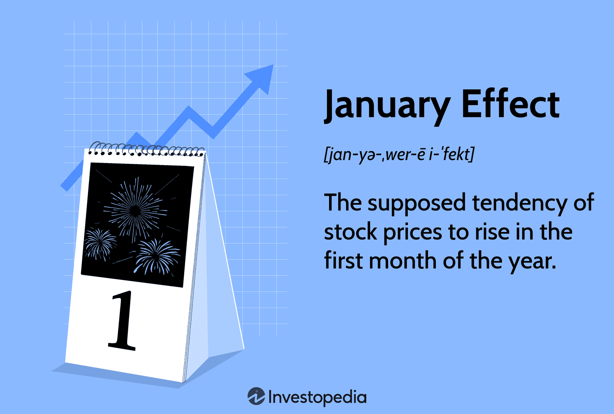

## Table of Contents

## What is the January Effect in the stock market?

The January Effect is a pattern in the stock market where stock prices tend to go up more in January than in other months. People noticed this pattern a long time ago. It happens because some investors sell their stocks at the end of the year to save on taxes. Then, they buy the stocks back in January, which makes the prices go up.

This effect is more noticeable in small company stocks. These stocks are often the ones that investors sell at the end of the year. However, not everyone believes in the January Effect. Some say it's not as strong as it used to be because more people know about it now. Still, it's something that many investors watch for at the start of each year.

## How was the January Effect first identified?

The January Effect was first noticed by people looking at stock market patterns over many years. They saw that stock prices often went up more in January than in other months. This pattern was spotted a long time ago, and people started talking about it in the 1940s. A man named Sidney B. Wachtel wrote about it in a book in 1942, which helped spread the idea.

Researchers then started to study this pattern more closely. They found that the January Effect was especially strong for small company stocks. This was because some investors would sell their stocks at the end of the year to save on taxes and then buy them back in January, pushing the prices up. Over time, as more people learned about the January Effect, some wondered if it would still happen as much, but it remains a topic that investors pay attention to at the start of each year.

## Can you explain the historical performance of stocks in January?

Historically, stocks have often done better in January than in other months. This pattern, called the January Effect, was first noticed a long time ago. People saw that stock prices would go up more in January, especially for small company stocks. This happened because some investors would sell their stocks at the end of the year to save on taxes and then buy them back in January, which would push the prices up.

Over the years, researchers have looked at a lot of data and found that this pattern is real. For example, from the 1950s to the 1980s, January was often the best month for stock market gains. However, as more people learned about the January Effect, some wondered if it would still happen as much. While it might not be as strong as it used to be, many investors still watch for it at the start of each year.

## What are the common causes attributed to the January Effect?

The January Effect happens because of what investors do at the end of the year and the start of a new one. Some investors sell their stocks in December to save on taxes. They sell stocks that have gone down in value to get a tax break. Then, in January, they buy these stocks back. This buying in January pushes the stock prices up.

Another reason for the January Effect is that people get new money in January. This can be from bonuses at work or from money they put aside for the new year. They use this money to invest in stocks, which also helps push prices up. The January Effect is more noticeable in small company stocks because these are the ones that investors often sell at the end of the year and buy back in January.

## How does tax-loss selling contribute to the January Effect?

Tax-loss selling is when investors sell stocks that have lost value at the end of the year. They do this to get a tax break. When they sell these stocks, it can make the prices go down a bit at the end of December. But then, in January, these same investors buy the stocks back. This buying in January pushes the stock prices up again.

This pattern of selling in December and buying in January is a big reason for the January Effect. It's more noticeable in small company stocks because these are the ones that investors often sell at the end of the year. So, when everyone starts buying them back in January, it really makes a difference in their prices.

## What role do year-end bonuses play in the January Effect?

Year-end bonuses can help make the January Effect happen. When people get extra money at the end of the year, they might decide to invest it in the stock market. They often wait until January to do this because it's the start of a new year, and they want to use their new money wisely. When a lot of people start buying stocks in January, it can push the prices up.

This extra buying from year-end bonuses adds to the January Effect, especially for small company stocks. These stocks often get a bigger boost in January because they are the ones that many investors choose to buy with their new money. So, year-end bonuses play a part in making stock prices go up more in January than in other months.

## How do investor psychology and behavior influence the January Effect?

Investor psychology and behavior play a big role in the January Effect. At the end of the year, many investors feel the need to tidy up their investments. They might sell stocks that have lost value to get a tax break. This is called tax-loss selling. When a lot of people do this at the same time, it can make stock prices go down a bit in December. But then, in January, these same investors buy the stocks back. This buying in January pushes the stock prices up again. It's like a cycle that happens every year because of how investors think and act.

Another part of investor psychology is the feeling of a fresh start in January. People get year-end bonuses or set new financial goals for the new year. They might decide to invest this new money in the stock market. When many people start buying stocks in January, it adds to the upward push on stock prices. This behavior, driven by the feeling of a new beginning, helps make the January Effect stronger. So, the way investors think and act at the end and start of the year really influences how stock prices move in January.

## Are there any specific sectors or types of stocks more affected by the January Effect?

The January Effect often hits small company stocks the hardest. These are the stocks that investors usually sell at the end of the year to save on taxes. When they buy these stocks back in January, it makes their prices go up a lot. Big company stocks can also go up in January, but the effect is usually not as strong as it is for small company stocks.

Another type of stock that can be affected by the January Effect is those that did badly the year before. Investors might sell these stocks at the end of the year to get a tax break. Then, in January, they buy them back, which can make their prices go up. So, if you see stocks that had a tough year, they might do better in January because of this effect.

## How can investors potentially capitalize on the January Effect?

Investors can try to use the January Effect to make money by buying small company stocks at the end of December or early January. These stocks often go up a lot in January because people sell them at the end of the year to save on taxes and then buy them back in January. If investors buy these stocks before the prices go up, they might be able to sell them later in January for a profit.

Another way to take advantage of the January Effect is to look at stocks that did badly the year before. These stocks are often sold at the end of the year for tax reasons, and then bought back in January. If investors buy these stocks in January, they might see their prices go up as more people start buying them again. It's important to remember, though, that the January Effect might not happen every year, so it's a good idea to be careful and do some research before making any big decisions.

## What are the criticisms and limitations of the January Effect theory?

Some people say the January Effect isn't as strong as it used to be. They think that because so many people know about it now, it's harder for it to happen. When everyone tries to buy stocks in January to make money, it can make the effect weaker. Also, some studies show that the January Effect might not happen every year. It can be hard to predict, and sometimes, stock prices might not go up in January like people expect.

Another problem with the January Effect is that it can be risky to try to use it to make money. If an investor buys stocks at the end of December hoping they will go up in January, they might lose money if the prices don't go up. The stock market can be unpredictable, and even if the January Effect has happened before, it doesn't mean it will happen again. So, investors need to be careful and not put all their money into one idea like the January Effect.

## How has the January Effect evolved over recent decades, and what are the current trends?

Over the last few decades, the January Effect has changed a lot. It used to be really strong, especially from the 1950s to the 1980s. Back then, January was often the best month for stock market gains. But as more people learned about the January Effect, it started to get weaker. Now, it's not as easy to see the big jumps in stock prices in January like before. Some years, the January Effect happens, but other years, it doesn't. This makes it harder for investors to count on it happening every year.

In recent years, the January Effect has become less predictable. Some experts think that because so many people know about it, they try to use it to make money, which can make the effect weaker. Also, changes in tax laws and how people invest their money have made a difference. For example, year-end tax strategies and the timing of bonuses can still play a role, but they don't always lead to the same big jumps in stock prices in January. So, while the January Effect is still something investors watch for, it's not as reliable as it used to be, and it's important for investors to be careful and not depend on it too much.

## What advanced statistical methods are used to study and predict the January Effect?

To study and predict the January Effect, researchers use advanced statistical methods like regression analysis. This method helps them look at past stock market data to see if there's a pattern where stock prices go up more in January than other months. They can also use time series analysis, which is a way to study how stock prices change over time. This helps them see if the January Effect is getting weaker or stronger over the years. These methods let researchers take a lot of data and find out if the January Effect is real and how strong it is.

Another method used is event study analysis. This looks at what happens to stock prices around certain times, like the end of December and the start of January. Researchers can see if there's a big change in stock prices during these times that might be because of the January Effect. They also use [machine learning](/wiki/machine-learning), which is a way to teach computers to find patterns in data. Machine learning can help predict if the January Effect will happen in a certain year by looking at a lot of different things, like tax laws and how people invest their money. These advanced methods help researchers understand the January Effect better and see if it's something investors can still use to make money.

## References & Further Reading

[1]: Wachtel, S. B. (1942). ["Certain Observations on Seasonal Movements in Stock Prices."](https://www.jstor.org/stable/2350013) Journal of Business.

[2]: Doran, J. S., & Krieger, K. (2010). ["The January Effect and Other Seasonal Anomalies: A Reassessment After 50 Years."](https://www.researchgate.net/publication/228317150_Implications_for_Asset_Returns_in_the_Implied_Volatility_Skew) The Review of Financial Studies.

[3]: Thaler, R. H. (1987). ["Anomalies: The January Effect."](https://www.aeaweb.org/articles?id=10.1257/jep.1.1.197) Journal of Economic Perspectives.

[4]: Green, J., & Hwang, B.-H. (2009). ["Price-Based Return Comovement."](https://www.sciencedirect.com/science/article/abs/pii/S0304405X0900066X) Journal of Financial Economics.

[5]: Slothouber, L., Raphael, D. M., & Yi, T. (2017). ["Does the January Effect Still Exist? Insights from Stock Returns and Volatility."](https://www.sciencedirect.com/science/article/abs/pii/S0378426617302815) Journal of Empirical Finance.

[6]: Chan, E. P. (2009). ["Quantitative Trading: How to Build Your Own Algorithmic Trading Business."](https://github.com/ftvision/quant_trading_echan_book) Wiley Trading Series.

[7]: Lopez de Prado, M. (2018). ["Advances in Financial Machine Learning."](https://www.amazon.com/Advances-Financial-Machine-Learning-Marcos/dp/1119482089) Wiley.