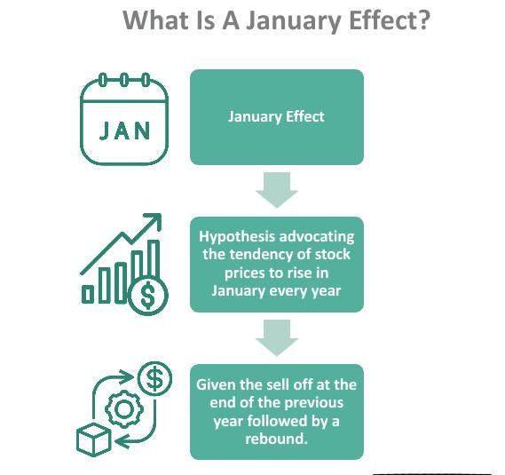

## Table of Contents

## What is the January effect?

The January effect is a pattern in the stock market where stock prices tend to go up more in January than in other months. People think this happens because investors sell their losing stocks at the end of the year to save on taxes. Then, they buy new stocks in January, which makes the prices go up.

Some people use this pattern to try to make money by buying stocks in December and selling them in January. But, it's not always a sure thing. The January effect can be different from year to year, and it might not happen at all. So, it's important to be careful and not rely on it too much when making investment choices.

## How was the January effect first identified?

The January effect was first noticed by a man named Sidney Wachtel in the 1940s. He was a stock market analyst and he saw that stock prices often went up a lot in January. He wrote about this in a book called "The Stock Market Almanac." This was the first time someone pointed out that January seemed to be special for the stock market.

After Wachtel's book, other people started to study this pattern more. They looked at lots of data from the stock market over many years. They found that, indeed, stocks often did better in January than in other months. This made the January effect more well-known and many investors started to pay attention to it when planning their investments.

## What causes the January effect?

The January effect happens because of how people act around the end of the year. Many investors sell their stocks that have lost money before the new year starts. They do this to get a tax break, since they can use those losses to lower their taxes. When lots of people sell their losing stocks at the same time, it can make stock prices go down at the end of the year.

Then, in January, these same investors often use the money they got from selling their stocks to buy new ones. This buying can push the prices of stocks up. Also, some people get extra money at the start of the year, like bonuses or money they saved for taxes, and they might decide to invest it in the stock market. All this buying in January can lead to the prices going up more than usual, which is what we call the January effect.

## Can you explain the tax-loss selling hypothesis related to the January effect?

The tax-loss selling hypothesis is a big reason why the January effect happens. It says that people sell stocks that have lost money at the end of the year. They do this to get a tax break. When you sell a stock at a loss, you can use that loss to lower the taxes you have to pay on other money you made. So, lots of people sell their losing stocks in December to save on taxes.

When everyone is selling their losing stocks at the same time, it can make stock prices go down at the end of the year. But then, in January, these same people often take the money they got from selling and buy new stocks. This buying can push the prices of stocks up. So, the tax-loss selling at the end of the year, followed by buying in January, is what causes the January effect.

## How does the January effect impact stock market performance?

The January effect can make stock market performance better in January than in other months. This happens because many people sell their losing stocks at the end of the year to save on taxes. When lots of people sell at the same time, it can make stock prices go down in December. But then, in January, these same people often use the money they got from selling to buy new stocks. This buying can push the prices of stocks up, making January a good month for the stock market.

However, the January effect doesn't happen every year, and it can be different from one year to the next. Sometimes, the effect is strong, and other times it's weak or doesn't happen at all. This means that investors can't always count on the January effect to make money. It's important for them to look at other things too, like the overall health of the economy and news about specific companies, before deciding to buy or sell stocks.

## What are some historical examples of the January effect?

One good example of the January effect happened in 1975. That year, the stock market had a really big jump in January. The Dow Jones Industrial Average, which is a way to measure how the stock market is doing, went up by about 14% in January alone. This was a lot more than usual and showed how strong the January effect could be. People think this big jump happened because a lot of investors sold their losing stocks at the end of 1974 to save on taxes and then bought new stocks in January.

Another example was in 1987. The stock market had a good January that year too. The S&P 500, another way to measure the stock market, went up by about 13% in January. This was a big increase and it made a lot of people happy. But, later that year, in October, the stock market crashed. This showed that even though the January effect can make the market go up in January, it doesn't mean the whole year will be good. So, it's important not to rely too much on the January effect when making investment choices.

## How can investors take advantage of the January effect?

Investors can take advantage of the January effect by buying stocks at the end of December and selling them in January. They do this because many people sell their losing stocks in December to save on taxes, which can make stock prices go down. Then, in January, these same people often buy new stocks, which can push the prices up. So, if an investor buys stocks when they are cheap at the end of December and sells them when they go up in January, they might make some money.

But, it's important to be careful. The January effect doesn't happen every year, and it can be different from one year to the next. Sometimes, the effect is strong, and other times it's weak or doesn't happen at all. So, investors should not rely only on the January effect. They should also look at other things, like how the economy is doing and news about specific companies, before deciding to buy or sell stocks. This way, they can make smarter choices and not lose money if the January effect doesn't work out as expected.

## Are there any risks associated with trading based on the January effect?

Yes, there are risks when you trade based on the January effect. The biggest risk is that the January effect doesn't happen every year. Sometimes, stock prices don't go up in January like people expect. If you buy stocks at the end of December hoping they will go up in January, and they don't, you could lose money.

Another risk is that the stock market can be unpredictable. Even if the January effect usually happens, other things can affect stock prices. Bad news about a company or the economy can make stock prices go down, even in January. So, if you're not careful and don't look at other things besides the January effect, you might make a bad investment choice.

## How has the January effect evolved over time?

The January effect has changed a lot over time. When it was first noticed in the 1940s, it was a big deal. People saw that stocks often went up a lot in January. But as more people learned about the January effect, they started to use it to try to make money. This meant more people were buying stocks at the end of December and selling them in January. Because so many people were doing this, the effect started to get weaker. It didn't happen as strongly or as often as it used to.

Now, the January effect is not as reliable as it once was. Sometimes it still happens, but it's not something you can count on every year. The stock market has also changed a lot. There are more ways to invest now, and the market is affected by more things, like news from around the world. So, the January effect is just one small part of how the stock market works. People still look at it, but they also need to pay attention to other things when making investment choices.

## What does recent research say about the persistence of the January effect?

Recent research shows that the January effect is not as strong or reliable as it used to be. A lot of people know about it now, so they try to use it to make money. This means more people buy stocks at the end of December and sell them in January. Because so many people do this, the effect is not as big as it was in the past. Some studies even say that the January effect might not happen at all some years.

Even though the January effect is weaker now, it can still happen sometimes. Researchers keep looking at data from the stock market to see if the effect is still there. They find that it can be different from year to year. So, while the January effect is not something you can count on every year, it's still something that investors watch. They just need to be careful and look at other things too, like how the economy is doing and news about specific companies, before making investment choices.

## How do different market sectors respond to the January effect?

Different market sectors can respond to the January effect in different ways. Some sectors, like small-cap stocks, often see a bigger jump in January than others. This is because small companies are more likely to be the ones that people sell at the end of the year to save on taxes. When these stocks get sold a lot in December, their prices go down. Then, when people buy them again in January, the prices go up a lot. So, the January effect can be stronger for small-cap stocks.

Other sectors, like big companies or tech stocks, might not see as big of a January effect. These companies are usually more stable, and people might not sell them as much at the end of the year. So, their prices might not go down as much in December, and they might not go up as much in January. But, even for these sectors, the January effect can still happen sometimes. It just depends on what's going on in the market and what people are doing with their investments.

## What are the global perspectives on the January effect outside of the U.S. market?

The January effect is not just something that happens in the U.S. It can happen in other countries too, but it can be different in each place. In some countries, like Canada and the UK, people have seen a January effect that is similar to what happens in the U.S. Stocks in these countries can go up more in January because people sell their losing stocks at the end of the year to save on taxes and then buy new ones in January. But, the effect might not be as strong as it is in the U.S.

In other countries, the January effect might not happen at all, or it might be weaker. This can be because different countries have different tax rules and different ways of investing. For example, in some Asian countries, the stock market might not see a big jump in January because people there might not sell their stocks at the end of the year for tax reasons. So, while the January effect can happen around the world, it's important to look at what's happening in each country's market before deciding to invest based on it.

## References & Further Reading

[1]: De Bondt, W. F., & Thaler, R. H. (1985). ["Does the Stock Market Overreact?"](https://onlinelibrary.wiley.com/doi/full/10.1111/j.1540-6261.1985.tb05004.x) The Journal of Finance, 40(3), 793-805.

[2]: Fama, E. F. (1991). ["Efficient Capital Markets: II."](https://onlinelibrary.wiley.com/doi/full/10.1111/j.1540-6261.1991.tb04636.x) The Journal of Finance, 46(5), 1575-1617.

[3]: Keim, D. B. (1983). ["Size-related anomalies and stock return seasonality: Further empirical evidence."](https://www.sciencedirect.com/science/article/pii/0304405X83900259) Journal of Financial Economics, 12(1), 13-32.

[4]: Rozeff, M. S., & Kinney, W. R. (1976). ["Capital market seasonality: The case of stock returns."](https://www.sciencedirect.com/science/article/pii/0304405X76900283) Journal of Financial Economics, 3(4), 379-402.

[5]: ["Trading and Exchanges: Market Microstructure for Practitioners"](https://www.amazon.com/Trading-Exchanges-Market-Microstructure-Practitioners/dp/0195144708) by Larry Harris

[6]: ["Algorithmic Trading: Winning Strategies and Their Rationale"](https://www.wiley.com/en-us/Algorithmic+Trading%3A+Winning+Strategies+and+Their+Rationale-p-9781118460146) by Ernie Chan