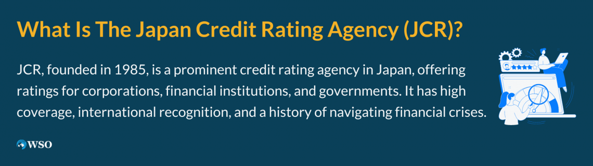

## Table of Contents

## What is the Japan Credit Rating Agency (JCR)?

The Japan Credit Rating Agency, or JCR, is a company that rates how safe it is to lend money to different organizations in Japan. They look at things like how much money a company makes, how much debt they have, and if they can pay back what they borrow. This helps people who want to lend money decide if it's a good idea to do so.

JCR gives ratings using letters and numbers, like AAA or BB+. A high rating, like AAA, means the organization is very safe to lend to. A lower rating, like BB+, means it might be riskier. These ratings are important because they help banks, investors, and other people make smart choices about where to put their money.

## What are the primary functions of JCR?

The Japan Credit Rating Agency, or JCR, has a main job of giving ratings to different organizations in Japan. These ratings tell people how safe it is to lend money to these organizations. JCR looks at things like how much money a company makes, how much debt they have, and if they can pay back what they borrow. This helps people who want to lend money decide if it's a good idea to do so. The ratings use letters and numbers, like AAA or BB+. A high rating, like AAA, means the organization is very safe to lend to. A lower rating, like BB+, means it might be riskier.

Besides giving ratings, JCR also does research and gives advice. They study the economy and different industries to understand what might happen in the future. This research helps them give better ratings and also helps investors and businesses make smart choices. JCR shares this information through reports and talks with people who might want to use their services. By doing all these things, JCR helps make the financial world safer and more trustworthy.

## How does JCR assess credit ratings?

JCR looks at many things to decide how safe it is to lend money to a company or organization. They check the company's money coming in and going out, how much debt they have, and if they can pay it back. JCR also looks at the company's history, the people running it, and what's happening in the world that could affect them. All these things help JCR figure out if the company is likely to pay back what they borrow.

After looking at all this information, JCR gives a rating using letters and numbers, like AAA or BB+. A high rating, like AAA, means the company is very safe to lend to. A lower rating, like BB+, means it might be riskier. These ratings help people who lend money, like banks and investors, make smart choices about where to put their money. By doing this, JCR helps make the financial world safer and more trustworthy.

## What types of entities does JCR rate?

JCR rates many different kinds of groups in Japan. They look at big companies that make things like cars or electronics, and smaller businesses too. They also rate banks and other places that lend money. This helps people know if it's safe to borrow from or invest in these groups.

Besides businesses, JCR also rates groups run by the government, like cities or public services. They check if these groups can pay back what they borrow. This is important because it helps the government and people who lend money make good choices. By rating all these different kinds of groups, JCR helps keep the money world safe and fair.

## What is the significance of credit ratings provided by JCR?

Credit ratings from JCR are very important because they tell people how safe it is to lend money to different groups in Japan. When JCR gives a high rating, like AAA, it means the group is very safe to lend to. This helps banks and investors feel confident about giving money to these groups. If the rating is lower, like BB+, it means there might be more risk. This helps lenders decide if they want to take that risk or look for safer options.

These ratings also help the groups being rated. If a group has a good rating, it can borrow money more easily and at lower interest rates. This is because lenders see them as less risky. For the economy, JCR's ratings help keep things stable. They make it easier for money to move around in a safe way, which helps businesses grow and the economy stay strong.

## How does JCR ensure the accuracy and reliability of its ratings?

JCR works hard to make sure their ratings are correct and people can trust them. They use a lot of information to make their ratings, like looking at a company's money coming in and going out, how much they owe, and if they can pay it back. JCR also talks to the people running the company and checks what's happening in the world that could affect them. This helps JCR give a fair and accurate rating.

To keep their ratings reliable, JCR follows strict rules and checks their work often. They have a team of experts who know a lot about money and businesses. These experts look at all the information carefully and make sure they are not missing anything important. JCR also listens to what other people say about their ratings and makes changes if they need to. This way, people can trust that JCR's ratings are as accurate and reliable as possible.

## What are the key responsibilities of JCR towards its stakeholders?

JCR has important jobs to do for the people who care about its ratings. These people include banks, investors, and the companies JCR rates. JCR's main job is to give fair and correct ratings that help these people make good choices about lending money. Banks and investors use JCR's ratings to decide if it's safe to lend money to a company. Companies want good ratings so they can borrow money more easily and at lower interest rates.

To make sure its ratings are trusted, JCR follows strict rules and checks its work often. They use a lot of information to make their ratings, like looking at a company's money coming in and going out, how much they owe, and if they can pay it back. JCR also talks to the people running the company and checks what's happening in the world that could affect them. By doing all this, JCR helps keep the money world safe and fair for everyone involved.

## How does JCR's methodology compare to other global credit rating agencies?

JCR, like other big credit rating agencies such as Moody's, Standard & Poor's (S&P), and Fitch, looks at many things to decide a company's rating. They all check a company's money coming in and going out, how much debt the company has, and if it can pay back what it borrows. JCR also looks at the company's history, the people running it, and what's happening in the world that could affect them. Other agencies do the same, but they might use different names for their ratings. For example, JCR might use AAA while S&P uses AAA too, but they might have slightly different ways of deciding what makes a company deserve that rating.

Even though the basic ideas are the same, each agency has its own special way of doing things. JCR focuses a lot on understanding the Japanese market and economy, which can be different from what Moody's or S&P do, who look at many countries around the world. JCR also talks a lot with the companies they rate, which helps them understand the company better. Other agencies might rely more on numbers and less on talking to the company. But all these agencies work hard to make sure their ratings are fair and correct, so people can trust them when making choices about lending money.

## What role does JCR play in the Japanese financial market?

JCR plays a big role in the Japanese financial market by giving ratings to different groups. These ratings help people know how safe it is to lend money to companies, banks, and even parts of the government. When JCR says a company is safe with a high rating like AAA, it helps banks and investors feel good about lending money. If the rating is lower, like BB+, it tells them there might be more risk. This way, JCR helps everyone make smart choices about where to put their money.

Besides giving ratings, JCR also does research and gives advice. They study the economy and different industries to understand what might happen in the future. This research helps them give better ratings and also helps investors and businesses make smart choices. By doing all these things, JCR helps make the financial world in Japan safer and more trustworthy.

## How has JCR adapted to international standards and regulations?

JCR has worked hard to make sure its ratings follow the rules that many countries agree on. They do this by using methods that are similar to those used by big rating agencies around the world, like Moody's and S&P. JCR looks at the same things these agencies do, like a company's money coming in and going out, how much debt they have, and if they can pay it back. They also follow rules set by groups like the International Organization of Securities Commissions (IOSCO), which helps make sure all rating agencies are fair and correct.

To keep up with changes in the world, JCR keeps learning and changing how they do things. They talk to other rating agencies and listen to what people say about their ratings. This helps JCR make their ratings even better and more trusted. By doing this, JCR makes sure their ratings are useful not just in Japan, but also for people from other countries who want to invest in Japan.

## What are some challenges faced by JCR in the credit rating industry?

JCR faces many challenges in the credit rating industry. One big challenge is keeping up with changes in the economy and the world. Things like new laws, big events, or changes in how people do business can affect how safe it is to lend money to a company. JCR has to watch all these things closely and change their ratings quickly if needed. This can be hard because it means they always have to be learning and updating their information.

Another challenge is competition from other rating agencies. JCR has to make sure their ratings are as good and trusted as those from bigger agencies like Moody's or S&P. These agencies have been around for a long time and are known all over the world. JCR has to work hard to show that their ratings are just as good and useful, especially for people who want to invest in Japan.

Lastly, JCR has to deal with the challenge of being fair and correct. If they make a mistake, it can hurt the companies they rate and the people who use their ratings. This means JCR has to be very careful and always check their work. They also have to follow strict rules to make sure they are doing everything right. This can be tough, but it's important for keeping people's trust in their ratings.

## How does JCR contribute to financial stability and transparency in Japan?

JCR helps keep the money world in Japan safe and clear by giving ratings to different groups. These ratings tell people how safe it is to lend money to companies, banks, and even parts of the government. When JCR gives a high rating, like AAA, it means the group is very safe to lend to. This helps banks and investors feel good about lending money. If the rating is lower, like BB+, it means there might be more risk. By doing this, JCR helps everyone make smart choices about where to put their money, which keeps the financial world stable.

Besides giving ratings, JCR also does research and gives advice. They study the economy and different industries to understand what might happen in the future. This research helps them give better ratings and also helps investors and businesses make smart choices. By sharing this information through reports and talks, JCR makes the financial world more transparent. This way, everyone can see what's happening and make decisions based on clear and fair information.

## What is the impact of JCR Ratings on markets?

Japan Credit Rating Agency (JCR) plays a significant role in shaping investor decisions and influencing market dynamics through its credit ratings. As a reliable provider of credit ratings, JCR's evaluations impact key sectors such as finance, medical, and education, among others. These sectors rely heavily on credit ratings to gauge the creditworthiness of entities and instruments.

JCR's ratings hold considerable sway in international markets and global finance. With its credible and consistent rating methodology, JCR helps enhance the transparency and efficiency of markets by offering investors detailed insights into the financial health and risk profiles of issuers. This, in turn, aids investors in making informed decisions, thereby contributing to market stability.

A prime example of JCR's influence is evident in its assessments of corporate bonds. When JCR issues a rating, it has a direct effect on the yield spreads of these bonds, impacting both their market demand and pricing. For instance, a higher rating from JCR typically correlates with a lower yield spread, indicating lower risk and, consequently, reduced borrowing costs for the issuer. This relationship can be mathematically represented as:

$$
\text{Yield Spread} = \text{Benchmark Yield} - \text{Corporate Bond Yield}
$$

where the corporate bond yield is influenced by JCR's rating.

In terms of case studies, consider the financial sector. When JCR rates a bank or financial institution, its rating affects not just the company's cost of capital but also its reputation in the international community. Positive ratings can lead to increased capital inflows and bolster the institution's market position. Conversely, a downgrade can trigger capital outflows and heightened scrutiny from investors and regulators alike.

Moreover, JCR has demonstrated resilience and adaptability to changing economic climates and financial crises. During periods of economic downturn, such as the global financial crisis of 2008 or the COVID-19 pandemic, JCR has recalibrated its assessment models to reflect shifting risk perceptions and market realities. This adaptability ensures that JCR's ratings remain relevant and reliable, providing robust guides to investors navigating turbulent financial landscapes.

In summary, JCR's credit ratings play a pivotal role in influencing investor behavior and shaping market outcomes across a variety of sectors. Its methodical approach to rating creditworthiness not only ensures transparency and stability in markets but also underscores its significance in both domestic and international finance.

## References & Further Reading

[1]: Kamiyama, N. (2004). ["Credit Rating Agencies in Japan and Their Role in the Bond Market."](https://www.outersite.org/wp-content/uploads/2010/02/credit-rating-agencies.critical-review.revised-4-8-09.pdf) Asian Economic Papers, 3(1), 103-122.

[2]: Boot, A. W., Milbourn, T., & Schmeits, A. (2006). ["Credit Ratings as Coordination Mechanisms."](http://apps.olin.wustl.edu/faculty/milbourn/creditratings-RFS-final-version.pdf) Review of Financial Studies, 19(1), 81-118.

[3]: Jorion, P., & Zhang, G. (2009). ["Credit Contagion from Counterparty Risk."](https://www.jstor.org/stable/27735165) Journal of Finance, 64(5), 2053-2087.

[4]: Ohno, M. (2000). ["Japan's Big Bang in an International and Historical Perspective."](http://www.imaginejapan.net/_Documents/ohnoKenichi.pdf) Asian Economic Journal, 14(1), 1-25.

[5]: IOSCO (2009). ["Code of Conduct Fundamentals for Credit Rating Agencies."](https://www.iosco.org/library/pubdocs/pdf/IOSCOPD437.pdf) International Organization of Securities Commissions.