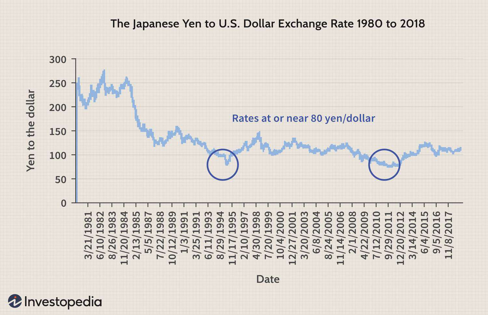

## Table of Contents

## What is the Japan Exchange Group (JPX)?

The Japan Exchange Group, or JPX, is a company that runs the stock markets in Japan. It was created in 2013 when the Tokyo Stock Exchange and the Osaka Securities Exchange joined together. The JPX helps people and companies buy and sell stocks, which are small pieces of ownership in a company. This makes it easier for companies to get money they need to grow and for people to invest their savings.

The JPX is important for Japan's economy because it helps businesses raise money and lets investors make money from their investments. It also keeps the market fair and safe by making rules that everyone has to follow. The JPX works hard to make sure that trading is done in a way that is open and honest, so people can trust the market.

## When was the Japan Exchange Group established?

The Japan Exchange Group, or JPX, was established on January 1, 2013. This happened when the Tokyo Stock Exchange and the Osaka Securities Exchange decided to come together and form one big group. By joining forces, they wanted to make the stock market in Japan stronger and more efficient.

The JPX helps companies and people buy and sell stocks, which are like small pieces of a company. This is important because it helps companies get the money they need to grow and lets people invest their savings. The JPX makes sure that everyone follows the rules so that the market stays fair and safe for everyone.

## What are the main functions of the Japan Exchange Group?

The Japan Exchange Group, or JPX, has some important jobs that help the stock market in Japan work well. One of its main functions is to provide a place where people and companies can buy and sell stocks. Stocks are like small pieces of a company that you can own. When people buy and sell these stocks, it helps companies get the money they need to grow bigger and do more things. This is really important for Japan's economy because it helps businesses to keep going and get better.

Another big job of the JPX is to make sure that the stock market is fair and safe for everyone. They do this by making rules that everyone has to follow. These rules help stop people from cheating or doing things that are not honest. By keeping the market fair and safe, the JPX helps people trust the market more. When people trust the market, they are more likely to invest their money, which is good for the economy.

The JPX also works to make the stock market better and easier to use. They use new technology and ideas to make trading faster and more efficient. This means that people can buy and sell stocks more quickly and easily. By doing this, the JPX helps make the whole process smoother and more helpful for everyone involved.

## How does the Japan Exchange Group impact the Japanese economy?

The Japan Exchange Group, or JPX, helps the Japanese economy by giving companies a place to get money. When companies want to grow or start new projects, they can sell pieces of their company, called stocks, on the JPX. People and other companies can buy these stocks, giving the company the money it needs. This helps businesses in Japan to keep working and getting bigger, which is good for the whole economy. When businesses do well, they can hire more people and make more things, which helps everyone.

The JPX also makes sure that the stock market is fair and safe. They have rules that everyone has to follow, which stops people from cheating or doing bad things. When people trust the market, they are more likely to invest their money. This is important because when people invest, it helps the economy grow. The JPX also uses new technology to make trading easier and faster, which helps more people to use the market and invest their money. This all adds up to a stronger and healthier economy in Japan.

## What are the major stock exchanges operated by the Japan Exchange Group?

The Japan Exchange Group, or JPX, runs two big stock exchanges in Japan. The first one is the Tokyo Stock Exchange, or TSE. It's the biggest and most important stock exchange in Japan. A lot of big companies from Japan and other countries have their stocks listed there. The TSE helps these companies get money by letting people buy and sell their stocks.

The second one is the Osaka Securities Exchange, or OSE. It's also a big deal, but it's a bit smaller than the TSE. The OSE is known for trading things like futures and options, which are special kinds of investments. Both the TSE and OSE are important because they help companies get money and let people invest in the economy.

## How can one invest in companies listed on the Japan Exchange Group?

To invest in companies listed on the Japan Exchange Group, you need to open an account with a brokerage firm. A brokerage firm is like a helper that lets you buy and sell stocks. You can choose a brokerage firm that works in Japan or one that lets you invest in Japanese stocks from another country. Once you have an account, you can put money into it and start looking at the different companies listed on the Tokyo Stock Exchange or the Osaka Securities Exchange. When you find a company you like, you can buy its stocks through your brokerage account.

After you buy stocks, you become a part-owner of the company. You can keep the stocks for a long time, hoping the company will do well and the stock price will go up. Or, you can sell the stocks later if you think it's a good time. You can also get money from the company if it decides to share its profits with its owners, which is called a dividend. Remember, investing in stocks can be risky, so it's a good idea to learn about the companies you're interested in and maybe talk to a financial advisor to help you make smart choices.

## What are the key indices managed by the Japan Exchange Group?

The Japan Exchange Group, or JPX, manages some important stock market indices that help people understand how the market is doing. The most famous one is the Nikkei 225, which tracks the stock prices of 225 big companies listed on the Tokyo Stock Exchange. It's like a scorecard that shows if these companies are doing well or not. People all over the world watch the Nikkei 225 to see how the Japanese economy is doing.

Another important index is the TOPIX, which stands for Tokyo Stock Price Index. This index looks at all the companies listed on the Tokyo Stock Exchange's First Section, which is a big group of companies. The TOPIX gives a broader view of the market because it includes more companies than the Nikkei 225. Both the Nikkei 225 and TOPIX help investors make decisions about where to put their money and help everyone understand the health of the Japanese economy.

## How does the Japan Exchange Group ensure market integrity and transparency?

The Japan Exchange Group, or JPX, works hard to keep the stock market fair and open for everyone. They do this by making rules that everyone has to follow. These rules stop people from cheating or doing things that are not honest. For example, JPX has rules against insider trading, which is when someone uses secret information to make money. They also watch the market closely to make sure no one is trying to trick others. By doing this, JPX helps people trust the market more because they know it's being watched and kept fair.

JPX also shares a lot of information with everyone. They tell people about the prices of stocks, how many stocks are being bought and sold, and other important details. This helps everyone see what's happening in the market, which makes it more open and clear. JPX uses technology to make sure this information is easy to find and understand. By being open and sharing information, JPX helps people make better choices about buying and selling stocks, which is good for the whole economy.

## What role does the Japan Exchange Group play in global financial markets?

The Japan Exchange Group, or JPX, is really important in the world of money because it runs the big stock markets in Japan. These markets are places where people from all over the world can buy and sell stocks of Japanese companies. The JPX helps make sure that these markets are fair and safe, which is important for everyone who wants to invest money in Japan. When people trust the Japanese market, they are more likely to put their money there, which helps the Japanese economy and also affects the global economy.

The JPX also makes special lists, called indices, like the Nikkei 225 and TOPIX, that show how well the Japanese stock market is doing. People around the world watch these indices to understand what's happening in Japan and to make decisions about where to invest their money. Because Japan is a big part of the world economy, what happens in its stock markets can affect markets everywhere. So, the JPX plays a big role in helping the world's money markets work together smoothly.

## What are some recent developments or initiatives by the Japan Exchange Group?

The Japan Exchange Group, or JPX, has been working on some new things to make the stock market better. One big change is that they started a new market called the Tokyo Pro Market in 2020. This market is for smaller companies that are just starting out and want to grow. It helps these companies get money by letting people buy and sell their stocks. The JPX also made it easier for foreign companies to list their stocks in Japan, which means more companies from other countries can join the Japanese market.

Another thing the JPX has been doing is using new technology to make trading faster and easier. They are working on a project to make a new trading system that will be better and more reliable. This system will help people buy and sell stocks more quickly, which is good for everyone. The JPX is also trying to make the market more open and fair by sharing more information with everyone. They want to make sure people can trust the market and feel good about investing their money there.

## How does the Japan Exchange Group handle corporate governance and sustainability?

The Japan Exchange Group, or JPX, helps make sure that companies follow good rules for how they are run, which is called corporate governance. They have rules that companies have to follow to make sure they are being honest and fair to everyone. This includes things like having a board of directors that watches over the company and making sure they tell everyone important information about how the company is doing. By doing this, JPX helps people trust the companies they invest in, which is good for the whole market.

JPX also cares about sustainability, which means making sure companies are good for the environment and society. They have a special index called the JPX Prime 150 Index that looks at companies that are doing well in terms of sustainability. This helps investors find companies that are trying to be good for the planet and for people. By encouraging companies to think about sustainability, JPX helps make the world a better place while also helping the economy grow.

## What are the future challenges and opportunities for the Japan Exchange Group?

The Japan Exchange Group, or JPX, faces some big challenges in the future. One challenge is to keep up with new technology. The world of trading is always changing, and JPX needs to make sure their systems are fast and safe. Another challenge is to attract more foreign companies to list their stocks in Japan. This can be hard because other countries have big markets too. Also, JPX needs to make sure that the market stays fair and honest, which means they have to keep watching for people trying to cheat.

But there are also a lot of opportunities for JPX. One big opportunity is to help more small companies grow by letting them list their stocks on the market. This can help the Japanese economy get stronger. Another opportunity is to focus more on sustainability. By encouraging companies to be good for the environment and society, JPX can help make the world a better place. If JPX can use new technology and keep the market fair, they can make the Japanese stock market even better and more trusted by people all over the world.

## References & Further Reading

1. **Tokyo Stock Exchange Overview**:
   - Tokyo Stock Exchange, "History and Milestones," Tokyo Stock Exchange official website.
   - Frino, A., & Otsubo, Y. (2017). "The Impact of Market Structure on Trading Costs: Evidence from the Tokyo Stock Exchange," *Asian Economic Policy Review*.

2. **Japan Exchange Group (JPX)**
   - JPX, "Corporate Strategy," Japan Exchange Group official website.
   - Sugawara, K. (2013). "The Merger of Tokyo Stock Exchange and Osaka Securities Exchange," *Financial Review*.

3. **Technological Advancements**
   - JPX, "J-GATE Trading System," Japan Exchange Group official publications.
   - Hamao, Y., & Hasbrouck, J. (1995). "Securities Trading in the Absence of Dealers: Trades and Quotes on the Tokyo Stock Exchange," *Review of Financial Studies*.

4. **Algorithmic Trading at TSE**
   - Chaboud, A. P., Chernenko, S. V., et al. (2009). "Rise of the Machines: Algorithmic Trading in the Foreign Exchange Market," *Board of Governors of the Federal Reserve System, International Finance Discussion Papers*.
   - TSE, "Arrowhead Trading System," Tokyo Stock Exchange official publications.

5. **Market Dynamics and Regulation**
   - Madhavan, A. (1992). "Trading Mechanisms in Securities Markets," *The Journal of Finance*.
   - Financial Services Agency (FSA), Japan, "Regulatory Framework for High-Frequency Trading," FSA Publications.

6. **Sustainability and ESG Initiatives**
   - JPX, "Sustainability Reports," Japan Exchange Group official website.
   - Nagata, T. (2020). "ESG Integration in Japanese Market," *Journal of Sustainable Finance & Investment*.

7. **Future Prospects and Innovations**
   - JPX, "Technology Initiatives," Japan Exchange Group strategic reports.
   - Deloitte, "The Future of Trading: Innovation and Technology in Financial Markets," Deloitte Research.

8. **General References**
   - Popper, N. (2012). *Digital Gold: Bitcoin and the Inside Story of the Misfits and Millionaires Trying to Reinvent Money*. Harper.
   - Shiller, R. J. (2015). *Irrational Exuberance*. Princeton University Press.

