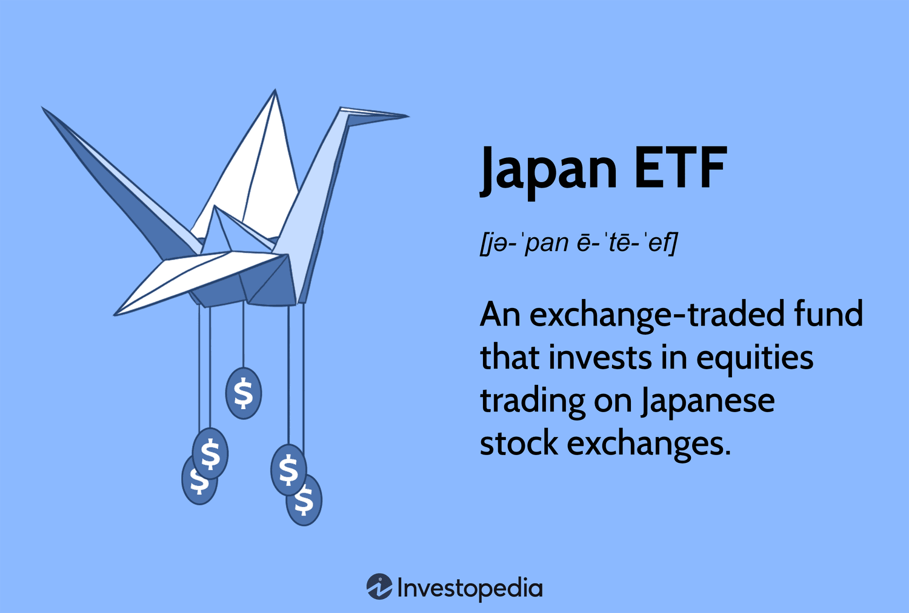

## Table of Contents

## What is a Japan Exchange-Traded Fund (ETF)?

A Japan Exchange-Traded Fund (ETF) is a type of investment fund that is traded on a stock exchange, just like individual stocks. It's designed to track the performance of a specific index, like the Nikkei 225, which represents a broad range of Japanese companies. When you buy shares of a Japan ETF, you're essentially investing in a basket of Japanese stocks all at once, which can be easier and less risky than picking individual stocks.

ETFs are popular because they offer diversification, which means spreading out your investment across many different companies to reduce risk. For example, if one company in the ETF does poorly, it might not affect the overall performance of the fund as much as it would if you had invested in that company alone. Japan ETFs can be a good way for investors to gain exposure to the Japanese market without having to research and buy individual Japanese stocks.

## How does a Japan ETF work?

A Japan ETF works by pooling money from many investors to buy a collection of Japanese stocks that match a specific index, like the Nikkei 225. This index is a list of the biggest and most important companies in Japan. When you buy shares of the ETF, you own a small piece of all those companies. The price of the ETF goes up and down based on how well the companies in the index are doing. If the companies do well, the ETF's price goes up. If they do poorly, the ETF's price goes down.

The [ETF](/wiki/etf-trading-strategies) is traded on a stock exchange, just like a regular stock. This means you can buy and sell shares of the ETF anytime during the trading day, at the current market price. The ETF's price can change throughout the day, but it usually stays close to the value of the stocks it holds. This makes it easy for investors to get in and out of their investment in the Japanese market without having to buy and sell many different stocks themselves.

## What are the benefits of investing in a Japan ETF?

Investing in a Japan ETF can be a smart move because it helps you spread your money across many different Japanese companies. This is called diversification, and it's a good way to lower your risk. Instead of putting all your money into one company, you're investing in a whole bunch of them. If one company does badly, it won't hurt your investment as much because the other companies might do well.

Another benefit is that Japan ETFs are easy to buy and sell. They trade on stock exchanges just like regular stocks, so you can buy or sell them anytime during the trading day. This makes it simple to get in and out of your investment in the Japanese market without having to deal with buying and selling lots of different stocks yourself. Plus, since the ETF follows a specific index like the Nikkei 225, you can easily keep track of how your investment is doing by watching that index.

## What are the risks associated with Japan ETFs?

Investing in Japan ETFs comes with some risks that you should know about. One big risk is that the whole Japanese market could go down. If the companies in the index that the ETF follows don't do well, the price of the ETF will go down too. This means you could lose money if the market takes a dip. Also, since ETFs are traded on stock exchanges, their prices can change a lot during the day. This can be risky if you need to sell your ETF quickly and the price has dropped.

Another risk is that Japan's economy might not do as well as other countries. Things like natural disasters, changes in government policies, or problems with big companies can affect the whole market. If Japan's economy struggles, your ETF could lose value. It's also important to remember that ETFs have fees, which can eat into your returns over time. So, even if the market does well, the fees could lower how much money you make.

## How can one invest in a Japan ETF?

To invest in a Japan ETF, you first need to open a brokerage account if you don't already have one. Many online brokers let you trade ETFs, so pick one that has low fees and a good platform. Once your account is set up, you can search for Japan ETFs. Look for ones that track indexes like the Nikkei 225 or the TOPIX, which are popular indexes of Japanese stocks. When you find the ETF you want, you can place an order to buy shares just like you would with any stock.

After you buy the ETF, you'll need to keep an eye on it. The price of the ETF will change every day based on how the companies in the index are doing. You can hold onto the ETF for as long as you want, but remember that you might want to sell it if you need the money or if you think the market is going to go down. Keep in mind that you'll have to pay some fees when you buy and sell the ETF, so those can affect how much money you make or lose.

## What are some popular Japan ETFs available in the market?

Some well-known Japan ETFs that you can invest in include the iShares MSCI Japan ETF (EWJ) and the WisdomTree Japan Hedged Equity Fund (DXJ). The iShares MSCI Japan ETF tracks the MSCI Japan Index, which includes a wide range of Japanese companies. It's a good choice if you want to invest in the overall Japanese market. On the other hand, the WisdomTree Japan Hedged Equity Fund focuses on Japanese companies but also tries to protect your investment from changes in the value of the Japanese yen compared to the U.S. dollar. This can be useful if you're worried about currency fluctuations.

Another popular option is the Nikkei 225 ETF (1320 JP), which tracks the Nikkei 225 Index. This index is made up of 225 large companies listed on the Tokyo Stock Exchange, so it's a good way to invest in some of Japan's biggest and best-known companies. If you're looking for a different approach, you might be interested in the Xtrackers MSCI Japan UCITS ETF (DBJP), which follows the MSCI Japan Index and is traded in Europe. Each of these ETFs offers a different way to get into the Japanese market, so you can pick the one that fits your investment goals the best.

## How do Japan ETFs compare to other investment options like mutual funds or individual stocks?

Japan ETFs are different from mutual funds and individual stocks in a few important ways. An ETF is like a basket of stocks that you can buy and sell on a stock exchange, just like you would with a single stock. This makes it easy to invest in a whole bunch of Japanese companies at once without having to pick each one yourself. ETFs usually have lower fees than mutual funds because they are passively managed, meaning they just follow an index like the Nikkei 225 instead of having someone actively choosing which stocks to buy and sell. On the other hand, mutual funds often have higher fees because they are actively managed, and they might not be traded as easily throughout the day like ETFs.

When you compare Japan ETFs to individual stocks, the big difference is risk and effort. If you buy an ETF, you spread your money across many companies, which can make your investment less risky than putting all your money into one stock. It's also a lot less work because you don't have to research each company on your own. But if you buy individual stocks, you might have the chance to make more money if you pick a stock that does really well. The downside is that you could lose more money if you pick a stock that does badly. So, Japan ETFs can be a good choice if you want an easier way to invest in the Japanese market with less risk, while individual stocks might be better if you're willing to do more research and take on more risk.

## What factors should be considered when choosing a Japan ETF?

When choosing a Japan ETF, you should think about what kind of Japanese companies you want to invest in. Some ETFs follow big indexes like the Nikkei 225, which includes the biggest companies in Japan. Others might focus on smaller companies or specific industries. You should pick an ETF that matches your investment goals. For example, if you want to invest in big, well-known companies, an ETF that tracks the Nikkei 225 might be a good choice. But if you're interested in smaller, growing companies, you might want to look for an ETF that focuses on those.

Another important thing to consider is the fees you'll have to pay. ETFs have something called an expense ratio, which is a fee that comes out of your investment every year. Lower fees mean you get to keep more of your money, so it's a good idea to compare the expense ratios of different ETFs. Also, think about how the ETF handles currency risk. Some ETFs, like the WisdomTree Japan Hedged Equity Fund, try to protect your investment from changes in the value of the Japanese yen. If you're worried about currency fluctuations, a hedged ETF might be a good choice. But if you're okay with taking that risk, you might go for an unhedged ETF, which usually has lower fees.

## How do economic conditions in Japan affect Japan ETFs?

Economic conditions in Japan can have a big impact on Japan ETFs. If the Japanese economy is doing well, companies in Japan usually make more money, and this can make the prices of Japan ETFs go up. For example, if Japan's GDP is growing, unemployment is low, and people are spending more money, this can be good for the companies in the ETF. On the other hand, if the economy is struggling, like during a recession, companies might not do as well, and the ETF's price could go down. Things like natural disasters, changes in government policies, or problems with big companies can also affect the whole market and, in turn, the ETFs.

Another thing to think about is how the value of the Japanese yen changes compared to other currencies. If the yen gets stronger, it can be good for Japanese companies that sell things in other countries because they get more money when they change it back to yen. But if the yen gets weaker, it can hurt those companies. Some Japan ETFs try to protect against these changes in currency value, which can be helpful if you're worried about the yen going up and down. Overall, keeping an eye on Japan's economic news and trends can help you understand how your Japan ETF might do in the future.

## What is the historical performance of Japan ETFs?

Japan ETFs have had ups and downs over the years, just like the Japanese market itself. In the late 1980s, Japan's economy was booming, and the Nikkei 225 reached an all-time high. But then, in the early 1990s, the bubble burst, and Japan went into a long period of slow growth called the "Lost Decades." During this time, Japan ETFs that followed the Nikkei 225 or other indexes didn't do very well. It took many years for the market to start recovering, and even now, the Nikkei 225 hasn't gotten back to its highest point from the late 1980s.

In more recent years, Japan ETFs have had some good times and some not-so-good times. For example, from 2012 to 2015, Japan's economy started to pick up a bit, thanks to policies called "Abenomics" that were meant to help the economy grow. During this time, Japan ETFs did pretty well, and their prices went up. But the market can still be shaky, and there have been times when Japan ETFs have gone down because of things like global economic problems or issues in Japan itself. Overall, the performance of Japan ETFs depends a lot on what's happening in Japan's economy and around the world.

## How do currency fluctuations impact investments in Japan ETFs?

Currency fluctuations can have a big effect on your investments in Japan ETFs. If you're investing from a country like the United States, you're buying the ETF in U.S. dollars, but the ETF itself is made up of Japanese companies that earn money in Japanese yen. If the yen gets stronger compared to the dollar, it can be good for your investment. That's because when the Japanese companies change their yen earnings back to dollars, they get more dollars. This can make the ETF's price go up. But if the yen gets weaker, it can hurt your investment because the companies get fewer dollars when they change their yen, and this can make the ETF's price go down.

Some Japan ETFs try to protect you from these currency changes. They do this by using something called currency hedging. This means they use financial tools to try to keep the value of your investment steady, even if the yen goes up and down. These hedged ETFs can be a good choice if you're worried about currency fluctuations. But they usually have higher fees than unhedged ETFs. If you're okay with taking the risk of currency changes, you might choose an unhedged ETF, which usually has lower fees. Either way, it's important to think about how currency changes might affect your investment in Japan ETFs.

## What advanced strategies can be used to optimize returns from Japan ETFs?

One advanced strategy to optimize returns from Japan ETFs is to use currency hedging. This means you pick ETFs that try to protect your investment from changes in the value of the Japanese yen. If the yen gets weaker, a hedged ETF can help keep your returns steady. But remember, these ETFs usually have higher fees, so you need to think about whether the protection is worth the extra cost. Another strategy is to use sector rotation, where you move your money into ETFs that focus on different parts of the Japanese economy based on which sectors are doing well at the time. For example, if technology companies in Japan are growing fast, you might want to invest more in a tech-focused Japan ETF.

Another way to boost your returns is by using a dollar-cost averaging approach. This means you invest a fixed amount of money in a Japan ETF at regular times, no matter what the market is doing. This can help you buy more shares when the price is low and fewer when it's high, which can lead to better returns over time. Finally, you might consider using leverage or inverse ETFs, but these are riskier. Leveraged ETFs try to give you bigger returns by using borrowed money, while inverse ETFs aim to go up when the market goes down. These can be useful for short-term trading but are not good for long-term investing because they can be very risky and might lose you a lot of money if the market doesn't move the way you expect.

## References & Further Reading

[1]: ["Japan on the Path of Economic Revival: A Comprehensive Analysis of 'Abenomics'."](https://www.bbc.com/news/business-62089543) International Monetary Fund.

[2]: Blackwell, D. (2014). ["The Impact of Algorithmic Trading on the Japanese Stock Market."](https://www.semanticscholar.org/paper/Assessing-the-Impact-of-Algorithmic-Trading-on-A-Gsell/820fa261b451f5b57decf4f8ccf526247fcbc2ff) Journal of Trading.

[3]: ["The Investment Environment: Japan"](https://www.jetro.go.jp/en/invest/investment_environment/ijre/report2023/) - MSCI.

[4]: Arnott, R. D., & Hsu, J. (2008). ["Corporate Governance, Risk Management and the Future of Japan's Financial Market."](https://papers.ssrn.com/sol3/papers.cfm?abstract_id=604842) CFA Institute.

[5]: ["Machine Learning for Asset Managers"](https://github.com/emoen/Machine-Learning-for-Asset-Managers) by Marcos M. López de Prado.

[6]: Boehmer, E., Fong, K. Y. L., & Wu, J. J. (2015). ["International Evidence on Algorithmic Trading."](https://www.cambridge.org/core/journals/journal-of-financial-and-quantitative-analysis/article/abs/algorithmic-trading-and-market-quality-international-evidence/4B96E916E3E13AFF1DF9B5FCC188F4E0) AFA 2014 Philadelphia Meetings Paper.