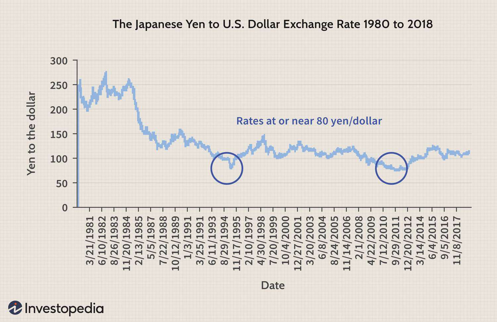

In recent years, Exchange-Traded Funds (ETFs) have emerged as a favored investment tool among both individual and institutional investors, largely due to their ability to offer diversified exposure to various markets without necessitating the purchase of individual securities. Japan, holding its position as the third-largest economy globally, presents a diverse and vibrant investment landscape, marked by its robust industrial sector, political stability, and technological advancements. This economic prowess, coupled with strategic reforms, makes the Japanese market particularly attractive to investors seeking growth opportunities and stability.

The Japanese ETF market has garnered significant attention for its potential to provide both diversification and growth. By focusing on Japanese investments, these ETFs offer investors a streamlined avenue to tap into the Japanese economy's dynamic sectors, such as technology, healthcare, and renewable energy. Additionally, Japan ETFs often track major indices, like the Nikkei 225 and the Topix, providing a comprehensive overview of the market landscape and enabling investors to access a broad spectrum of Japanese equities with ease.



This article will examine the intersection of Japan ETFs, Japanese investments, and the role of algorithmic trading in optimizing returns. Algorithmic trading, characterized by the use of computer algorithms to automate trading processes based on predetermined criteria, is becoming increasingly integral in enhancing the efficiency and effectiveness of ETF investments in Japan. By leveraging algorithmic trading strategies, investors can capitalize on market movements quickly, improve trade execution, and potentially reduce transaction costs.

Understanding these components—the Japanese ETF market, the underlying investment landscape, and the application of algorithmic trading—is crucial for investors aiming to diversify their portfolios and maximize their participation in Japan's economic narrative. This comprehensive approach provides valuable insights that can aid investors in navigating the complexities of international investments while positioning themselves advantageously within the Japanese market.

## Table of Contents

## Understanding Japan ETFs

Exchange-Traded Funds (ETFs) are investment funds that are traded on stock exchanges in the same manner as individual stocks. These financial instruments consist of a diversified portfolio of assets, which can include stocks, bonds, or commodities, offering investors a way to invest in a broader market segment without needing to buy each individual asset separately. Japan ETFs, in particular, are tailored to focus on investments within the Japanese market, encompassing domestic stocks and bonds.

Japan ETFs serve as a convenient vehicle for investors wishing to access the Japanese economy without directly acquiring shares in Japanese companies. This is particularly advantageous for investors looking to diversify their portfolios internationally while managing risk. By holding shares in a Japan ETF, an investor can indirectly own a slice of the Japanese market's major companies and sectors.

One of the primary attractions of Japan ETFs is their ability to track significant market indices such as the Nikkei 225 and the Topix. The Nikkei 225 is a price-weighted index that comprises 225 large, publicly-owned companies in Japan from various industry sectors, while the Topix index includes all companies listed on the Tokyo Stock Exchange's First Section, providing comprehensive market coverage. These indices offer exposure to the breadth and depth of the Japanese economy, which remains one of the most developed and technologically advanced economies worldwide.

The appeal of Japan ETFs has grown substantially among investors due to the potential for steady returns. This possibility is aligned with Japan's status as a well-developed economy characterized by stability and innovation. Furthermore, the Japanese market's longevity and resilience provide an appealing proposition for investors seeking consistent performance within a major global economy. As investors increasingly seek diversification and stable yields, Japan ETFs stand out as efficient and effective investment options for harnessing the growth potential of Japan's economy.

## The Appeal of Japanese Investments

Japan stands as a formidable force in the global economic arena due to its robust industrial foundation, characterized by well-established sectors such as automotive, electronics, and machinery. This industrial prowess is supported by a stable political landscape and cutting-edge technological infrastructure, collectively crafting an environment conducive to attracting a broad array of investors.

Despite being acknowledged as a mature economy, Japan presents a plethora of growth opportunities across various emerging sectors. The technology sector, particularly in fields such as robotics, [artificial intelligence](/wiki/ai-artificial-intelligence), and information technology, continues to draw significant attention due to Japan's long-standing reputation for innovation and precision. Moreover, the healthcare industry is expanding, driven by advancements in medical technology and an aging population, which enhances demand for healthcare services and products. Additionally, Japan's commitment to renewable energy solutions amidst global environmental concerns underscores the potential for investment in green technologies, aligning economic growth with sustainable practices.

A crucial [factor](/wiki/factor-investing) in increasing investor interest in Japan is the series of capital market reforms aimed at enhancing corporate governance standards and promoting improved shareholder returns. These reforms, including the adoption of international best practices, have resulted in greater transparency and accountability among Japanese companies, fostering an improved investment climate.

The Japanese government's strategic focus on economic revitalization further bolsters investor confidence. Initiatives such as the "Abenomics" policy package, which encompasses monetary easing, fiscal stimulus, and structural reforms, have been instrumental in stimulating economic activity and boosting investor sentiment. This governmental commitment is further evidenced by efforts to streamline regulatory processes and attract foreign direct investment, demonstrating Japan's openness to international capital flows.

Investing in Japanese assets can play a critical role in diversifying a global investment portfolio. Japan's economy, being inherently different from Western markets, provides a hedge against regional economic downturns and geopolitical tensions affecting other parts of the world. This diversification potential is particularly valuable in mitigating investment risks and enhancing portfolio stability.

In conclusion, Japan's appeal as an investment destination is multi-faceted. With its advanced industrial capabilities, evolving market opportunities, and supportive legislative reforms, Japan offers a compelling case for investors seeking both stability and growth. Whether through direct investments or instruments such as Japan ETFs, engaging with this dynamic market could be a strategic move for diversifying and strengthening investment portfolios.

## Role of Algorithmic Trading in Japan ETFs

Algorithmic trading employs advanced computer algorithms to automate the execution of trades, allowing financial markets to be navigated with greater precision and efficiency. These algorithms operate based on pre-defined rules and criteria, enabling swift responses to real-time market dynamics. In the context of Japan Exchange-Traded Funds (ETFs), [algorithmic trading](/wiki/algorithmic-trading) plays a pivotal role by facilitating rapid adaptation to market fluctuations and enhancing trade execution.

One of the primary advantages of algorithmic trading lies in its capacity to optimize execution by minimizing human intervention, thereby reducing potential errors. The automation of trading processes leads to improved accuracy and faster order processing, which are critical in a volatile and fast-paced market environment such as Japan’s. By cutting down the time it takes to execute trades, algorithmic trading significantly reduces transaction costs, which can enhance overall investment returns.

Furthermore, algorithmic trading aligns well with high-frequency trading ([HFT](/wiki/high-frequency-trading-strategies)) strategies. These strategies capitalize on very short-term market inefficiencies and typically involve executing numerous trades within a very brief time period, often in milliseconds. Japan’s market, with its technological sophistication and [liquidity](/wiki/liquidity-risk-premium), is particularly conducive to such strategies. HFT, powered by algorithms, can capitalize on small price discrepancies that may occur fleetingly across different trading platforms or within different financial instruments linked to Japanese ETFs.

The integration of artificial intelligence (AI) and [machine learning](/wiki/machine-learning) (ML) into algorithmic trading systems is revolutionizing the management and trading of Japan ETFs. These technologies empower algorithms to learn from historical data, recognize patterns, and make predictions about future price movements. For instance, machine learning algorithms can be used to optimize the selection of variables affecting trade decisions, resulting in improved forecasting of stock prices or market trends. The ability to process vast amounts of data enables AI-driven models to make nuanced decisions that account for a myriad of factors influencing the market.

Here is a simple Python example of how a basic algorithm might function using a moving average strategy:

```python
import numpy as np

# Historical price data for a Japan ETF
prices = np.array([150, 152, 149, 153, 155, 157, 156, 158, 157, 160])

# Calculate the short-term and long-term moving averages
short_window = 3
long_window = 5
short_mavg = np.convolve(prices, np.ones(short_window)/short_window, mode='valid')
long_mavg = np.convolve(prices, np.ones(long_window)/long_window, mode='valid')

# Generate buy/sell signals
signals = []
for i in range(len(long_mavg)):
    if short_mavg[i] > long_mavg[i]:
        signals.append('Buy')
    elif short_mavg[i] < long_mavg[i]:
        signals.append('Sell')
    else:
        signals.append('Hold')

print("Signals:", signals)
```

This code exemplifies a straightforward method where a 'Buy' signal is generated when the short-term moving average crosses above the long-term average, while a 'Sell' signal is indicated by the opposite scenario. Though rudimentary, this illustrates the core logic of algorithmic decision-making.

In conclusion, as algorithmic trading continues to evolve through advancements in AI and ML, it enhances the strategic options available for managing Japan ETFs. Such technological advancements promise to further refine trade execution and expand the potential for optimized returns in the Japanese market.

## Navigating Risks and Challenges

Investing in Japan ETFs involves various risks that investors must consider. One of the primary concerns is market [volatility](/wiki/volatility-trading-strategies), which refers to the fluctuations in market prices that can affect the value of [ETF](/wiki/etf-trading-strategies) holdings. This volatility is influenced by numerous factors such as changes in domestic and international economic conditions, investor sentiment, and significant market events. For instance, sudden economic downturns or global financial crises can lead to sharp declines in market prices, affecting ETF returns.

Another critical risk is currency fluctuation, especially with investments denominated in Japanese yen. Changes in the exchange rate between the yen and an investor's home currency can significantly impact the investment's overall performance. For example, a depreciation of the yen against the US dollar could reduce returns for US-based investors, even if the underlying Japanese stocks perform well.

Economic shifts, including changes in interest rates, inflation, and economic growth patterns, can also pose challenges. These shifts can affect corporate profits, consumer spending, and overall economic stability, which in turn impact Japan ETFs. Investors must analyze Japan's economic policies, including fiscal measures, monetary policy, and regulatory changes, to gauge their potential effects on investments.

Algorithmic trading presents its own set of risks. Though it offers advantages like faster order execution and cost reduction, over-reliance on algorithmic strategies can lead to significant issues. Technical failures, such as software bugs or connectivity problems, can result in incorrect trade executions or missed opportunities. Furthermore, algorithms driven by predefined criteria may not adapt well to unexpected market conditions, potentially leading to suboptimal trading decisions.

To navigate these risks, investors should adopt a diversified investment approach, spreading investments across various asset classes, sectors, and geographies. Diversification helps mitigate the impact of poor performance in a particular area. Robust risk management strategies, such as setting stop-loss orders and regularly reviewing and adjusting investment portfolios, can further protect against adverse market movements.

Staying informed about market trends and technological advancements is crucial for managing the risks associated with Japan ETFs and algorithmic trading. By keeping abreast of new developments, investors can make well-informed decisions and adapt their strategies accordingly. Continuous learning and adaptation can enhance an investor's ability to manage risks and capitalize on opportunities in the Japanese market.

## Conclusion

The integration of Japan Exchange-Traded Funds (ETFs) and algorithmic trading offers a promising avenue for investors eager to leverage the strengths of the Japanese market. With the potential for diversification, Japan ETFs allow investors to access a wide range of sectors within a well-established economy, providing balanced exposure without the need to manage individual stock portfolios. This diversification is a strategic advantage, helping to mitigate risks associated with market volatility and sector-specific downturns.

Algorithmic trading, meanwhile, brings a level of precision and efficiency that is difficult to achieve through traditional trading methods. By utilizing complex algorithms and real-time data analysis, traders can optimize execution strategies, reduce transaction costs, and enhance the likelihood of capturing favorable market movements. As advancements in artificial intelligence and machine learning continue, these technologies will further refine trading strategies, increasing the efficiency and potential returns of Japan ETFs.

Investors considering Japan ETFs should carefully evaluate their investment objectives and risk tolerance. The Japanese market offers strong growth potential, but understanding the intricacies of algorithmic trading and the unique challenges of the Japanese economy is crucial for making informed decisions. Balancing the appeal of technological trading advancements with a sound investment strategy is key to capitalizing on these opportunities.

Ultimately, the combination of Japan ETFs and algorithmic trading represents a modern, strategic approach to participating in Japan's economic growth. By harnessing these tools, investors can not only diversify their portfolios but also optimize their trading outcomes, reflecting a sophisticated investment strategy aligned with contemporary financial markets.

## References & Further Reading

[1]: ["Japan on the Path of Economic Revival: A Comprehensive Analysis of 'Abenomics'."](https://www.bbc.com/news/business-62089543) International Monetary Fund.

[2]: Blackwell, D. (2014). ["The Impact of Algorithmic Trading on the Japanese Stock Market."](https://www.semanticscholar.org/paper/Assessing-the-Impact-of-Algorithmic-Trading-on-A-Gsell/820fa261b451f5b57decf4f8ccf526247fcbc2ff) Journal of Trading.

[3]: ["The Investment Environment: Japan"](https://www.jetro.go.jp/en/invest/investment_environment/ijre/report2023/) - MSCI.

[4]: Arnott, R. D., & Hsu, J. (2008). ["Corporate Governance, Risk Management and the Future of Japan's Financial Market."](https://papers.ssrn.com/sol3/papers.cfm?abstract_id=604842) CFA Institute.

[5]: ["Machine Learning for Asset Managers"](https://github.com/emoen/Machine-Learning-for-Asset-Managers) by Marcos M. López de Prado.

[6]: Boehmer, E., Fong, K. Y. L., & Wu, J. J. (2015). ["International Evidence on Algorithmic Trading."](https://www.cambridge.org/core/journals/journal-of-financial-and-quantitative-analysis/article/abs/algorithmic-trading-and-market-quality-international-evidence/4B96E916E3E13AFF1DF9B5FCC188F4E0) AFA 2014 Philadelphia Meetings Paper.