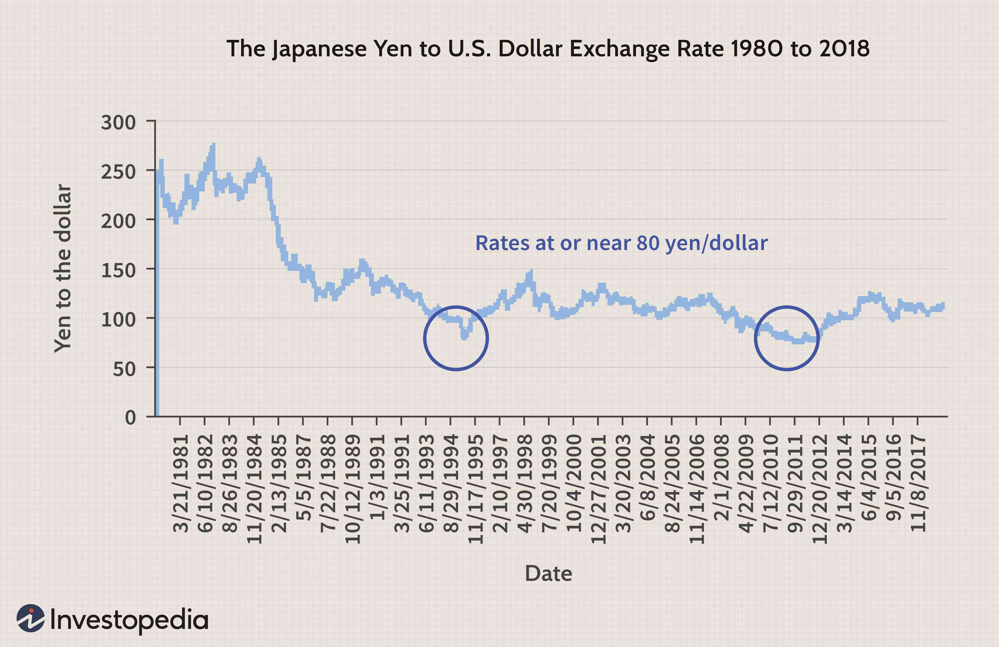

The Japanese economy stands as one of the most formidable and dynamic systems globally, offering distinct elements encapsulated in the concept known as Japan Inc. This term, widely recognized and studied, encapsulates the intricate interplay between Japan's robust corporate framework, strategic economic policies, and its adeptness at technological innovation. Despite various challenges, such as economic downturns and demographic shifts, Japan has continually showcased resilience and adaptability in the global economic sphere.

Japan's economic journey is characterized by its rapid post-war recovery, leading to a remarkable period of industrial growth and modernization, significantly influencing global markets. Japan Inc. denotes a unique corporate structure that emphasizes collaboration between business and government, promoting an integrated approach to economic advancement and innovation. The historical context of Japan's economic ascension is marked by an export-led growth strategy and a symbiotic relationship between state and industry, fostering an environment ripe for industrial prowess and global competitiveness.

In modern times, Japan's evolution continues as it embraces cutting-edge advancements, notably in financial technologies and algorithmic trading, aligning with global digital transformation trends. The strategic adaptation of economic policies and corporate structures emphasizes Japan's commitment to maintaining its stronghold in international markets. As Japan navigates these complexities, examining its economic history, corporate dynamics, and policy strategies offers valuable insights into its sustained growth and influence. The exploration of Japan Inc., through the lens of its corporate ecosystem and progressive economic policies, underpins its perch as a global economic powerhouse.

## Table of Contents

## Understanding Japan Inc.: A Historical Perspective

Japan Inc. epitomizes the symbiotic relationship between government and industry that propelled Japan's post-war economic resurgence. This collaborative model focused on fostering industrial growth by aligning governmental policies with business interests. In the decades following World War II, Japan prioritized economic reconstruction, leading to the creation of a robust industrial base. 

Throughout the 1970s and 1980s, Japan's corporate structure catalyzed its economic boom. The era emphasized export-led growth, heavily supported by the government through incentives and centralized planning. Entities like the Ministry of International Trade and Industry (MITI) were instrumental, tailoring policies that facilitated industrial expansion. During this period, major conglomerates known as keiretsu dominated the Japanese economy. These networks linked manufacturers, suppliers, and financial institutions, creating interconnected entities that could withstand economic fluctuations and capitalize on global market opportunities.

However, Japan Inc.'s reliance on this system faced significant challenges during the "lost decade" of the 1990s. This period was marked by stagnation, partially attributed to the bursting of the asset price bubble in the late 1980s. The ensuing economic stagnation highlighted the limitations of Japan's tightly-knit corporate-government relationships, which struggled to adapt to rapid changes in global economic conditions. Despite these setbacks, the principles underlying Japan Inc. have continued to influence modern economic strategies, proving resilient in the face of adversity.

Today, while Japan's corporate structure has evolved, the foundational elements of Japan Inc. still play a role in shaping its economic landscape. The legacy of close government and industry collaboration remains evident in Japan's modern approach to economic policy, focusing on innovation and responsive strategies to maintain its global economic position.

## Key Features of Japan's Corporate Structure

The Japanese corporate landscape is intricately shaped by the keiretsu system, which plays a crucial role in the nation's economic infrastructure. This system consists of interconnected corporations and embodies two notable forms: vertical and horizontal keiretsu, each contributing distinctively to Japan's industrial framework.

Vertical keiretsu represent a hierarchical integration of businesses, where large multinational corporations establish close collaborations with small- to medium-sized enterprises (SMEs). This structure fosters mutual benefits; large firms gain reliable supply chains and innovation inputs, while SMEs receive financial stability and growth opportunities. Such alliances create a resilient economic ecosystem, enhancing competitiveness and ensuring economic stability during volatile market conditions. An important characteristic of vertical keiretsu is that they facilitate efficient resource allocation and product development processes, as coordination among tiered suppliers and manufacturers ensures streamlined production cycles.

Horizontal keiretsu, by contrast, consist of diverse industry groups that engage in cross-ownership practices across various sectors. This configuration promotes industrial synergies and strengthens market competitiveness through diversified business operations. Companies within a horizontal keiretsu often share financial resources, managerial strategies, and market information, reinforcing their collective ability to respond to economic challenges. This cross-shareholding provides a buffer against hostile takeovers, thereby securing the strategic interests of the participating enterprises. Moreover, it facilitates collaborative innovation efforts, as companies can leverage collective knowledge and technological advancements to pioneer new markets.

Both vertical and horizontal keiretsu exemplify Japan's approach to corporate organization, characterized by long-term relationships, mutual trust, and an orientation towards consensus-building. This system not only underpins the stability of Japan's economic framework but also enhances its adaptability to shifting global market demands.

## Japan's Economic Transition and Modern Policies

Japan's economic transition and modern policies reflect a significant shift towards embracing globalization and technological advancements. These changes are crucial to maintaining Japan's status as a leading economic power in an increasingly interconnected world. Central to this transformation are targeted government policies and strategic economic frameworks designed to foster innovation and adaptability.

The Ministry of Economy, Trade, and Industry (METI) is at the forefront of Japan's modernization efforts. METI is instrumental in reshaping industrial policies to align with global economic trajectories and technological progressions. Through regulatory adjustments, METI supports innovation-led growth projects, promoting research and development in cutting-edge technologies such as [artificial intelligence](/wiki/ai-artificial-intelligence), robotics, and renewable energy. By prioritizing these sectors, Japan aims to cement its position as a leader in technology and sustainable practices.

In tandem with fostering innovation, Japan's economic strategy includes a dual approach of trade liberalization and the protection of strategic industries. Trade liberalization efforts are aimed at opening up markets and reducing barriers to international trade, enhancing Japan's competitiveness on the global stage. This is achieved through active participation in international trade agreements and partnerships, such as the Comprehensive and Progressive Agreement for Trans-Pacific Partnership (CPTPP) and negotiations with the European Union.

Simultaneously, Japan seeks to safeguard its strategic industries, recognizing their importance to national security and economic stability. METI's policies ensure support and protection for these key sectors, which include automotive, electronics, and advanced manufacturing. By balancing openness with strategic protection, Japan enhances its economic resilience while safeguarding its industrial base.

In conclusion, Japan's economic transition and modern policies underscore the country's commitment to adaptability and growth. Through the dynamic interplay of regulatory innovation and strategic trade measures, Japan strives to maintain its global economic influence and address the challenges of a rapidly changing world.

## The Rise of Algorithmic Trading in Japan

Algorithmic trading has become increasingly prominent in Japan's financial markets due to advancements in technology and robust infrastructure. This trading approach involves the use of computer algorithms to automate the process of buying and selling securities. The rise of [algorithmic trading](/wiki/algorithmic-trading) in Japan is indicative of the country's broader digital transformation efforts.

The key advantage of algorithmic trading lies in its ability to increase market efficiency. Algorithms can process vast amounts of data and execute trades at speeds unattainable by human traders. This rapid execution enhances price discovery—the process through which the market assigns a value to a security—by more quickly incorporating information into market prices. Moreover, algorithms can identify [arbitrage](/wiki/arbitrage) opportunities and execute trades that maintain market equilibrium, thus further contributing to market efficiency.

The growth of algorithmic trading in Japan is supported by a well-developed technological infrastructure and a commitment to innovation. The Tokyo Stock Exchange, for example, provides a high-speed trading platform equipped with the necessary tools to support algorithmic trading, thus facilitating its integration into the financial ecosystem.

Regulatory oversight is crucial in maintaining the integrity and stability of markets utilizing algorithmic trading. In Japan, the Financial Services Agency (FSA) plays a central role in ensuring that these practices are conducted fairly and transparently. The FSA has established guidelines and frameworks to monitor and regulate algorithmic trading activities, thereby safeguarding the interests of investors and minimizing risks such as market manipulation and systemic instability.

In conclusion, the rise of algorithmic trading in Japan's financial markets reflects the country's ongoing digital transformation and its ability to adapt to global technological trends. By enhancing market efficiency and ensuring the integrity of trading practices, Japan positions itself prominently in the evolving landscape of global finance.

## Challenges and Opportunities Ahead

Japan's economic landscape faces significant challenges and opportunities as it navigates an increasingly complex global environment. One of the most pressing issues is the aging population, which has far-reaching implications for workforce dynamics and economic productivity. As the population ages, the labor force shrinks, potentially reducing economic output and increasing the burden on social security systems. This demographic trend poses a critical challenge to sustaining economic growth and maintaining the social welfare system.

To address these challenges, Japan is increasingly looking towards innovative technologies to enhance productivity and compensate for the declining workforce. Automation, artificial intelligence (AI), and robotics are being integrated into various sectors to boost efficiency and output. For instance, the deployment of robots in manufacturing and service industries aims to offset labor shortages while maintaining high productivity levels. The embrace of such technologies is not only a response to demographic changes but also a strategic move to position Japan as a leader in the digital economy.

Furthermore, forming strategic alliances is another vital opportunity for Japan to expand its influence in the global market. Collaborative efforts with international partners can facilitate the exchange of knowledge and technological advancements, benefiting Japan's economic landscape. Such alliances can also help Japanese companies tap into new markets, diversify their offerings, and enhance their competitive edge on the global stage.

Balancing traditional corporate structures with the need to adapt to international market demands is crucial for Japan's economic future. The established keiretsu system, characterized by interlinked corporate networks, has historically contributed to Japan's economic stability. However, to remain competitive, there is a growing need for these structures to evolve. This evolution might include more flexible business practices, greater openness to foreign investment, and a shift towards greater innovation and entrepreneurship.

In summary, Japan's path forward is replete with both challenges and opportunities. By embracing technological innovations, fostering strategic partnerships, and carefully balancing traditional practices with modern market demands, Japan can navigate these complexities effectively, ensuring its robust economic future.

## Conclusion

Japan Inc., with its distinctive corporate structure, continues to evolve as it navigates the ever-changing global and domestic environments. This adaptability is a testament to Japan's ability to leverage its economic past while integrating modern practices. The historical interplay between government and industry has fortified Japan's economic resilience, fostering a culture of collaboration and stability that remains relevant today.

The country's responsiveness to global economic shifts is evident through its continued emphasis on innovation and strategic policy adjustments. By incorporating advanced trading mechanisms, such as algorithmic trading, Japan enhances market efficiency and price discovery, aligning with its digital transformation goals. These technological advancements, coupled with responsive policymaking, are crucial in maintaining Japan's competitive edge on the global economic stage.

Moreover, Japan's emphasis on innovation and strategic alliances positions it well to capitalize on opportunities within the digital economy. Balancing traditional corporate practices with the demands of international markets remains essential for sustaining its economic robustness and influence.

In conclusion, the integration of sophisticated trading systems and adaptive policy frameworks serves as a solid foundation for Japan's ongoing success. Japan's unique approach to corporate governance and economic policy not only underpins its resilience but also sets a precedent for global economic influence and adaptability.

## References & Further Reading

[1]: Johnson, C. A. (1982). ["MITI and the Japanese Miracle: The Growth of Industrial Policy, 1925-1975."](https://www.sup.org/books/title?id=2791) Stanford University Press.

[2]: Toyoda, T. (1993). ["Japan’s Keiretsu System: An Empirical Investigation."](https://carbuzz.com/coolest-everyday-japanese-cars-of-the-1990s/) The Journal of Asian Studies, 52(4), 1032-1033.

[3]: Ghemawat, P., & Ghadar, F. (2000). ["The Dubious Logic of Global Megamergers"](https://hbr.org/2000/07/the-dubious-logic-of-global-megamergers) Harvard Business Review.

[4]: Schaede, U. (2008). ["Choose and Focus: Japanese Business Strategies for the 21st Century."](https://archive.org/details/choosefocusjapan0000scha) Cornell University Press.

[5]: Nottage, L., & Wolff, L. (Eds.). (2005). ["Corporate Governance in the 21st Century: Japan’s Gradual Transformation"](https://www.elgaronline.com/abstract/9781847209238.xml) Edward Elgar Publishing.