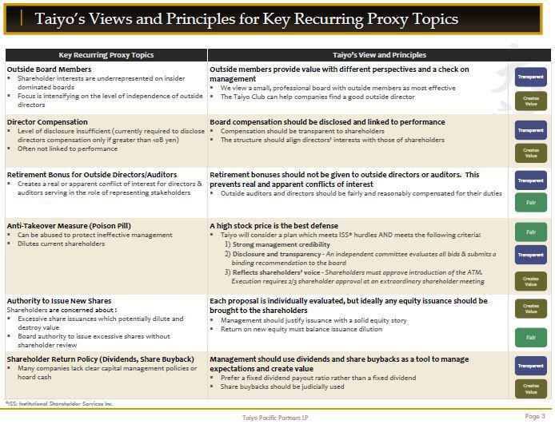

Japan's economy, renowned for its innovation and resilience, has experienced substantial reforms in corporate governance and investment policies over recent years. As part of these reforms, the Japan Stewardship Code has emerged as a pivotal initiative directing the enhancement of corporate governance standards. Introduced to foster a culture of responsible investment, the code sets out principles that aim to build effective engagement between institutional investors and the companies in which they invest. This initiative is crucial in promoting long-term sustainable growth and improving corporate value.

The reform-driven agenda within Japan's financial sector is reflective of a broader strategy to increase market competitiveness and attract foreign investment. It aligns with global tendencies towards reforming corporate governance structures, seeking increased transparency, accountability, and the empowerment of independent directors within corporate boards. Central to this transformative process is the encouraging backdrop of open dialogue between investors and corporations, a fundamental aspect driven by the Japan Stewardship Code.

In parallel, the rise of algorithmic trading marks another transformative shift within Japan's financial markets. Characterized by the use of detailed algorithms to make rapid trading decisions, this form of trading has the potential to significantly enhance market efficiency. However, it simultaneously poses significant regulatory challenges due to its inherent speed and complexity. The emphasis placed by the Stewardship Code on responsible investment necessitates that algorithmic traders ensure alignment of their practices with corporate governance principles and frameworks.

Understanding the interplay between these components is essential for investors and corporate stakeholders looking to navigate Japan's evolving financial landscape. The dynamic nature of this environment necessitates adaptability and engagement from all market participants to ensure sustainable and positive outcomes. This article investigates the various roles played by the Japan Stewardship Code in shaping corporate governance, its impact on investment policies, and the rising influence of algorithmic trading within this context.

## Table of Contents

## Understanding the Japan Stewardship Code

The Japan Stewardship Code was introduced as a significant policy initiative to promote responsible and sustainable investment practices among institutional investors in Japan. It was developed by the Financial Services Agency (FSA) in response to global calls for improved corporate governance and sustainable growth. The main objective of the code is to guide institutional investors towards responsible engagement with investee companies, fostering an environment where long-term value creation and corporate accountability are prioritized.

The code is structured around several principles that serve as a framework for institutional investors. One of the key principles is the articulation of fiduciary responsibilities. Investors are expected to prioritize the interests of their beneficiaries or clients and manage conflicts of interest diligently. This principle is crucial to ensuring that investment decisions align with the broader goals of fiduciary duty, transparency, and ethical conduct.

Another fundamental aspect of the Japan Stewardship Code is its emphasis on dialogue between institutional investors and investee companies. This engagement is not merely transactional; it aims to build a constructive relationship that facilitates sustainable corporate growth. Through consistent and open communication, investors can influence corporate strategies and decisions, encourage better business practices, and ensure that companies adhere to the highest standards of governance.

The code also focuses on improving corporate value over time. Investors are encouraged to adopt a long-term perspective in their investment strategies, considering factors that contribute to sustainable economic performance, such as environmental, social, and governance ([ESG](/wiki/esg-investing)) criteria. By integrating these considerations into their decision-making process, institutional investors can support companies in achieving and maintaining strong governance structures that enhance corporate performance and shareholder value.

Overall, the Japan Stewardship Code establishes a framework that encourages responsible investment and corporate governance practices, aiming to create a more transparent and accountable financial environment. Through the implementation of these principles, the code seeks to align investor interests with long-term corporate success, thereby contributing to a healthier, more resilient economy.

## Corporate Governance Reforms in Japan

Japan's Corporate Governance Code, developed alongside the Japan Stewardship Code, has been instrumental in redefining corporate governance standards within the country's financial and business landscape. This initiative was launched by the Financial Services Agency and the Tokyo Stock Exchange in an effort to strengthen corporate governance frameworks and make Japanese companies more attractive to domestic and international investors.

One of the core tenets of these corporate governance reforms is the emphasis on improving transparency and accountability within corporations. By promoting full disclosure of financial and operational activities, the reforms aim to foster trust among investors and stakeholders. In line with these objectives, Japanese companies are encouraged to enhance their reporting standards and provide clear, comprehensive information regarding their governance policies and business practices.

Another critical facet of the reforms is the emphasis on the role of independent directors in corporate boards. Traditionally, Japanese boards have been dominated by internal management, which often leads to a lack of objective oversight. By integrating more independent directors, the reforms aim to bolster board objectivity and ensure that management decisions align with shareholder interests. This move not only aligns Japan with global governance norms but also heightens the board's capacity to challenge management decisions effectively and ensure the company's strategic direction is in the best interest of all stakeholders.

These reforms are strategically designed to position Japan as an attractive destination for foreign investment. By aligning more closely with global governance standards, Japan aims to enhance its market competitiveness. The increased presence of foreign investors can bring new perspectives and innovation to Japanese companies, thereby stimulating economic growth and development.

The adoption of the Corporate Governance Code by numerous Japanese firms indicates a significant shift towards embracing international best practices. This proactive stance demonstrates Japan's commitment to fostering an investment climate that prioritizes robust governance frameworks. It reflects an understanding that sound corporate governance is fundamental to achieving long-term sustainable growth.

In summary, Japan's Corporate Governance Code represents a fundamental change in corporate governance practices, focusing on transparency, accountability, and independent oversight. These reforms are crucial for attracting foreign investment and enhancing the global competitiveness of Japanese firms, marking a significant step toward modernizing Japan's corporate governance landscape.

## Impact on Investment Policies

The Japan Stewardship Code plays a critical role in shaping investment policies by demanding increased transparency and accountability from institutional investors. By requiring these investors to report on their engagement strategies and voting records, the Code provides a clearer view of the intentions and actions that guide investment decisions. This transparency aids in enhancing trust among investors and stakeholders, as all parties gain insights into how investment institutions prioritize and value their commitments to the companies in which they invest.

Moreover, the Stewardship Code emphasizes the integration of Environmental, Social, and Governance (ESG) factors into the investment decision-making process. This approach encourages investors to evaluate not just the financial aspects of potential investments, but also the broader impact of their investment choices on society and the environment. By promoting the consideration of ESG criteria, the Code aligns investment strategies with overarching trends towards sustainability and responsible governance. An investor who factors in ESG metrics is likely to concern themselves with long-term environmental impact, social justice, and effective corporate governance, ensuring an alignment with broader societal goals.

Such alignment is predominantly aimed at ensuring that investor interests are congruent with long-term corporate performance, ensuring sustainability over short-term gains. This shift from short-termism to long-termism requires investors to focus on sustainable growth and stability, which can lead to enhanced corporate value over time. This alignment not only provides investors with a stable return on their investments but also supports a wider economic ecosystem that is resilient and capable of sustaining growth.

Investment institutions, under the influence of the Japan Stewardship Code, are encouraged to formulate their strategies with a long-term perspective. This includes actively engaging with investee companies to discuss strategies and performance related to ESG factors. By aligning investment policies with sustainable goals and responsible governance practices, the Code fosters an investment environment that is conducive to long-term, sustainable growth, benefiting both investors and corporate entities within Japan's financial market.

## Algorithmic Trading and Its Role

Algorithmic trading, an increasingly prevalent practice within Japan's financial markets, leverages sophisticated computer algorithms to execute trades more efficiently than traditional methods. This trading methodology is acclaimed for its ability to enhance market efficiency. By automating trading processes, [algorithmic trading](/wiki/algorithmic-trading) reduces transaction costs, improves [liquidity](/wiki/liquidity-risk-premium), and allows for the rapid execution of complex trading strategies. These advantages contribute significantly to creating a more efficient and competitive marketplace.

However, the rapid evolution and increased complexity associated with algorithmic trading present notable regulatory challenges. The speed with which trades are executed can lead to market [volatility](/wiki/volatility-trading-strategies), posing difficulties in ensuring transparency and fairness in the markets. Moreover, the intricate nature of these algorithms can obscure the decision-making processes, complicating regulatory oversight. These concerns necessitate a vigilant approach to regulation, ensuring that market integrity is maintained.

The Japan Stewardship Code, with its focus on responsible investing and corporate governance, implies a need for algorithmic traders to align their methodologies with these principles. It encourages traders to conduct operations transparent and ethically, fostering trust in market mechanisms. This alignment is crucial as algorithmic trading becomes a more integral part of Japan's financial ecosystem.

As the domain of algorithmic trading continues to evolve, the need for adaptive regulatory frameworks becomes increasingly pressing. These frameworks must address the dual objectives of allowing technological innovation while safeguarding market stability. This dynamic environment requires continuous evaluation and refinement of policies to accommodate the advancements in trading technologies and ensure that markets remain fair and transparent for all participants.

## Challenges and Future Outlook

Despite the significant strides made through the Japan Stewardship Code, several challenges hinder its full implementation. A primary concern is ensuring compliance and genuine adherence to its principles, given its non-binding nature. Without legal mandates, the code relies primarily on the commitment and integrity of institutional investors. This voluntary adherence poses the risk of superficial compliance, where firms may meet minimum expectations without genuinely embracing the code's ethos. Consequently, the effectiveness of the code largely depends on the transparency and willingness of the investors and companies to engage in meaningful stewardship activities.

The future of the Japan Stewardship Code will likely witness the increased integration of technology in investment practices and governance frameworks. Technological advancements, particularly in financial technologies like blockchain and [artificial intelligence](/wiki/ai-artificial-intelligence), provide unprecedented opportunities for enhancing transparency and accountability in investment activities. For instance, blockchain technology could be utilized to verify and report institutional investors' engagement and voting activities, thereby ensuring greater transparency. Moreover, artificial intelligence can help analyze vast datasets to assess companies' adherence to environmental, social, and governance (ESG) criteria, aligning with the code's objectives. 

Continuous monitoring and evaluation of the Stewardship Code's impact are essential in nurturing a robust investment environment in Japan. Ongoing assessment mechanisms will help identify areas for improvement and ensure that the code evolves with market dynamics and technological advancements. This will also involve periodically updating the principles based on feedback from key stakeholders, including investors, corporate boards, and regulatory bodies. By doing so, Japan can strengthen its financial markets, making them more resilient, transparent, and aligned with global best practices.

## Conclusion

Japan's Stewardship Code represents a significant advancement in the nation's corporate governance and investment policies, particularly in nurturing a more transparent and accountable financial environment. By promoting responsible investment practices, the code not only aligns institutional investors with long-term corporate performance but also reinforces a sustainable financial ecosystem. This initiative encourages market participants to integrate Environmental, Social, and Governance (ESG) factors into their decision-making processes, highlighting a shift towards sustainability in investment strategies.

The dynamic interplay between the Japan Stewardship Code, evolving corporate governance standards, and the rise of algorithmic trading underscores the complexity and adaptability required in contemporary financial markets. Algorithmic trading, with its efficiency and rapid execution, challenges traditional regulatory frameworks, necessitating that these systems are adapted to align with responsible stewardship principles. This adaptation is crucial in maintaining market integrity and transparency, ultimately protecting investor interests and promoting sustainable growth.

As Japan continues to reform its financial landscape, stakeholders must remain proactive and adaptable amidst these changes. Ensuring compliance and fostering a genuine commitment to the code's principles is essential for achieving positive outcomes. This requires continuous engagement and monitoring of the code's impact, encouraging a culture of accountability and sustainable investment practices among all market participants. Through sustained efforts, Japan aims to create a robust investment environment that balances innovation with regulatory integrity, benefiting all stakeholders.

## References & Further Reading

[1]: Financial Services Agency, Japan. (2014). ["Japan's Stewardship Code."](https://www.fsa.go.jp/en/refer/councils/stewardship/20140407.html)

[2]: Financial Services Agency, Japan. (2015). ["Japan's Corporate Governance Code."](https://www.fsa.go.jp/en/refer/councils/corporategovernance/20150306-1/01.pdf)

[3]: Organisation for Economic Co-operation and Development (OECD). (2017). ["The Role of Institutional Investors in Promoting Good Corporate Governance."](https://one.oecd.org/document/DAF/COMP/WD(2017)94/En/pdf)

[4]: Ito, K. & Fukuda, S. (2018). ["Corporate governance reform and foreign ownership in Japan."](https://www.emerald.com/insight/content/doi/10.1108/cg-04-2022-0152/full/html) VoxEU CEPR

[5]: Woyke, E. (2015). ["Japan's Governance Reforms: A Work in Progress."](https://pmc.ncbi.nlm.nih.gov/articles/PMC5604758/) The Investors Agency.