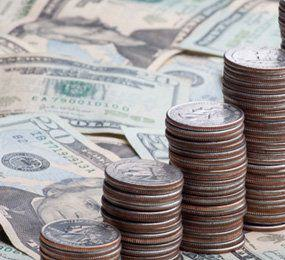

## Table of Contents

## What are Japanese Government Bonds (JGBs)?

Japanese Government Bonds (JGBs) are a type of bond issued by the Japanese government to raise money. When you buy a JGB, you are lending money to the government. In return, the government promises to pay you back the money you lent them, plus interest, over a certain period of time. JGBs are considered very safe because they are backed by the Japanese government, which is seen as very reliable.

There are different types of JGBs, and they can have different lengths of time before they mature. Some JGBs might mature in a few months, while others might take 10, 20, or even 30 years. The interest rate on JGBs can also vary. People and institutions, like banks, buy JGBs as a way to invest their money safely and earn a steady return.

## What are the different types of JGBs available?

There are several types of Japanese Government Bonds (JGBs) that people can buy. The most common type is the fixed-rate JGB, where the interest rate stays the same until the bond matures. These bonds come in different lengths of time, like 2-year, 5-year, 10-year, 20-year, and 30-year bonds. Another type is the floating-rate JGB, where the interest rate can change over time based on market conditions. These are usually shorter-term bonds.

There are also inflation-indexed JGBs, which help protect investors from inflation. The interest and principal of these bonds change with the inflation rate, so investors get more money if prices go up. Lastly, there are treasury discount bills, which are very short-term JGBs that don't pay interest but are sold at a discount and redeemed at face value when they mature. These are usually for 6 months or less. Each type of JGB has its own features and can be a good choice depending on what an investor is looking for.

## How are JGBs issued and who can purchase them?

JGBs are issued by the Japanese government through the Ministry of Finance. The process starts with the government deciding how much money they need to borrow. They then announce the details of the bond, like how long it will last and what the [interest rate](/wiki/interest-rate-trading-strategies) will be. The bonds are sold at auctions, where banks and other financial institutions bid on them. After the auction, the bonds can be traded on the secondary market, where investors buy and sell them among themselves.

Anyone can buy JGBs, but it's usually easier for individuals to buy them through a bank or a securities firm. These firms help people understand the bonds and manage their investments. Some JGBs are designed specifically for individual investors, like the 10-year JGB for retail investors. These bonds are easier for regular people to buy because they are sold in smaller amounts and can be purchased directly from banks or post offices.

## What are the maturity periods for JGBs?

JGBs come in different lengths of time before they mature. The shortest ones are called treasury discount bills, and they last for 6 months or less. Then there are short-term bonds that last for 2 years. Medium-term bonds last for 5 years. 

Longer-term bonds include the 10-year, 20-year, and 30-year JGBs. Each of these bonds has a different time until they mature, which means the government will pay back the money you lent them at the end of that time. The longer the bond lasts, the more interest you might earn, but you have to wait longer to get your money back.

## How do JGBs contribute to Japan's fiscal policy?

JGBs help the Japanese government manage its money. When the government needs to spend more money than it gets from taxes, it can sell JGBs to borrow money from people and institutions. This helps the government pay for things like building roads, schools, and other public services. By selling JGBs, the government can keep running smoothly even when it doesn't have enough money from taxes.

The way JGBs are used can also affect the economy. If the government sells a lot of JGBs, it can increase the amount of money in the economy, which might help it grow. But if too many JGBs are sold, it could lead to higher interest rates, which might slow down the economy. So, the government has to be careful about how many JGBs it sells and at what interest rates to keep the economy balanced.

## What are the current interest rates for JGBs?

The interest rates for JGBs change over time and depend on the type of bond. As of the latest data, the interest rate for a 10-year JGB is very low, around 0.5%. This means if you buy a 10-year JGB, you will get a little bit more than what you paid for it when it matures in 10 years. The interest rates for shorter-term JGBs, like the 2-year and 5-year bonds, are even lower, often close to 0%.

For longer-term JGBs, like the 20-year and 30-year bonds, the interest rates are a bit higher but still very low compared to the past. The 20-year JGB might have an interest rate around 1%, and the 30-year JGB could be around 1.5%. These low interest rates are because Japan's central bank, the Bank of Japan, has been trying to keep the economy growing by keeping borrowing costs low.

## How do JGBs affect the Japanese economy?

JGBs play a big role in Japan's economy. When the government sells JGBs, it gets money to spend on things like roads, schools, and hospitals. This spending helps the economy grow because it creates jobs and makes people's lives better. But if the government sells too many JGBs, it might have to pay higher interest rates to get people to buy them. Higher interest rates can make borrowing money more expensive for everyone, which might slow down the economy.

The Bank of Japan also buys JGBs to help control the economy. When the Bank of Japan buys a lot of JGBs, it puts more money into the economy, which can help it grow. But if there's too much money, it might cause prices to go up too fast, which is called inflation. So, the Bank of Japan has to be careful about how many JGBs it buys to keep the economy balanced. By working together, the government and the Bank of Japan use JGBs to try to keep the economy stable and growing.

## What are the risks associated with investing in JGBs?

Investing in JGBs is usually seen as very safe because they are backed by the Japanese government. But there are still some risks to think about. One risk is interest rate risk. If interest rates go up after you buy a JGB, the value of your bond might go down. This is because new bonds will be sold with higher interest rates, making your older bond less attractive to other investors. If you need to sell your bond before it matures, you might get less money than you paid for it.

Another risk is inflation risk. If prices start to go up a lot, the money you get back from your JGB might not be worth as much as when you bought it. This means the real value of your investment could go down. Also, even though JGBs are considered safe, there's always a small chance that the government could have trouble paying back its debts. This is called credit risk, but it's very low for JGBs because Japan's government is seen as very reliable.

## How have JGB yields changed over the past decade?

Over the past decade, the yields on JGBs have been very low and have stayed low. A yield is like the interest you get from a bond. In the early 2010s, the yield on a 10-year JGB was around 1%. But as the years went by, the Bank of Japan started buying a lot of JGBs to help the economy. This made the yields drop even more. By the middle of the decade, the yield on a 10-year JGB was close to 0%.

Since then, the Bank of Japan has kept the yields very low to help the economy grow. In 2016, the Bank of Japan even introduced a policy to keep the 10-year JGB yield at around 0%. This policy is called yield curve control. Because of this, the yields on JGBs have stayed very low, even going negative at times for shorter-term bonds. This means that the interest rates on JGBs have been very low for a long time, and they haven't changed much over the past few years.

## What role do JGBs play in global financial markets?

JGBs are important in the global financial markets because they are seen as very safe investments. Many investors from around the world buy JGBs to keep their money safe. When there's a lot of uncertainty in the world, like during a financial crisis, people often buy more JGBs because they trust the Japanese government to pay them back. This makes JGBs a big part of the global bond market, and they help keep the world's financial system stable.

The low interest rates on JGBs also affect other countries. When Japan's central bank buys a lot of JGBs to keep the interest rates low, it can make investors look for higher returns in other countries. This can lead to more money flowing into other countries' bond markets, which might change interest rates there too. So, what happens with JGBs can have a big impact on the global economy, even though they are issued by just one country.

## How does the Bank of Japan's monetary policy influence JGBs?

The Bank of Japan's monetary policy has a big effect on JGBs. One of the main things the Bank of Japan does is control interest rates. When the Bank of Japan wants to help the economy grow, it buys a lot of JGBs. This puts more money into the economy and makes the interest rates on JGBs go down. When interest rates are low, it's cheaper for the government to borrow money, and it can help the economy by spending more.

The Bank of Japan also uses a policy called yield curve control to keep the interest rates on JGBs very low. They try to keep the yield on 10-year JGBs around 0%. This means that even if the economy changes, the interest rates on JGBs stay the same. By doing this, the Bank of Japan makes sure that people and businesses can borrow money easily, which can help the economy stay strong. But it also means that people who invest in JGBs don't get much interest, so they might look for other places to put their money.

## What are some notable examples of JGB issuance and their impact on the market?

In 2016, the Bank of Japan introduced a policy called yield curve control. They said they would keep the interest rate on 10-year JGBs at around 0%. This was a big deal because it made the interest rates on JGBs very low and kept them that way. It helped the government borrow money cheaply, but it also made it hard for people who wanted to earn more interest from their investments. This policy changed how people thought about JGBs and made them look for other places to put their money.

Another important time was during the global financial crisis in 2008. A lot of people were worried about their money, so they started buying JGBs because they thought they were safe. This made the demand for JGBs go up a lot, and the interest rates went down. It showed how JGBs can be a safe place for people to put their money when things are uncertain. It also helped keep the Japanese economy stable during a tough time.

## References & Further Reading

[1]: [Bank of Japan. "Introduction of the Quantitative and Qualitative Monetary Easing (QQE)."](https://www.sciencedirect.com/science/article/pii/S0889158318301473) Released on April 4, 2013.

[2]: [Bank of Japan. "Introduction of 'Quantitative and Qualitative Monetary Easing with Yield Curve Control'."](https://tradingeconomics.com/japan/purchases-of-government-bonds) Released on September 21, 2016.

[3]: [Fitch Ratings. "Japanese Government Bonds."](https://www.fitchratings.com/research/sovereigns/japan-29-04-2024) Published report on JGBs and Yield Curve Control.

[4]: ["Japanese Government Bonds: The BoJ and the Market."](https://www.boj.or.jp/en/research/wps_rev/wps_2024/data/wp24e10.pdf) Financial Times article exploring the dynamics of the JGB market.

[5]: ["Algorithmic Trading: Winning Strategies and Their Rationale"](https://www.amazon.com/Algorithmic-Trading-Winning-Strategies-Rationale-ebook/dp/B00CY5HC0U) by Ernie Chan

[6]: ["The Economics of Sovereign Debt and Default"](https://press.princeton.edu/books/hardcover/9780691176819/the-economics-of-sovereign-debt-and-default) by Mark Aguiar and Manuel Amador

[7]: ["Global Financial Stability Report: Markets in the Time of COVID-19"](https://www.imf.org/en/Publications/GFSR/Issues/2020/04/14/global-financial-stability-report-april-2020) by the International Monetary Fund (providing context on global bond markets including JGBs).