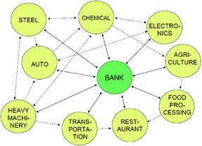

## Table of Contents

## What is a Japanese Keiretsu?

A Japanese Keiretsu is a type of business group where companies work closely together. They often own small parts of each other and have long-term relationships. This helps them to share information and resources easily. A famous example is the Mitsubishi group, which has companies in many different industries like cars, electronics, and finance.

Keiretsus started after World War II when Japan was rebuilding its economy. They helped companies grow by working together instead of competing against each other. This system made Japanese businesses strong and stable. However, in recent years, some people think that keiretsus can slow down innovation because the companies are too connected and may not take big risks.

## How did the concept of Keiretsu originate in Japan?

The concept of Keiretsu in Japan started after World War II. During the war, Japan's economy was badly damaged. After the war, the country needed to rebuild quickly. The government and businesses worked together to create a system where companies could support each other. This led to the formation of Keiretsus, where companies in different industries formed close relationships and often owned small parts of each other. This helped them share resources and information easily, which was crucial for Japan's rapid economic recovery.

Over time, Keiretsus became a key part of Japan's business culture. They helped companies grow and stay strong by reducing competition among them. For example, a car company in a Keiretsu might work closely with a steel company and a bank within the same group. This close cooperation made the companies more efficient and stable. However, as the global economy changed, some people started to think that Keiretsus could slow down innovation because the companies were too connected and might not take big risks.

## What are the different types of Keiretsu?

There are two main types of Keiretsu in Japan: horizontal and vertical. Horizontal Keiretsu are groups of companies from different industries that work together. They often have a bank at the center that helps them with money. A famous example is the Mitsubishi group, which has companies in cars, electronics, and finance. These groups help each other by sharing information and resources, making them strong and stable.

Vertical Keiretsu are different. They focus on one main industry, like cars or electronics. In a vertical Keiretsu, a big company at the top works closely with smaller companies that supply parts or services. For example, Toyota is a vertical Keiretsu. Toyota works with many smaller companies that make car parts. This helps the big company control the whole process from making parts to selling the final product. Both types of Keiretsu help Japanese companies grow and stay competitive.

## Can you explain the structure of a typical Keiretsu?

A typical Keiretsu has a structure where companies from different industries work together closely. In a horizontal Keiretsu, there is often a bank at the center that helps with money. The companies in the group own small parts of each other, which helps them share information and resources easily. For example, in the Mitsubishi group, there are companies that make cars, electronics, and provide financial services. They all work together to make the whole group strong and stable.

In a vertical Keiretsu, the structure is different. It focuses on one main industry, like cars or electronics. A big company at the top works closely with smaller companies that supply parts or services. For example, Toyota is a vertical Keiretsu. Toyota works with many smaller companies that make car parts. This helps Toyota control the whole process from making parts to selling the final product. Both types of Keiretsu help Japanese companies grow and stay competitive by working together.

## What role do banks play in a Keiretsu?

In a Keiretsu, banks play a very important role. They are often at the center of a horizontal Keiretsu, which means they help all the companies in the group with money. The bank gives loans and other financial help to the companies, making sure they have the money they need to grow and stay strong. This close relationship with the bank helps the companies in the Keiretsu work together better.

For example, in the Mitsubishi group, which is a horizontal Keiretsu, the bank helps companies that make cars, electronics, and provide financial services. By being part of the Keiretsu, the bank can understand the needs of these companies better and provide the right kind of financial support. This makes the whole group more stable and able to work together smoothly.

## How do Keiretsu influence the Japanese economy?

Keiretsu have a big impact on the Japanese economy. They help companies work together and share resources, which makes them strong and stable. This cooperation helps the whole economy grow because companies can focus on making good products instead of just competing with each other. For example, a car company in a Keiretsu can get parts from other companies in the group, which makes it easier and cheaper to make cars.

However, Keiretsu can also have some downsides. Some people think that because companies in a Keiretsu work so closely together, they might not take big risks or try new things. This can slow down innovation and make it harder for new companies to start up. Still, Keiretsu have been a big part of Japan's success and continue to play an important role in the economy.

## What are the advantages of being part of a Keiretsu for a company?

Being part of a Keiretsu has many advantages for a company. One big advantage is that companies in a Keiretsu can share resources easily. For example, a car company can get parts from other companies in the group, which makes it cheaper and easier to make cars. They can also share information and work together to solve problems. This helps the companies grow and stay strong because they are not just competing with each other.

Another advantage is that companies in a Keiretsu have a close relationship with a bank. The bank can give them loans and other financial help, which makes it easier for the companies to get the money they need. This close relationship with the bank helps the companies in the Keiretsu work together better and makes the whole group more stable. Being part of a Keiretsu can help a company be more successful and grow faster.

## What are the potential disadvantages or criticisms of the Keiretsu system?

One big criticism of the Keiretsu system is that it can slow down innovation. Because companies in a Keiretsu work so closely together and own parts of each other, they might not want to take big risks or try new things. They might stick to what they know works instead of trying to come up with new ideas. This can make it hard for new companies to start up and grow because the big Keiretsu companies have so much power and control.

Another disadvantage is that Keiretsu can make the economy less competitive. When companies in a Keiretsu work together instead of competing, it can be harder for other companies outside the group to do well. This can make it tough for new businesses to enter the market and can keep prices high because there is less competition. Some people think that this can hurt the overall economy because it stops new ideas and companies from coming in and shaking things up.

## How has the role and influence of Keiretsu changed over time?

The role and influence of Keiretsu in Japan have changed a lot over time. After World War II, Keiretsu were very important for helping Japan's economy grow fast. They helped companies work together and share resources, which made them strong and stable. During this time, Keiretsu were at the center of Japan's business world and helped the country become a big economic power.

In recent years, the influence of Keiretsu has changed. As the world economy has become more global, some people think that Keiretsu can slow down innovation because the companies are too connected and may not take big risks. Also, more companies from other countries are coming into Japan, which makes it harder for Keiretsu to control everything. So, while Keiretsu are still important, their role is not as strong as it used to be, and they have to adapt to new ways of doing business.

## Can you provide examples of well-known Keiretsu?

One well-known Keiretsu is the Mitsubishi group. This group has companies in many different industries, like cars, electronics, and finance. They all work together and help each other grow. The Mitsubishi bank is at the center and gives money to the other companies in the group. This makes the whole group strong and stable.

Another example is Toyota, which is a vertical Keiretsu. Toyota focuses on making cars and works closely with many smaller companies that make car parts. This helps Toyota control the whole process from making parts to selling the final product. By working together, Toyota and the smaller companies can make cars more efficiently and stay competitive.

These examples show how Keiretsu help companies work together and share resources. But over time, the role of Keiretsu has changed as the world economy has become more global. Still, they remain an important part of Japan's business world.

## How do Keiretsu compare to similar business networks in other countries?

Keiretsu in Japan are similar to business networks in other countries, but they have some unique features. In South Korea, there are groups called Chaebols, like Samsung and Hyundai. Chaebols are family-controlled and focus on many different industries, just like Keiretsu. But Chaebols are often owned by one family, while Keiretsu companies own small parts of each other. In Germany, there are business networks called Konzerns, like Siemens. Konzerns are groups of companies that work together and share resources, much like Keiretsu. But Konzerns are often more focused on one industry and do not have the same close relationship with a bank.

Despite these similarities, Keiretsu have a special way of working together that sets them apart. The close relationship with a central bank is a big part of what makes Keiretsu unique. This bank helps all the companies in the group with money, making it easier for them to grow and stay strong. In other countries, business networks might not have this kind of close financial relationship. Also, Keiretsu help companies from different industries work together, which can make the whole group more stable. But this can also slow down innovation because the companies might not take big risks or try new things.

## What is the future outlook for Keiretsu in the globalized economy?

In the globalized economy, the future of Keiretsu is not clear. As more companies from other countries come into Japan, Keiretsu have to change how they do business. They might need to work with companies from other countries and try new things to stay competitive. This could mean that Keiretsu will not be as strong as they used to be, but they can still be important if they adapt to the new global economy.

Some people think that Keiretsu can still help Japanese companies grow and stay strong. They can use their close relationships to share resources and information, which can make them more efficient. But to do well in the future, Keiretsu might need to take more risks and try new ideas. This could help them innovate and keep up with the fast-changing global market.

## References & Further Reading

[1]: Gerlach, Michael L. (1992). ["Alliance Capitalism: The Social Organization of Japanese Business."](https://archive.org/details/alliancecapitali0000gerl) University of California Press.

[2]: Lincoln, James R., & Gerlach, Michael L. (2004). ["Japan's Network Economy: Structure, Persistence, and Change."](https://archive.org/details/japansnetworkeco0000linc) Cambridge University Press.

[3]: Nakatani, Iwao. (1984). "The Economic Role of Financial Corporate Groupings." In Yamamura, Kozo & Yasuba, Yasukichi (Eds.), The Political Economy of Japan, Volume 1: The Domestic Transformation. Stanford University Press.

[4]: Miyashita, Kenichi, & Russell, David. (1996). ["Keiretsu: Inside the Hidden Japanese Conglomerates."](https://www.amazon.com/Keiretsu-Inside-Hidden-Japanese-Conglomerates/dp/007042859X) McGraw-Hill Education.

[5]: Imai, Ken-ichi. (1992). "Theories of the Firm and Japanese-Style Management." In Hayashi, Fumio (Ed.), Understanding Saving: Evidence from the United States and Japan. The MIT Press.