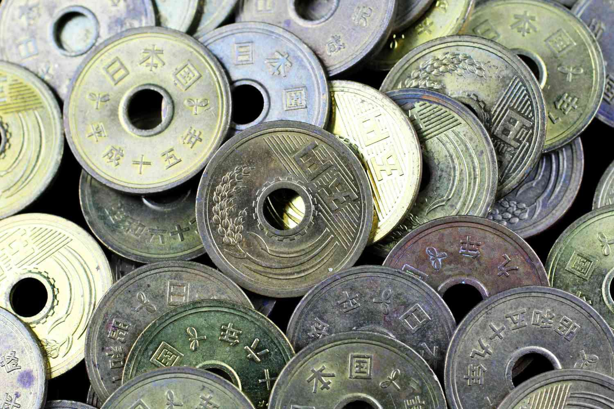

The term 'keiretsu' pertains to a distinctive organizational framework prevalent in Japan, characterized by interconnected business relationships and shareholdings. These conglomerates have played a crucial role in shaping Japan's economic landscape, particularly during its early phases of development and industrialization. Originating from the dissolution of pre-war zaibatsus, which were tightly-knit family-owned monopolies, keiretsus emerged as a more democratic and collaborative arrangement, designed to promote business stability and economic growth post World War II.

In contemporary Japanese economy, keiretsus continue to maintain substantial importance despite the shifts in global economic dynamics. They are emblematic of Japan's capacity for economic resilience and adaptation, facilitating synergies between financial institutions, manufacturers, and suppliers. Their influence extends across various sectors, contributing significantly to the country’s GDP, with a notable presence in manufacturing and export-driven industries.

This article endeavors to examine the historical trajectory of keiretsus, their structural classifications into horizontal and vertical forms, and the implications both hold for Japan's modern economy. It further explores the impact of algorithmic trading—a testament to the rapid technological advances in global financial markets—on the dynamics of keiretsus, potentially reshaping their interactions and operations. Through analyzing these elements, the article aims to provide a comprehensive understanding of the keiretsu phenomenon and its enduring significance in Japan's economic framework.

## Table of Contents

## The Historical Evolution of Japanese Business Groups

The origin of Japanese business conglomerates, known as zaibatsus, can be traced back to the Edo period in the 1600s. These early zaibatsus were family-owned monopolies that became instrumental in shaping the economic landscape of Japan. Their influence grew significantly during the Meiji Restoration, a period marking Japan's rapid industrialization and modernization beginning in the late 19th century. The zaibatsus, leveraging their extensive control over various industries, became vital partners in Japan's economic and industrial policies. They accumulated vast amounts of capital, enabling the country to transition from a feudal society to a burgeoning industrial power.

The structure of zaibatsus typically involved a holding company with a clearly defined family lineage at the top, overseeing a web of subsidiary companies. This central control allowed zaibatsus to dominate sectors such as banking, shipping, and trading. However, this absolute power also resulted in criticisms regarding their undemocratic and monopolistic tendencies.

In the aftermath of World War II, these monopolistic structures underwent significant changes under Allied occupation, which aimed to dismantle the pre-existing power concentrations. The occupation forces initiated a series of economic reforms, leading to the dissolution of many zaibatsus. Their assets were redistributed in an effort to democratize the Japanese industry and economy. These reforms were driven by the intention to weaken the economic influence of the families that controlled these conglomerates and to promote fair competition within the marketplace.

The transformation from zaibatsu to keiretsu marked a significant shift in Japanese business practices. Unlike the centralized control that defined zaibatsus, keiretsus were organized as collaborative consortia of companies. These new business structures were characterized by the absence of family ownership, with member companies maintaining their independence while being connected through mechanisms like cross-shareholding and interlocking directorates. This arrangement fostered long-term partnerships and mutual support among companies, correcting some of the undemocratic practices observed in zaibatsus while still enabling collaboration.

Overall, the historical evolution from zaibatsus to keiretsus reflects Japan's adaptive strategies in response to both internal pressures for modernization and external demands for economic reform. These changes laid down a new foundation for Japan's economic dynamics, allowing for increased flexibility and sustained growth in the decades that followed.

## Horizontal and Vertical Keiretsu Structures

Keiretsus can be primarily classified into two distinct structures: horizontal and vertical. Horizontal keiretsus, also known as financial keiretsus, involve a web of cross-shareholdings among various companies, typically including banks, manufacturers, and suppliers. This structure developed prominently in post-World War II Japan as a counter to the pre-war zaibatsu system. The main objective of horizontal keiretsus is to ensure financial stability and mutual support among the member companies. Banks, often at the center of a horizontal keiretsu, provide a buffer against financial downturns by offering necessary credit and fostering investment in innovation through reliable funding avenues. As a result, these keiretsus become self-sustaining entities that can weather economic fluctuations more robustly.

On the other hand, vertical keiretsus are hierarchically tiered systems that connect suppliers directly to manufacturers. These structures are prevalent in Japan's automotive and electronics industries, where the efficiency and seamless integration offered by vertical keiretsus are critical. Vertical keiretsus focus on streamlining production processes by fostering close, long-term relationships between the manufacturer and its numerous suppliers and subcontractors. This system facilitates the implementation of just-in-time (JIT) manufacturing techniques, reducing inventory costs and improving responsiveness to market changes without sacrificing quality. The tiered nature of vertical keiretsus allows for a high degree of specialization and collaboration at various production stages, enhancing overall operational efficiency.

The interconnected nature of both horizontal and vertical keiretsus enables their member companies to achieve reduced costs through economies of scale and improved supply chain coordination. Moreover, such interconnectedness promotes shared research and development efforts, leading to innovation and more competitive products in the global marketplace. Long-term business planning is another significant advantage, as these networks prioritize stable and strategic partnerships over short-term profits. By leveraging these integrated structures, keiretsus have played a crucial role in propelling Japan to become a major economic powerhouse only decades after the devastation of World War II.

## The Modern Role of Keiretsus in the Japanese Economy

In contemporary Japan, keiretsus continue to play a crucial role in the economic structure, despite experiencing a decline in prominence since the 1990s. These conglomerate structures, centered around interlinked corporate relationships, have persisted primarily in the manufacturing and export sectors, which remain vital to Japan’s Gross Domestic Product (GDP). As of recent estimates, keiretsus contribute to Japan's economic output by facilitating large-scale manufacturing processes and efficient supply chain management, bolstering the country’s export capacity significantly.

The economic contribution of keiretsus stems from the integrated networks of firms that operate under these structures. Keiretsu companies benefit from shared technological resources, collaborative research and development, and coordinated investment strategies which enhance competitiveness. This mutual cooperation leads to cost efficiency and innovation, attributes that are essential for Japan's manufacturing giants, particularly in electronics and automotive industries. Consequently, these inter-linkages fortify a culture that prioritizes shared growth and strategic alliance, reducing financial risks for individual firms through distributed dependency.

Additionally, the intricate web of relationships between keiretsu member companies fosters resilience and stability. By mutual shareholding and consistent communication, these firms engage in collective decision-making that aligns with long-term strategic goals. Such structures not only mitigate risks but also emphasize reciprocal benefits, aligning closely with traditional Japanese business practices that underscore trust and loyalty.

Although modern economic pressures and international competition present challenges, keiretsus maintain their relevance by adapting to global market dynamics while preserving their core organizational principles. This adaptability, coupled with their foundational interconnections, allows them to support and influence Japan's economic landscape effectively, particularly where traditional manufacturing and export roles are concerned. This enduring framework remains a testament to their resourcefulness and strategic significance in Japan's robust economy.

## Algorithmic Trading and Its Impact on Keiretsus

Algorithmic trading, often termed algo trading, represents a paradigm shift in the financial markets, integrating complex algorithms and high-speed data processing to execute trades at a fraction of a second. In Japan, a nation historically defined by structured business conglomerates like keiretsus, the advent of [algorithmic trading](/wiki/algorithmic-trading) introduces both challenges and opportunities for these interlinked entities.

Keiretsus thrive on robust, long-term relationships between banks, manufacturers, and suppliers, which traditionally rely on stable and predictable business environments. The core of keiretsu operations involves mutual support, cross-shareholding, and collaborative decision-making, elements that algo trading might disrupt due to its focus on rapid, efficiency-oriented transactions. The contrast between the steady keiretsu model and the volatile algorithm-driven market emphasizes different priorities: the former favors stability and relationship-building, whereas the latter values speed and immediate reaction to market signals.

Algorithmic trading could potentially enhance the [liquidity](/wiki/liquidity-risk-premium) of stocks owned by keiretsu firms, as algorithms can execute large volumes of trade seamlessly. This increased liquidity might attract a broader spectrum of investors, thereby reflecting market sentiments more accurately. However, the resultant market [volatility](/wiki/volatility-trading-strategies) could pose challenges to keiretsus, whose governance and strategic principles are grounded in minimizing risk and maintaining long-term planning.

The influence of algorithmic trading on keiretsus' stock market strategies cannot be underestimated. The prevalence of high-frequency trading, often driven by algorithms, necessitates a recalibration in the approach of keiretsu firms toward their investment and risk management practices. It encourages these firms to adopt more sophisticated financial technologies and analytics to remain competitive. For instance, embracing advanced data analytics may aid keiretsus in comprehending market trends and preemptively adjusting to fluctuations driven by algorithmic trading activities.

Moreover, the competitive advantage keiretsus hold through cross-shareholding might erode under the swift mechanisms of algo trading. Traditional strategies, reliant on gradual stock valuation and predictable return patterns, may no longer suffice in a rapidly shifting digital marketplace. Therefore, keiretsu firms might need to evolve their models, incorporating elements of agility and flexibility observed in algorithmic trading practices, while maintaining their foundational relationship-driven ethos.

In conclusion, while algorithmic trading challenges the traditional structures and operational strategies of keiretsus, it also offers a transformative opportunity for these conglomerates to modernize and adapt to the globalized, fast-paced financial environment. Understanding and integrating elements of algorithmic efficiency and technology could redefine the future trajectory of keiretsus in Japan's economy.

## Challenges and Future Directions

Keiretsus, as fundamental components of Japan’s economic framework, face various challenges and opportunities driven by globalization, technological advances, and evolving regulatory landscapes. Globalization enables international competition, requiring keiretsus to further optimize their supply chains and business strategies. Foreign firms often challenge traditional market strongholds, prompting keiretsus to innovate and improve efficiency. The adoption of international best practices and standards is necessary for sustaining competitiveness.

Technological disruptions present both threats and opportunities. The rise of digital technologies such as [artificial intelligence](/wiki/ai-artificial-intelligence) (AI) and the Internet of Things (IoT) is reshaping industries. In manufacturing, integrating AI can lead to smarter production lines with predictive maintenance and quality control, enhancing productivity and reducing downtime. For keiretsus, embracing these technologies is essential to maintain their competitive edge. Transitioning to technology-driven business models might involve initial costs and restructuring but promises long-term gains.

Algorithmic trading, a notable technological shift in financial markets, impacts keiretsus by altering stock market dynamics. The traditional hallmark of long-standing relationships and trust within keiretsus may be challenged by the transparency and real-time requirement of algo trading. Adjusting to these changes requires developing new strategies that incorporate algorithmic insights without compromising the core collaborative values of keiretsus.

Regulatory changes also exert pressure on keiretsus to adapt. As laws evolve to address global issues like climate change and corporate governance, keiretsus must align with new regulations to avoid penalties and maintain their social license to operate. Sustainable practices are becoming imperative, necessitating shifts in strategy towards more eco-friendly operations.

To address these challenges, keiretsus might evolve into new forms of business alliances. This evolution could include more flexible networks with international partners, engaging in joint ventures that leverage global innovation and market access. Such adaptability ensures the resilience and perpetual relevance of keiretsus in the global market.

Looking forward, the fusion of technological advancements with traditional keiretsu strengths offers significant potential for shaping Japan’s economic future. By leveraging AI in areas like trading and manufacturing, keiretsus can achieve enhanced operational capabilities and spearhead innovative industry practices. As keiretsus navigate these challenges and explore new pathways, their role in Japan's economic landscape remains pivotal. Their ability to innovate while preserving core strengths will largely determine their future trajectory.

## Conclusion

Keiretsus, with their historical roots entrenched deeply in Japan's unique business culture, form a vital bridge connecting the nation's past economic structure to its modern economy. These networks of interconnected businesses are not just historical remnants but active participants shaping Japan’s economic development. Their interlinked nature and collaborative frameworks have long provided resilience against economic fluctuations, showcasing a model of stability and mutual growth.

Understanding the architecture and dynamics of keiretsus offers key insights into Japan's economic resilience. These conglomerates, whether horizontal with cross-shareholdings or vertical with layered supply chains, highlight a form of economic organization that balances risk through shared responsibilities and resources. This systemic interdependence fosters an environment conducive to sustained economic growth, innovation, and adaptability in times of change.

The evolution of keiretsus, particularly in light of new market dynamics driven by algorithmic trading and technological advancements, demands continuous scrutiny. As the global financial landscape becomes increasingly dependent on data-driven technologies, keiretsus must adapt without losing their intrinsic cultural and organizational values. Embracing new trading technologies, such as AI-driven market strategies or real-time data analytics, can potentially transform how these conglomerates function within the global economy.

In conclusion, while keiretsus are steeped in historical significance, their ongoing adaptation and evolution remain critical for understanding potential future pathways in Japan’s economic terrain. Continuous examination of their structure and function, especially with the integration of advanced trading technologies, will provide deeper insights into their role in shaping economic resilience and growth. As Japan navigates an ever-evolving economic landscape, the adaptability and strategic foresight of keiretsus will be instrumental in fostering long-term economic stability and innovation.

## References & Further Reading

[1]: Gerlach, Michael L. (1992). ["Alliance Capitalism: The Social Organization of Japanese Business."](https://archive.org/details/alliancecapitali0000gerl) University of California Press.

[2]: Lincoln, James R., & Gerlach, Michael L. (2004). ["Japan's Network Economy: Structure, Persistence, and Change."](https://archive.org/details/japansnetworkeco0000linc) Cambridge University Press.

[3]: Nakatani, Iwao. (1984). "The Economic Role of Financial Corporate Groupings." In Yamamura, Kozo & Yasuba, Yasukichi (Eds.), The Political Economy of Japan, Volume 1: The Domestic Transformation. Stanford University Press.

[4]: Miyashita, Kenichi, & Russell, David. (1996). ["Keiretsu: Inside the Hidden Japanese Conglomerates."](https://www.amazon.com/Keiretsu-Inside-Hidden-Japanese-Conglomerates/dp/007042859X) McGraw-Hill Education.

[5]: Imai, Ken-ichi. (1992). "Theories of the Firm and Japanese-Style Management." In Hayashi, Fumio (Ed.), Understanding Saving: Evidence from the United States and Japan. The MIT Press.