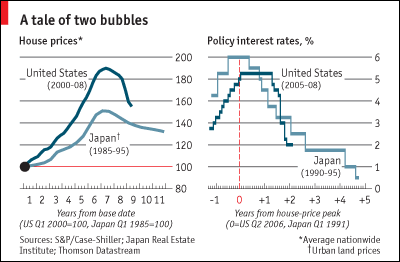

## Table of Contents

## What is Japan's Lost Decade?

Japan's Lost Decade refers to a period of economic stagnation in Japan that started in the early 1990s and lasted for about ten years. Before this, Japan had a booming economy with rising property and stock prices. But then, the bubble burst. Property and stock prices fell sharply, and many banks and companies faced big losses. This led to a slowdown in the whole economy.

During the Lost Decade, Japan tried many things to fix the economy, but nothing seemed to work well. Interest rates were lowered to almost zero, but people and businesses still didn't want to spend or invest much. Unemployment went up, and many young people struggled to find good jobs. The effects of the Lost Decade lasted long after the 1990s, and it took Japan many years to start growing again.

## When did Japan's Lost Decade begin and end?

Japan's Lost Decade started in the early 1990s. It began after a big economic bubble burst. This bubble was caused by high property and stock prices. When the bubble burst, these prices fell a lot, and it hurt the economy.

The Lost Decade is usually said to have ended around the early 2000s. But the effects of this time lasted much longer. Japan's economy didn't really start to grow again until many years later.

## What were the main causes of the real estate crisis in Japan?

The real estate crisis in Japan was mainly caused by a big bubble in the economy. In the 1980s, Japan's economy was doing very well. Property prices and stock prices were going up a lot. Banks were lending a lot of money to people and businesses to buy property. This made property prices go even higher. People thought that property prices would keep going up forever, so they kept buying more and more.

But then, in the early 1990s, the bubble burst. Property prices started to fall. People who had borrowed a lot of money to buy property couldn't pay back their loans. Banks had given out too many loans and now they were in trouble too. This caused a big crisis in the real estate market. The government tried to fix things, but it took a long time for the economy to get better.

## How did the real estate bubble form in Japan during the 1980s?

In the 1980s, Japan's economy was growing fast. People and businesses were making a lot of money. They started buying more and more property because they thought the prices would keep going up. Banks were happy to lend money for these purchases because they thought the property would be worth more in the future. This made property prices go even higher. It was like a big bubble that kept getting bigger and bigger.

But this bubble was not going to last forever. People were borrowing too much money, and the prices were getting too high. When the bubble burst in the early 1990s, property prices started to fall. People who had borrowed money to buy property couldn't pay back their loans. Banks had given out too many loans and now they were in trouble too. This caused a big crisis in the real estate market and hurt Japan's economy for a long time.

## What were the immediate effects of the real estate bubble bursting?

When the real estate bubble burst in Japan, property prices started to fall quickly. People who had borrowed money to buy property found that their homes and buildings were now worth less than what they owed on their loans. This made it hard for them to pay back the banks. Many people had to sell their properties at a loss or even give them back to the banks. This caused a lot of problems for the banks too because they had given out too many loans and now they were not getting their money back.

The banks were in trouble because of all the bad loans they had made. They had to be more careful about lending money, so they started to lend less. This made it harder for businesses to get the money they needed to grow or even to keep running. As a result, many businesses had to close or cut back on what they were doing. This slowdown in business activity led to fewer jobs and higher unemployment. The whole economy started to slow down and it was hard for Japan to get back on track.

## How did the Japanese government respond to the crisis?

When the real estate bubble burst, the Japanese government tried many things to fix the economy. They lowered interest rates to almost zero to make it cheaper for people and businesses to borrow money. They also spent a lot of money on public projects like building roads and bridges to create jobs and help the economy grow. But these things didn't work as well as they hoped. People and businesses were still scared to spend and invest because they were worried about the future.

The government also tried to help the banks that were in trouble because of all the bad loans they had made. They set up programs to help the banks get rid of these bad loans and to make them stronger. But it took a long time for these efforts to work. The government's actions helped a little, but the economy was still slow for many years. It was a hard time for Japan, and it took a long time for things to start getting better.

## What were the long-term economic impacts of the Lost Decade on Japan?

The Lost Decade had a big impact on Japan's economy that lasted for many years. After the real estate bubble burst, the economy didn't grow much for a long time. People and businesses were scared to spend and invest because they didn't know if the economy would get better. This made it hard for Japan to start growing again. Unemployment stayed high, especially for young people who had a hard time finding good jobs. Many people felt like they weren't moving forward in their lives, and this affected how they felt about the future.

It also took a long time for the banks to get better. They had made a lot of bad loans during the bubble, and it took years to fix this problem. The government tried to help, but it was slow. The economy didn't really start to grow again until many years later. Even now, Japan's economy is not as strong as it was before the Lost Decade. The effects of that time are still felt today, and it changed how Japan thinks about its economy and its future.

## How did the real estate crisis affect the average Japanese citizen?

The real estate crisis made life harder for many people in Japan. When the bubble burst, property prices fell a lot. People who had borrowed money to buy homes or buildings found that their properties were now worth less than what they owed. This made it tough for them to pay back their loans. Some people had to sell their homes at a loss or even give them back to the banks. This was very stressful and made many people worry about their future.

The crisis also made it harder for people to find good jobs. As businesses struggled and the economy slowed down, many companies had to close or cut back on what they were doing. This led to higher unemployment, especially for young people who were just starting their careers. Many people felt like they were stuck and not moving forward in their lives. The effects of the crisis lasted for a long time, and it took many years for things to start getting better for the average Japanese citizen.

## What lessons can other countries learn from Japan's experience with the real estate crisis?

Other countries can learn a lot from what happened in Japan during the real estate crisis. One big lesson is to be careful about letting property prices get too high. When prices go up too fast, it can create a bubble that will eventually burst. Governments and banks need to watch the market closely and make sure people are not borrowing too much money to buy property. If they see a bubble forming, they should take action to slow things down before it's too late.

Another lesson is about how to respond when a crisis happens. Japan tried many things to fix the economy, but it took a long time for things to get better. Other countries should learn that quick action is important. They need to help banks get rid of bad loans and make sure people can still borrow money to keep the economy going. It's also important to help people who are struggling, like those who lose their jobs or homes. By acting fast and helping everyone, a country can recover from a crisis more quickly.

## How did the crisis influence Japan's monetary policy and banking sector?

The crisis made Japan change its monetary policy a lot. The government and the central bank tried to help the economy by lowering interest rates to almost zero. They thought this would make it cheaper for people and businesses to borrow money, and then they would spend more and help the economy grow. But it didn't work as well as they hoped. People were still scared to spend and invest because they were worried about the future. So, the economy stayed slow for a long time. The government also spent a lot of money on public projects like building roads and bridges to create jobs and help the economy, but this didn't fix things quickly either.

The banking sector was also hit hard by the crisis. Banks had made a lot of loans during the real estate bubble, and when the bubble burst, many of these loans turned bad. People couldn't pay back their loans because their properties were worth less than what they owed. This made the banks very weak. The government tried to help the banks by setting up programs to get rid of these bad loans and make the banks stronger. But it took a long time for these efforts to work. The banks had to be very careful about lending money, which made it harder for businesses to get the money they needed to grow or even keep running.

## What role did international factors play in Japan's economic downturn during the Lost Decade?

International factors did play a role in Japan's economic downturn during the Lost Decade, but they were not the main cause. One big international [factor](/wiki/factor-investing) was the change in exchange rates. In the late 1980s, the value of the Japanese yen went up a lot compared to the US dollar. This made Japanese exports more expensive and harder to sell in other countries. When Japan couldn't sell as many things abroad, it hurt their economy.

Another international factor was the slowdown in the global economy. In the early 1990s, many countries were not growing as fast as before. This meant there was less demand for Japanese products around the world. When other countries were not buying as much from Japan, it made the economic problems at home even worse. But even though these international factors played a role, the main problems came from inside Japan, like the real estate bubble and the banks' bad loans.

## What are the current views on Japan's economic recovery from the Lost Decade?

People have different views about how Japan has recovered from the Lost Decade. Some think Japan has made good progress. They say the economy is doing better now than it was during the Lost Decade. The government and the central bank have been working hard to help the economy grow. They have tried new ideas like "Abenomics," which is a set of policies to make the economy stronger. These efforts have helped a bit, but some people think Japan still has a long way to go to be as strong as it was before the crisis.

Others believe that Japan's recovery is not complete. They say the economy is still facing big challenges. For example, Japan has a lot of debt, and the population is getting older. This means there are fewer young people working and paying taxes. Some also worry that Japan is not growing fast enough compared to other countries. They think Japan needs to do more to fix these problems and make the economy stronger. Overall, while Japan has made some progress, many people feel that the effects of the Lost Decade are still felt today.

## References & Further Reading

[1]: Koo, R. C. (2009). ["The Holy Grail of Macroeconomics: Lessons from Japan's Great Recession."](https://onlinelibrary.wiley.com/doi/book/10.1002/9781119199618) Wiley.

[2]: Werner, R. A. (2003). ["Princes of the Yen: Japan's Central Bankers and the Transformation of the Economy."](https://www.taylorfrancis.com/books/mono/10.4324/9781315701554/princes-yen-richard-werner) M.E. Sharpe.

[3]: Hoshi, T., & Kashyap, A. K. (2004). ["Japan's Financial Crisis and Economic Stagnation."](https://pubs.aeaweb.org/doi/pdfplus/10.1257/089533004773563412) Journal of Economic Perspectives, 18(1), 3-26.

[4]: Ito, T., & Mishkin, F. S. (Eds.). (2004). ["Monetary Policy with Very Low Inflation in the Pacific Rim."](https://www.nber.org/system/files/chapters/c0092/c0092.pdf) University of Chicago Press.

[5]: Fingleton, E. (1995). ["Blindside: Why Japan Is Still on Track to Overtake the U.S. by the Year 2000."](https://archive.org/details/blindsidewhyjapa0000fing) Houghton Mifflin.